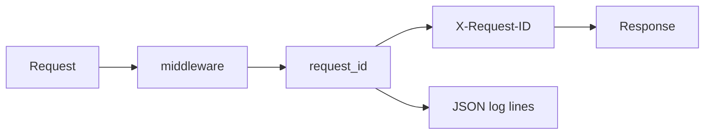

# Month 11 · Week 4 · Day 1
# Structured Logging and Request-ID Middleware

**Program:** Full-Stack Mastery · 18 months  
**Phase:** 3 — Python and backend  
**Month index:** [../../README.md](../../README.md)  
**Week 4:** Day 1 (today) · [2](day-02.md) · [3](day-03.md) · [4](day-04.md) · [5](day-05.md) · [6](day-06.md) · [7](day-07.md)  
**Week rhythm today:** Learn + type-along  
**Student state:** 6B has Postgres and a Redis decision. Today you can **follow one HTTP request** through logs without printing passwords.  
**Study time:** 3–4 focused hours

**This week covers:** structured logs, request ids, env config, secrets, health, timeouts, failing loudly, idempotency **concept**, a **separate** Mongo exercise, 6B checklist, exam.

Today: **structured logging** and **request id middleware**. Config/health tomorrow. Mongo is Day 5 **not** in ops-api. This textbook will **not** paste `~/ops-api/`.

Labs: `~\fullstack-lab\month-11\week-04\day-01\`. Noun: **lost-and-found tags**.

---

## How to use this textbook

1. Read a section. Close it. Say what a log line must contain and must **not**.  
2. Type middleware. Do not paste a full observability platform.  
3. Optional review links are for later rechecking.

---

## How to read this chapter

A **log** is a record of what the process did. **Structured** means machines can parse it (JSON fields), not only humans reading `"oops"`. A **request id** (correlation id) is a string that **joins** every line for one HTTP request — and you **return** it on the response so `curl.exe -D -` can show it.



**Wrong belief:** “I’ll `print(user)` in every route; that is logging.”  
**Correct:** `print` has no level, no request id, and will eventually print a password. Use the **logging** module (or `structlog` if you add it on purpose) with a **formatter**.

**Wrong belief:** “I’ll log the whole request body. Debugging gold.”  
**Correct:** bodies contain secrets and PII. Log **method, path, status, duration, request id**. Log an **error type**, not a token.

---

## Today's contract

By the end of this day you will be able to:

1. Configure **stdlib `logging`** to emit **one JSON object per line** (or key=value — JSON preferred).  
2. Write Starlette/FastAPI **middleware** that:  
   - reads `X-Request-ID` if the client sent a **safe** token, or generates a **UUID4**  
   - stores it in `request.state`  
   - sets **response header** `X-Request-ID`  
   - logs **start** and **end** with method, path, status, ms  
3. Bind **127.0.0.1**.  
4. Prove with `curl.exe -D -` that the header appears.  
5. Write `SECRETS.md`: three things you will never log.

**Today's gate.** Closed-book:

> Each request has an id on the response and in JSON logs. I log method, path, status, duration — not passwords, tokens, or Authorization headers. Middleware is the place, not twenty print statements.

---

## Time box

| Block | Minutes | Work |
|---|---|---|
| A | 50 | Theory |
| B | 70 | Middleware + JSON logs + curl |
| C | 50 | Independent: error log with request id |
| D | 15 | Git |
| E | 15 | Recall |

---

# Block A — Theory

## 1. Why structure

Month 9 `print("here")` dies in production volume. Grep for a request id is how you debug **one** user’s 500 without reading everyone else’s traffic.

JSON example (shape, not a dump of a platform):

```json
{"level":"info","event":"http_done","request_id":"a1b2c3d4","method":"GET","path":"/tags","status":200,"ms":12}
```

One object per line. Filebeat/Cloud later can parse. Today the file is stderr.

**stdlib:**

```python
import logging
import json
import sys

class JsonFormatter(logging.Formatter):
    def format(self, record: logging.LogRecord) -> str:
        payload = {
            "level": record.levelname.lower(),
            "msg": record.getMessage(),
        }
        extra = getattr(record, "extra_json", None)
        if isinstance(extra, dict):
            payload.update(extra)
        return json.dumps(payload)

handler = logging.StreamHandler(sys.stdout)
handler.setFormatter(JsonFormatter())
logger = logging.getLogger("lab")
logger.handlers.clear()
logger.addHandler(handler)
logger.setLevel(logging.INFO)
```

You may use `logger.info("http_done", extra={"extra_json": {...}})` — `extra=` keys must not collide with LogRecord. Putting a dict on a custom attribute is the lab’s simple path. **structlog** is allowed if you read its docs later; not required.

**Wrong belief:** “I’ll f-string JSON by hand in every route.”  
**Correct:** one formatter. Routes call `logger.info(..., extra=...)`.

## 2. Request id rules

| Rule | Why |
|---|---|
| Generate UUID4 if missing | Every request joinable |
| Accept inbound `X-Request-ID` **only if** it matches a tight charset (e.g. `[\w\-]{8,64}`) | Stop log injection / huge headers |
| Echo on response | Client and server share the id |
| Put on `request.state.request_id` | Handlers and `get_session` can log it |

Do not accept a 10_000 character header and write it 50 times.

Contextvars (`contextvars.ContextVar`) are the right way to make the id visible in deep functions without passing request everywhere. Lab: `request.state` plus middleware logs is enough. If you use contextvar, reset it — Starlette middleware + async is a footgun if you forget. Prefer middleware start/end logs today.

## 3. Middleware (FastAPI / Starlette)

```python
import time
import uuid
from fastapi import FastAPI, Request

app = FastAPI()

@app.middleware("http")
async def request_id_middleware(request: Request, call_next):
    rid = request.headers.get("x-request-id")
    if not rid or len(rid) > 64:
        rid = str(uuid.uuid4())
    request.state.request_id = rid
    start = time.perf_counter()
    response = await call_next(request)
    ms = int((time.perf_counter() - start) * 1000)
    response.headers["X-Request-ID"] = rid
    logger.info(
        "http_done",
        extra={
            "extra_json": {
                "event": "http_done",
                "request_id": rid,
                "method": request.method,
                "path": request.url.path,
                "status": response.status_code,
                "ms": ms,
            }
        },
    )
    return response
```

This is a **sketch** you type and **adapt**. If `call_next` raises, you still want a log and an id on the error response — `try/except`, log `http_fail`, re-raise or return 500. Independent block.

**Wrong belief:** “Middleware is only for CORS.”  
**Correct:** CORS was Month 9. Request ids are **observability**. Same slot, different job.

## 4. What never to log

- Passwords, hashes, tokens, `Authorization` values  
- Full credit-card-shaped numbers  
- Redis URLs with passwords, `DATABASE_URL`  
- Raw request bodies by default  

Log `user_id` if you have it and it is not secret. Log exception **class** and a **safe** message. `exc_info=True` on 500s **after** you know the traceback will not include a connection string — often it will. Prefer `repr(exc)` of a typed error.

## 5. Levels

DEBUG noisy. INFO request done. WARNING recovered weirdness. ERROR 500s. Do not INFO every SQL line in production (echo=True was Week 1 teacher).

---

# Block B — Type-along

```powershell
cd ~\fullstack-lab
mkdir month-11\week-04\day-01 -Force
cd ~\fullstack-lab\month-11\week-04\day-01
uv init --name lab-request-id
uv add fastapi uvicorn
```

`GET /health`, `GET /tags` hard-coded list (no DB required today). Middleware as above. JSON logs to stdout.

```powershell
uv run uvicorn main:app --reload --host 127.0.0.1 --port 8000
```

```powershell
curl.exe -s -D - http://127.0.0.1:8000/tags -o NUL
curl.exe -s -D - -H "X-Request-ID: lab-trace-001" http://127.0.0.1:8000/health -o NUL
```

Write `HEADERS.txt`: status, `X-Request-ID`. Write `LOGS.txt`: one JSON line copied (no secrets). Confirm inbound `lab-trace-001` echoed if it passed your charset check — hyphens/alnum should.

---

# Block C — Independent

1. Route `GET /boom` raises `RuntimeError("lab boom")`. Middleware logs **fail** with request id and **does not** log a fake password. Client still gets 500.  
2. Reject inbound id that contains spaces or `"` — generate UUID instead. Test with curl. `INJECTION.txt`.  
3. `SECRETS.md` three never-logs.  

No Mongo. No Redis required. No ops-api paste.

```powershell
cd ~\fullstack-lab
git add month-11
git commit -m "Month 11 Week 4 Day 1: JSON logs and X-Request-ID middleware."
```

---

# Block E — Recall

1. Why JSON lines.  
2. Why echo the id.  
3. Why validate inbound ids.  
4. What to log on http_done.  
5. Why not log Authorization.

## Office hours

**Middleware never runs.** You attached it after a sub-app mistake, or you are hitting another process. curl the port you started.

**`extra` KeyError / LogRecord conflict.** Do not use extra keys named `message`, `name`, `args`. Use `extra_json` as in the sketch.

**UUID on every request even when I sent a header.** Your validation too strict, or you read `X-Request-Id` vs `x-request-id` — Starlette is case-insensitive for `.get("x-request-id")`.

**Logs are not JSON** because Uvicorn access log is separate. That is OK. Your **app** logger is JSON. Optional: disable uvicorn access log with `--no-access-log` to see only yours.

---

## Lecture: an id is cheaper than a mystery 500

When 6B fails in Month 12, the frontend will send `X-Request-ID` (or you will generate one) and you will grep logs. If you skip middleware today, you will grep timestamps and cry.

Structured does not mean “buy Datadog this afternoon.” It means **fields**. Request id is the join key. Status and ms tell you **what** and **how long**. Path tells you **which** handler.

SQLAlchemy echo is not structured logging. Redis MONITOR is not either. Do not log every GET cache HIT at INFO in production — DEBUG or a metric. Lab INFO is fine.

Pydantic errors: log 422 **path** and **count** of errors, not the raw password field value from the body.

---

## Worked session — middleware, curl -D, boom

`uv init`. FastAPI health + tags. JSON formatter. Middleware UUID/header. curl `-D -`. GET `/boom` logs fail + id. SECRETS.md. Bind 127.0.0.1. No database required. No ops-api.

Windows: `curl.exe`. PowerShell `curl` is the wrong program.

If JSON parse fails in your eye, you mixed two formatters. One handler.

---

## Definition of done

- [ ] JSON (or structured) request-complete log  
- [ ] `X-Request-ID` on response  
- [ ] Inbound id honored if safe  
- [ ] `/boom` logs without secrets  
- [ ] SECRETS.md  
- [ ] Commit exists  

---

## Optional review links

- [Python logging](https://docs.python.org/3/library/logging.html)  
- [Starlette middleware](https://www.starlette.io/middleware/)  
- [UUID4](https://docs.python.org/3/library/uuid.html)

---

## Tomorrow

**Config from the environment**, **secrets not in git**, **health endpoint** (liveness vs a first “dependencies” thought).

---

# Closing lecture — join the lines

A request id turns a river of logs into **one** story. JSON turns grep into `jq`. Middleware runs for every path including 404 from FastAPI.

Never log secrets. Never accept unbounded inbound ids. Never confuse Uvicorn access logs with your formatter.

Tags are the noun. 6B gets this middleware **written by you** later this week — not pasted from a vendor quickstart.

`curl.exe -D -` is the camera. Stdout is the film.
