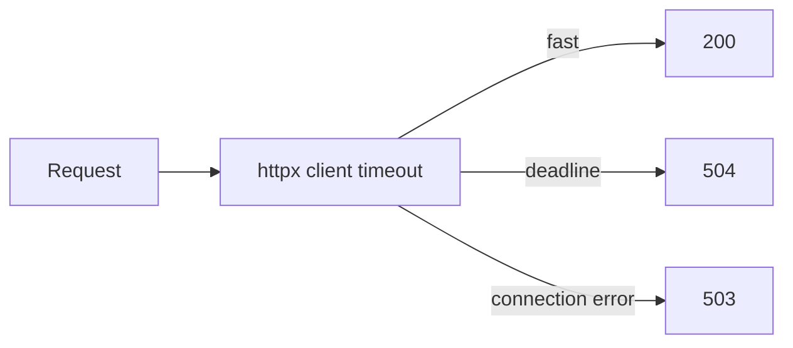

# Month 11 · Week 4 · Day 3
# From Memory: Timeouts and Failing Loudly

**Program:** Full-Stack Mastery · 18 months  
**Phase:** 3 — Python and backend  
**Month index:** [../../README.md](../../README.md)  
**Week 4:** [1](day-01.md) · [2](day-02.md) · Day 3 (today) · [4](day-04.md) · [5](day-05.md) · [6](day-06.md) · [7](day-07.md)  
**Week rhythm today:** Implement from memory  
**Student state:** Day 2 gate passed. Settings, health, request ids. Today **timeouts** and **failing loudly** — hung calls are worse than honest errors.  
**Study time:** 3–4 focused hours  
**Prereq:** Day 2 gate passed.

Labs: `~\fullstack-lab\month-11\week-04\day-03\`. Noun: **courier pings** (you call a **fake** upstream). Not 6B. Not a scraper.

---

## How Day 3 works

Days 1–2 closed during the build. This recap is the teacher.

Stuck > 25 minutes: open only the matching earlier section. `lookups.txt`.

No complete app in this file.

---

## How to read this chapter

A **timeout** is a deadline. If Postgres, Redis, or an HTTP client does not finish, you **stop waiting** and **fail**. **Failing loudly** means: a **status that is not 200**, a **log with request id**, and **no** swallowed `except Exception: return {"ok": true}`.



**Wrong belief:** “I’ll wait forever so I never fail.”  
**Correct:** waiting forever holds a worker and a pool connection. The user retries. Now you have **two** hung workers. Timeouts **protect the process**.

**Wrong belief:** “504 is for other people’s CDNs.”  
**Correct:** you may emit **504** when **your** upstream exceeded its deadline. **503** when you cannot reach a dependency. Be consistent in CONTRACT.md.

---

## Complete explanation (timeouts you must still own)

**Settings:** `BaseSettings`, env, `.env` gitignored, `.env.example`. `model_dump` not `.dict()`. Never log URLs with passwords.

**Health:** `/health` liveness. `/ready` may `SELECT 1`. 503 if not ready.

**Request id:** middleware, `X-Request-ID`, JSON log `http_done` / `http_fail`. No Authorization values in logs.

**Outbound HTTP:** `httpx.Client(timeout=httpx.Timeout(2.0))` or `timeout=2.0`. `httpx.TimeoutException` → your 504/503. Do **not** call random internet hosts. **Fake upstream** = a second FastAPI route `/upstream/slow` that `time.sleep(5)` **or** TestClient calling a function you patch. Lab: **one app** with `/upstream/slow` and `/courier` that uses httpx against `http://127.0.0.1:8000/upstream/slow` — careful with **deadlock** (single worker waiting on itself).

**Deadlock warning:** Uvicorn one worker; handler A waits on handler B on the **same** server → can stall. Prefer:

- `time.sleep` **inside** `/courier?sleep=5` to simulate **your** work exceeding a **server-side** deadline you enforce with `asyncio.wait_for` **or**  
- a **sync** function `fetch_upstream(url, timeout=)` tested with a mock, **plus** one httpx call to `https://httpbin.org/delay/1` **only if** you already use httpbin and it is allowed on your network — **not required**. Default: **do not** depend on the public internet.

**Course default lab:** `/work?seconds=` sleeps. Middleware or route uses `asyncio.wait_for(..., timeout=1.0)` in an **async** route, or you document that sync `time.sleep` **blocks the worker** (that is the lesson) and you still **set httpx timeout** in a **unit-tested** helper with a fake transport.

Simplest honest lab:

```python
import httpx

def ping_upstream(base: str, timeout_s: float) -> int:
    with httpx.Client(timeout=timeout_s) as client:
        r = client.get(f"{base}/health")
        return r.status_code
```

`/courier` calls `ping_upstream` toward **itself** `/health` with timeout 2s — that should work. `/courier/slow` uses `httpx` against a **pytest httpx mock** or `httpx.MockTransport` that sleeps past timeout. TestClient + MockTransport is the **reliable** Windows path. `curl.exe` hits `/courier` success path.

**SQLAlchemy:** `create_engine(..., pool_timeout=30)` — name it in `POOL.txt`. Connect timeout in the URL if the driver supports it. You need not hang Postgres.

**Redis:** `socket_timeout=` on the client if you use Redis. fakeredis does not hang. Still **write** `TIMEOUTS.md`.

**Fail loudly:**

| Failure | Status | Log |
|---|---|---|
| Upstream timeout | 504 or 503 (document) | request id, `event=upstream_timeout` |
| Upstream down | 503 | `event=upstream_error` |
| Unhandled | 500 | `event=unhandled` **no** secret |
| Validation | 422 | existing FastAPI |

**Never:** `except Exception: return {"status":"ok"}`.

**Retry concept:** retry **idempotent GET** with backoff **once** in a helper if you have time; do **not** retry POST blindly (Day 4 idempotency). Write `RETRY.txt`: GET vs POST.

**Windows:** uv, curl.exe, 127.0.0.1. No Mongo today.

---

## Today's contract

**Today's gate.** Closed-book:

> Timeouts are deadlines. I fail with 503/504 and a request-id log, not with a hung worker and a 200 lie. I do not swallow exceptions. I do not need the public internet.

---

## Time box

| Block | Minutes | Work |
|---|---|---|
| A | 20 | Oral |
| B | 40 | Paper: table of failures |
| C | 90 | Build spec |
| D | 35 | Tests + curl |
| E | 15 | lookups |

---

# Block A — Speak

1. liveness vs ready.  
2. Why infinite wait is worse than 504.  
3. Why not retry POST.  
4. What never to log.  
5. `model_dump`.  
6. Same-server httpx deadlock.

---

# Block B — Paper

`DRILLS.txt`: Settings fields; health JSON; middleware fields; timeout helper signature; three statuses.

---

# Block C — Spec

```powershell
cd ~\fullstack-lab
mkdir month-11\week-04\day-03 -Force
cd ~\fullstack-lab\month-11\week-04\day-03
uv init --name lab-timeouts
uv add fastapi uvicorn httpx pydantic-settings
uv add --dev pytest
```

| Piece | Rule |
|---|---|
| Settings | `upstream_timeout_s: float = 1.0` from env |
| GET `/health` | 200 liveness |
| Middleware | `X-Request-ID` + JSON log |
| GET `/courier` | uses helper + MockTransport in tests; live `/courier` may call `/health` with httpx and timeout from settings |
| GET `/fail-quiet` | **forbidden** in final code; you may write it, test that you **deleted** it, or implement `/fail-loud` 500 |
| Tests | timeout helper raises / returns 504 path; health 200; swallow-test **fails** if you reintroduce swallow |

CONTRACT.md statuses.

Do not start Redis unless leftover. Do not call unrelated hosts.

---

# Block D — Defect hunt

1. `timeout=None` on httpx — forbidden. Prove settings applied.  
2. Swallow except — grep. `GREP.txt`.  
3. Log line includes request id on timeout path (test or manual).  
4. `curl.exe -D -` health shows request id.

---

# Block E

`lookups.txt`

```powershell
cd ~\fullstack-lab
git add month-11
git commit -m "Month 11 Week 4 Day 3: timeouts and fail-loud courier lab."
```

---

# Lecture: silence is a 200 that lies

Month 9 forbade `ok: false` with 200. Month 11 forbids **hanging** as a success strategy. Operators would rather see 504 **now** than a timeout at the load balancer with no request id.

`wait_for` and httpx timeout are the same idea at two layers. Pool timeout is the third. Name all three in `TIMEOUTS.md` even if you only code one.

Retries: GET maybe. POST not until Day 4 keys. Blind retry duplicates inserts.

---

## Definition of done

- [ ] Spoke A  
- [ ] Timeout helper tested  
- [ ] Health + request id  
- [ ] No swallow-all  
- [ ] TIMEOUTS.md names pool/httpx  
- [ ] Commit exists  

---

# Worked session — settings, health, httpx timeout test

uv init. Settings. Middleware. Health. `ping_upstream` with Timeout. TestClient health. pytest MockTransport or `respx` **not required** — `httpx.MockTransport` is enough. GREP no `except Exception: return`. Bind 127.0.0.1. No ops-api. No Mongo.

Windows: `uv run pytest -q`. `curl.exe`.

If you deadlock uvicorn with self-httpx, switch to MockTransport-only for the slow path and write `DEADLOCK.txt`.

---

## Optional review links

- [httpx timeouts](https://www.python-httpx.org/advanced/timeouts/)  
- [SQLAlchemy pool timeout](https://docs.sqlalchemy.org/en/20/core/pooling.html)

---

## Tomorrow

**Lab: idempotency key CONCEPT for POST** — store the key, replay the **same** body, conflict on a different body.

---

# Closing lecture — deadlines are kindness

A timeout is a boundary. A loud fail is a status + a log id. A quiet fail is a lie.

Settings from env. Secrets out of git. Health cheap. Ready honest.

Courier pings are the noun. Do not retry POST. Do not swallow. Do not log tokens.

`lookups.txt` honesty. Then git.

---

## Recite-back checklist

- [ ] timeout is a deadline  
- [ ] 503/504 documented  
- [ ] no except-all 200  
- [ ] request id on fail logs  
- [ ] no POST retry  
- [ ] not ops-api  
- [ ] not public-internet required
