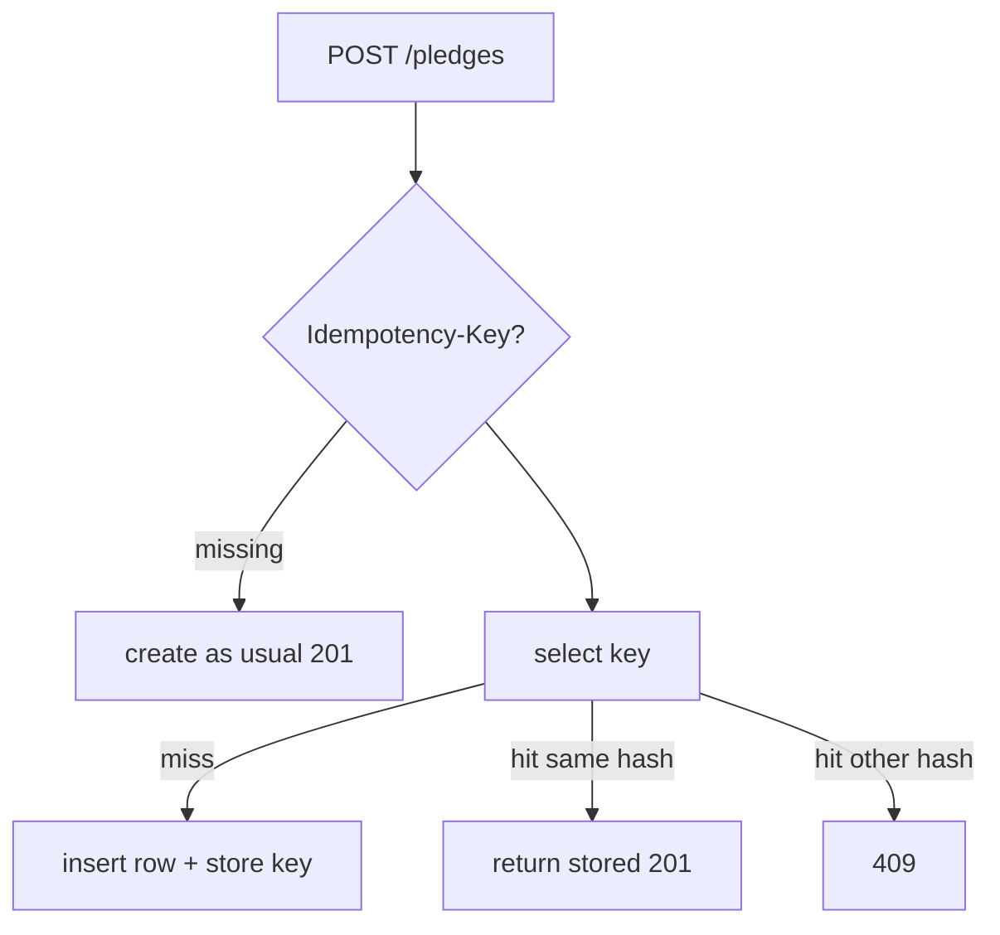

# Month 11 · Week 4 · Day 4
# Lab: Idempotency-Key Concept for POST

**Program:** Full-Stack Mastery · 18 months  
**Phase:** 3 — Python and backend  
**Month index:** [../../README.md](../../README.md)  
**Week 4:** [1](day-01.md) · [2](day-02.md) · [3](day-03.md) · Day 4 (today) · [5](day-05.md) · [6](day-06.md) · [7](day-07.md)  
**Week rhythm today:** Lab  
**Student state:** You fail loudly with timeouts. Today a **retried POST** must not create **two** rows if the client sends the **same Idempotency-Key** and the **same body**.  
**Study time:** 3–4 focused hours

Labs: `~\fullstack-lab\month-11\week-04\day-04\`. Noun: **pledge slips**. Not 6B. Not a payment-processor clone.

---

## How to use this textbook

1. This is a **concept lab**: store key → replay **same** response; **different** body → **409**.  
2. Store keys in **PostgreSQL** (SoR). Redis TTL cache of keys is optional later, not required.  
3. Do not build a Stripe replica. Do not paste ops-api.

---

## How to read this chapter

HTTP POST is not idempotent by default. A client timeout then retry **creates twice**. An **Idempotency-Key** header (industry habit) names the **attempt**. You store **key + body hash + status + response JSON**. Second POST with same key:

- **same body** → return **stored** status/body (**do not** insert again)  
- **different body** → **409** conflict  



**Wrong belief:** “I’ll unique-index `email` and that is idempotency.”  
**Correct:** uniqueness prevents two emails. It does **not** replay the first response body and it fights **intentional** second pledges with a new key. Keys are **client-chosen attempt ids**.

**Wrong belief:** “I’ll put the key in Redis only.”  
**Correct:** Redis flush **forgets** the attempt; retry creates a second Postgres row. **Postgres is SoR for the key** in this lab.

---

## Today's contract

By the end of this day you will be able to:

1. Read header `Idempotency-Key` (optional on POST; if present, enforce).  
2. Hash the body (`hashlib.sha256` of canonical JSON bytes).  
3. Table `idempotency_keys` (key PK, body_hash, status_code, response_json, created_at).  
4. Same key + same hash → replay. Same key + other hash → 409.  
5. Transaction: insert pledge **and** key **atomically** (Month 10 / Week 1 `begin`).  
6. Request id still on the response. Do not log the whole body if it might contain secrets — pledges `amount` is fine; no passwords.

**Today's gate.** Closed-book:

> I can replay a POST with the same Idempotency-Key and body without a second row. A different body with that key is 409. Keys live in Postgres. This is reliability, not a payment exploit kit.

---

## Time box

| Block | Minutes | Work |
|---|---|---|
| A | 35 | Theory |
| B | 80 | Lab models + POST replay |
| C | 50 | 409 + curl traces + race note |
| D | 15 | Git |
| E | 15 | Recall |

---

# Block A — Theory

## 1. Canonical hash

```python
import hashlib
import json

def body_hash(payload: dict) -> str:
    blob = json.dumps(payload, sort_keys=True, separators=(",", ":")).encode()
    return hashlib.sha256(blob).hexdigest()
```

Pydantic: `payload.model_dump()` then hash — **not** `.dict()`. Key order in JSON must not fork the hash — `sort_keys=True`.

## 2. Schema (lab)

`Pledge`: `id`, `name`, `amount` (int cents — Month 10: not float money in real apps; int is enough here).

`IdempotencyKey`: `key` string PK, `body_hash`, `status_code`, `response_json` (TEXT or JSON/JSONB), `created_at`.

FK optional from key to pledge id.

## 3. Race

Two parallel POSTs with the same new key: both miss SELECT, both INSERT pledge. Unique on `idempotency_keys.key` makes the second INSERT fail — catch IntegrityError, **replay** the winner. Write `RACE.md`. You need not prove with threads today.

## 4. Missing header

CONTRACT: missing key → ordinary insert (not idempotent). Or require the header → 400. **Pick one.** Lab default: **optional** header.

## 5. Timeouts + retry

Day 3: client retries POST **because** of timeout. Today the retry is **safe** if they send the same key. `RETRY.txt` links the two days.

---

# Block B — Lab

```powershell
cd ~\fullstack-lab
mkdir month-11\week-04\day-04 -Force
cd ~\fullstack-lab\month-11\week-04\day-04
uv init --name lab-idempotency
uv add fastapi uvicorn sqlalchemy "psycopg[binary]" pydantic pydantic-settings
uv add --dev pytest httpx
psql -U postgres -c "CREATE DATABASE month11_w4d4;"
```

`create_all` lab shortcut OK; `SCHEMA.txt` Alembic reminder.

Routes: GET `/health`, POST `/pledges` 201, GET `/pledges` 200. `select()`. Middleware request id. Settings DATABASE_URL.

```powershell
uv run uvicorn main:app --reload --host 127.0.0.1 --port 8000
```

---

# Block C — Traces

`body.json`: `{"name":"Ada","amount":500}`

```powershell
curl.exe -s -D - -H "Content-Type: application/json" -H "Idempotency-Key: lab-key-1" --data-binary @body.json http://127.0.0.1:8000/pledges
```

Run **twice**. Same `id` in JSON. `psql` `SELECT count(*) FROM pledges` is **1**.

Second file `body2.json` different amount, same header key → **409**.

`CURL.txt`. pytest: replay and 409.

`RACE.md`. No Redis required. No Mongo.

```powershell
cd ~\fullstack-lab
git add month-11
git commit -m "Month 11 Week 4 Day 4: POST idempotency key concept."
```

---

# Block E — Recall

1. Why unique email is not replay.  
2. Why keys in Postgres.  
3. same hash vs 409.  
4. IntegrityError race.  
5. `model_dump` + sort_keys.

## Office hours

**Two rows with same key.** You committed pledge before key, or no unique on key. One transaction.

**Replay 200 instead of 201.** Store `status_code` and reuse it.

**Hash differs on replay.** Floats/spacing — use model_dump and sort_keys; curl same file.

**I stored keys in a module dict.** Reload loses them — Month 9. Postgres.

---

## Lecture: retries need names

Timeouts cause retries. Retries need keys. Keys need SoR. The response must be **replayed**, not reconstructed with a new id.

This is **your** API’s reliability. It is not a way to abuse others’ POST endpoints.

6B may add this on **one** dangerous POST (create payment-like, transfer). Day 6 checklist will ask if you **need** it. Not every GET.

---

## Worked session — two curls, one row

uv init. Pledge + IdempotencyKey models. POST with header. curl twice. count=1. Different body 409. pytest. Request id. Settings. Bind 127.0.0.1. `select()`. No `Query()`. No ops-api.

Windows: `curl.exe`, `--data-binary @body.json`. Database `month11_w4d4`.

---

## Definition of done

- [ ] Replay same key+body → one row  
- [ ] Different body → 409  
- [ ] Keys in Postgres  
- [ ] CURL.txt + test  
- [ ] RACE.md  
- [ ] Commit exists  

---

## Optional review links

- [IETF Idempotency-Key draft (concept)](https://datatracker.ietf.org/doc/html/draft-ietf-httpapi-idempotency-key-header) — read as **concept**, not a spec you must implement fully  
- [SQLAlchemy IntegrityError](https://docs.sqlalchemy.org/en/20/core/exceptions.html)

---

## Tomorrow

**MongoDB separate exercise** — documents, collections, embed vs ref, one index, one tiny aggregation. **Not** in the main app. **Not** in ops-api.

---

# Closing lecture — name the attempt

POST without a key is “create.” POST with a key is “create or replay.” 409 means “you reused a key for a different document.”

Postgres holds pledges **and** keys. Redis may cache later; it must not be the only memory of the attempt.

`model_dump`, sort_keys, sha256. One `begin`. IntegrityError → replay.

Pledges are the noun. Two curls. One row. Then git.
