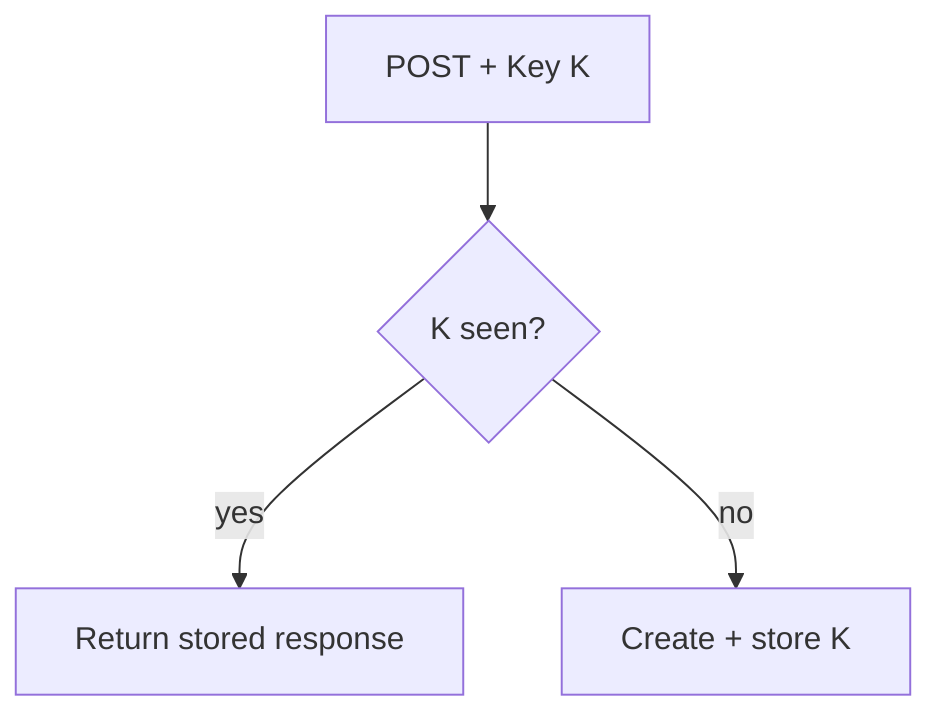

# Month 11 · Week 4 · Day 4
# Lab: Idempotency Keys for POST

**Program:** Full-Stack Mastery · 18 months  
**Phase:** 3 — Python and backend  
**Month index:** [../../README.md](../../README.md)  
**Week 4:** [1](day-01.md) · [2](day-02.md) · [3](day-03.md) · Day 4 (today) · [5](day-05.md) · [6](day-06.md) · [7](day-07.md)  
**Week rhythm today:** Lab  
**Study time:** 3–4 focused hours

Labs: `~\fullstack-lab\month-11\week-04\day-04\`.

---

## How to read this chapter

The user double-clicks Create. Two HTTP POSTs. Without care, two rows. An **Idempotency-Key** header (or JSON field) means: same key + same body → same result, no second insert.

**Wrong belief:** “Unique email is enough.”  
**Correct:** uniqueness helps. A retry with the same email 409s; a retry with a generated title might duplicate. Keys cover “I meant this one action.”

Store: table `idempotency_keys (key TEXT PRIMARY KEY, status_code INT, body JSONB, created_at)` or a Redis key with TTL. Postgres is fine and durable.

If the second request has a **different** body, 409 conflict — do not silently do something else.

This is **your** API’s defense against double submit, not a payment-network exploit guide.

---

## Today's contract

1. Table or dict of keys.  
2. POST `/charges` lab (fake) or `/notes` that uses the header.  
3. Second identical POST returns the first resource id.  
4. Different body, same key → 409.  
5. TestClient tests.

**Gate:** I can explain idempotent POST and implement a lab-sized store.

---

## Time box

| Block | Minutes | Work |
|---|---|---|
| A | 30 | Why POST is not idempotent by HTTP definition |
| B | 90 | Implement + tests |
| C | 30 | NOTES: TTL vs forever |
| D | 15 | Git |
| E | 15 | Recall |

---

HTTP says GET is idempotent; POST is not. You **add** the property with a key.

---

## Definition of done

- [ ] Replay works  
- [ ] Mismatched body 409  
- [ ] Tests  
- [ ] Commit  

---

## Tomorrow

MongoDB as a **separate** exercise — not in 6B unless you already refused Redis-and-Mongo stuffing.

---

## Optional review links

Idempotency is explained in this chapter. These pages are for later checking, not for first learning.

- [IETF: Idempotency-Key draft (concept)](https://datatracker.ietf.org/doc/draft-ietf-httpapi-idempotency-key-header/)
