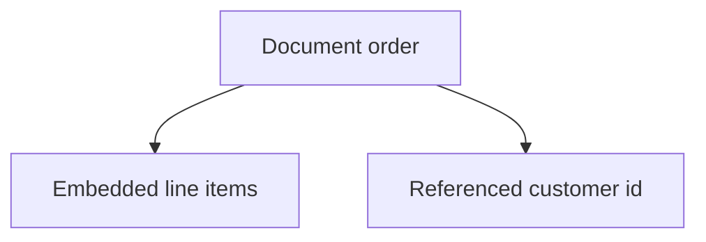

# Month 11 · Week 4 · Day 5
# MongoDB Lab (Separate From 6B)

**Program:** Full-Stack Mastery · 18 months  
**Phase:** 3 — Python and backend  
**Month index:** [../../README.md](../../README.md)  
**Week 4:** [1](day-01.md) · [2](day-02.md) · [3](day-03.md) · [4](day-04.md) · Day 5 (today) · [6](day-06.md) · [7](day-07.md)  
**Week rhythm today:** Learn + small exercise  
**Study time:** 3–4 focused hours

Labs: `~\fullstack-lab\month-11\week-04\day-05\`. **Do not** add Mongo to `~/ops-api/` unless your data model truly wants documents — the default is **no**.

If you cannot install MongoDB, use a **JSON file** stand-in for documents and still write the modeling paragraphs. mongomock is acceptable for API shape.

---

## How to read this chapter

A **document** is a JSON-like blob with an `_id`. A **collection** is a bag of documents. **Embed** vs **reference**: nest a small always-together object; reference when it is shared or unbounded.



**Wrong belief:** “Schema-less means no design.”  
**Correct:** you still choose embed vs ref. Bad choices hurt as much as bad SQL.

**Wrong belief:** “I’ll replace Postgres with Mongo in 6B because I did this lab.”  
**Correct:** 6B’s resources are relational. This lab is literacy.

---

## Today's contract

1. Explain collection, document, `_id`.  
2. Embed vs reference with **your** example (blog post comments vs users).  
3. One index (e.g. `{ "email": 1 }` unique) — or the equivalent unique in the stand-in.  
4. One tiny aggregation: count documents per type **or** `$group` if you have a server.  
5. `MONGO-VS-6B.md`: would Mongo improve the **main** app? “No” is expected.

**Gate:** I can talk documents without putting them in 6B by default.

---

## Time box

| Block | Minutes | Work |
|---|---|---|
| A | 40 | Modeling |
| B | 70 | Lab insert/find/index |
| C | 40 | MONGO-VS-6B.md |
| D | 15 | Git |
| E | 15 | Recall |

---

pymongo sketch if you have a server:

```python
from pymongo import MongoClient, ASCENDING

client = MongoClient("mongodb://127.0.0.1:27017")
db = client["month11lab"]
db.notes.create_index([("title", ASCENDING)])
db.notes.insert_one({"title": "hello", "tags": ["sql", "orm"]})
print(list(db.notes.find({"title": "hello"})))
```

Windows install is optional. Do not burn the day on services. The **paragraphs** are the gate if the server is absent.

---

## Definition of done

- [ ] Modeling notes  
- [ ] Lab or stand-in  
- [ ] MONGO-VS-6B.md  
- [ ] Commit  

---

## Tomorrow

6B checklist vs project 06 headings. Then exam.

---

## Optional review links

Document modeling is explained in this chapter. These pages are for later checking, not for first learning.

- [MongoDB: Documents](https://www.mongodb.com/docs/manual/core/document/)
