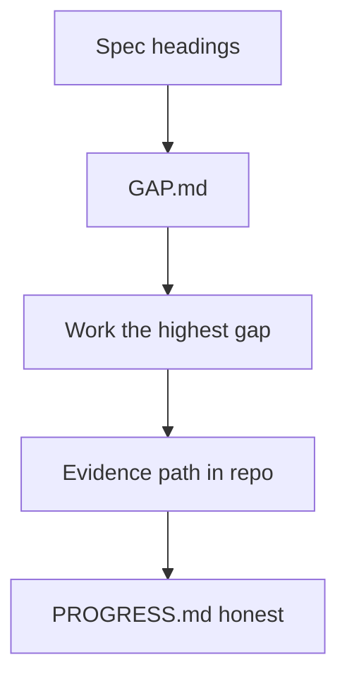

# Month 11 · Week 4 · Day 6
# Independent: Finish 6B Against Project 6 Headings

**Program:** Full-Stack Mastery · 18 months  
**Phase:** 3 — Python and backend  
**Month index:** [../../README.md](../../README.md)  
**Week 4:** [1](day-01.md) · [2](day-02.md) · [3](day-03.md) · [4](day-04.md) · [5](day-05.md) · Day 6 (today) · [7](day-07.md)  
**Week rhythm today:** Independent implementation  
**Student state:** You have models, migrations, a Redis decision, logs, config, health, a Mongo **side** lab. Today you **close gaps** in **`~/ops-api/`** using **spec headings**, not a pasted product.  
**Study time:** 3–4 focused hours (6B may continue after the exam if the gate is false)

Work in **`~/ops-api/`**. Checklist in `~\fullstack-lab\month-11\week-04\day-06\`.  
Open `full_stack_project_requirements_2026/project_06_production_style_backend_system.md` for **headings** — not as source code to copy. This textbook will **not** give you ops-api.

---

## How to use this textbook

1. **CONTRACT.md** and **ARCHITECTURE.md** in **your** repo win. The spec headings are a **checklist**, not a second domain.  
2. AI may review; it may not ship 6B.  
3. Mongo stays out of the main app unless your Day 5 page said Yes **and** you still should not rush it tonight. Default: keep it separate.  
4. Optional review links are for later rechecking.

---

## How to read this chapter

Stage B/C of Project 6 is **your** FastAPI talking to **PostgreSQL** through **SQLAlchemy 2.x** and **Alembic**, with **Redis only if justified**, tests, logs, config, health. Stage A HTTP skills still apply (201, 404, 422, pagination you already built).

**Wrong belief:** “I’ll generate a new FastAPI template and abandon Months 9–10.”  
**Correct:** 6B **upgrades** 6A. Same repo. Same contract, now durable.

**Wrong belief:** “Day 6 is optional if I attended Weeks 1–5.”  
**Correct:** the month gate is **evidence in ops-api**, not attendance.

---

## Today's contract

By the end of this day you will be able to:

1. Produce `GAP.md` mapping **spec headings** to **your files** (or “missing”).  
2. Close **at least one** real gap (Session on a write path, migration, test DB, request id, health, Redis paragraph).  
3. Confirm: `Mapped`/`mapped_column`/`select()`, no `Query()` as the main API, `model_dump` not `.dict()`.  
4. Confirm: `.env` not in git; `.env.example` exists.  
5. Leave Mongo out of ops-api (unless you have a written exception — still discouraged).  
6. Write an honest **PROGRESS.md** for tomorrow’s exam.

**Today's gate.** Closed-book:

> I can point at spec headings and at files in ops-api. Gaps are named. I did not paste a finished backend. Postgres is SoR.

---

## Time box

| Block | Minutes | Work |
|---|---|---|
| A | 25 | GAP.md from headings |
| B | 40 | Pick the highest gap; failing test if applicable |
| C | 90 | Implement until the gap moves  
| D | 30 | Docs pass: architecture, migrations, redis, logs |
| E | 15 | PROGRESS.md |

---

# Block A — Headings only (fill GAP.md)

Use **these** headings from the project spec (paraphrased so you still open the file). For each: **path in your repo** or **MISSING**.

**Stage B**

6. Database requirements (PK, FK, NOT NULL, UNIQUE, timestamps, indexes)  
7. Raw SQL requirement (Month 10 — should already exist; link the files)  
8. SQLAlchemy (models, relationships, sessions, transactions, eager load, N+1)  
9. Alembic (init, column or index, upgrade, downgrade in dev)  
10. Transaction (one multi-record atomic operation)  
11. PostgreSQL performance (two queries, EXPLAIN — Month 10; link notes)

**Stage C**

12. Redis (cache / rate limit / ephemeral **or** justified absence)  
13. Testing (unit / API / integration test DB / Redis fakeredis or skip)  
14. Logging (request id, method/path, outcome, no secrets)  
15. Configuration (env, no hardcoded secrets)  
16. Health (liveness; readiness difference understood)

**Also**

17. Mongo exercise **separate** + one page (Day 5 folder is evidence)  
18. Documentation (architecture, ER, API overview, setup, env, migrations, tests, Redis decision, query notes, limitations)  
19. Definition of Done checkboxes — you tick **honestly**

Do not paste the spec into ops-api. Do not invent tables from a blog.

---

# Complete explanation (keep open; other days closed except this recap)

**SQLAlchemy 2.x:** `DeclarativeBase`, `Mapped`, `mapped_column`, `ForeignKey`, `back_populates`, `select()`, `selectinload`/`joinedload`, Session per request, commit/rollback/close. Identity map per Session. Expire after commit.

**Alembic:** `env.py` metadata + URL; revisions reviewed; no unread drop; test DB `upgrade head`.

**Redis:** optional; keys; TTL; DEL after commit; INCR defense; fakeredis tests; ARCHITECTURE.md.

**Logs:** JSON + `X-Request-ID`. No secrets.

**Settings:** pydantic-settings or equivalent. `.env.example`.

**Health:** `/health`. `/ready` if you ping DB.

**Timeouts:** httpx/pool named. Fail loud. No swallow-all.

**Idempotency:** concept on a dangerous POST if you have one; not required on every route.

**Mongo:** lab + page. Not in main app.

**HTTP:** Month 9 statuses still true. Pydantic Create/Out. `model_dump`. `HTTPException` 404.

**Windows:** `uv`, PowerShell, `psql`, `curl.exe`, `127.0.0.1`.

---

# Block B — Highest gap

Examples of **highest**: HTTP still RAM; no Alembic; tests on the demo DB; no request id; Redis as SoR (remove it). Pick **one** you can finish today rather than five you cannot.

Write a failing test if the gap is behavioral. `RED.txt`.

---

# Block C — Implement

Stay on that gap. Depth beats a new framework.

If RAM still serves GET list, wiring `select()` + `selectinload` if nested is the correct 6B move. If already wired, write the transaction story (`PROGRESS.md` heading 10).

Do not start Month 12 UI.

---

# Block D — Docs pass

README: how to `alembic upgrade head`, `uv run pytest`, `uvicorn --host 127.0.0.1`. ARCHITECTURE diagram (mermaid ok). Redis section. MIGRATIONS.md. Link Day 5 Mongo page as **external evidence**, not as a dependency.

---

# Block E — Recall

1. Why headings not a new schema.  
2. SoR.  
3. N+1 proof location.  
4. Where request id is set.  
5. Why Mongo page can say No.

## Quality bar

GAP.md is too thin if every row says “yes” without a path. Enough if a classmate can open the path.

**Forbidden rescue:** copy this month’s rooms/slots/quotes labs into ops-api as the product domain.

---

## Predicted failures

| Symptom | Cause |
|---|---|
| Gate false tomorrow | GAP still MISSING on Alembic or tests |
| `.dict()` in schemas | v2 `model_dump` |
| `session.query` | 2.x `select` |
| Mongo in requirements.txt of ops-api | remove |

Commit in ops-api. Lab GAP.md in fullstack-lab.

---

## Definition of done

- [ ] GAP.md with paths  
- [ ] At least one gap closed today  
- [ ] PROGRESS.md honest  
- [ ] Secrets not in git  
- [ ] Mongo not smuggled in  
- [ ] No tutorial ops-api  

---

## Optional review links

- `full_stack_project_requirements_2026/project_06_production_style_backend_system.md` headings  
- Month 11 README gate list [../../README.md](../../README.md)

---

## Tomorrow

**Month 11 exam + gate.** Textbook files closed except the exam file. Mini in fullstack-lab, not a rewrite of ops-api during Blocks 1–3. Link to [Month 12](../../../month-12/README.md) only if the gate is true.

Wait — the exam file will link `../month-12/README.md` from week-04 (that is `textbook/month-12`). Use that relative path tomorrow.

---

# Closing lecture — headings are a mirror

The spec is not a second assignment. It is a **mirror** held up to **your** repo. GAP.md is the honest reflection.

6B is an upgrade: RAM → Postgres, `create_all` → Alembic, prints → request ids, maybe Redis, never Mongo-by-default.

Tomorrow you will teach the month from the exam synthesis and mark the gate. If a heading is MISSING, the honest mark is false. Stay on 6B. Do not start Month 12 on a false row.

Your table names stay yours. This file still does not contain them.

---

## Recite-back checklist

Write `RECITE.txt` in the lab folder.

- [ ] GAP.md has paths or MISSING  
- [ ] one gap closed today  
- [ ] `select()` not `Query()`  
- [ ] `model_dump` not `.dict()`  
- [ ] Alembic or an honest MISSING  
- [ ] Redis paragraph or absence  
- [ ] request id / health / env  
- [ ] Mongo evidence is the Day 5 folder  
- [ ] PROGRESS.md is not theater  

**Heading 10 transaction.** If you still have no multi-row write, name the 6B operation that **will** need `session.begin()` (membership + project, transfer, etc. — **your** nouns). Do not invent a fake second table tonight if the gap is “HTTP still RAM.”

**Heading 7 raw SQL.** Link Month 10 files. Do not delete them because SQLAlchemy exists. The spec wanted SQL **before** the ORM. Keep the evidence.

Windows: work in `~/ops-api`. `uv run pytest -q` if tests exist. `uv run alembic current`. `curl.exe` `/health`. Bind 127.0.0.1.

Tomorrow’s exam mini is hangars, not your product. Do not paste 6B into the exam folder. Do not start [Month 12](../../month-12/README.md) on a false gate.

---

## Heading map (copy into GAP.md as a skeleton)

| Heading | Path or MISSING |
|---|---|
| 6 DB constraints | |
| 7 Raw SQL (Month 10) | |
| 8 SQLAlchemy 2.x | |
| 9 Alembic | |
| 10 Transaction | |
| 11 EXPLAIN notes | |
| 12 Redis decision | |
| 13 Tests + test DB | |
| 14 Request-id logs | |
| 15 Env config | |
| 16 Health | |
| 17 Mongo page (lab) | |
| 18 Docs | |

Fill paths. One MISSING is a gate risk. Close the highest today.

Windows: `~/ops-api`, `uv run alembic current`, `uv run pytest -q`, `curl.exe` `/health`. Secrets not in git. No `Query()`. `model_dump`. Mongo not in requirements.

PROGRESS.md tells tomorrow’s you the truth. The exam synthesis will not grade attendance.

**If HTTP is still RAM:** wiring one GET list to `select()` beats adding Redis. The gate’s item 1 is mapping **and** Session boundaries, not a cache.

**If Alembic is MISSING:** that is the highest gap. Week 2 Day 6 was the pack. Do it before logging cosmetics.

Hangars tomorrow. 6B tonight. Month 12 only on a true table — [Month 12 README](../../month-12/README.md) from this folder is `textbook/month-12` via `../../month-12`.

Exam evidence goes in `~\fullstack-lab\month-11-exam\`, not inside ops-api. Block 4 tomorrow may open your docs; Blocks 1–3 may not.

If GAP.md is all YES with no paths, it is not a map. Add paths before you sleep.

Definition of done is the spec’s section 19 ticked **honestly**, not a green calendar.
