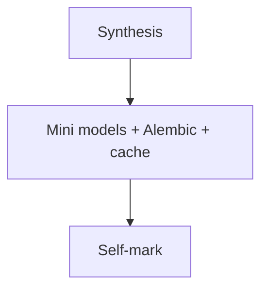

# Month 11 · Week 4 · Day 7
# Month 11 Exam + Gate

**Program:** Full-Stack Mastery · 18 months  
**Phase:** 3 — Python and backend  
**Month index:** [../../README.md](../../README.md)  
**Week 4:** [1](day-01.md) · [2](day-02.md) · [3](day-03.md) · [4](day-04.md) · [5](day-05.md) · [6](day-06.md) · Day 7 (today)  
**Week rhythm today:** Monthly exam  
**Study time:** 3–4 focused hours

Textbook files stay closed except **this file**. Work in `~\fullstack-lab\month-11-exam\`. Not inside ops-api for the mini. Do not start Month 12 if the gate is false.

---

## How to read this chapter

This file teaches the month again, then you prove it.

---

## Month synthesis

**SQLAlchemy 2.x:** `Mapped`, `mapped_column`, `select()`, `Session`. Engine = pool of connections. Session = unit of work; commit; close. `relationship` + `ForeignKey` are not the same. **N+1:** lazy load in a loop; `selectinload` / `joinedload` as the fix you can name.

**Alembic:** revisions, upgrade head, downgrade in lab, autogenerate is a draft, expand/contract for NOT NULL, test database runs migrations.

**Redis:** optional. Cache-aside, TTL, invalidate on write, INCR window, fakeredis in tests. Postgres is the record. Redis down: defined behavior.

**Logs:** request id, no secrets. **Config:** env. **Health/ready.** **Timeouts.** **Idempotency key** for POST retries. **Mongo:** separate literacy; default not in 6B.

**Wrong belief:** “Session is a login cookie.”  
**Correct:** that is Month 13. Today’s Session is the database conversation.

---

## Today's contract

Teach this synthesis, ship a mini, mark the gate honestly.

---

## Time box

| Block | Minutes | Work |
|---|---|---|
| 1 | 35 | Speak synthesis |
| 2 | 80 | Mini: 2 models, Session, one Alembic revision, FakeRedis cache-aside |
| 3 | 30 | Debug paper |
| 4 | 20 | Gate table |

---

# Mini-exam spec

`sticker` resource: id, title unique. SQLAlchemy model, `create_all` **or** one Alembic revision (pick one and say why Alembic is still the 6B way). `GET /stickers` cache-aside FakeRedis TTL 30, `POST` invalidates. TestClient: two GETs, POST, GET sees new. Request id middleware optional stretch.

---

# Debug

**A.** Forgot `session.commit()` — objects look saved in Python  
**B.** Autogenerate dropped a table you still need — what did you do  
**C.** Cached list after POST still old  
**D.** Logged `Authorization` header  
**E.** Mongo as primary for stickers in 6B — why no

---

# Month 11 Gate

| # | Claim | true / false |
|---|---|---|
| 1 | I can map tables to SQLAlchemy models and explain session/transaction boundaries. | |
| 2 | I can show N+1 and an eager load that removes it. | |
| 3 | Alembic: init + a later column/index; upgrade and downgrade in development. | |
| 4 | I can name why Redis exists in my 6B (or honestly refuse) with key + TTL + invalidation. | |
| 5 | Structured logs with a request id; no secrets in logs or git. | |
| 6 | Health endpoint; config from environment. | |
| 7 | Integration tests against a test database. | |
| 8 | MongoDB: I can say whether it would improve the **main** model (“no” allowed). | |

All true → [Month 12](../../../month-12/README.md). Else stay.

---

## Definition of done

- [ ] Mini + tests  
- [ ] Debug answers  
- [ ] Honest gate  
- [ ] Commit  

---

## Optional review links

This exam is the lesson. These pages are for later checking, not for first learning.

- [SQLAlchemy ORM](https://docs.sqlalchemy.org/en/20/orm/)
- [Alembic](https://alembic.sqlalchemy.org/)
