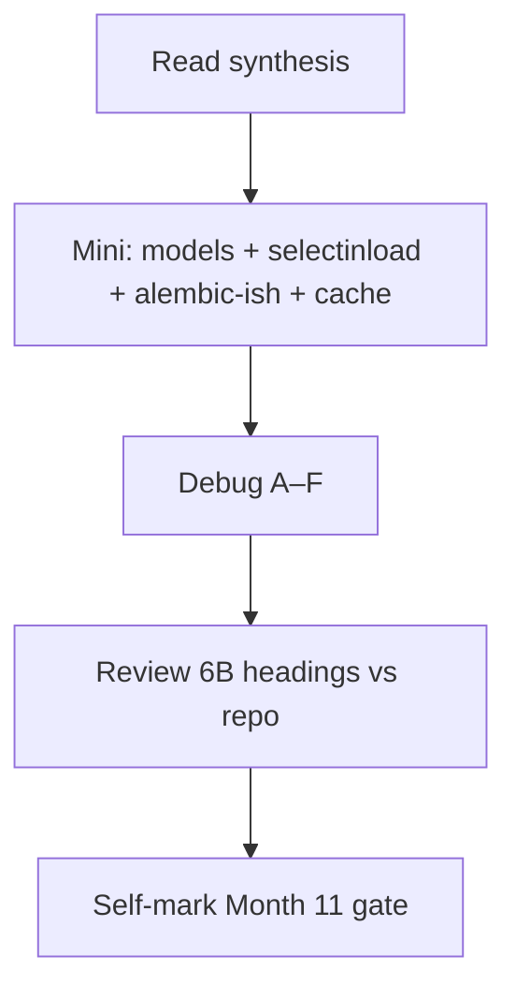
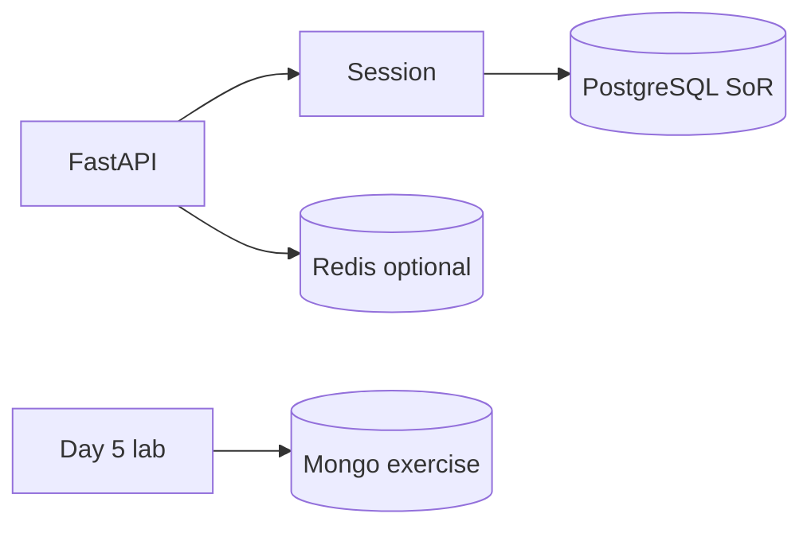

# Month 11 · Week 4 · Day 7
# Month 11 Exam + Gate

**Program:** Full-Stack Mastery · 18 months  
**Phase:** 3 — Python and backend  
**Month index:** [../../README.md](../../README.md)  
**Week 4:** [1](day-01.md) · [2](day-02.md) · [3](day-03.md) · [4](day-04.md) · [5](day-05.md) · [6](day-06.md) · Day 7 (today)  
**Week rhythm today:** Monthly exam  
**Study time:** 3–4 focused hours (Project 6B continues **after** if the gate is still false)

Textbook files stay **closed** except:

- **this file** (synthesis + exam blocks + self-mark table),
- Stage B/C **headings** in `full_stack_project_requirements_2026/project_06_production_style_backend_system.md` if you need to remember **what 6B must contain** — not as a source to paste,
- your **own** `~/ops-api/` docs **only in Block 4** (review), not during Blocks 1–3.

Repair forgotten facts from **this synthesis**, not from Weeks 1–4 day files and not from an ORM tutorial.

Work in `~\fullstack-lab\month-11-exam\` for exam evidence. Do **not** implement the exam mini inside `~/ops-api`. Do **not** start Month 12 because the calendar moved.

When the gate is **true**, continue with [Month 12](../../month-12/README.md).

---

## How to read this chapter

This file is the **exam and the teacher**. The synthesis is written so a student whose Weeks 1–4 notes are foggy can still re-learn the month from **today’s pages**, then prove it with the blocks and the gate.



During Blocks 1–3, other day files stay closed. If you go blank, re-read **this synthesis**. AI may not write exam-01, the mini, or the debug answers.

---

## Today's contract

By the end of this day you will be able to teach Month 11 aloud from this synthesis, ship a mini that maps + queries + (optionally) caches, debug classic ORM/migration/cache failures, and **honestly** mark the Month 11 gate.

**Today's gate** is the Month 11 Gate table below — not “I attended four weeks.” If any required row is false, **do not start Month 12**. Continue Project 6B.

---

## Time box

| Block | Minutes | Work |
|---|---|---|
| 0 | 25 | Read the complete explanation; speak it |
| 1 | 40 | Closed-book `exam-01.md` (teach the month) |
| 2 | 50 | Mini-build (`mini/`) |
| 3 | 30 | Debug A–F |
| 4 | 20 | Review 6B vs headings (if repo exists) |
| 5 | 15 | Break one mini test; restore |
| 6 | 15 | Design: why Mongo stays out by default |
| 7 | 20 | Retro + self-mark |

---

## Month 11 synthesis (the lesson, in this book)

**PostgreSQL is the system of record.** SQLAlchemy **2.x** maps tables with **`Mapped`**, **`mapped_column`**, **`ForeignKey`**, **`relationship(back_populates=...)`**. Queries are **`select()`** + `session.scalars`. Not `Query()`. HTTP Out is Pydantic; export **`model_dump()`**, not `.dict()`.

**Engine** once per process (pool). **Session** per request: begin/commit/rollback/**close**. Flush is not durable. **Identity map** is per Session (same PK → same instance). **expire_on_commit** may SELECT after commit. After close, instances are detached — copy to Out first.

**N+1:** `select(Parent)` then touch `parent.children` → 1+N. **`selectinload`** batches collections. **`joinedload`** JOINs; collections may need **`.unique()`**. Count echo. FK indexes still matter (Month 10).

**Alembic:** replayable history. **`alembic_version`** pointer. **`env.py`**: env URL, **imported** `Base.metadata`. Autogenerate is a **draft** (rename ≠ drop+add; NOT NULL needs a fill). **Nullable → UPDATE → NOT NULL**. **Expand/contract** for overlap. Tests **`upgrade head`** on **`TEST_DATABASE_URL`**. Stamp only when the DB **already matches**. `create_all` is not 6B’s source of truth. Downgrade is a **dev** tool.

**Redis (optional):** cache / counter / ephemeral. **TTL** + **DEL after commit**. Key names. Stampede awareness. **INCR+TTL** 429 is **defense of your API**, not an attack tool. **fakeredis** tests always; real Redis **skipif** no URL. Losing Redis must not lose rows. ARCHITECTURE.md names use or absence.

**Production patterns:** JSON logs + **`X-Request-ID`**. Config from env; **`.env` not in git**. **`/health`** liveness; readiness ≠ liveness. **Timeouts**; fail **loudly** (503/504), no swallow-all 200. **Idempotency-Key** concept: store in **Postgres**, replay same body, **409** on different body.

**Mongo:** **separate** exercise (document, collection, embed vs ref, index, tiny aggregation). One page: would it help 6B? **No is allowed.** Not in ops-api by default.

**6B:** **your** `~/ops-api/`. This course never pastes it. Windows: PowerShell, `uv`, `py -3`, `psql`, `curl.exe`, `127.0.0.1`. Docker only if already installed — not Month 15.

**Wrong belief:** “The ORM replaces SQL.”  
**Correct:** echo and `EXPLAIN` still decide.

**Wrong belief:** “Redis + Mongo + Postgres is professional.”  
**Correct:** one SoR. Tools have names.

The rest of this file unpacks those sentences so the exam is not a vocabulary quiz against a ghost month.

---

# Complete explanation — backend integration you must still own

## 1. Mapping and Session (Week 1)

`DeclarativeBase`. `__tablename__` matches Postgres. Child holds `ForeignKey("parents.id")`. Both sides `back_populates`. `with Session(engine)` closes. FastAPI `Depends`: try commit, except rollback, finally close. Tests: rollback fixture, override, `clear()`. `HTTPException` 404 when `scalars().first()` is `None`.

## 2. Migrations (Week 2)

Linear `versions/`. Review every `drop_`. Empty autogenerate means match **or** empty metadata. Test DB migrates. Startup does not `create_all` to hide missing revisions.

## 3. Redis (Week 3)

Copy, count, or flag. Commit then DEL. fakeredis default. FLUSHALL is not invalidation.

## 4. Operability (Week 4)

Request id joins logs. Settings from env. Health cheap. Timeouts protect workers. Idempotency names POST retries. Mongo lab is literacy.

## 5. 6B

Contract first (Month 9). Schema (Month 10). Adapter + history + optional cache (Month 11).

---

# Block 0 — Speak the synthesis

Out loud, no other files: SoR; Mapped vs mapped_column; identity map; N+1; alembic_version; autogenerate draft; Redis allowed uses; request id; health vs ready; Mongo no-by-default. Then Block 1.

---

# Block 1 — Closed-book teach (40 min)

Create `~\fullstack-lab\month-11-exam\exam-01.md` (20–40 lines, your words). Must include: Session boundary, N+1 fix name, one migration safety rule, Redis SoR sentence, one thing never to log.

If you cannot fill it, re-read the synthesis. Do not open Day 4 of Week 1.

This block is **teaching**. Code is Block 2.

---

# Block 2 — Mini-build (50 min)

Textbook closed except this file’s spec reminders.

```powershell
cd ~\fullstack-lab
mkdir month-11-exam\mini -Force
cd ~\fullstack-lab\month-11-exam\mini
uv init --name exam-m11
uv add fastapi uvicorn sqlalchemy "psycopg[binary]" pydantic pydantic-settings redis fakeredis
uv add --dev pytest httpx
psql -U postgres -c "CREATE DATABASE month11_exam;"
psql -U postgres -c "CREATE DATABASE month11_exam_test;"
```

**Domain (imposed so you cannot paste 6B): hangars and planes** (each plane belongs to a hangar).

**Must:**

- Models 2.x with FK + `back_populates`  
- `GET /health` + request-id middleware (`X-Request-ID`)  
- `GET /hangars` returns hangars **with planes**; **show N+1 then `selectinload`** (`NPLUS1.txt` + `SELECTIN.txt` counts)  
- `GET /hangars/{id}` 200/404 `HTTPException`  
- Settings from env; `.env.example`; no password in git  
- `select()` only  
- TestClient: 404 + list 200; FakeRedis **or** skip cache if time — if you cache GET list, invalidate is stretch  
- `create_all` allowed **on exam DBs only**; write `ALEMBIC.txt`: why 6B still uses Alembic  

**Should if time:** POST hangar 201; pytest rollback on test URL.

**Must not:** `Query()`, `.dict()`, Mongo, Redis as SoR, `allow_origins=["*"]` if you add CORS, ops-api copy, `except Exception: return ok`.

```powershell
uv run pytest -q
uv run uvicorn main:app --reload --host 127.0.0.1 --port 8000
curl.exe -s -D - http://127.0.0.1:8000/hangars/999 -o NUL
```

You want **404** and `X-Request-ID`, not **200** null.

---

# Block 3 — Debug (30 min)

Write `exam-03-debug.md`. For each: **what you see**, **cause**, **fix**. No need to run broken code.

**A.** `GET /hangars` echo is 1+N SELECTs. Developer “need a bigger server.”  
**B.** Autogenerate `drop_table('users')` on 6B; developer upgrades because it was generated.  
**C.** POST 201 then GET list HIT without the new hangar.  
**D.** Tests `create_all` green; production missing `planes.hangar_id` index from a revision.  
**E.** `session.query(Hangar).all()` in a PR because a blog used 1.x.  
**F.** Mongo added to ops-api “for logs.”

---

# Block 4 — Review Project 6B

If `~/ops-api` exists: compare GAP.md / ARCHITECTURE.md / MIGRATIONS.md to **headings** (open **only** those). One mismatch: `exam-04-6b.md`. If 6B missing, the month gate is **false**.

Do not start React “while you’re here.”

---

# Block 5 — Break a test

In mini: change 404 assert to 200; pytest fails; restore. `exam-05-fail.txt`.

---

# Block 6 — Design

`exam-06-design.md` (10–15 lines): why 6B stays relational; when JSONB might be enough; when Mongo’s embed would win; why “No” is a gate-complete answer.

---

# Block 7 — Retro + self-mark

`exam-07-retro.md`: weakest week; Redis decision; remaining 6B work.

---

## Month 11 Gate (self-mark)

True **without a tutorial**. Evidence paths are yours.

| # | Claim | Evidence | Pass? |
|---|---|---|---|
| 1 | Tables mapped; Session and transaction boundaries explained | models, get_session, exam-01 | |
| 2 | One N+1 shown and eager-load fix | NPLUS1.txt / 6B notes | |
| 3 | Alembic init + later column/index; upgrade and downgrade in dev | versions/, MIGRATIONS.md | |
| 4 | Why Redis in *your* 6B (or justified absence) with key+TTL+invalidation **if used** | ARCHITECTURE.md | |
| 5 | Structured logs with request id; no secrets in logs or git | middleware, .gitignore | |
| 6 | Health endpoint; config from environment | /health, Settings, .env.example | |
| 7 | Integration tests against a **test database** | TEST_DATABASE_URL, pytest | |
| 8 | One page: would MongoDB improve the **main** model? “No” allowed | Day 5 writeup | |

If any **required** row is false, **do not start Month 12**. Finish 6B.

```powershell
cd ~\fullstack-lab
git add month-11-exam
git commit -m "Complete Month 11 exam evidence."
```

---

## If you passed

Month 12 is **full-stack integration**: React + Query talking to **your** FastAPI + PostgreSQL. Open [Month 12](../../month-12/README.md) only when this gate is true.

## If you did not pass

Stay on Month 11. The exam synthesis remains the teacher. Project 6B remains the work.

---

If the gate table has a false row, the honest action is more 6B, not Month 12.

---

## Optional review links

Repair from this synthesis first.

- [SQLAlchemy 2.0 querying](https://docs.sqlalchemy.org/en/20/orm/queryguide/select.html)  
- [Alembic tutorial](https://alembic.sqlalchemy.org/en/latest/tutorial.html)  
- [FastAPI middleware](https://fastapi.tiangolo.com/tutorial/middleware/)

---

# Scoring the mini (you, not a grader bot)

| Piece | Honest pass |
|---|---|
| exam-01 | Session, N+1, migration safety, Redis SoR, no-secret logs |
| Mini models | Mapped, FK, back_populates |
| Mini list | selectinload after counted N+1 |
| Mini 404 | HTTPException, X-Request-ID |
| Debug A–C | eager load; unread drop; cache invalidation |
| ALEMBIC.txt | create_all is exam-only |

If the mini used `Query()` to “save time,” Block 2 is a fail even if pytest is green.

---

## Worked answers you should not need — check after you write debug

**A.** Lazy collection load. `selectinload(Hangar.planes)`. Not a bigger VPS.

**B.** Autogenerate is a draft. Delete unmanaged drops. Metadata/URL/imports.

**C.** Commit then DEL the **same** key GET uses. HIT of stale list is a wrong 200.

**D.** Tests must `alembic upgrade` on the test URL. `create_all` is a different factory.

**E.** Rewrite to `select(Hangar)`. 2.x is the course.

**F.** Logs are files/streams with request ids, not a document SoR. Remove Mongo from ops-api.

If your written answers disagree, fix them from this box **only after** you attempted A–F alone.



---

## Month 12 is not a reward for finishing the calendar

React will not teach `selectinload`. A false gate ships N+1 to the browser as “slow API.” Stay until the table is true.

Continue `~/ops-api` until every gate row is true. Do not begin Month 12 tonight on a false self-mark.

## Closed-book cards (write answers in exam-07-retro or cards.md)

1. Engine vs Session vs connection.  
2. Why `Query()` is not this course.  
3. Identity map: one Session vs two.  
4. selectinload vs joinedload in one sentence each.  
5. What `alembic_version` stores.  
6. Why drop+add is not a rename.  
7. Commit then DEL.  
8. fakeredis vs skip integration.  
9. What never to log.  
10. Why Mongo “No” is allowed.

If you miss more than two, re-read the synthesis, then the gate table.

**Mini uvicorn** (after pytest):

```powershell
uv run uvicorn main:app --reload --host 127.0.0.1 --port 8000
curl.exe -s -D - http://127.0.0.1:8000/hangars/999 -o NUL
```

404 + request id. Not 200 null. Not ops-api.

## Definition of done (exam day)

- [ ] exam-01 teaches the month  
- [ ] Mini uses 2.x, 404, N+1 files  
- [ ] Debug A–F written, then checked  
- [ ] Self-mark table is honest  
- [ ] Month 12 not started on a false row  

The gate table is the course’s definition of done for the month. Attendance is not.

---

# Closing lecture — one record, optional tools, honest mark

Postgres holds 6B. SQLAlchemy translates. Alembic histories. Redis maybe. Mongo as a lab. Logs join on a request id. Tests migrate a second database.

Hangars are the exam noun. ops-api is yours in Block 4 only.

If a row is false, Month 12 waits. If all rows are true, open [Month 12](../../month-12/README.md) and keep the SoR rule in your mouth when the UI arrives.
