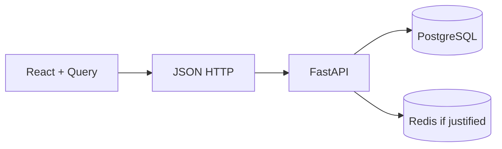

# Month 12 — Full-Stack Integration

**Program:** Full-Stack Mastery Textbook  
**Phase:** 4 — Full-stack application engineering  
**Length:** 4 weeks · 7 days each · 3–4 focused hours/day  
**Prereq:** Month 11 gate passed (6B has Postgres; you can explain Redis)  
**This month’s job:** Connect **React + TypeScript + Query** to **your FastAPI + PostgreSQL** so a requirement can move **database → API → UI → tests**. Start **Project 7** (serious domain — not a todo).

**Project 7:** `full_stack_project_requirements_2026/project_07_evolving_full_stack_product.md`. This textbook will **not** give you the product source.

---

## How this textbook is organized

```
month-12/
  README.md     ← you are here
  week-01/      API client, env, CORS, loading/error, typed contracts
  week-02/      CRUD, filter, search, pagination, optimistic vs not
  week-03/      uploads, email port, notifications, dual validation
  week-04/      basic auth, integration tests, happy path, Project 7
```

Labs: `~\fullstack-lab\month-12\`.  
Product: **Project 7 repo** (and/or `~/ops-web/` talking to `~/ops-api/`).

---

## The stack in one picture



**Wrong belief:** “Full-stack means I copy a boilerplate that already wired CORS and Query.”  
**Correct:** you already have the pieces. This month you **join** them without lying about types or status codes.

---

## Month 12 Gate

True **without a tutorial**:

1. A typed client (or fetch wrapper) — not raw `fetch` in every component.  
2. `VITE_API_BASE` (or equivalent) with **no secrets** in the frontend bundle.  
3. CORS only as wide as local Vite (`http://127.0.0.1:5173`), not `*`.  
4. List/detail/create/edit with loading, empty, error.  
5. Filter/search/pagination in the **URL** and the **queryKey**.  
6. Mutations invalidate the right keys; optimistic UI only when you can name the risk.  
7. Validation on **both** sides (Zod + Pydantic) for the same rules.  
8. From a new requirement, change **DB → API → UI → a test** without a tutorial.

If any item is false, do not start Month 13.

---

## Tools

Vite + React 19 + Router + TanStack Query v5 + RHF/Zod as you already use. FastAPI + SQLAlchemy from Month 11. Playwright-deep is Month 14; a thin happy-path is enough this month.

---

## Start

Open [week-01/day-01.md](week-01/day-01.md).

When Month 12’s gate is true, continue with [Month 13](../month-13/README.md).
