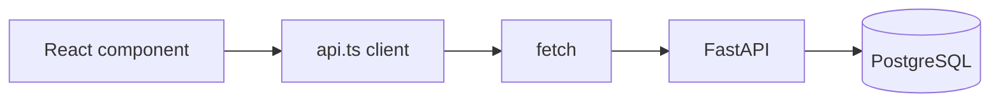
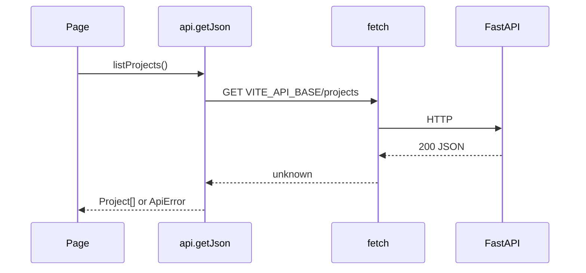

# Month 12 · Week 1 · Day 1
# An API Client You Own

**Program:** Full-Stack Mastery · 18 months  
**Phase:** 4 — Full-stack application  
**Month index:** [../../README.md](../../README.md)  
**Week 1:** Day 1 (today) · [2](day-02.md) · [3](day-03.md) · [4](day-04.md) · [5](day-05.md) · [6](day-06.md) · [7](day-07.md)  
**Week rhythm today:** Learn + type-along  
**Student state:** Month 11 gate passed. You have a FastAPI + PostgreSQL backend you can explain. Today the **browser** must talk to it through **one module**, not a scatter of `fetch` calls.  
**Study time:** 3–4 focused hours

**This week covers:** API client design, environment configuration, CORS, loading/error UX, typed contracts.

Today: a **typed client** (a small `api.ts`), `VITE_API_BASE`, TypeScript types that match JSON, and why Query (Day 4) sits **on top of** this client, not instead of it. CORS deepens tomorrow. Project 7 is **not** a paste.

Labs: `~\fullstack-lab\month-12\week-01\day-01\`. You may point the client at **your** `~/ops-api/` if it is running, or at a tiny lab FastAPI included below.

---

## How to use this textbook

1. Read a section. Close it. Say it.
2. Type the client. Do not install a 2,000-line generated SDK.
3. When the browser fails, read Network: URL, method, status, CORS errors as **separate** stories.
4. Optional review links are for later rechecking.

---

## How to read this chapter

The UI is not allowed to know the backend’s hostname in twelve files. One module builds URLs, sets `Content-Type`, parses JSON, and throws a **typed error** when the status is not OK.



**Wrong belief:** “TanStack Query replaces an API client.”  
**Correct:** Query caches and retries **functions**. Those functions still call HTTP. Today you write the function. Day 4 wraps it in `useQuery`.

**Wrong belief:** “I’ll put the password in `VITE_` so the frontend can log in as the admin.”  
**Correct:** anything `VITE_` is **public**. It ships in the JavaScript bundle. Base URL is public. Secrets are not.

---

## Today's contract

By the end of this day you will be able to:

1. Scaffold a Vite + React + TypeScript app the **correct Windows way**.
2. Read `import.meta.env.VITE_API_BASE` and fail loudly if it is missing in dev.
3. Write `api.getJson<T>(path)` that checks `response.ok`.
4. Declare a `Project` type that matches the JSON you actually receive.
5. Render a list **without** Query yet (useEffect is allowed **today** so you feel the pain Query will remove).
6. Explain why `fetch` in every component becomes unmaintainable.

**Today's gate.** Closed-book:

> One client module owns HTTP. The Vite env var is the API origin, not a secret. Types describe JSON. Components call functions, not raw URLs. Query is next; it does not erase this module.

---

## Time box

| Block | Minutes | Work |
|---|---|---|
| A | 40 | Theory |
| B | 80 | Vite app + client + list against a running API |
| C | 50 | Independent: get-one + error message on 404 |
| D | 15 | Git |
| E | 15 | Recall |

---

# Block A — Theory

## 1. Two origins

Vite dev: `http://127.0.0.1:5173`  
FastAPI: `http://127.0.0.1:8000`

Those are **different origins** (different ports). The browser’s same-origin policy will block the frontend from reading the response unless the **API** sends CORS headers that allow `http://127.0.0.1:5173`. Tomorrow you configure CORS. Today, if you already have CORS on 6B, use it. If not, the tiny lab API below includes a tight `CORSMiddleware`.

**Wrong belief:** “CORS is a FastAPI bug when I see it in the console.”  
**Correct:** CORS is the browser protecting the user. The Network tab still shows the request. The **JavaScript** is not allowed to read the body until the API opts in.

## 2. What the client must do

A useful `getJson`:

1. `fetch(base + path)`
2. If `!response.ok`, throw an `ApiError` with `status` and a short message (from JSON `detail` if present).
3. If 204, return `undefined` (no body).
4. Otherwise `response.json()` as `T`.

Do **not** `return response.json()` on 404 and hope the component notices. Status is part of HTTP. Swallowing it is how UIs show empty lists that are really outages.

## 3. Types are a contract, not a vibe

```ts
export type Project = {
  id: number;
  title: string;
};
```

If the API sends `name` instead of `title`, TypeScript will not save you at runtime. Types are a **promise you keep in tests and in your eyes**. Month 9’s CONTRACT.md still applies: the JSON keys are the contract.

## 4. Windows Vite scaffold

```powershell
npm create vite@latest lab-client -- --template react-ts
```

The extra `--` is required so npm passes `--template` to Vite. You have done this since Month 5. Do not skip it.

---

# Block B — Type-along

## B1. Optional tiny API if 6B is not running

You may skip this if `http://127.0.0.1:8000/projects` already returns JSON.

```powershell
mkdir ~\fullstack-lab\month-12\week-01\day-01\lab-api -Force
cd ~\fullstack-lab\month-12\week-01\day-01\lab-api
uv init --name labapi
uv add fastapi uvicorn
```

`main.py`:

```python
from fastapi import FastAPI
from fastapi.middleware.cors import CORSMiddleware

app = FastAPI(title="Month 12 lab API")
app.add_middleware(
    CORSMiddleware,
    allow_origins=["http://127.0.0.1:5173"],
    allow_methods=["GET"],
    allow_headers=["*"],
)

PROJECTS = [
    {"id": 1, "title": "Atlas"},
    {"id": 2, "title": "Northline"},
]


@app.get("/projects")
def list_projects() -> list[dict]:
    return PROJECTS


@app.get("/projects/{project_id}")
def get_project(project_id: int) -> dict:
    for row in PROJECTS:
        if row["id"] == project_id:
            return row
    from fastapi import HTTPException

    raise HTTPException(status_code=404, detail="Project not found")
```

```powershell
uv run uvicorn main:app --reload --host 127.0.0.1 --port 8000
```

Prove it:

```powershell
curl.exe http://127.0.0.1:8000/projects
```

## B2. Vite app

In a **second** terminal:

```powershell
cd ~\fullstack-lab\month-12\week-01\day-01
npm create vite@latest lab-client -- --template react-ts
cd lab-client
npm install
```

Create `.env`:

```
VITE_API_BASE=http://127.0.0.1:8000
```

Restart `npm run dev` after changing env files. Vite inlines env at start.

`src/api.ts`:

```ts
const base = import.meta.env.VITE_API_BASE;

if (!base) {
  throw new Error("VITE_API_BASE is missing. Put it in .env.");
}

export class ApiError extends Error {
  status: number;
  constructor(status: number, message: string) {
    super(message);
    this.status = status;
  }
}

export async function getJson<T>(path: string): Promise<T> {
  const response = await fetch(`${base}${path}`);
  if (!response.ok) {
    let detail = response.statusText;
    try {
      const body = (await response.json()) as { detail?: string };
      if (body.detail) detail = body.detail;
    } catch {
      /* not JSON */
    }
    throw new ApiError(response.status, detail);
  }
  return response.json() as Promise<T>;
}

export type Project = { id: number; title: string };

export function listProjects(): Promise<Project[]> {
  return getJson<Project[]>("/projects");
}

export function getProject(id: number): Promise<Project> {
  return getJson<Project>(`/projects/${id}`);
}
```

`src/App.tsx` — list with **explicit** loading and error (useState/useEffect today):

```tsx
import { useEffect, useState } from "react";
import { ApiError, listProjects, type Project } from "./api";

export default function App() {
  const [projects, setProjects] = useState<Project[] | null>(null);
  const [error, setError] = useState<string | null>(null);

  useEffect(() => {
    listProjects()
      .then(setProjects)
      .catch((err: unknown) => {
        if (err instanceof ApiError) setError(`${err.status}: ${err.message}`);
        else setError("Network error");
      });
  }, []);

  if (error) return <p role="alert">{error}</p>;
  if (!projects) return <p>Loading…</p>;
  if (projects.length === 0) return <p>No projects yet.</p>;

  return (
    <ul>
      {projects.map((p) => (
        <li key={p.id}>{p.title}</li>
      ))}
    </ul>
  );
}
```

```powershell
npm run dev -- --host 127.0.0.1 --port 5173
```

Open `http://127.0.0.1:5173`. You should see Atlas and Northline.

Stop the API. Refresh. You should see an error, not a silent blank. That is the point of `ApiError`.

---

# Block C — Independent

Add a second screen or a click: load `/projects/1` with `getProject`. Then load `/projects/999` and show the 404 detail, not a crash.

Write `NOTES.md`: what Network showed for a good GET and for 404; whether CORS appeared when origin was `localhost` vs `127.0.0.1` (they are **different origins** — pick one and stay consistent).

---

# Block D — Git

```powershell
cd ~\fullstack-lab
git add month-12/week-01/day-01
git commit -m "Month 12 Week 1 Day 1: typed API client and Vite env."
```

Do not commit secrets. `VITE_API_BASE` pointing at 127.0.0.1 is fine.

---

# Block E — Recall

1. Why Query does not replace `api.ts`.  
2. Why `VITE_` cannot hold a private API key.  
3. What `response.ok` means.  
4. `localhost` vs `127.0.0.1` as CORS.  
5. Loading vs empty vs error — three UIs.

## Office hours

**CORS error, Network 200.** The browser hid the body. Fix API `allow_origins` to the exact origin in the address bar.

**Empty list but API works in curl.exe.** The frontend called a different path or a different port. Read the request URL in Network.

**`import.meta.env.VITE_API_BASE` undefined.** Env file name, prefix `VITE_`, restart Vite.

---

## Definition of done

- [ ] Vite app lists projects through `api.ts`  
- [ ] Missing env throws a clear error  
- [ ] 404 is visible in the UI  
- [ ] Commit exists  

---

## Tomorrow

CORS configuration you can explain, plus loading/error as a reusable UI pattern. Day 4 introduces Query on this same client.

---

## Optional review links

Fetch and Vite env are explained in this chapter. These pages are for later checking, not for first learning.

- [MDN: Using the Fetch API](https://developer.mozilla.org/en-US/docs/Web/API/Fetch_API/Using_Fetch)
- [Vite: Env variables](https://vitejs.dev/guide/env-and-mode.html)

---

# Lab notebook — files you should actually have

```
month-12/week-01/day-01/
  lab-api/          (or you pointed at 6B)
    main.py
  lab-client/       Vite react-ts
    .env
    .env.example
    src/api/client.ts
    src/api/types.ts
    src/api/projects.ts   (or your noun)
    src/App.tsx           no fetch(
```

`npm create vite@latest lab-client -- --template react-ts` — extra `--` required on Windows npm. Later this month: `npm install react-router` and `import { BrowserRouter } from "react-router"`. Query is Day 4: `useQuery({ queryKey, queryFn })` with **`isPending`**, not a homemade `loading` boolean you forget to clear.

If the stub returns Pydantic models, serialize with **`model_dump()`**. Do not call `.dict()`.

Prove HTTP with **`curl.exe`** before you blame React:

```powershell
curl.exe -s http://127.0.0.1:8000/projects
```

**Wrong belief:** “The client can `as Project[]` because I wrote the API.”  
**Correct:** treat `response.json()` as `unknown` and narrow. Day 5 tests will punish the cast.

**Wrong belief:** “I’ll add Axios so I do not think about `ok`.”  
**Correct:** Axios still needs a wrapper. `fetch` plus `ApiError` is enough.



## Recite-back checklist

Write `RECITE.txt`.

- [ ] one client module owns fetch
- [ ] VITE_API_BASE is public
- [ ] throw on !ok
- [ ] JSON unknown then type
- [ ] curl.exe proved the stub
- [ ] Vite extra --
- [ ] no secrets in the bundle
- [ ] Query sits on this client tomorrow-plus-two
