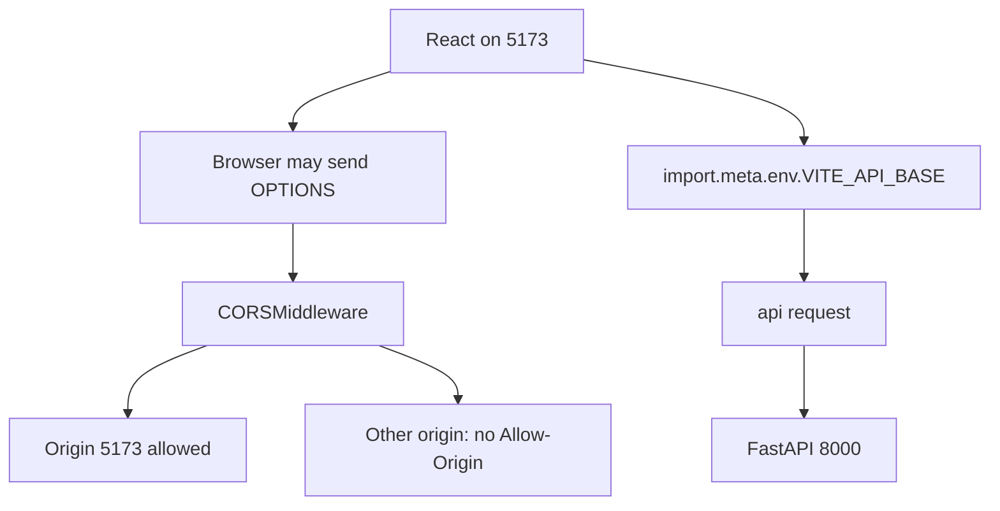
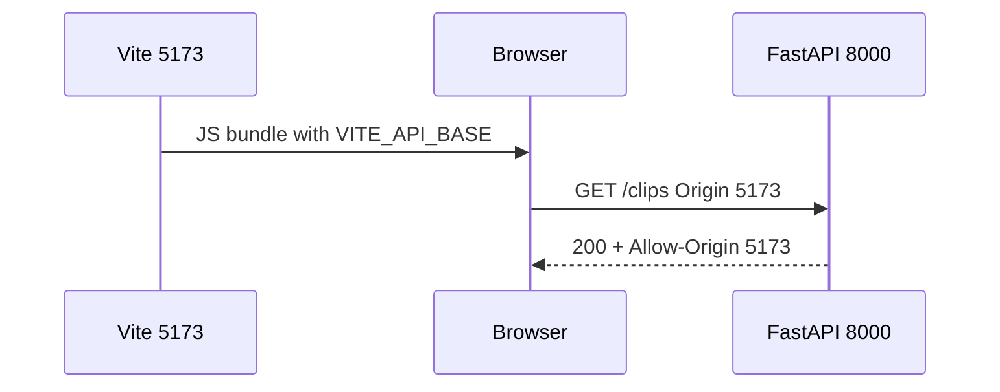

# Month 12 · Week 1 · Day 2
# Env, CORS, and Honest Loading / Error UI

**Program:** Full-Stack Mastery · 18 months  
**Phase:** 4 — Full-stack application  
**Month index:** [../../README.md](../../README.md)  
**Week 1:** [1](day-01.md) · Day 2 (today) · [3](day-03.md) · [4](day-04.md) · [5](day-05.md) · [6](day-06.md) · [7](day-07.md)  
**Week rhythm today:** Learn + type-along  
**Student state:** Day 1 gate passed. You have a typed client and a FastAPI stub. Today the browser is allowed to call that stub **on purpose**, the base URL comes from **env**, and the UI names **loading, empty, and error** as different states. Cookies wait.  
**Study time:** 3–4 focused hours

**This week covers:** API client, env, CORS, loading/error UX, typed contracts.

Today: **`VITE_API_BASE`**, FastAPI **`CORSMiddleware`** for `http://127.0.0.1:5173` (not `*`), JSON requests, and UI branches you can teach. Query’s `isPending` is Day 4; today you may still use a local `status` enum if Query is not wired yet — the **names** of the states must be right.

Labs: `~\fullstack-lab\month-12\week-01\day-02\`. Do not paste Project 7. Do not paste `~/ops-web/`.

---

## How to use this textbook

1. Read a section. Close it. Say it.
2. Type CORS and env. Do not “temporarily” allow `*`.
3. Predict browser vs `curl.exe` **before** you click.
4. Optional review links are for later rechecking.

---

## How to read this chapter

The browser’s **same-origin policy** is not FastAPI being rude. **Origin** is scheme + host + port. Vite is `http://127.0.0.1:5173`. Uvicorn is `http://127.0.0.1:8000`. Those are **different origins**. `curl.exe` does not care. Chrome does.

**CORS** is the API saying “yes, that origin may read this response.” It is **not** authentication. It is **not** a firewall for `curl.exe`. It is a **browser** rule.

**Env** is how the client learns the API base **without** hard-coding it in twelve files. Vite only exposes variables that start with **`VITE_`**. Those values are **public**. They ship in the JavaScript bundle.



**Wrong belief:** “I’ll set `allow_origins=['*']` so I can code.”  
**Correct:** `*` teaches a lie. With cookies (`allow_credentials=True`) browsers **reject** `*`. Reflecting any Origin is worse. Allow **`http://127.0.0.1:5173`**. If you also use `http://localhost:5173`, that is a **second** origin — list it only if you document it.

**Wrong belief:** “I’ll put the database URL in `.env` as `VITE_DATABASE_URL` so the UI can skip the API.”  
**Correct:** `VITE_*` is public. The UI talks to FastAPI. Postgres stays on the server.

---

## Today's contract

By the end of this day you will be able to:

1. Put **`VITE_API_BASE=http://127.0.0.1:8000`** in `.env` (and `.env.example` without secrets).
2. Read it in the client; **fail loudly** if it is missing (do not silently fetch the Vite origin).
3. Add **CORSMiddleware** with `allow_origins=["http://127.0.0.1:5173"]`, `allow_credentials=False` for today’s JSON.
4. Explain **preflight** (OPTIONS) for `Content-Type: application/json`.
5. Render **loading**, **empty**, **error**, and **rows** as four different UIs.
6. Use **`curl.exe`** with an `Origin` header to see `Access-Control-Allow-Origin` — and a second origin that must **not** be echoed.

**Today's gate.** Closed-book:

> Vite inlines `VITE_API_BASE`. No secrets there. CORS allows 5173, not `*`. curl always gets the body; the browser needs the header. Loading is not empty. Empty is not error. Cookies and `credentials: "include"` are later — today’s JSON does not need credentials.

---

## Time box

| Block | Minutes | Work |
|---|---|---|
| A | 50 | Theory |
| B | 60 | Env + CORS + four UI states |
| C | 70 | Independent: Origin experiments + missing env |
| D | 20 | Git |
| E | 15 | Recall |

---

# Block A — Theory

## 1. `VITE_API_BASE` is public configuration

Create `.env` next to `package.json`:

```
VITE_API_BASE=http://127.0.0.1:8000
```

Create `.env.example` with the **same key** and a dummy URL. Commit `.env.example`. Do **not** commit secrets. Today there are no secrets; still gitignore `.env` if your template does not.

```ts
const baseUrl = import.meta.env.VITE_API_BASE;

if (typeof baseUrl !== "string" || baseUrl.trim() === "") {
  throw new Error("VITE_API_BASE is missing");
}
```

Restart `npm run dev` after changing `.env`. Vite reads env at **dev-server start** and at **build**.

**Wrong belief:** “Env is private because the file is named `.env`.”  
**Correct:** on the **server**, env can be private. In **Vite**, `VITE_*` is compiled into JS. Anyone can open DevTools and see the base URL. That is fine for a public API origin. It is not fine for a password.

Month 5 already taught: `vite build` inlines the string. `Select-String` on `dist` would find `127.0.0.1:8000`. Good. The same procedure would leak a token.

---

## 2. CORS in sentences you can recite

1. **Origin** = scheme + host + port. Path is not part of origin. No trailing slash in `allow_origins`.
2. A **cross-origin** `fetch` from 5173 to 8000 is blocked unless the response includes `Access-Control-Allow-Origin` matching the page (or a carefully configured alternative this course does not use).
3. **`curl.exe` is not a browser.** It prints JSON even when CORS would fail in Chrome. Use curl to test **HTTP**. Use the browser (or a TestClient header test) to test **CORS**.
4. **Preflight:** for many JSON POSTs the browser sends **OPTIONS** first. CORSMiddleware answers OPTIONS. If you never added middleware, the preflight fails and the POST never happens. You will blame FastAPI’s POST while OPTIONS is the corpse.
5. **CORS is not auth.** Allowing 5173 does not know *who* the user is. Month 13 authenticates. A wide CORS policy plus a missing auth check is how a random website’s JS reads your API **as the victim** (browser-side). Lock origins. Lock auth later. Do both.

```python
from fastapi.middleware.cors import CORSMiddleware

app.add_middleware(
    CORSMiddleware,
    allow_origins=["http://127.0.0.1:5173"],
    allow_credentials=False,
    allow_methods=["GET", "POST", "PUT", "PATCH", "DELETE", "OPTIONS"],
    allow_headers=["Content-Type", "Accept"],
)
```

`allow_credentials=False` today. Cookie sessions need `True` **and** an explicit origin — never `*`. Week 4 sketches HttpOnly cookies. Do not enable credentials “just in case.”

**Wrong belief:** “I’ll allow `*` and `allow_credentials=True` so login works later.”  
**Correct:** that combination is invalid in browsers. You will “fix” it by echoing the request Origin. That is an open door. This course: **list the Vite origin**.

---

## 3. JSON today, cookies later

| Today | Later (Week 4 sketch / Month 13) |
|---|---|
| `Content-Type: application/json` | Same, plus cookie header the **browser** sends |
| `credentials` omitted / `"same-origin"` | `"include"` if the API is another origin and you use cookies |
| CORS `allow_credentials=False` | `True` only with explicit origins |

Do not set `credentials: "include"` today. You would force a credentials CORS conversation you are not implementing.

---

## 4. Four UI states (name them)

A list screen has **four** honest states. Mixing them is the bug users call “it is broken.”

| State | Meaning | UI |
|---|---|---|
| **Loading** | No success data yet (first request) | Status text, skeleton, `aria-busy` — not a fake empty table |
| **Empty** | Request **succeeded**; zero rows | “No clips yet” + optional create |
| **Error** | Request **failed** (`ApiError` or network) | Message + retry; do not pretend it is empty |
| **Rows** | Success with one or more items | The list |

When Query arrives (Day 4):

- **`isPending`** ≈ loading (no success data yet).
- **`isFetching`** can be true **while rows stay on screen** (refetch). Do not blank the table.
- **`isError`** ≈ error.
- **`data.items.length === 0`** ≈ empty.

Today, if you still call the client from a button, use a small union:

```ts
type ListState =
  | { status: "idle" }
  | { status: "loading" }
  | { status: "error"; message: string }
  | { status: "success"; items: ClipDto[] };
```

`idle` is “have not asked.” After Day 4, Query asks on mount.

**Wrong belief:** “I’ll show ‘No clips’ while loading so the layout does not jump.”  
**Correct:** that trains the user to think the database is empty. Use a loading name. Empty is a **success** with length 0.

**Wrong belief:** “I’ll `alert()` the error.”  
**Correct:** an error region in the page (`role="alert"` is reasonable) plus a Retry button. Alerts do not compose with Query.

---

## 5. Windows checks

```powershell
curl.exe -s -D - http://127.0.0.1:8000/clips -o NUL
curl.exe -s -D - http://127.0.0.1:8000/clips -H "Origin: http://127.0.0.1:5173" -o NUL
curl.exe -s -D - http://127.0.0.1:8000/clips -H "Origin: http://evil.example" -o NUL
```

Write `CORS-HEADERS.txt`: which `Access-Control-Allow-Origin` you saw. Evil origin must **not** be copied back.

PowerShell’s `curl` alias is not this course. **`curl.exe`**.

---

## 6. Security start

- Origins listed, not `*`.
- No `VITE_` secrets.
- Bind Uvicorn `--host 127.0.0.1`.
- Error UI must not dump stack traces or SQL to the user. Log on the server (Month 11). Show a short message in the browser.

---

# Block B — Type-along

Continue from Day 1 by **typing** into a new folder (do not import across days as a package):

```powershell
cd ~\fullstack-lab
mkdir month-12\week-01\day-02 -Force
cd ~\fullstack-lab\month-12\week-01\day-02
```

Copy-by-typing the stub + Vite app (or rebuild). Then:

1. FastAPI: CORSMiddleware as specified. Keep GET `/clips` envelope.
2. Vite: `.env` + `.env.example`. Client reads `import.meta.env.VITE_API_BASE`.
3. UI: on mount **or** on a Load button, set loading → then empty, error, or rows. Three fixtures:
   - Stub with two clips (rows)
   - Stub returning `{items: [], total: 0}` (empty) — a query flag or a second route `/clips-empty` is allowed in the **lab only**
   - Stop Uvicorn (error)

Prefer **one** list route and toggle data in the stub dict rather than a fake second route if you can.

Run Vite:

```powershell
npm run dev -- --host 127.0.0.1 --port 5173
```

Open `http://127.0.0.1:5173` (not `localhost` unless you added that origin).

Write `STATES.md`: screenshot optional; required: four sentences naming the four states you observed.

---

# Block C — Independent

1. Remove `VITE_API_BASE` from `.env`, restart Vite, record the **loud** failure (your throw). Restore.
2. OPTIONS preflight: `curl.exe` OPTIONS `/clips` with `Origin` and `Access-Control-Request-Method: GET`. Record status.
3. Add a visible **Retry** on error that calls the client again.
4. Write `SECURITY.md`: why `*` is forbidden in this course; why `VITE_` cannot hold a password; cookies not today.

Do not enable `allow_credentials=True`. Do not start Project 7.

```powershell
cd ~\fullstack-lab
git add month-12
git commit -m "Month 12 Day 2: VITE_API_BASE, CORS 5173, loading empty error."
```

---

# Block E — Recall

1. Origin vs URL path.  
2. Why curl is a bad CORS teacher if used alone.  
3. Preflight in one sentence.  
4. `isPending` vs empty list (preview of Day 4).  
5. What `allow_credentials=True` plus `*` does in a browser.

---

## Office hours — defects you will hit

**Page on `http://localhost:5173`, CORS allows `127.0.0.1`.** Blocked. Pick one host and use it in the address bar **and** in `allow_origins`.

**Trailing slash in origins.** `http://127.0.0.1:5173/` is wrong. Origins have no path.

**Forgot to restart Vite after `.env`.** Old base URL or `undefined`. Restart.

**Error looks like empty.** You branched `if (!data)` and treated throw and `[]` the same. Separate `isError` / catch from length 0.

**CORSMiddleware added but POST still fails.** Check OPTIONS. Check `allow_headers` includes `Content-Type`.

**`fetch("/clips")` still relative.** Env unused. You are hitting Vite.



---

## Definition of done

- [ ] `.env.example` has `VITE_API_BASE`
- [ ] Client throws if base is missing
- [ ] CORS allows `http://127.0.0.1:5173` only
- [ ] `CORS-HEADERS.txt` shows allow vs not-echoed evil
- [ ] UI distinguishes loading, empty, error, rows
- [ ] No `allow_origins=["*"]`
- [ ] Commit exists

---

## Optional review links

CORS and Vite env are explained in this chapter.

- [MDN: CORS](https://developer.mozilla.org/en-US/docs/Web/HTTP/CORS)
- [FastAPI: CORS](https://fastapi.tiangolo.com/tutorial/cors/)
- [Vite: Env variables](https://vitejs.dev/guide/env-and-mode.html)
- [MDN: Using Fetch — CORS](https://developer.mozilla.org/en-US/docs/Web/API/Fetch_API/Using_Fetch)

---

## Tomorrow

**Implement from memory:** a list page talking to a **tiny local FastAPI stub** (or your 6B list if you can do it without copying a tutorial). Days 1–2 stay closed during the build.

---

# Worked session — env then CORS then states

`.env` first. Client reads `import.meta.env.VITE_API_BASE`. Throw if missing. `.env.example` committed. `.env` not a secret store.

CORSMiddleware on the stub: `allow_origins=["http://127.0.0.1:5173"]`, `allow_credentials=False`. `curl.exe -H "Origin: ..."` for 5173 and for evil. Write headers.

Vite `npm run dev -- --host 127.0.0.1 --port 5173`. Open 127.0.0.1, not localhost, unless both origins are listed.

Four UI states. Loading is not empty. Empty is 200 with no rows. Error is throw. Rows are rows.

JSON only. No `credentials: "include"`. No `*`. No Project 7 dump.

---

# Closing lecture — browsers lie without CORS; curl does not

`curl.exe` will praise an API that Chrome refuses. That is not a FastAPI bug. Origin 5173 must appear in `Access-Control-Allow-Origin`. Evil must not.

`VITE_API_BASE` is a public string in the bundle. Database URLs and signing keys stay in the **API** environment, never prefixed with `VITE_`.

Four states. If you only have “spinner vs table,” you will call a 500 “no data.” Users will create duplicate rows. Name error.

Cookies later. Today `allow_credentials=False`. Month 13 will make you justify session cookie vs token. Do not enable credentials to feel ready.

`isPending` on Day 4 is loading. `isFetching` is not a reason to blank the table. Learn the names today so Query does not surprise you.
