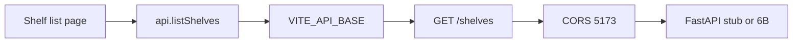

# Month 12 · Week 1 · Day 3
# Implement From Memory: A List Page and a Tiny API

**Program:** Full-Stack Mastery · 18 months  
**Phase:** 4 — Full-stack application  
**Month index:** [../../README.md](../../README.md)  
**Week 1:** [1](day-01.md) · [2](day-02.md) · Day 3 (today) · [4](day-04.md) · [5](day-05.md) · [6](day-06.md) · [7](day-07.md)  
**Week rhythm today:** Implement from memory  
**Student state:** Day 2 gate passed. You have typed a client module, `VITE_API_BASE`, CORS for 5173, and four UI states. Today those ideas must still live in your head — from **this file**.  
**Study time:** 3–4 focused hours  
**Prereq:** Day 2 gate passed.

Labs: `~\fullstack-lab\month-12\week-01\day-03\`. Do **not** copy Day 1–2 source. Do **not** paste Project 7 or `~/ops-web/`. You **may** point the client at **your** 6B list endpoint if it already exists — still **type** the client and the page; do not copy-paste 6B into the lab. Index **shelves** are the default noun.

---

## How Day 3 works

Days 1–2 had type-along code. During the drills they stay **closed**. This file contains a recap so you are not sent to another site to learn.

Allowed:

- The complete explanation in this file
- Your own notes in `fullstack-lab`
- HTTP in front of you (`curl.exe`, browser Network tab, `/docs`)

Not allowed:

- Pasting a finished client from AI
- Copying Day 1 or Day 2 `client.ts` / `main.py`
- Browsing Vite or FastAPI docs as the teacher during the build

If you are stuck **more than 25 minutes** on one task, open **only** the matching Day 1 or Day 2 section **in this textbook**, read it, close it, continue from memory. Record lookups in `lookups.txt`.

There is **no complete app** in this file. The resource is specified. You write it.

---

## How to read this chapter

A list page is not a `fetch` in `useEffect` forever. It is a **typed client** plus **four UI states** plus an API that returns a **JSON envelope**. Query is tomorrow. Today you may load on mount with a small state union **or** a Load button. The **client** is still the only `fetch`.



**Wrong belief:** “Memory day means I reopen Day 2 with the file open.”  
**Correct:** the recap below is the teacher. Days 1–2 are backup after 25 minutes.

---

## Complete explanation (the join you must still own)

**Two programs.** React on Vite (`http://127.0.0.1:5173`). FastAPI on Uvicorn (`http://127.0.0.1:8000`). Different origins.

**Scaffold.** `npm create vite@latest shelf-web -- --template react-ts`. Extra `--` required. `npm install`. Router not required today; if you install it: `npm install react-router` and import from `"react-router"`.

**Client module.** `request()` prefixes `import.meta.env.VITE_API_BASE`. Throws if missing. `fetch` only here. JSON as `unknown`. `!response.ok` → `ApiError` with `status`. Parse function returns a DTO. Components do not call `fetch`.

**DTO.** Wire JSON, not SQLAlchemy. Example: `{ id: number, name: string, slot_count: number }`. Envelope `{ items: ShelfDto[], total: number }`. Empty list is success.

**Pydantic v2.** Out model uses **`model_dump()`**, not `.dict()`. Prefer `response_model` so you do not leak internals.

**Env.** `.env` has `VITE_API_BASE=http://127.0.0.1:8000`. `.env.example` committed. No secrets. `VITE_*` is public in the bundle. Restart Vite after env changes.

**CORS.** `CORSMiddleware`, `allow_origins=["http://127.0.0.1:5173"]`, `allow_credentials=False` for JSON. Not `*`. `localhost` and `127.0.0.1` are different. Open the matching host in the browser. `curl.exe` always sees bodies; send `-H "Origin: http://127.0.0.1:5173"` to inspect `Access-Control-Allow-Origin`. Evil origin must not be echoed.

**Preflight.** JSON POST often sends OPTIONS first. Today GET list may be “simple.” Still add middleware so Day 4+ POSTs work.

**UI states.** Loading (asked, no success yet). Empty (200, zero items). Error (`ApiError` or network). Rows. Do not show “No shelves” while loading. Retry on error.

**Windows.** `curl.exe`, not the `curl` alias. Uvicorn: `uv run uvicorn main:app --reload --host 127.0.0.1 --port 8000`. Vite: `npm run dev -- --host 127.0.0.1 --port 5173`.

**Query v5 preview (do not require it today):** `useQuery({ queryKey, queryFn })`. `isPending` is first load. `gcTime` not `cacheTime`. Tomorrow.

**6B option.** If `~/ops-api/` already lists a resource, you may set `VITE_API_BASE` at it and type a DTO that matches **its** CONTRACT.md. You still write a **new** Vite lab. You do not copy ops-api source into `fullstack-lab`. If 6B CORS is missing, add 5173 there **or** use the stub. Do not allow `*`.

**Wrong belief:** “I’ll `fetch` in the page because Query is tomorrow.”  
**Correct:** tomorrow Query calls **the same** `listShelves`. If `fetch` lives in the page, you will delete it tomorrow anyway — or you will have two HTTP paths.

**Wrong belief:** “CORS `*` is fine for a memory lab.”  
**Correct:** the habit is the lesson. 5173 only.

---

## Today's contract

Rebuild Day 1–2 skills as if this were a lab exam.

**Today's gate.** Closed-book:

> Using the editor, curl.exe, this recap, and my notes, I produced a typed client, VITE_API_BASE, CORS for 5173, and a list page with loading/empty/error/rows — without fetch in the component.

---

## Time box

| Block | Minutes | Work |
|---|---|---|
| A | 20 | Closed-book oral review (no typing yet) |
| B | 40 | Paper drills: layers and headers |
| C | 90 | Build the spec |
| D | 35 | Defect hunt |
| E | 15 | Record lookups |

---

# Block A — Speak first

Out loud, no notes, no Day 1–2 files:

1. Why components do not call `fetch`.  
2. What `VITE_API_BASE` becomes in the bundle.  
3. Origin in one sentence.  
4. Why curl is not enough to prove CORS.  
5. Loading vs empty vs error.  
6. `model_dump()` vs `.dict()`.  
7. `isPending` vs `isLoading` (v5 main flag).

If any answer is mush, re-read the recap. Do not open Day 2 yet.

---

# Block B — Paper drills

On paper or `DRILLS.txt` (no servers running):

1. Write the CORSMiddleware `allow_origins` list for this course.  
2. Write `ApiError` fields you will need (`status`, `body`).  
3. Sketch `listShelves` return type.  
4. Predict: browser on localhost, CORS allows 127.0.0.1 — what happens?  
5. Predict: GET `/shelves` 200 `{items:[], total:0}` — which UI state?

Do not look up answers. The recap is enough.

---

# Block C — Spec (you implement)

```powershell
cd ~\fullstack-lab
mkdir month-12\week-01\day-03 -Force
cd ~\fullstack-lab\month-12\week-01\day-03
```

**Default resource: library shelves** — not Project 7, not 6A users/projects/tasks.

**CONTRACT (implement this):**

| Piece | Rule |
|---|---|
| Stub **or** 6B | GET `/health` 200. GET `/shelves` 200 envelope `{items, total}`. Item: `id`, `name`, `slot_count`. Seed **zero or more** — you must be able to demo empty **and** rows (toggle seed or POST later; a lab-only reset route is allowed). |
| CORS | `http://127.0.0.1:5173`, not `*` |
| Client | `src/api/`; no `fetch` in pages |
| Env | `VITE_API_BASE`; `.env.example` |
| UI | Four states + Retry |
| Pydantic | Out + `model_dump()` if you control the stub |

```powershell
uv run uvicorn main:app --reload --host 127.0.0.1 --port 8000
npm run dev -- --host 127.0.0.1 --port 5173
```

Prove stub with **`curl.exe`**. Write `CURL.txt`. Write `CORS-HEADERS.txt` with Origin 5173 and evil.

---

# Block D — Defect hunt

On **your** servers:

1. Stop API — UI is **error**, not empty.  
2. Empty seed — **empty** copy, not a spinner forever.  
3. Missing env — loud throw (restart Vite).  
4. Open `localhost:5173` if you only allowed 127.0.0.1 — record blocked.  
5. `curl.exe` GET still works when the browser is blocked (CORS vs HTTP).

If POST is not in the spec, do not add a CRUD empire.

---

# Block E — Lookups

`lookups.txt`: what you opened Days 1–2 for. If empty, write `none`.

```powershell
cd ~\fullstack-lab
git add month-12
git commit -m "Month 12 Day 3: shelf list from memory with typed client."
```

---

# Lecture: the client is the join

Month 12 is not “learn fetch again.” Month 7 already fetched. Month 9 already served JSON. The join is **one module** both sides can trust.

If you pointed at 6B, the DTO must match 6B’s Out model. If 6B returns a bare array, either wrap it in the client (`{ items: array, total: array.length }`) **or** change 6B to an envelope — document the choice in `CONTRACT.md`. Lying with `as` is not a choice.

Query tomorrow: `useQuery({ queryKey: ["shelves"], queryFn: () => api.listShelves() })`. If `listShelves` does not exist, you will paste `fetch` into `queryFn` and Week 1 failed.

`isPending` is loading. Empty is success. CORS is not auth. `VITE_*` is not a vault.

---

## Definition of done

- [ ] Spoke Block A without notes  
- [ ] Spec implemented; four UI states observed  
- [ ] No `fetch` in component files  
- [ ] CORS 5173, not `*`  
- [ ] `lookups.txt` exists  
- [ ] Commit exists  

---

# Worked session — shelves, not ops-web

New folder. Stub or 6B. `uv` + Vite extra `--`. Client `request` + `listShelves`. Env throw. CORS 5173. Four states. `curl.exe`. Evil origin not echoed.

Days 1–2 closed. Recap is the teacher. 25-minute lookup rule. No AI-finished client. No Project 7 dump.

If you use 6B, write `SOURCE.txt`: “ops-api GET /… ; lab UI is new.” If you use a stub, write “stub.”

---

## Optional review links

Repair from this recap first.

- [FastAPI CORS](https://fastapi.tiangolo.com/tutorial/cors/)
- [Vite env](https://vitejs.dev/guide/env-and-mode.html)

---

## Tomorrow

**Lab:** `QueryClient`, `QueryClientProvider`, `useQuery` list. Object syntax. `isPending`. The client you built today becomes `queryFn`.

---

# Closing lecture — four states, one fetch, one origin

Components do not call `fetch`. The client throws `ApiError`. Env is `VITE_API_BASE`. CORS is 5173. Loading is not empty. Empty is not error.

`model_dump()` on the server. `unknown` then parse on the client. `curl.exe` for HTTP. Browser for CORS.

Do not allow `*`. Do not put secrets in Vite. Do not copy Day 2 files. Do not paste ops-web.

Recite: object-syntax Query is tomorrow; the `queryFn` is already `listShelves`.

## Recite-back checklist (close the editor, then tick)

Write `RECITE.txt` with one honest sentence per line.

- [ ] no fetch in pages
- [ ] VITE_API_BASE public
- [ ] CORS 5173 not star
- [ ] four UI states
- [ ] ApiError on !ok
- [ ] model_dump on Out
- [ ] curl.exe vs browser
- [ ] not Project 7 source

---

# If you pointed at 6B instead of the stub

Write `SOURCE.txt`:

- exact GET path
- envelope vs bare array
- whether you wrapped the array in the client
- CORS: did 6B already allow 5173?

If 6B returns a bare array, either:

1. Change 6B to `{items, total}` (better for Week 2 pagination), or  
2. Wrap in the client: `{ items: data, total: data.length }` and say so in CONTRACT.md.

Do not `as any`. Parse.

**Wrong belief:** “Memory day is optional if Day 2 compiled.”  
**Correct:** Day 2 had the files open in your muscle memory. Today the recap is the teacher.

Windows quoting is not the API. If POST is not in spec, skip it. GET list is enough.

```powershell
uv run uvicorn main:app --reload --host 127.0.0.1 --port 8000
npm run dev -- --host 127.0.0.1 --port 5173
curl.exe -s -D - http://127.0.0.1:8000/shelves -H "Origin: http://127.0.0.1:5173" -o NUL
```

If Allow-Origin is missing, CORSMiddleware is missing. If curl works and Chrome fails, you opened the wrong host.

Tomorrow Query: `useQuery({ queryKey: ["shelves"], queryFn: () => api.listShelves() })`. If `listShelves` does not exist, you will paste fetch into the page. That fails the week.
