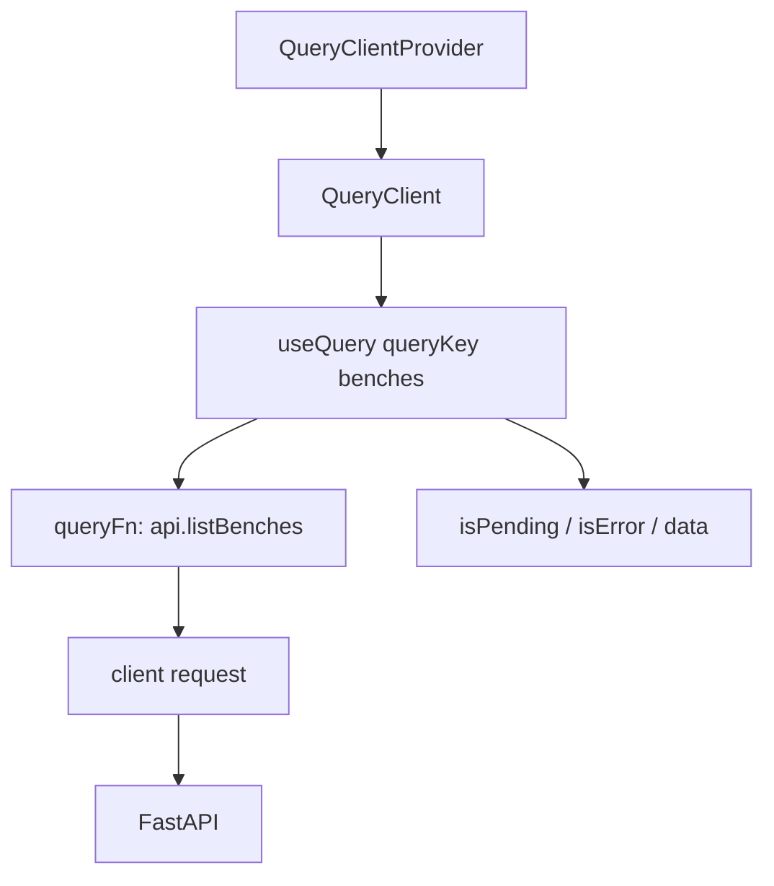
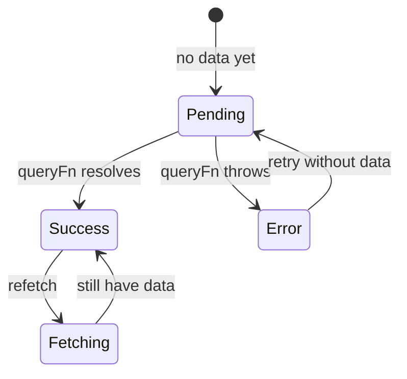

# Month 12 · Week 1 · Day 4
# Lab: QueryClient, Provider, and a useQuery List

**Program:** Full-Stack Mastery · 18 months  
**Phase:** 4 — Full-stack application  
**Month index:** [../../README.md](../../README.md)  
**Week 1:** [1](day-01.md) · [2](day-02.md) · [3](day-03.md) · Day 4 (today) · [5](day-05.md) · [6](day-06.md) · [7](day-07.md)  
**Week rhythm today:** Learn + lab feature  
**Student state:** You can call a typed client from a page. Today **TanStack Query v5** owns the list cache. The client stays. The page stops owning request state by hand.  
**Study time:** 3–4 focused hours

Today: **`QueryClient`**, **`QueryClientProvider`**, **`useQuery({ queryKey, queryFn })`**, **`isPending` / `isError` / `data`**. Mutations are Week 2. Pagination keys are Week 2. Tests are Day 5.

Labs: `~\fullstack-lab\month-12\week-01\day-04\`. Resource: **lab benches** (or continue shelves if you rebuild). Not Project 7 source.

---

## How to use this textbook

1. Read a section. Close it. Say it.
2. Type the provider and the hook. Do not paste a dashboard.
3. When the table flashes empty on refetch, that is **`isPending` vs `isFetching`** — today’s bug name.
4. Optional review links are for later rechecking.

---

## How to read this chapter

Month 7 already taught Query. Month 12 **aims it at your FastAPI**. The cache key is the identity of a **server** result. The `queryFn` is **your client function**, not a second `fetch`.



If that is still abstract: Day 3’s `useState` union was a homemade cache of one screen. Query is that cache with a **key**, **deduping**, and **refetch**. Two components with `["benches"]` share one HTTP call.

**Wrong belief:** “I’ll keep `useState` and also call `useQuery`.”  
**Correct:** Query **is** the list state. Copying `data` into `useState` in an effect is the Month 7 bug returning.

**Wrong belief:** “v4 `isLoading` is the flag I remember, so I’ll use it.”  
**Correct:** in v5, **`isPending`** is the main “no success data yet” flag. `isLoading` still exists as a narrower alias (`isPending && isFetching`). Teach **`isPending`** for first load. **`isFetching`** for “a request is in flight, maybe we already have rows.”

---

## Today's contract

By the end of this day you will be able to:

1. Construct **one** `QueryClient` **outside** the `App` render (or `useState` factory) so it is not recreated every paint.
2. Wrap the tree in **`QueryClientProvider`**.
3. Write **`useQuery({ queryKey: ["benches"], queryFn: () => api.listBenches() })`**.
4. Branch UI on **`isPending`**, **`isError`**, empty `data.items`, and rows.
5. Leave rows visible when **`isFetching`** is true after the first success.
6. Keep throwing in the client on `!ok`; Query surfaces that as `isError`.

**Today's gate.** Closed-book:

> QueryClient is the cache. Provider makes it available. useQuery object syntax subscribes. queryFn calls the client. isPending is first load. isFetching can coexist with data. Empty array is success. I still do not fetch in the component.

---

## Time box

| Block | Minutes | Work |
|---|---|---|
| A | 50 | Theory |
| B | 60 | Provider + useQuery list |
| C | 70 | Independent: second subscriber + Devtools |
| D | 20 | Git |
| E | 15 | Recall |

---

# Block A — Theory

## 1. QueryClient — one per app

```tsx
import { QueryClient, QueryClientProvider } from "@tanstack/react-query";
import { ReactQueryDevtools } from "@tanstack/react-query-devtools";

const queryClient = new QueryClient({
  defaultOptions: {
    queries: {
      staleTime: 30_000,
      gcTime: 5 * 60 * 1000,
      retry: 1,
    },
  },
});
```

Install:

```powershell
npm install @tanstack/react-query
npm install -D @tanstack/react-query-devtools
```

**`staleTime`:** how long data is **fresh** (no refetch just because you remounted).  
**`gcTime`:** how long **unused** data stays in memory after the last subscriber unmounts. Formerly **`cacheTime`**. The name changed. Do not set `cacheTime`.  
**`retry`:** failed queries retry by default. Labs often use `1`. Tests tomorrow use **`retry: false`**.

```tsx
createRoot(document.getElementById("root")!).render(
  <QueryClientProvider client={queryClient}>
    <App />
    <ReactQueryDevtools initialIsOpen={false} />
  </QueryClientProvider>,
);
```

**Wrong belief:** “I’ll `new QueryClient()` inside `function App()`.”  
**Correct:** every render would throw away the cache. Create it once in `main.tsx` (course default) or `useState(() => new QueryClient())` if you must colocate.

---

## 2. useQuery — object API only

```tsx
const benchesQuery = useQuery({
  queryKey: ["benches"],
  queryFn: () => api.listBenches(),
});
```

| Field | Meaning |
|---|---|
| `queryKey` | Identity of the cache entry. Include every input the function uses (id, `q`, page — Week 2). |
| `queryFn` | Returns parsed data or **throws**. |
| `isPending` | No successful data yet. |
| `isFetching` | A request is in flight. |
| `isError` | Last request threw. |
| `error` | The thrown value (`ApiError` if your client throws it). |
| `data` | Parsed DTO after success. |

```tsx
if (benchesQuery.isPending) {
  return <p role="status">Loading benches…</p>;
}
if (benchesQuery.isError) {
  return (
    <p role="alert">
      Could not load benches.
      <button type="button" onClick={() => void benchesQuery.refetch()}>
        Retry
      </button>
    </p>
  );
}
const items = benchesQuery.data.items;
if (items.length === 0) {
  return <p>No benches yet.</p>;
}
return (
  <ul>
    {items.map((b) => (
      <li key={b.id}>{b.label}</li>
    ))}
  </ul>
);
```

Show a quiet “Refreshing…” from **`isFetching && !isPending`** if you want. Do **not** replace the `<ul>` with the first-load spinner on refetch.

**Wrong belief:** “I’ll use `isLoading` because old blog posts do.”  
**Correct:** this course’s first-load flag is **`isPending`**. If you read v4 notes, translate.

---

## 3. queryFn is the client

```ts
queryFn: () => api.listBenches(),
```

Not:

```ts
queryFn: async () => {
  const r = await fetch(`${import.meta.env.VITE_API_BASE}/benches`);
  return r.json();
};
```

The second copy forgets `ok`, forgets `unknown`, forgets CORS headers you might add later (`credentials`). Day 1 exists so this line stays one call.

`enabled` remains available: skip a query when an id is missing. Not required for a full list.

---

## 4. Keys you will need next week (preview)

`["benches"]` is enough for an unfiltered list. Next week:

```ts
queryKey: ["benches", { q, page }],
placeholderData: keepPreviousData,
```

`keepPreviousData` is imported from `@tanstack/react-query` and passed to **`placeholderData`**. There is no `keepPreviousData: true` boolean in v5. Do not implement pagination today unless you finish early — still put the **idea** in `KEYS.md`.

Invalidation next week:

```ts
void queryClient.invalidateQueries({ queryKey: ["benches"] });
```

Object form. Prefix `["benches"]` marks filtered keys stale too.

---

## 5. React Router (optional today)

If the lab has only `/`:

You may skip the router. If you add it:

```powershell
npm install react-router
```

```tsx
import { BrowserRouter, Routes, Route } from "react-router";
```

Not `react-router-dom` unless you have a specific import that still lives there. This course imports from **`"react-router"`**.

---

## 6. Security start

- Query cache is **in the tab**. It is not a secret store. Do not put passwords in query data.
- `VITE_API_BASE` still public.
- Error UI: `ApiError.status` is useful; do not render raw SQL from a leaked 500 body.

---

# Block B — Type-along

```powershell
cd ~\fullstack-lab
mkdir month-12\week-01\day-04 -Force
cd ~\fullstack-lab\month-12\week-01\day-04
```

**Stub:** GET `/benches` envelope `{items, total}` with `{id, label, room}`. CORS 5173. Pydantic Out + `model_dump()`.

**Vite:** `npm create vite@latest bench-web -- --template react-ts`. Install Query + optional Devtools. `.env` `VITE_API_BASE`. Client from Day 1 ideas (type it).

`main.tsx`: Provider + one `QueryClient` with `gcTime` in defaultOptions (even if you leave the default 5 minutes — **write the name** `gcTime` in a comment so you do not type `cacheTime`).

`BenchList.tsx`: `useQuery` as specified. Four UI states using Query flags.

Prove:

1. First paint: loading status.  
2. Rows.  
3. Empty the stub dict (or seed zero), refetch: empty copy.  
4. Stop Uvicorn: error + Retry.

Write `FLAGS.txt`: when `isPending` was true; when `isFetching` was true with rows still visible (trigger refetch via Devtools or Retry after success).

---

# Block C — Independent

1. Second component `BenchCount` that calls **`useQuery` with the same key** `["benches"]`. Confirm **one** Network GET (dedupe).  
2. Change the key in the count component to `["benches","count"]` **by mistake**, observe two GETs, then **fix** it back. Write `DEDUPE.txt`.  
3. Optional: `ReactQueryDevtools`.  
4. Confirm no `fetch(` in `src/` except `src/api/`.

Do not add `useMutation` yet.

```powershell
cd ~\fullstack-lab
git add month-12
git commit -m "Month 12 Day 4: QueryClient provider and useQuery benches."
```

---

# Block E — Recall

1. Why the client is not created inside `App` render.  
2. `isPending` vs `isFetching`.  
3. `gcTime` vs `staleTime` vs the dead name `cacheTime`.  
4. Why `queryFn` should call `api.listBenches`.  
5. Empty list vs `isError`.

---

## Office hours — defects you will hit

**Blank table on window focus.** `isPending` used where `isFetching` belongs. First load uses `isPending`. Refetch keeps `data`.

**Two QueryClients.** Provider in `main` and another in `App`. Caches split. Deduping fails.

**`queryFn` not throwing.** Client `return { items: [] }` on 500. Query thinks success. Throw `ApiError`.

**`cacheTime` in defaultOptions.** TypeScript may error. Use **`gcTime`**.

**JSONPlaceholder habits.** Your FastAPI envelope is `{items, total}`, not a bare array, unless you chose that in CONTRACT.md.



---

## Definition of done

- [ ] One QueryClient, Provider in `main.tsx`
- [ ] `useQuery({ queryKey, queryFn })` object syntax
- [ ] UI uses `isPending` for first load
- [ ] Rows stay on `isFetching`
- [ ] Same key deduped across two components
- [ ] `gcTime` named (not `cacheTime`)
- [ ] Commit exists

---

## Optional review links

Query v5 is explained in this chapter and in Month 7.

- [QueryClient](https://tanstack.com/query/latest/docs/reference/QueryClient)
- [useQuery](https://tanstack.com/query/latest/docs/framework/react/reference/useQuery)
- [React Query Devtools](https://tanstack.com/query/latest/docs/framework/react/devtools)

---

## Tomorrow

**Tests:** React Testing Library with a **mocked fetch** or a light MSW setup — or HTTP contract tests on the stub. Fresh `QueryClient` per test, `retry: false`.

---

# Worked session — provider then hook then flags

`npm install @tanstack/react-query`. `QueryClient` with `staleTime`, **`gcTime`**, `retry: 1`. Provider wraps `App`. `useQuery({ queryKey: ["benches"], queryFn: () => api.listBenches() })`.

Branch `isPending` → status. `isError` → alert + refetch. `data.items.length === 0` → empty. Else list.

Second subscriber same key. One GET. Wrong extra key → two GETs → fix.

Client still the only `fetch`. CORS 5173. `VITE_API_BASE`. Stub `model_dump()`. `curl.exe` still works without Query.

No `cacheTime`. No tuple `useQuery`. No Project 7 dump. No `isLoading` as the taught first-load flag.

---

# Closing lecture — Query schedules; the client speaks HTTP

`QueryClient` is the cache owner. Create it once. Provider is how hooks find it.

`useQuery({ queryKey, queryFn })` is v5. The key is identity. The function throws or returns DTOs.

`isPending` means the user has no success data yet. `isFetching` means the network is busy. Blanking on every fetch is a UX bug with a precise name.

`gcTime` is garbage collection of unused entries. `staleTime` is freshness. `cacheTime` is the old word.

`invalidateQueries({ queryKey })` is Week 2. `placeholderData: keepPreviousData` is Week 2. Today the list is one key and four honest states.

Windows: Vite extra `--`. FastAPI 127.0.0.1. curl.exe for the stub. Browser for the provider.
