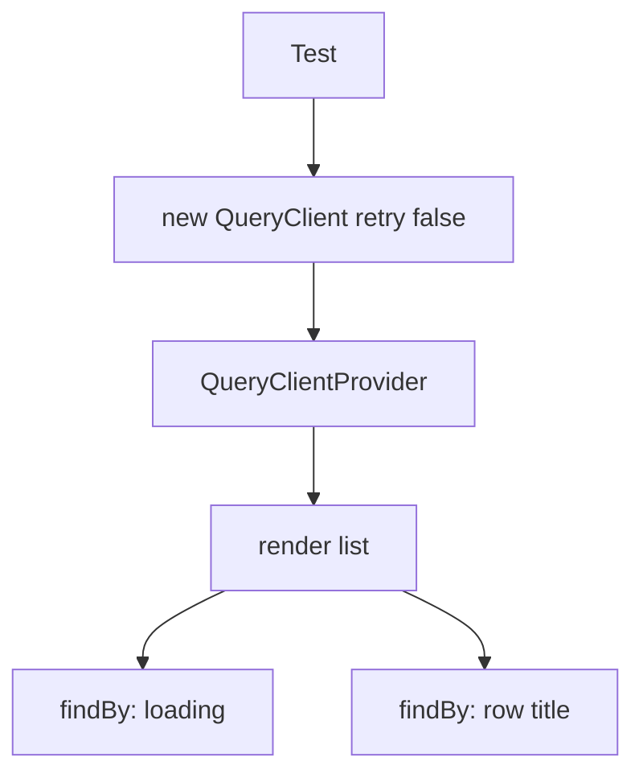
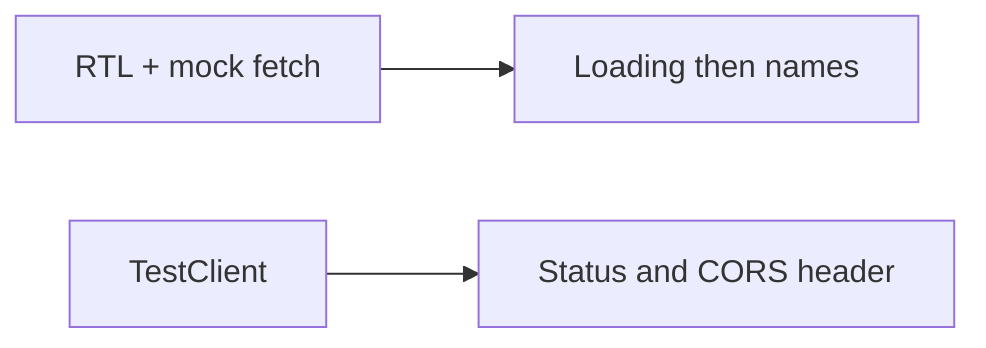

# Month 12 · Week 1 · Day 5
# Tests: RTL with a Mocked Fetch (or Light MSW)

**Program:** Full-Stack Mastery · 18 months  
**Phase:** 4 — Full-stack application  
**Month index:** [../../README.md](../../README.md)  
**Week 1:** [1](day-01.md) · [2](day-02.md) · [3](day-03.md) · [4](day-04.md) · Day 5 (today) · [6](day-06.md) · [7](day-07.md)  
**Week rhythm today:** Tests + documentation  
**Student state:** You can `useQuery` a FastAPI list. Today you **claim** loading then success without staring at Chrome.  
**Study time:** 3–4 focused hours

Labs: `~\fullstack-lab\month-12\week-01\day-05\`. You may continue the benches app **by typing** into day-05, or rebuild a smaller **hooks** resource (`{id, name}`).

MSW as a full product layer can wait until Month 14 habits; **today** a **mocked `fetch`**, a stub under `queryFn`, or **light MSW** is enough. **Contract tests** on the FastAPI stub with TestClient are a valid **second** proof — they do not replace a UI test of loading → rows.

Do **not** paste Project 7. Do **not** mock `useQuery` itself.

---

## How to use this textbook

1. Read a section. Close it. Say it.
2. Type tests. A test you did not run is a wish.
3. Break a mock; watch red; restore.
4. Optional review links are for later rechecking.

---

## How to read this chapter

Query adds a cache and retries. If you reuse one `QueryClient` across tests, test B sees test A’s rows. If you leave **retry** at 3, an error test waits through delays and feels haunted.

The **user** sees loading, then a name. The test should see that too — roles and text, not `isPending === true` as the only assert.



**Wrong belief:** “I’ll `vi.mock('useQuery')` and return `{ data }`.”  
**Correct:** you asserted a stub. The client, the parse, and Query’s status machine never ran. Mock **`fetch`**, or inject `queryFn`, or MSW the HTTP. Mocking the hook is worthless.

**Wrong belief:** “Shared QueryClient is fine if I `invalidateQueries` in `afterEach`.”  
**Correct:** **new client**. `retry: false`. Optional `gcTime: 0`.

---

## Today's contract

By the end of this day you will be able to:

1. Render with a **fresh** `QueryClient` (`retry: false` on queries and mutations).
2. Assert **loading** then **success** with Testing Library (`findByRole` / `findByText`).
3. Assert **error** UI when `fetch` rejects or returns non-OK.
4. Explain **contract tests** (TestClient on the stub) vs **UI tests** (RTL).
5. Keep `queryFn` real enough that a mock sits **under** it, not over `useQuery`.

**Today's gate.** Closed-book:

> Each test gets its own QueryClient with retry false. I assert loading then titles. I mock fetch or MSW or the client function — not useQuery. Empty list is success. FastAPI TestClient can still prove statuses.

---

## Time box

| Block | Minutes | Work |
|---|---|---|
| A | 45 | Theory |
| B | 65 | Wrapper + three UI tests |
| C | 70 | Independent: error test + one TestClient contract |
| D | 20 | Git |
| E | 15 | Recall |

---

# Block A — Theory

## 1. Wrapper

Use Vitest + Testing Library if your Vite template already has them, or add:

```powershell
npm install -D vitest jsdom @testing-library/react @testing-library/jest-dom @testing-library/user-event
```

Align with **your** Month 6/7 test setup if it already exists. The idea is the wrapper, not a new runner religion.

```tsx
import { QueryClient, QueryClientProvider } from "@tanstack/react-query";
import { render } from "@testing-library/react";
import type { ReactNode } from "react";

export function createTestClient() {
  return new QueryClient({
    defaultOptions: {
      queries: { retry: false, gcTime: 0 },
      mutations: { retry: false },
    },
  });
}

export function renderWithQuery(ui: ReactNode) {
  const client = createTestClient();
  return render(
    <QueryClientProvider client={client}>{ui}</QueryClientProvider>,
  );
}
```

If you use React Router in the list page, wrap **`MemoryRouter`**. Do not nest `BrowserRouter` inside another router.

---

## 2. Mock fetch (light)

```ts
function jsonResponse(data: unknown, status = 200): Response {
  return new Response(JSON.stringify(data), {
    status,
    headers: { "Content-Type": "application/json" },
  });
}

beforeEach(() => {
  vi.stubGlobal(
    "fetch",
    vi.fn().mockResolvedValue(
      jsonResponse({
        items: [{ id: 1, name: "Hook A" }],
        total: 1,
      }),
    ),
  );
});

afterEach(() => {
  vi.unstubAllGlobals();
});
```

Your **client** still runs. It checks `ok`, parses `unknown`, returns DTOs. Query still runs. The test fakes **HTTP**.

If `VITE_API_BASE` is missing in Vitest, set it in `vitest.config` `env` or a tiny `import.meta.env` mock. Document the choice in `TESTS.md`.

---

## 3. Alternative: stub `api.listHooks`

```ts
vi.mock("../api/hooks", () => ({
  listHooks: vi.fn(),
}));
```

This skips HTTP. It still exercises Query **if** `queryFn` calls `listHooks`. Document that the mock sits **under** `queryFn`. Prefer mocked `fetch` at least once this day so `ApiError` on 500 is real.

---

## 4. Light MSW

If you already used MSW in Month 7 Week 4, a **single** handler is allowed:

```ts
http.get("http://127.0.0.1:8000/hooks", () =>
  HttpResponse.json({ items: [...], total: 1 }),
);
```

Do not build a full mock service worker empire. One handler + `server.listen()` is “light.”

---

## 5. Contract tests (API)

In the stub folder:

```python
from fastapi.testclient import TestClient
from main import app

client = TestClient(app)

def test_list_envelope() -> None:
    r = client.get("/hooks")
    assert r.status_code == 200
    body = r.json()
    assert "items" in body
    assert "total" in body
```

Reset in-memory store in a fixture if tests mutate. CORS header test: `client.get("/hooks", headers={"Origin": "http://127.0.0.1:5173"})` then assert `access-control-allow-origin`.

UI tests do not replace this. This does not replace UI tests.

---

## 6. What to assert

| Case | Assert |
|---|---|
| First load | `findByRole("status", { name: /loading/i })` (match **your** accessible name) |
| Success | `findByText("Hook A")` |
| Empty | success UI “No hooks yet”, **not** alert |
| HTTP 500 | `findByRole("alert")` |
| CORS | TestClient header **or** documented curl.exe — not RTL |

Do not snapshot the whole DOM. Do not assert query keys.

---

## 7. Security and tests

- Mocks must not include fake passwords “for realism.”
- Do not hit the real internet.
- Do not print `VITE_` secrets (there should be none).

---

# Block B — Type-along

```powershell
cd ~\fullstack-lab
mkdir month-12\week-01\day-05 -Force
cd ~\fullstack-lab\month-12\week-01\day-05
```

Rebuild a tiny **hooks** list (API stub + Vite) with Query as Day 4. Then add tests.

Minimum UI tests:

1. `test_shows_loading_then_hook_name`  
2. `test_shows_empty_message_when_items_empty`  
3. `test_shows_error_on_http_500`

Run:

```powershell
npx vitest run
```

(or `npm test` if you wired it). Write `TESTS.md`: wrapper rules; where the mock sits.

Break the 500 mock to return 200; show the error test fail; restore. Paste the fail snippet in `RED.txt`.

---

# Block C — Independent

1. FastAPI `uv add --dev pytest httpx`. TestClient: envelope keys + CORS allow header for 5173.  
2. One test that **evil origin** is not echoed (if you can assert header absence).  
3. Confirm you never `vi.mock` `@tanstack/react-query`.

```powershell
cd ~\fullstack-lab
git add month-12
git commit -m "Month 12 Day 5: RTL Query wrapper and stub contract tests."
```

---

# Block E — Recall

1. Why a shared QueryClient flakes.  
2. Why `retry: false`.  
3. Why mocking `useQuery` is worthless.  
4. Empty vs error in tests.  
5. What TestClient proves that RTL does not.

---

## Office hours — tests that lie

**Forgot `waitFor` / `findBy`.** Query is async. `getByText` on the title immediately is a race.

**Used production `queryClient` from `main.tsx`.** Cache leaks. `staleTime` hides refetches.

**Asserted `fetch` called with a URL and nothing else.** Pair with UI.

**jsdom has no `fetch`.** You must stub it. That is a gift — you will not accidentally hit 8000.

**CORS test in RTL.** jsdom does not enforce CORS. Use TestClient or curl.exe.



---

## Definition of done

- [ ] Fresh QueryClient per test, `retry: false`
- [ ] Loading then success test green
- [ ] Empty and error covered
- [ ] `useQuery` itself not mocked
- [ ] At least one TestClient contract test
- [ ] `RED.txt` shows a failed assert then restore
- [ ] Commit exists

---

## Optional review links

The wrapper is explained in this chapter and Month 7 Day 5.

- [TanStack Query: Testing](https://tanstack.com/query/latest/docs/framework/react/guides/testing)
- [Testing Library](https://testing-library.com/docs/react-testing-library/intro/)
- [FastAPI Testing](https://fastapi.tiangolo.com/tutorial/testing/)

---

## Tomorrow

**Independent:** wire **your** list (6B or Project 7 start) to **your** API. Spec envelope in the lab notes. No product source in this textbook.

---

# Worked session — wrapper, mock, contract

`createTestClient`: `retry: false`, `gcTime: 0`. `renderWithQuery`. Stub `fetch` to return envelope JSON. `findBy` loading, `findBy` name.

Empty envelope: empty copy. `status: 500`: alert.

`uv run pytest -q` on the stub: 200 envelope, Origin 5173 allow header.

Do not mock `useQuery`. Do not share the production client. Do not claim CORS from jsdom.

`isPending` still the first-load flag in the component. Tests see the **status** node you rendered, not the hook field.

---

# Closing lecture — claims about users, not hooks

A green test that mocks `useQuery` proves you can mock a hook. It does not prove the client throws on 500.

Put the fake at the network (fetch/MSW) or at `listHooks`. Keep Query real. Keep the client real when you mock fetch.

New `QueryClient` every test. `retry: false`. `findBy` for async.

TestClient is HTTP in-process for FastAPI. It proves 200 and CORS headers. RTL proves the four UI states. You need both kinds this month, not tomorrow’s Playwright yet.

No Project 7 dump. No `any` on the mock JSON if you can type a DTO fixture.
