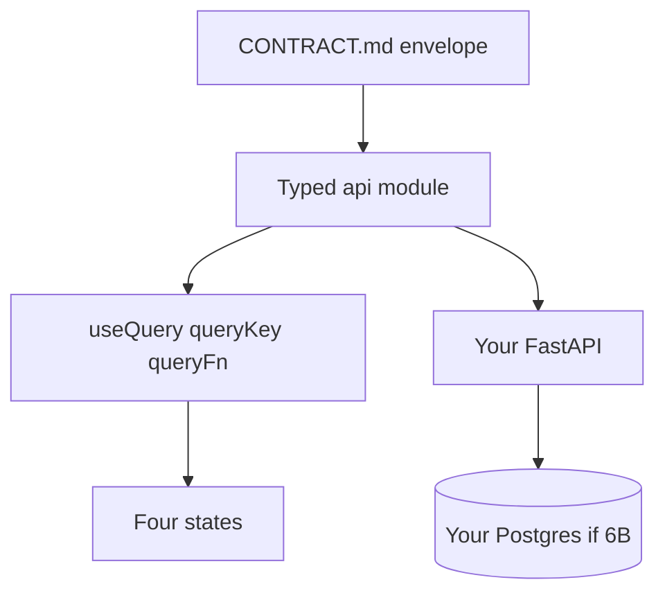
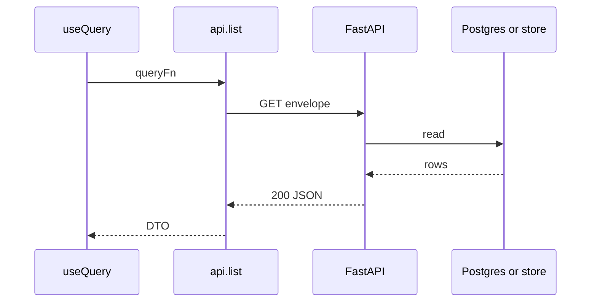

# Month 12 · Week 1 · Day 6
# Independent: Wire Your List to Your API

**Program:** Full-Stack Mastery · 18 months  
**Phase:** 4 — Full-stack application  
**Month index:** [../../README.md](../../README.md)  
**Week 1:** [1](day-01.md) · [2](day-02.md) · [3](day-03.md) · [4](day-04.md) · [5](day-05.md) · Day 6 (today) · [7](day-07.md)  
**Week rhythm today:** Independent implementation  
**Student state:** You have a typed client, CORS, four UI states, `useQuery`, and tests in **labs**. Today you apply that to **your** backend list — 6B, `~/ops-api/` + `~/ops-web/`, or the first slice of Project 7.  
**Study time:** 3–4 focused hours

This textbook will **not** give you product source. It will give you a **spec envelope** and a **forbidden list**.

Labs notes: `~\fullstack-lab\month-12\week-01\day-06\` (CONTRACT + evidence). Code lives in **your** repos.

---

## How to use this textbook

1. Write the envelope **first**. Empty UI is allowed; empty contract is not.
2. Type the join. AI may review; it may not ship the client.
3. Tests are part of the day.
4. Optional review links are for later rechecking.

---

## How to read this chapter

Week 1’s skill is not “I followed five labs.” It is “I can point React Query at **my** FastAPI list without `fetch` in the page and without CORS `*`.”



**Wrong belief:** “I’ll keep using the clip stub forever so I never touch ops-api.”  
**Correct:** the lab stub taught the join. Today the join must hit **your** list. If 6B has no list yet, that is a **backend** gap — add a thin list there, do not invent a second product in the lab and call it independent.

**Wrong belief:** “Independent day is when I paste a boilerplate MERN client.”  
**Correct:** Vite + your client + Query v5 object API + CORS 5173.

---

## Today's contract

By the end of this day you will be able to:

1. Name the **resource** you will list (one noun from **your** domain).
2. Write an envelope: path, JSON fields, `items`/`total` or your existing 6B shape.
3. Implement or reuse a **typed client** in the **frontend repo** (`~/ops-web/` or Project 7 web).
4. `useQuery({ queryKey, queryFn })` with **`isPending`** first load.
5. CORS: `http://127.0.0.1:5173` on the API you actually call.
6. Prove with `curl.exe` + browser + at least one automated test (RTL **or** TestClient).

**Today's gate.** Closed-book:

> My list page talks to my API through a client module. Query caches it. Env has VITE_API_BASE. CORS is 5173. I did not paste a tutorial app. I did not allow `*`.

---

## Time box

| Block | Minutes | Work |
|---|---|---|
| A | 25 | Envelope + choose repo |
| B | 40 | Failing test or failing UI claim |
| C | 90 | Implement until green |
| D | 30 | curl.exe + Network tab vs envelope |
| E | 15 | Recall + README note |

---

# Block A — Envelope (write first)

Create `~\fullstack-lab\month-12\week-01\day-06\CONTRACT.md`.

Must include:

1. Repo paths: API repo, web repo (honest: `~/ops-api` and `~/ops-web`, or Project 7 names).  
2. Resource noun and why it is not a todo.  
3. `GET` path, success 200, envelope fields.  
4. DTO field table (name, type, from Out model).  
5. `queryKey` you will use.  
6. CORS origin.  
7. `VITE_API_BASE` example (no secrets).  
8. Empty vs error vs loading — one sentence each.

If 6B returns a **bare array**, say so and either wrap in the client or change the API to `{items, total}`. Pick one. Pagination total matters next week.

**Forbidden:** copying this textbook’s benches/shelves/clips into ops-web and calling it “my domain.” **Allowed:** a lab-only fallback **only if** you write `BLOCKED.md` explaining why 6B/Project 7 cannot be reached today — then you still type a **new** noun in the lab, not a copy of Day 4.

---

# Complete explanation (keep this open; Days 1–5 closed except this recap)

**Client:** `request()` + `ApiError` + parse `unknown`. No `fetch` in pages.

**Env:** `VITE_API_BASE`. Public. Restart Vite.

**CORS:** `allow_origins=["http://127.0.0.1:5173"]`. Not `*`. `allow_credentials=False` until Week 4 cookie sketch. `127.0.0.1` ≠ `localhost`.

**Query:** `useQuery({ queryKey: ["noun"], queryFn: () => api.listNoun() })`. One `QueryClient` in `main.tsx`. `isPending` first load. Do not blank on `isFetching`. `gcTime` not `cacheTime`.

**Server:** FastAPI path operation, Pydantic Out, **`model_dump()`**. Postgres if 6B already has it — do not rip the list back to a dict unless you are blocked.

**Windows:** `curl.exe`. Uvicorn `--host 127.0.0.1 --port 8000`. Vite `--host 127.0.0.1 --port 5173`.

**Router:** `npm install react-router`; import from `"react-router"`.

**Tests:** fresh QueryClient, `retry: false`; or TestClient on the list route.



---

# Block B — Red first

Write a UI test **or** a TestClient test that encodes the envelope. Run it. Save output in `RED.txt`. If the list already exists and is green, write a **new** assertion (empty state or CORS header) that fails, then implement.

Do not skip red because you are “just wiring.”

---

# Block C — Implement

In **your** web repo:

- `src/api/client.ts` and `src/api/<noun>.ts` if missing.  
- Provider if missing.  
- List route/page: four states.  
- `.env.example` with `VITE_API_BASE`.

In **your** API repo if needed:

- CORS 5173.  
- Envelope matches CONTRACT.md.  
- Out model `model_dump()` / `response_model`.

Do not add create/edit today unless the list is already done and you have time — Week 2 is mutations. Depth on the **list join**.

---

# Block D — Manual check

```powershell
curl.exe -s http://127.0.0.1:8000/YOUR_PATH
curl.exe -s -D - http://127.0.0.1:8000/YOUR_PATH -H "Origin: http://127.0.0.1:5173" -o NUL
```

Browser: `http://127.0.0.1:5173` list page. Network tab: one GET for two subscribers if you added a count. Write `EVIDENCE.md`: screenshot optional; required: status, envelope keys, queryKey.

---

# Block E — Recall

1. Why the lab stub is not enough for the month gate.  
2. Where `fetch` is allowed.  
3. What you would break by allowing `*`.  
4. `isPending` vs empty.

## Quality bar

Your CONTRACT.md is too thin if it says “list items.” It is enough if a classmate could wire the client without asking:

- exact path  
- envelope vs array  
- field names  
- queryKey  
- origin  
- env key  

Your page is too thin if it only works when the API is already warm and you never tested empty/error.

**Wrong belief:** “I’ll wire create too so I look full-stack.”  
**Correct:** a honest list with four states beats a mutation that does not invalidate (Week 2).

If pytest/Vitest cannot import, `cd` into the right repo. Do not run tools from the textbook folder.

---

```powershell
cd ~\fullstack-lab
git add month-12\week-01\day-06
git commit -m "Month 12 Day 6: list-to-API envelope and evidence."
```

Commit **product** repos separately, in those repos, with messages you own.

---

## Definition of done

- [ ] CONTRACT.md written **before** the happy path  
- [ ] Client module in **your** web repo  
- [ ] `useQuery` object syntax; `isPending` first load  
- [ ] CORS 5173 on the API you call  
- [ ] `curl.exe` + browser evidence  
- [ ] One automated test  
- [ ] No `*` ; no textbook product dump  

---

## Check yourself before you leave

Closed-book: client vs Query vs page; `VITE_API_BASE`; CORS vs curl; four states; `gcTime`; `model_dump()`.

If 6B was blocked, `BLOCKED.md` is honest. The month gate still needs a real list on **your** API before Month 13.

---

## Optional review links

Week 1 mechanics are in Days 1–5 of this textbook.

- [TanStack Query useQuery](https://tanstack.com/query/latest/docs/framework/react/guides/queries)
- [FastAPI CORS](https://fastapi.tiangolo.com/tutorial/cors/)

---

## Security reminder

Bind 127.0.0.1. No secrets in Vite. Error UI short. CORS not auth.

---

## Tomorrow

**Week 1 review** — contracts and CORS myths. Synthesis in the Day 7 file. Mini-build. Days 1–6 closed during the mini-build.

---

# Product join checklist (tick in EVIDENCE.md)

1. Repo paths written (api + web).  
2. GET path and envelope keys match CONTRACT.md.  
3. `src/api/` exists; `Select-String fetch src` shows **only** `src/api`.  
4. `QueryClient` in `main.tsx`; `useQuery({ queryKey, queryFn: () => api.listX() })`.  
5. First load uses **`isPending`**. Empty copy is not the spinner.  
6. `.env.example` has `VITE_API_BASE=http://127.0.0.1:8000`.  
7. API `CORSMiddleware` lists `http://127.0.0.1:5173` only (plus localhost only if documented).  
8. `curl.exe -s` the list; then `curl.exe -D -` with Origin 5173.  
9. Browser `http://127.0.0.1:5173` — not a random port.  
10. One test: TestClient envelope **or** RTL loading→name.

**Wrong belief:** “I’ll wire Redux because the dashboard had it in Month 7.”  
**Correct:** GET lists stay in Query. Redux is still optional and not for this list.

If 6B has no list, adding GET list + Out model + `model_dump()` **is** today’s backend work. That is not cheating. That is the join.

Postgres stays. Do not rip 6B back to a dict to make CORS easier.

```powershell
curl.exe -s http://127.0.0.1:8000/YOUR
curl.exe -s -D - http://127.0.0.1:8000/YOUR -H "Origin: http://127.0.0.1:5173" -o NUL
```

Write the two status lines in EVIDENCE.md. If the second has no Allow-Origin, fix CORS before you call the UI done.

---

# What “wired” means in one paragraph

Your list page mounts. `useQuery({ queryKey: ["YOUR"], queryFn: () => api.listYOUR() })` runs. `queryFn` is the client. The client prefixes `VITE_API_BASE`, checks `ok`, parses `unknown`. FastAPI returns an envelope your CONTRACT named. CORS allows `http://127.0.0.1:5173`. `isPending` shows loading. Empty is a success sentence. Error is an alert and Retry. `curl.exe` showed the same JSON. A test exists. That is Day 6. Extra chrome is not a substitute.

If two components subscribe to the same key, Network shows **one** GET. If you see two, the keys differ. Fix the key, not the API.

Do not add create unless the list is honest. Week 2 is mutations.

---

# BLOCKED.md shape (only if true)

- What endpoint 6B/Project 7 is missing
- What you ran instead (lab noun — **new**, not Day 4 benches)
- What you will do next session to unstick

The month gate still needs **your** API list. A lab fallback is honesty, not a pass.

---

# Git

Product repos: commit there. fullstack-lab: envelope only.

```powershell
cd ~\fullstack-lab
git add month-12\week-01\day-06
git commit -m "Month 12 Day 6: list join evidence."
```
