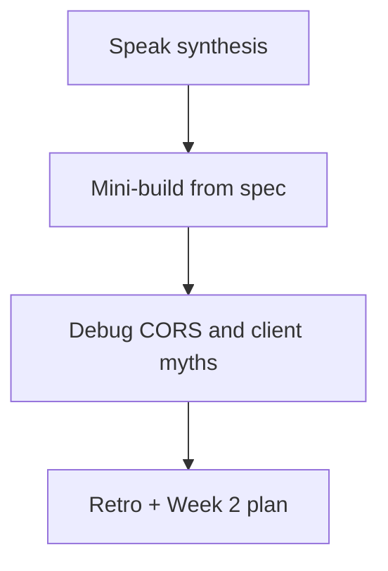

# Month 12 · Week 1 · Day 7
# Week Review — Contracts and CORS Myths

**Program:** Full-Stack Mastery · 18 months  
**Phase:** 4 — Full-stack application  
**Month index:** [../../README.md](../../README.md)  
**Week 1:** [1](day-01.md) · [2](day-02.md) · [3](day-03.md) · [4](day-04.md) · [5](day-05.md) · [6](day-06.md) · Day 7 (today)  
**Week rhythm today:** Review, repair, plan Week 2  
**Student state:** You joined a typed client to FastAPI with Query. Today those ideas must still live in your head — from **this file**.  
**Study time:** 3–4 focused hours

Do not start Week 2 because the calendar moved. Mutations on a sloppy CORS policy and `fetch` in pages are two problems.

Work in `~\fullstack-lab\month-12\week-01\day-07\`. Do not implement the mini-build inside `~/ops-web/` or Project 7.

---

## How to read this chapter

This is a **closed-book teaching day**. The synthesis **is** the Week 1 lesson.



Days 1–6 closed during mini-build. Repair from **this** recap.

---

## Week synthesis (the lesson, in this book)

**Two programs.** Vite React on `http://127.0.0.1:5173`. FastAPI on `http://127.0.0.1:8000`. Join them with a **typed API client**, not `fetch` in every component.

**Client.** `request()` prefixes **`VITE_API_BASE`**. Throws if missing. JSON as **`unknown`**, then a DTO parse. **`!response.ok` → `ApiError`**. Empty list is success. DTO is the wire shape. SQLAlchemy stays on the server. Pydantic v2 **`model_dump()`**, not `.dict()`.

**Env.** `VITE_*` is **public** in the bundle. No secrets. `.env.example` committed. Restart Vite after env changes.

**CORS.** Origin = scheme + host + port. Middleware `allow_origins=["http://127.0.0.1:5173"]`. **Not `*`.** `localhost` ≠ `127.0.0.1`. `allow_credentials=False` for JSON this week. Cookies later. CORS is **not** authentication. **`curl.exe` always gets bodies**; browsers need `Access-Control-Allow-Origin`. Preflight OPTIONS for many JSON writes.

**Query v5.** One `QueryClient` (not inside `App` render). `QueryClientProvider`. **`useQuery({ queryKey, queryFn })`** object syntax. `queryFn` calls the client. **`isPending`** first load (not v4 `isLoading` as the taught flag). **`isFetching`** can coexist with rows — do not blank. **`gcTime`** not `cacheTime`. Tests: **new client**, **`retry: false`**. Do not mock `useQuery`.

**UI.** Loading, empty, error, rows. Retry on error.

**Scaffold.** `npm create vite@latest name -- --template react-ts`. Router: `npm install react-router`, import from `"react-router"`. Windows: **`curl.exe`**.

**Wrong belief:** “CORS `*` is a lab shortcut.”  
**Correct:** `*` plus credentials is invalid; reflecting Origin is worse; 5173 is the policy.

**Wrong belief:** “Query replaces fetch.”  
**Correct:** Query **schedules** the client. The client **calls** fetch.

**Wrong belief:** “If curl works, the SPA works.”  
**Correct:** curl skips CORS. The Network tab and Origin tests tell the browser story.

The sections below unpack that so you can mini-build without Days 1–6.

---

## Today's contract

**Today's gate.** Closed-book:

> I can explain the client, VITE_API_BASE, CORS 5173 vs star, four UI states, useQuery object syntax and isPending, and I built a tiny list join from this file’s spec.

---

## Time box

| Block | Minutes | Work |
|---|---|---|
| 1 | 40 | Speak the synthesis |
| 2 | 55 | Mini-build `pegs` list join |
| 3 | 30 | Debug five defects |
| 4 | 20 | Review Day 6 CONTRACT vs Network |
| 5 | 20 | Re-run one test suite |
| 6 | 20 | Design: CORS myths page |
| 7 | 20 | Retro + Week 2 plan |

---

# Complete explanation — the join you must still own

## 1. Layers

| Layer | Owns |
|---|---|
| Page | Four UI states, later URL params |
| Query | Cache, `isPending`, refetch |
| Client | Base URL, `ok`, DTO |
| FastAPI | Statuses, Out models, CORS header |
| Postgres | Truth (6B); stub may be RAM |

## 2. CORS myths (teach these)

| Myth | Fact |
|---|---|
| CORS protects the API from curl | curl ignores CORS |
| `*` is fine until production | Habit leaks; credentials break |
| Allowing 5173 logs the user in | CORS ≠ auth |
| `localhost` and `127.0.0.1` match | Different origins |
| TestClient failing CORS means the route is down | Look at headers; body may be 200 |

## 3. Query flags

`isPending`: no success data. `isFetching`: in flight. `isError`: throw. `data.items.length === 0`: empty success.

## 4. Tests

RTL: wrapper + mock fetch. TestClient: envelope + Origin header. Never mock `useQuery`.

---

# Block 1 — Speak

No notes. Cover: client vs fetch-in-page; env; five CORS facts; four states; QueryClient lifecycle; `isPending` vs `isFetching`; `gcTime`; `model_dump()`.

Write `exam-01.md` after speaking — 15–25 lines, your words.

---

# Block 2 — Mini-build (Days 1–6 closed)

```powershell
cd ~\fullstack-lab
mkdir month-12\week-01\day-07\mini -Force
cd ~\fullstack-lab\month-12\week-01\day-07\mini
```

**Spec: tent pegs** — not Project 7.

| Piece | Rules |
|---|---|
| API | `uv` FastAPI. GET `/health`. GET `/pegs` envelope `{items, total}` with `{id, color, length_mm}`. CORS 5173 not `*`. Pydantic Out + `model_dump()`. |
| Web | `npm create vite@latest peg-web -- --template react-ts`. Query. Client. `VITE_API_BASE`. Four states. `useQuery({ queryKey: ["pegs"], queryFn })`. |
| Prove | `curl.exe` + browser on 127.0.0.1:5173 |

Optional: one Vitest loading→name test **or** TestClient envelope test. Prefer at least one.

No mutations. No `allow_origins=["*"]`. No ops-web.

```powershell
uv run uvicorn main:app --reload --host 127.0.0.1 --port 8000
```

---

# Block 3 — Debug

Write `exam-03-debug.md`. For each, **what the user/browser sees**, **cause**, **fix**. No need to run broken code.

**A.** Component `fetch`es `/pegs` (relative). Vite HTML in `data`.  
**B.** `allow_origins=["*"]` and a plan for cookies next month.  
**C.** List uses `isFetching` to show the full-page spinner; window focus blanks the table.  
**D.** Tests import `queryClient` from `main.tsx`. Second test sees first test’s pegs.  
**E.** Developer says “CORS is broken” because `curl.exe` without Origin “does not show Allow-Origin.” Is the API down?

---

# Block 4 — Review

Open **only** Day 6 `CONTRACT.md` and your Network notes (not Day 6 source unless fixing). One mismatch: record in `MATCH.txt` or fix in the **product** repo after the mini is done.

---

# Block 5 — Tests

Re-run Day 5 or mini tests. Break one assert; show fail; restore.

---

# Block 6 — Design

`design.md`: 12–20 lines. Why CORS is a browser rule. Why the client is the place for `credentials` later. Why Query keys will need `q` and `page` next week.

---

# Block 7 — Retro

`retro.md`: weakest myth; whether you still want `*`; Week 2 question about invalidation.

Week 2 is **mutations**, **URL search params**, **pagination keys**. Do not start it if Block 2 is incomplete.

## Debug keys (after you write A–E)

**A.** Relative URL hits Vite. Prefix `VITE_API_BASE` in the client. No `fetch` in the page.

**B.** `*` is not the credentials story. Explicit 5173. Cookies: `allow_credentials=True` **and** explicit origin — never star.

**C.** First load: `isPending`. Keep rows on `isFetching`.

**D.** New `QueryClient` per test. `retry: false`.

**E.** curl without Origin often has **no** CORS headers. That is normal. Send `-H "Origin: http://127.0.0.1:5173"`. API can be healthy.

If you wrote “browser bug” for any of these, rewrite from the synthesis.

---

```powershell
cd ~\fullstack-lab
git add month-12
git commit -m "Month 12 Week 1 review: pegs mini-build and CORS debug."
```

---

# Lecture: CORS is not a lock on the server process

Uvicorn still answers curl. CORS tells **browsers** whether JS on another origin may **read** the response. Attackers with curl were never stopped by CORS. Auth stops them (Month 13). Origin allowlists stop **other websites’ JS** from using the victim’s browser as a confused deputy. That is the myth to kill in `design.md`.

The client is one door so Week 4 can add `credentials: "include"` once. Query is the cache so Week 2 can `invalidateQueries({ queryKey: ["pegs"] })` once.

Mini is pegs. Not ops-web. `~\fullstack-lab\month-12\week-01\day-07\mini`.

---

## Definition of done

- [ ] `exam-01.md` from memory  
- [ ] Mini list join works in the browser  
- [ ] Debug A–E answered  
- [ ] Retro exists  
- [ ] I will not ship CORS `*`  

---

# Worked session — pegs mini

Stub + Vite extra `--`. Client. Env. CORS 5173. Provider. `useQuery({ queryKey: ["pegs"], queryFn: () => api.listPegs() })`. Four states. curl.exe with Origin. Debug A–E in sentences. `design.md` CORS myths. Retro: Week 2 invalidation.

No `cacheTime`. No tuple useQuery. No fetch in JSX. No Project 7.

---

## Optional review links

Repair from this synthesis first.

- [MDN CORS](https://developer.mozilla.org/en-US/docs/Web/HTTP/CORS)
- [TanStack Query testing](https://tanstack.com/query/latest/docs/framework/react/guides/testing)

---

## Next week

[Week 2 Day 1 — CRUD mutations and invalidateQueries](../week-02/day-01.md). Writes must not leave the list lying.

---

# Closing lecture — contracts and CORS myths

The contract is the envelope and the DTO. The client enforces `ok`. Query caches. CORS headers are for browsers.

Myths: star is not a shortcut; curl is not Chrome; CORS is not login; `isFetching` is not first load; mocking `useQuery` is not a test.

`VITE_API_BASE` is public. `model_dump()` is Pydantic v2. `gcTime` is the memory clock. `isPending` is the pending flag you teach.

Mini pegs in fullstack-lab. Product repos stay yours. Week 2 will invalidate `["pegs"]` after POST. If your list still uses `fetch` in the page, repair today.

## Recite-back checklist (close the editor, then tick)

Write `RECITE.txt` with one honest sentence per line.

- [ ] client is the only fetch
- [ ] VITE_API_BASE public
- [ ] CORS 5173 not star
- [ ] curl vs browser
- [ ] useQuery object API
- [ ] isPending first load
- [ ] gcTime not cacheTime
- [ ] tests: new QueryClient
- [ ] mini not ops-web

If any debug answer says “Chrome is wrong,” rewrite it from the synthesis.
