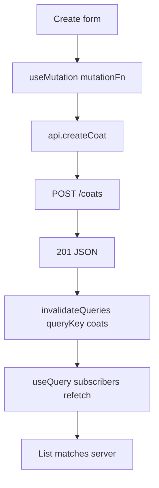
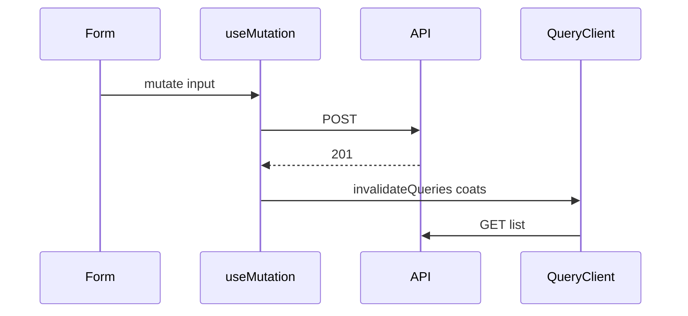

# Month 12 · Week 2 · Day 1
# CRUD Mutations: useMutation and invalidateQueries

**Program:** Full-Stack Mastery · 18 months  
**Phase:** 4 — Full-stack application  
**Month index:** [../../README.md](../../README.md)  
**Week 2:** Day 1 (today) · [2](day-02.md) · [3](day-03.md) · [4](day-04.md) · [5](day-05.md) · [6](day-06.md) · [7](day-07.md)  
**Week rhythm today:** Learn + type-along  
**Student state:** Week 1 gate passed. You can list with `useQuery` through a typed client. Today a **create** (and the idea of update/delete) must **not** leave the list lying.  
**Study time:** 3–4 focused hours

**This week covers:** CRUD mutations, filter, search, pagination, optimistic vs not.

Today: **`useMutation({ mutationFn })`**, **`invalidateQueries({ queryKey })`**, POST **201**, client methods for writes. Optimistic UI is Day 4 — today you **invalidate** after success. Project 7 is not a paste.

Labs: `~\fullstack-lab\month-12\week-02\day-01\`. Noun: **lab coats** (`id`, `size`, `label`).

---

## How to use this textbook

1. Read a section. Close it. Say it.
2. Type the mutation. Do not paste a CRUD admin template.
3. Watch the Network tab: POST then GET (invalidation). If the GET never happens, you forgot invalidate.
4. Optional review links are for later rechecking.

---

## How to read this chapter

Query does **not** guess that `POST /coats` should refresh `["coats"]`. The cache is a set of **named** results. A write is a different hook. After the server says **201**, you mark list keys **stale** so subscribers refetch.



**Wrong belief:** “I’ll `setState` the new row into the list and skip Query.”  
**Correct:** then detail pages, counts, and the next refetch disagree. Invalidate (or a careful `setQueryData`) is the join.

**Wrong belief:** “I’ll invalidate in `mutate()` before the POST returns.”  
**Correct:** invalidate **on success**. If POST 422, the list should not flicker a row that never existed. (Optimistic is Day 4 and has a named risk.)

---

## Today's contract

By the end of this day you will be able to:

1. Add **`createCoat`** (and sketch update/delete) on the **client**.
2. Write **`useMutation({ mutationFn })`** (v5 object API).
3. On success, **`queryClient.invalidateQueries({ queryKey: ["coats"] })`**.
4. Use mutation **`isPending`** to disable submit (this `isPending` is the mutation’s, not the list’s).
5. Keep POST **201** on FastAPI (`status_code=201`). Pydantic create vs out; **`model_dump()`**.
6. Explain prefix invalidation: `["coats"]` marks `["coats", { q }]` stale too.

**Today's gate.** Closed-book:

> Mutations do not update lists by magic. I invalidate the list key after success. useMutation is object syntax. The client still throws on !ok. FastAPI still emits 201. I still do not fetch in the form component.

---

## Time box

| Block | Minutes | Work |
|---|---|---|
| A | 50 | Theory |
| B | 60 | Type-along: create + invalidate |
| C | 70 | Independent: PATCH or DELETE + invalidate |
| D | 20 | Git |
| E | 15 | Recall |

---

# Block A — Theory

## 1. mutationFn is still the client

```ts
export async function createCoat(input: CoatCreateDto): Promise<CoatDto> {
  return request(
    "/coats",
    { method: "POST", headers: { "Content-Type": "application/json" }, body: JSON.stringify(input) },
    parseCoat,
  );
}
```

The page:

```tsx
const queryClient = useQueryClient();

const create = useMutation({
  mutationFn: createCoat,
  onSuccess: () => {
    void queryClient.invalidateQueries({ queryKey: ["coats"] });
  },
});
```

`useQueryClient()` reads the same client the Provider holds. Do not `new QueryClient()` here.

**Wrong belief:** “`invalidateQueries('coats')` string form is fine.”  
**Correct:** v5 wants **`{ queryKey: ["coats"] }`**. Use the object.

---

## 2. Prefix invalidation

Keys are **partial-matched** from the front:

| Cached key | `invalidateQueries({ queryKey: ["coats"] })` |
|---|---|
| `["coats"]` | stale |
| `["coats", { page: 2, q: "xl" }]` | stale |
| `["hats"]` | untouched |

That is why Week 1 used `["coats"]` as the resource prefix. Next week filters live **inside** that prefix.

**Wrong belief:** “I must list every filtered key by hand.”  
**Correct:** prefix invalidation is the default tool. `setQueryData` is a scalpel when you can prove the new cache equals GET.

---

## 3. Mutation isPending vs query isPending

| Hook | `isPending` means |
|---|---|
| `useQuery` | No success **data** yet for that key |
| `useMutation` | The **write** is in flight |

Disable the submit button with **`create.isPending`**. Do not disable it with the list’s `isPending` after the list already loaded.

On 422, FastAPI returns a `detail` list. Your `ApiError.status === 422`. Show a form error. **Do not** `reset()` the form on 422 (Month 7 habit). Reset on success only if that is the product.

---

## 4. FastAPI create (recap, you type it)

```python
@app.post("/coats", status_code=201, response_model=CoatOut)
def create_coat(payload: CoatCreate) -> CoatOut:
    ...
    return CoatOut.model_validate(row)  # or construct Out
```

Serialize with **`model_dump()`** if you return a dict. Prefer `response_model`. Create model ≠ Out model if you ever have secrets or server-assigned ids.

`curl.exe`:

```powershell
curl.exe -s -D - -X POST http://127.0.0.1:8000/coats -H "Content-Type: application/json" -H "Origin: http://127.0.0.1:5173" --data-binary @body.json
```

Expect **201**. CORS must allow POST + `Content-Type` (preflight). If POST never fires, inspect OPTIONS.

---

## 5. Update and delete (same pattern)

| Method | Client | Typical success | Then |
|---|---|---|---|
| POST create | `createCoat` | 201 | invalidate `["coats"]` |
| PATCH/PUT | `patchCoat` | 200 | invalidate `["coats"]` **and** `["coats", id]` if you have detail |
| DELETE | `deleteCoat` | 204 empty | invalidate list; remove detail key |

For 204, the client must **not** `response.json()`. Read status, return `undefined` or `null`.

```ts
if (response.status === 204) {
  return undefined as T; // only for delete helpers typed as void
}
```

Design `request()` to handle empty body. Do not parse JSON on 204.

---

## 6. setQueryData is optional today

```ts
queryClient.setQueryData(["coats"], (old) => { ... });
```

It can **lie** if the server changed other fields (id, timestamps). Invalidation is slower by one GET and **honest**. This course default after create: **invalidate**. Day 4 discusses optimistic `setQueryData` and **when not to**.

---

## 7. Security start

- Validate create bodies on the **server** (Pydantic). The UI cannot be trusted (Week 3).
- Do not put tokens in mutation variables that get logged by Devtools carelessly.
- CSRF is a Month 13 cookie topic. JSON POST from a browser is still a real request — CORS is not auth.

---

# Block B — Type-along

```powershell
cd ~\fullstack-lab
mkdir month-12\week-02\day-01 -Force
cd ~\fullstack-lab\month-12\week-02\day-01
```

Stub: in-memory dict of coats. GET list envelope. POST 201. CORS 5173. Pydantic Create/Out.

Vite: Query list + form. `useMutation` + invalidate. Mutation `isPending` disables submit.

Network: POST 201 then GET list. Write `NETWORK.txt`.

If the list does not gain a row, check: stub actually stored; invalidate key matches; GET after POST returns the new item (reload-the-API-process RAM lesson still applies — do not confuse that with Query).

---

# Block C — Independent

Implement **DELETE** 204 **or** **PATCH** label. Client method. Mutation. Invalidate. Missing id 404 via `HTTPException`.

Write `CRUD.md`: which methods you implemented; which key you invalidate; why not optimistic today.

```powershell
cd ~\fullstack-lab
git add month-12
git commit -m "Month 12 Week 2 Day 1: useMutation and invalidateQueries coats."
```

---

# Block E — Recall

1. Why POST does not update `useQuery` by itself.  
2. Object form of `invalidateQueries`.  
3. Mutation `isPending` vs query `isPending`.  
4. 204 and `json()`.  
5. Prefix invalidation vs listing every page key.

---

## Office hours — defects you will hit

**Invalidated `["coat"]` (singular).** Cache key is `["coats"]`. Typo = silent stale list.

**`onSuccess` never runs.** `mutationFn` swallowed the error instead of throw. Client must throw `ApiError`.

**POST 200.** Forgot `status_code=201`. Query still works; the **contract** is wrong. Fix the decorator. Tests and curl `-D -` show it.

**Preflight 400.** CORS `allow_methods` / `allow_headers`. OPTIONS must succeed.

**Form `fetch` copy-paste.** Two HTTP stacks. Delete the page `fetch`.



---

## Definition of done

- [ ] `useMutation({ mutationFn })` create
- [ ] `invalidateQueries({ queryKey: ["coats"] })` on success
- [ ] POST 201 from FastAPI
- [ ] Submit disabled while mutation `isPending`
- [ ] No `fetch` in the form file
- [ ] `NETWORK.txt` shows POST then GET
- [ ] Commit exists

---

## Optional review links

Mutations are explained in this chapter and Month 7 Day 2.

- [useMutation](https://tanstack.com/query/latest/docs/framework/react/guides/mutations)
- [Query Invalidation](https://tanstack.com/query/latest/docs/framework/react/guides/query-invalidation)
- [FastAPI response status](https://fastapi.tiangolo.com/tutorial/response-status-code/)

---

## Tomorrow

**Filter, search, pagination** in the **URL** and in the **queryKey**. `placeholderData: keepPreviousData`.

---

# Worked session — create then invalidate

Client `createCoat`. FastAPI POST 201, `CoatOut.model_dump()` or `response_model`. CORS allows POST JSON.

`useMutation({ mutationFn: createCoat, onSuccess: () => queryClient.invalidateQueries({ queryKey: ["coats"] }) })`.

List `useQuery({ queryKey: ["coats"], queryFn: () => api.listCoats() })`. `isPending` on the list for first load. Mutation `isPending` on the button.

curl.exe POST with Origin. Windows quoting: `--data-binary @body.json`.

No optimistic today. No `cacheTime`. No tuple hooks. No Project 7 source.

---

# Closing lecture — the cache does not hear POST

HTTP POST is not a Query event. You translate success into **`invalidateQueries({ queryKey })`**. Prefix keys so filters refetch next week.

The client throws. Query marks error. The form shows 422 without reset.

201 is a decorator choice. 204 has no JSON. `model_dump()` is v2.

One door: `api.createCoat`. One cache: `QueryClient`. One origin: 5173.
