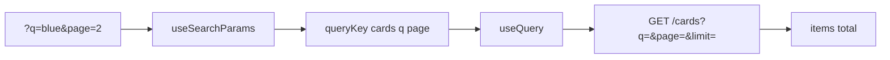
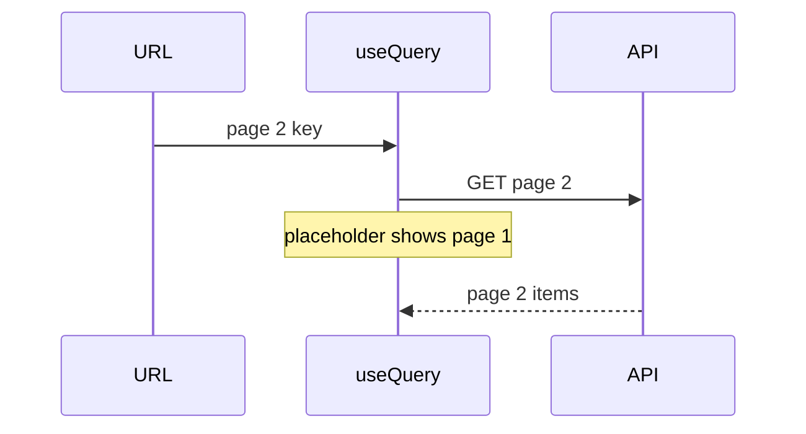
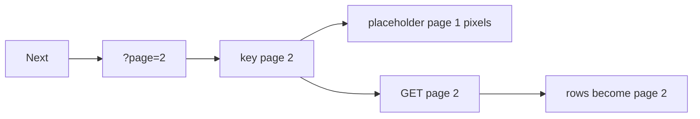

# Month 12 · Week 2 · Day 2
# Filter, Search, Pagination: URL and queryKey Together

**Program:** Full-Stack Mastery · 18 months  
**Phase:** 4 — Full-stack application  
**Month index:** [../../README.md](../../README.md)  
**Week 2:** [1](day-01.md) · Day 2 (today) · [3](day-03.md) · [4](day-04.md) · [5](day-05.md) · [6](day-06.md) · [7](day-07.md)  
**Week rhythm today:** Learn + type-along  
**Student state:** You can create and invalidate a list. The list is still “all rows.” Products are **pages**, **filters**, and **search** — and those must survive refresh.  
**Study time:** 3–4 focused hours

Today: **`q`**, **filter**, and **`page`** live in **URL search params** **and** in **`queryKey`**. **`placeholderData: keepPreviousData`** so page 2 does not look like a first load. FastAPI already paginated in Month 9; you **call** that envelope.

Labs: `~\fullstack-lab\month-12\week-02\day-02\`. Noun: **archive cards**. Not Project 7.

---

## How to use this textbook

1. Read a section. Close it. Say it.
2. Type URL params and the key together. A key without `page` is today’s bug.
3. Click Next and watch `isPlaceholderData` — the table should stay painted.
4. Optional review links are for later rechecking.

---

## How to read this chapter

A query key is the identity of **one** server result. Page 1 is not page 2. `["cards"]` for both pages is a cache lie: you show the wrong rows or you flash empty.

The **URL** is how a human (and a teammate) shares “page 2, q=blue”. React state alone dies on refresh. Month 7 Week 3 already taught this with a mock API. Today FastAPI is the server.



**Wrong belief:** “I’ll keep `page` in `useState` because the URL is ugly.”  
**Correct:** ugly is bookmarkable. State is amnesia.

**Wrong belief:** “I’ll fetch all rows and `slice` in React.”  
**Correct:** fine for 12 lab rows. A product list is **server** pagination. Query caches **each slice**.

---

## Today's contract

By the end of this day you will be able to:

1. Read and write **`q`** and **`page`** with React Router **`useSearchParams`** (import from `"react-router"`).
2. Put **`{ q, page }`** in **`queryKey`**.
3. Pass them to the client → FastAPI query params.
4. Import **`keepPreviousData`** and set **`placeholderData: keepPreviousData`**.
5. Reset **`page` to 1** when `q` changes, in the **same** URL update.
6. Keep **`isPending`** for true first load; use **`isFetching` / `isPlaceholderData`** for page changes.

**Today's gate.** Closed-book:

> Page and search belong in the URL and in the queryKey. A new page is a new cache entry. placeholderData: keepPreviousData avoids a blank flash. Changing q resets page. I still throw on !ok. Empty page is 200.

---

## Time box

| Block | Minutes | Work |
|---|---|---|
| A | 50 | Theory |
| B | 60 | Type-along: paginated archive |
| C | 70 | Independent: one filter besides q |
| D | 20 | Git |
| E | 15 | Recall |

---

# Block A — Theory

## 1. URL search params

```tsx
import { useSearchParams } from "react-router";

const [params, setParams] = useSearchParams();
const q = params.get("q") ?? "";
const page = Math.max(1, Number(params.get("page") ?? "1") || 1);
```

Install if needed: `npm install react-router`. Wrap the app in `BrowserRouter` from `"react-router"`.

When the user clicks Next:

```ts
setParams((prev) => {
  const next = new URLSearchParams(prev);
  next.set("page", String(page + 1));
  return next;
});
```

When the user **commits** search (form submit, not every keystroke unless you intend to):

```ts
setParams({ q: draft, page: "1" });
```

**Wrong belief:** “I’ll put keystrokes in the queryKey.”  
**Correct:** **committed** `q` is in the URL and key. Draft can be `useState`. Query is not a debounce library; you can debounce the commit if you want.

---

## 2. queryKey includes every input

```tsx
import { keepPreviousData, useQuery } from "@tanstack/react-query";

const list = useQuery({
  queryKey: ["cards", { q, page, limit }],
  queryFn: () => api.listCards({ q, page, limit }),
  placeholderData: keepPreviousData,
});
```

If `page` is omitted from the key but used in `queryFn`, Query **reuses the wrong cache** or refetches with a confusing mix.

v5: **`placeholderData: keepPreviousData`**. `keepPreviousData` is a **function** exported by the library. There is no `keepPreviousData: true`.

While the new page loads:

- `data` is the **previous** page’s rows (`isPlaceholderData === true`)
- `isPending` is typically **false**
- `isFetching` is **true**

Disable Next or set `aria-busy` on the table. Do not unmount the table.

---

## 3. FastAPI list recap

Identify in the **path**. Filter/search/page in the **query**. Envelope:

```json
{ "items": [], "total": 0, "page": 1, "limit": 10 }
```

Or `skip`/`limit` as in Month 9. Pick one; put it in CONTRACT.md. Empty page is **200**, not 404.

Cap `limit`. Sort **whitelist** if you expose sort (do not pass raw column names from the UI).

Pydantic / Query constraints: `ge=1` on page. **`model_dump()`** on Out items.

```powershell
curl.exe -s "http://127.0.0.1:8000/cards?q=blue&page=2&limit=10"
```

---

## 4. Client builds the query string

```ts
export function listCards(opts: { q: string; page: number; limit: number }) {
  const sp = new URLSearchParams();
  if (opts.q.trim()) sp.set("q", opts.q.trim());
  sp.set("page", String(opts.page));
  sp.set("limit", String(opts.limit));
  return request(`/cards?${sp.toString()}`, { method: "GET" }, parseEnvelope);
}
```

Do not concatenate unsanitized strings into paths. Search params are the right tool.

---

## 5. Invalidation still uses the prefix

After create:

```ts
void queryClient.invalidateQueries({ queryKey: ["cards"] });
```

All pages and searches marked stale. Do not invent `invalidateQueries({ queryKey: ["cards", { page: 1 }] })` as the only invalidate unless you **want** page 2 stale-but-not-marked.

---

## 6. Security start

- Do not put passwords or tokens in `?q=`.
- Server still filters; a crafted query string is not a SQL injection if you use ORM binds (Month 11). Never interpolate `q` into SQL.
- CORS still 5173. Pagination GETs are usually simple requests; POST create still preflights.

---

# Block B — Type-along

```powershell
cd ~\fullstack-lab
mkdir month-12\week-02\day-02 -Force
cd ~\fullstack-lab\month-12\week-02\day-02
```

Seed **≥ 15** archive cards in the stub so page 2 is real. GET `/cards` with `q`, `page`, `limit`, `total`. CORS 5173.

Vite: Router + Query. Search form commits `q` and `page=1`. Next/Prev change `page`. `placeholderData: keepPreviousData`.

Write `KEYS.md`: example keys for page 1 vs page 2 vs `q=blue`.

Prove refresh: copy the URL with `page=2`, new tab, same page.

---

# Block C — Independent

Add **one** filter (example: `color=red` or `kind=note`) as a search param **and** key field. FastAPI query param. Reset page when the filter changes.

Write `URL.md`: all params you own.

```powershell
cd ~\fullstack-lab
git add month-12
git commit -m "Month 12 Week 2 Day 2: URL params and queryKey pagination."
```

---

# Block E — Recall

1. Why page belongs in the key.  
2. `placeholderData: keepPreviousData` vs merging arrays.  
3. Why `q` change resets page.  
4. Envelope `total` vs counting the current page.  
5. Prefix invalidate after create.

---

## Office hours — defects you will hit

**Blank flash on Next.** Missing `placeholderData: keepPreviousData`.

**Page 2 shows page 1 rows forever.** `page` not in `queryKey`.

**`keepPreviousData: true`.** v5 does not work that way. Import the function.

**`q` in key on every keystroke.** Fetch storm. Commit on submit.

**`total` is `items.length`.** Last page looks like the whole archive. Server total after filter.

**Router import from `react-router-dom` only.** This course: `"react-router"`.



---

## Definition of done

- [ ] `q` and `page` in URL and queryKey
- [ ] `placeholderData: keepPreviousData`
- [ ] Changing search resets page
- [ ] FastAPI envelope with total
- [ ] Refresh preserves page
- [ ] Commit exists

---

## Optional review links

- [TanStack Query: Paginated queries](https://tanstack.com/query/latest/docs/framework/react/guides/paginated-queries)
- [React Router: URL search params](https://reactrouter.com/start/declarative/url-values)
- [FastAPI query parameters](https://fastapi.tiangolo.com/tutorial/query-params/)

---

## Tomorrow

**From memory:** a paginated list with URL + key. Days 1–2 closed during the build.

---

# Worked session — seed 15, then page in the key

Stub seed. Envelope. curl.exe `"http://127.0.0.1:8000/cards?page=2&limit=5"`.

Vite extra `--`. `npm install react-router @tanstack/react-query`. `BrowserRouter`. `useSearchParams`. `useQuery({ queryKey: ["cards", { q, page }], queryFn, placeholderData: keepPreviousData })`.

Invalidate `["cards"]` if you keep create from Day 1 ideas.

No slice-all-rows. No `cacheTime`. No Project 7 dump. `isPending` only when there is no data to show (including no placeholder).

---

# Closing lecture — the address bar is part of the cache id

If the human cannot see `page=2`, the cache will also forget what page means. URL and queryKey are the same facts in two places.

`keepPreviousData` is a placeholder, not infinite scroll concat. Admin tables **replace** rows.

FastAPI slices after filter. `total` is the filtered count. Empty is 200.

Client builds `URLSearchParams`. Components do not call `fetch`. CORS 5173. `VITE_API_BASE` public.

Tomorrow you rebuild this from the recap without Day 2 open.

---

# Why three copies of `{ q, page }`

| Place | Job |
|---|---|
| URL search params | Refresh, share, back button |
| `queryKey` | Cache identity |
| FastAPI query string | Server slice |

If the URL has `page=2` and the key does not, Query may show page 1 forever.  
If the key has `page=2` and FastAPI is not passed `page`, you cache the wrong GET.

```tsx
import { keepPreviousData, useQuery } from "@tanstack/react-query";
import { useSearchParams } from "react-router";

const list = useQuery({
  queryKey: ["cards", { q, page, limit }],
  queryFn: () => api.listCards({ q, page, limit }),
  placeholderData: keepPreviousData,
});
```

v5: **no** `keepPreviousData: true`. The export is a function assigned to **`placeholderData`**.

When `q` changes, set `page` to 1 in the **same** `setSearchParams`. Otherwise you land on page 4 of a two-page search.

**Wrong belief:** “`total` can be `items.length`.”  
**Correct:** that is the page size, not the archive. FastAPI counts after filter, then slices.

`npm install react-router`. Import `useSearchParams`, `BrowserRouter` from `"react-router"`.

Seed ≥ 15 so page 2 is real. `curl.exe -s "http://127.0.0.1:8000/cards?page=2&limit=5"`.



Do not concat page 1 and page 2 unless the product is infinite scroll (this course prefers replace).

---

# URL.md example (copy and replace)

```
q        search on title, committed on submit
page     1-based
limit    10, server cap 50
color    optional exact filter (Block C)

key: ["cards", { q, page, limit, color }]
```

Refresh `http://127.0.0.1:5173/?page=2&q=blue` must show page 2. If it shows page 1, `page` never left `useState`.

`isPlaceholderData` can disable Next. Do not unmount the table.

---

# Recite-back

- [ ] q and page in URL
- [ ] same facts in queryKey
- [ ] placeholderData: keepPreviousData
- [ ] q change resets page
- [ ] total is filtered count
- [ ] prefix invalidate after create
