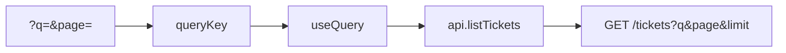

# Month 12 · Week 2 · Day 3
# Implement From Memory: A Paginated List

**Program:** Full-Stack Mastery · 18 months  
**Phase:** 4 — Full-stack application  
**Month index:** [../../README.md](../../README.md)  
**Week 2:** [1](day-01.md) · [2](day-02.md) · Day 3 (today) · [4](day-04.md) · [5](day-05.md) · [6](day-06.md) · [7](day-07.md)  
**Week rhythm today:** Implement from memory  
**Student state:** Day 2 gate passed. You have typed mutations, URL params, and `keepPreviousData`. Today a **paginated list** must still live in your head — from **this file**.  
**Study time:** 3–4 focused hours  
**Prereq:** Day 2 gate passed.

Labs: `~\fullstack-lab\month-12\week-02\day-03\`. Do **not** copy Day 1–2 source. Do **not** paste Project 7. Noun: **ferry tickets** (id, route, price_cents).

---

## How Day 3 works

Days 1–2 stay **closed** during drills. This recap is the teacher.

Allowed: this file, your notes, curl.exe, Network tab, `/docs`.  
Not allowed: pasting a paginator from AI; copying day-02 source; browsing Query docs as teacher.

Stuck **> 25 minutes**: open **only** the matching Day 1 or Day 2 section, close it, continue. Record `lookups.txt`.

No complete app in this file.

---

## How to read this chapter

Pagination is not `slice` in React. It is **query params on FastAPI**, **the same params in the URL**, and **the same params in `queryKey`**.



**Wrong belief:** “Memory day means reopen Day 2.”  
**Correct:** recap first. Days 1–2 after 25 minutes.

---

## Complete explanation (pagination you must still own)

**Client.** Only `fetch`. `VITE_API_BASE`. `ApiError`. `unknown` then parse. Create uses POST JSON. List uses GET query string via `URLSearchParams`.

**Query v5.** `useQuery({ queryKey, queryFn })`. `useMutation({ mutationFn })`. `invalidateQueries({ queryKey: ["tickets"] })` object form. `isPending` first load. Do not blank on `isFetching`. `gcTime` not `cacheTime`.

**Pagination.** `queryKey: ["tickets", { q, page, limit }]`. `placeholderData: keepPreviousData` imported from `@tanstack/react-query`. Not a boolean. `isPlaceholderData` while Next loads. Changing `q` sets `page=1` in the **same** `setSearchParams`.

**URL.** `useSearchParams` from `"react-router"`. `npm install react-router`. `BrowserRouter`. Refresh must restore page.

**FastAPI.** Query `q`, `page` or skip/limit. Envelope `{items, total, ...}`. Filter then count `total` then slice. Empty 200. Cap limit. POST 201. Pydantic **`model_dump()`**. CORS `http://127.0.0.1:5173` not `*`. `HTTPException` 404 for missing id.

**Seed.** ≥ 12 rows so page 2 exists.

**Windows.** `curl.exe`. Vite `npm create vite@latest name -- --template react-ts`. Uvicorn 127.0.0.1:8000.

**Wrong belief:** “I’ll omit page from the key because keepPreviousData remembers it.”  
**Correct:** the placeholder is **previous data**, not a reason to collapse keys. Page 2 must be its own entry.

**Wrong belief:** “Invalidation must name page 1.”  
**Correct:** prefix `["tickets"]` after create.

---

## Today's contract

**Today's gate.** Closed-book:

> I built a paginated list with URL + queryKey + keepPreviousData and a typed client, from this recap, without copying Day 2.

---

## Time box

| Block | Minutes | Work |
|---|---|---|
| A | 20 | Oral review |
| B | 40 | Paper drills |
| C | 90 | Build spec |
| D | 35 | Defect hunt |
| E | 15 | Lookups |

---

# Block A — Speak first

1. Why page is in the key.  
2. `placeholderData: keepPreviousData` in v5.  
3. `isPending` vs `isPlaceholderData`.  
4. Why `q` resets page.  
5. Prefix invalidate.  
6. CORS origin.  
7. 201 vs 200 on create (if you include create).

---

# Block B — Paper drills

1. Write the `useQuery` object (keys, placeholder).  
2. Write `GET /tickets` query param names.  
3. Sketch keys for `q=` page 1 vs `q=north` page 2.  
4. Predict blank table cause if Next flashes empty.  
5. Predict wrong rows cause if Next shows page 1 forever.

---

# Block C — Spec

```powershell
cd ~\fullstack-lab
mkdir month-12\week-02\day-03 -Force
cd ~\fullstack-lab\month-12\week-02\day-03
```

| Piece | Rule |
|---|---|
| GET `/tickets` | Envelope, `q` on `route`, `page`, `limit`, `total` |
| Seed | ≥ 12 |
| CORS | 5173 not `*` |
| UI | Search commit, Next/Prev, four states, placeholder on page change |
| Optional | POST 201 + invalidate prefix |
| Client | No fetch in pages |

`CURL.txt` for page 1 and page 2. `KEYS.txt` two example keys.

---

# Block D — Defect hunt

1. Next: table stays painted (`isPlaceholderData` or `isFetching` without full spinner).  
2. Refresh on `?page=2`.  
3. Search: page returns to 1.  
4. `curl.exe` page 2 `total` unchanged (filtered total if `q` set).  
5. localhost vs 127.0.0.1 if you only allowed one.

---

# Block E — Lookups

`lookups.txt`. Commit.

```powershell
cd ~\fullstack-lab
git add month-12
git commit -m "Month 12 Day 3: ferry tickets paginated list from memory."
```

---

# Lecture: three copies of the same truth

The URL, the queryKey, and the FastAPI query string must agree. If one forgets `page`, you get a bug that looks like Query being random.

`keepPreviousData` keeps **pixels**. It does not merge page 1 and page 2. It does not skip caching page 2.

Create still invalidates the **prefix**. Page 2 will refetch if it is on screen.

`model_dump()` on Out. `ApiError` on !ok. Empty page 200.

Do not paste ops-web. Ferry tickets only.

---

## Definition of done

- [ ] Spoke Block A  
- [ ] URL + key + API params agree  
- [ ] `placeholderData: keepPreviousData`  
- [ ] No Day 2 copy  
- [ ] Commit exists  

---

# Worked session — tickets

uv stub seed 12+. Vite extra `--`. Router from `"react-router"`. Client `listTickets({q,page,limit})`. useQuery object + keepPreviousData. curl.exe quoted query URLs.

25-minute lookup rule. No AI paginator. No `keepPreviousData: true`. No `cacheTime`. No `isLoading` as the taught first-load flag.

---

## Optional review links

Repair from this recap first.

- [Paginated queries](https://tanstack.com/query/latest/docs/framework/react/guides/paginated-queries)

---

## Tomorrow

**Lab:** detail + edit. Optimistic updates: **when not to**, with a **named risk**.

---

# Closing lecture — page is identity

`["tickets"]` is a resource prefix. `["tickets", { q, page }]` is a slice. Placeholders paint the old slice. Invalidation marks all slices stale.

URL is the shareable copy of `{ q, page }`.

Recite v5: object hooks, `isPending`, `gcTime`, `placeholderData: keepPreviousData`, `invalidateQueries({ queryKey })`.

## Recite-back checklist

Write `RECITE.txt`.

- [ ] page in URL and key
- [ ] keepPreviousData function
- [ ] q resets page
- [ ] envelope total
- [ ] prefix invalidate
- [ ] CORS 5173
- [ ] no fetch in pages
- [ ] not Project 7
