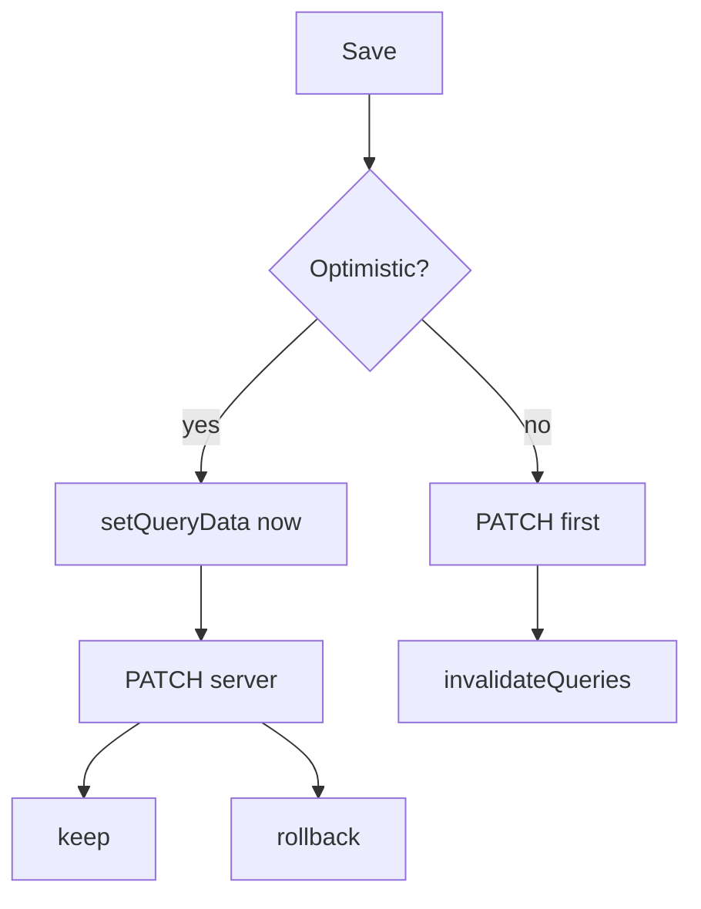
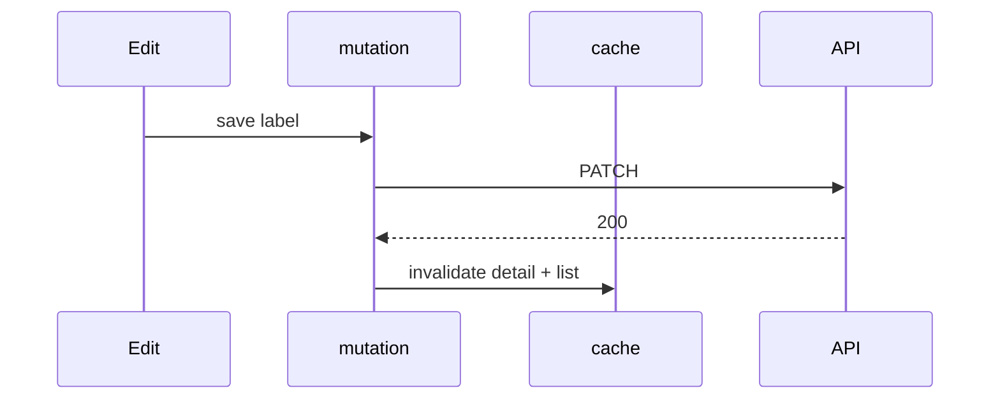
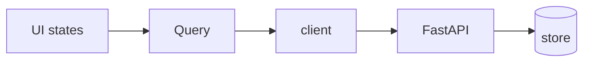

# Month 12 · Week 2 · Day 4
# Lab: Detail + Edit; Optimistic Updates — When Not To

**Program:** Full-Stack Mastery · 18 months  
**Phase:** 4 — Full-stack application  
**Month index:** [../../README.md](../../README.md)  
**Week 2:** [1](day-01.md) · [2](day-02.md) · [3](day-03.md) · Day 4 (today) · [5](day-05.md) · [6](day-06.md) · [7](day-07.md)  
**Week rhythm today:** Learn + lab feature  
**Student state:** You can paginate a list. Today **one row** has a detail screen and an **edit**. You will hear **optimistic UI** and you will **name a risk** before you use it.  
**Study time:** 3–4 focused hours

**Week nav fix:** Day 5 is [day-05.md](day-05.md).

Labs: `~\fullstack-lab\month-12\week-02\day-04\`. Noun: **lockers** (`id`, `code`, `label`). Not Project 7.

---

## How to use this textbook

1. Read a section. Close it. Say the risk out loud.
2. Type detail + edit with **invalidate** first. Optimistic is an experiment you may skip if you write the risk clearly.
3. Optional review links are for later rechecking.

---

## How to read this chapter

List keys are collections. Detail is **another key**: `["lockers", id]`. Edit is a **mutation**. After PATCH 200, invalidate the detail key **and** the list prefix.

**Optimistic** means: update the cache **before** the server agrees, then rollback if it fails. That is a **bet**.



**Wrong belief:** “Optimistic is how professional apps always edit.”  
**Correct:** professional apps **name the lie**. If GET will not match what you painted, you taught the user a ghost.

---

## Today's contract

By the end of this day you will be able to:

1. Route `/lockers/:id` with React Router (`useParams` from `"react-router"`).
2. `useQuery({ queryKey: ["lockers", id], queryFn, enabled: !!id })`.
3. Edit with `useMutation` + **`invalidateQueries({ queryKey: ["lockers", id] })`** and prefix `["lockers"]`.
4. Narrow `id` from `string | undefined` — **no `as string`**.
5. Write **`RISK.md`**: when you must **not** be optimistic, with a **named risk**.
6. Optionally implement optimistic **once**, with rollback on error.

**Today's gate.** Closed-book:

> Detail has id in the key. Edit invalidates detail and list. Optimistic UI is a bet. I can name a risk that makes that bet dishonest. isPending on the detail query is first load of that id.

---

## Time box

| Block | Minutes | Work |
|---|---|---|
| A | 50 | Theory |
| B | 60 | Detail + pessimistic edit |
| C | 70 | RISK.md + optional optimistic with rollback |
| D | 20 | Git |
| E | 15 | Recall |

---

# Block A — Theory

## 1. Detail key

```tsx
const { id } = useParams();
const lockerId = id !== undefined && /^\d+$/.test(id) ? Number(id) : undefined;

const detail = useQuery({
  queryKey: ["lockers", lockerId],
  queryFn: () => api.getLocker(lockerId!),
  enabled: lockerId !== undefined,
});
```

Prefer parsing without `!` if you can: `queryFn` only runs when `enabled` is true, but TypeScript may still want a narrowed number. A small helper `function requireId(id: number | undefined): number` that throws is better than `as string`.

**Wrong belief:** “`["lockers"]` is enough; I’ll find the row in the list cache.”  
**Correct:** page 2’s cache may not include this id. Detail **GET** is the source of truth.

---

## 2. Pessimistic edit (course default)

```tsx
const queryClient = useQueryClient();
const save = useMutation({
  mutationFn: (input: LockerPatchDto) => api.patchLocker(lockerId, input),
  onSuccess: () => {
    void queryClient.invalidateQueries({ queryKey: ["lockers", lockerId] });
    void queryClient.invalidateQueries({ queryKey: ["lockers"] });
  },
});
```

Wait for 200. Then refetch. The UI can show mutation `isPending` on Save. The user sees old values until success. That is **honest**.

PATCH on FastAPI: Pydantic model + **`model_dump(exclude_unset=True)`** so omitted fields stay. Missing id: `HTTPException` 404.

---

## 3. Optimistic pattern (know it)

```tsx
useMutation({
  mutationFn: (input: LockerPatchDto) => api.patchLocker(lockerId, input),
  onMutate: async (input) => {
    await queryClient.cancelQueries({ queryKey: ["lockers", lockerId] });
    const previous = queryClient.getQueryData(["lockers", lockerId]);
    queryClient.setQueryData(["lockers", lockerId], (old) => /* merge input */);
    return { previous };
  },
  onError: (_err, _input, ctx) => {
    if (ctx?.previous !== undefined) {
      queryClient.setQueryData(["lockers", lockerId], ctx.previous);
    }
  },
  onSettled: () => {
    void queryClient.invalidateQueries({ queryKey: ["lockers", lockerId] });
  },
});
```

This is the shape. You must still **throw** in `mutationFn` on !ok or `onError` never runs.

---

## 4. When NOT to be optimistic (you must name the risk)

Write these in `RISK.md`. Pick **at least one** as your “I will not optimistic this” case:

| Situation | Named risk |
|---|---|
| **Server assigns fields** (normalized `code`, timestamps, unique suffix) | You paint a `code` the GET will replace. User copies the wrong code. |
| **Unique constraint 409** | Two lockers cannot share `code`. Optimistic list shows a duplicate that **snaps away**. User thinks they saved. |
| **Authorization / ownership** (Week 4 / Month 13) | You show an edit that **403** will refuse. Ghost success. |
| **Multipart upload** (Week 3) | You cannot fake a stored path or size before the server writes the file. |
| **Create with client-made ids** | Fake negative ids collide with Query keys; GET `/lockers/-1` 422/404. **Risk: phantom id.** |
| **Money, inventory counts, anything two users edit** | Last-write-wins plus optimism **hides** the other user’s value until rollback. **Risk: lost update you already hid.** |

**Wrong belief:** “Rollback makes optimistic safe.”  
**Correct:** rollback fixes the cache. It does not un-send an email, un-charge a card, or un-confuse a user who already left the page. If rollback is not enough, **do not** paint success first.

**This course’s default for locker `code` uniqueness: do not optimistic the `code` field.** Invalidate after PATCH.

You may optimistic a **label** (cosmetic string) if you implement rollback and still invalidate on settled. Write that choice.

---

## 5. Router

```powershell
npm install react-router
```

```tsx
import { Route, Routes, useParams, Link } from "react-router";
```

List links to `/lockers/1`. Unknown id: query `isError` from 404 `ApiError`.

---

## 6. Security start

- Path id wins over body id.
- Do not `as any` the PATCH body.
- 409 vs 422: unique vs schema (Month 9). Show a toast or field error — tests tomorrow.

---

# Block B — Type-along

```powershell
cd ~\fullstack-lab
mkdir month-12\week-02\day-04 -Force
cd ~\fullstack-lab\month-12\week-02\day-04
```

Stub: CRUD-enough GET list, GET one, PATCH, unique `code` 409. CORS 5173. `model_dump(exclude_unset=True)` on patch.

Vite: list, detail, edit form. Pessimistic invalidate. `enabled` when id parsed.

Write `NETWORK.txt`: GET detail, PATCH, GET detail again.

---

# Block C — Independent

1. `RISK.md`: at least **one** named risk from the table, in your words, tied to **this** noun.  
2. Optional: optimistic **label** with rollback; keep `code` pessimistic.  
3. 404 detail UI.  
4. No `as string` on params without narrowing.

```powershell
cd ~\fullstack-lab
git add month-12
git commit -m "Month 12 Week 2 Day 4: locker detail edit and optimistic risk."
```

---

# Block E — Recall

1. Why detail is a separate key.  
2. `exclude_unset` on PATCH.  
3. A named risk against optimistic create ids.  
4. Why `onError` needs a thrown `ApiError`.  
5. Prefix vs id invalidation.

---

## Office hours — defects you will hit

**`enabled: true` with `id` undefined.** `getLocker(undefined)` → `/lockers/undefined`. Parse first.

**Optimistic without `cancelQueries`.** In-flight GET overwrites your optimistic data. Cancel, then set.

**409 optimistic duplicate.** The named risk. Remove optimism on `code`.

**Invalidated only `["lockers", id]`.** List still shows old label. Prefix too.



---

## Definition of done

- [ ] Detail `useQuery` with id in key  
- [ ] Edit mutation + invalidate  
- [ ] `RISK.md` names when **not** to be optimistic  
- [ ] Id narrowed without reckless `as`  
- [ ] Commit exists  

---

## Optional review links

- [Optimistic updates](https://tanstack.com/query/latest/docs/framework/react/guides/optimistic-updates)
- [FastAPI PATCH exclude unset](https://fastapi.tiangolo.com/tutorial/body-updates/)

---

## Tomorrow

**Tests:** mutation **failure** rollback and/or error toast. Prove `onError` is not a comment.

---

# Worked session — pessimistic first

Routes. `getLocker`. PATCH `model_dump(exclude_unset=True)`. Unique code 409. Invalidate two keys.

`RISK.md` title: “Phantom id” or “409 snap-back” or “lost update”. One paragraph.

Optimistic only on a cosmetic field, with rollback, if time.

`useParams` from `"react-router"`. Vite extra `--`. CORS 5173. No Project 7 dump.

---

# Closing lecture — honesty is a product feature

Invalidate after edit is slower by one GET. Users see saved data that GET agrees with.

Optimistic is a bet that the server will echo your paint. Unique fields, server-normalized fields, auth, files, money, and fake ids are **named risks**. Rollback is cache hygiene, not time travel.

Detail key includes id. List prefix still matters. `enabled` guards undefined ids.

v5 object API. `isPending` on detail first load. Mutation `isPending` on Save. `gcTime` not `cacheTime`.

---

# RISK.md template (fill in your words)

Title: **when I will not paint success first**

Pick one:

1. **Phantom id** — optimistic create with `id: -1` makes `GET /lockers/-1` and a Query key that will never match the server id.  
2. **409 snap-back** — two lockers cannot share `code`. The list shows a duplicate, then it vanishes. The user already walked away.  
3. **Normalized field** — server `casefold`s `code`. You painted `A1 `; GET returns `a1`. Clipboard copies the wrong value.  
4. **Lost update** — two tabs edit `label`. Optimism hides the other tab’s value until rollback, which the user may never see.

Rollback restores **cache**. It does not un-send, un-charge, or un-confuse.

Course default for unique `code`: **pessimistic**. PATCH, wait 200, `invalidateQueries({ queryKey: ["lockers", id] })` and prefix `["lockers"]`.

```ts
enabled: lockerId !== undefined
queryKey: ["lockers", lockerId]
```

Narrow `useParams()` from `"react-router"`. No `as string`.

Pydantic PATCH: **`model_dump(exclude_unset=True)`**.

**Wrong belief:** “onSettled invalidate makes optimistic free.”  
**Correct:** the user already saw the lie. Use optimism only when the named risk is acceptable.

## Recite-back

- [ ] detail id in key
- [ ] enabled when parsed
- [ ] invalidate detail + list
- [ ] named risk in RISK.md
- [ ] exclude_unset on PATCH

---

# Pessimistic sequence (memorize)

1. User clicks Save. Mutation `isPending` true. Button disabled.  
2. PATCH `/lockers/1`.  
3. 200 + Out body.  
4. `invalidateQueries({ queryKey: ["lockers", 1] })`.  
5. `invalidateQueries({ queryKey: ["lockers"] })`.  
6. Detail refetch. List refetch. User sees server truth.

Optimistic inserts a `setQueryData` between 1 and 2 and a rollback on error. Only if RISK.md says the field is cosmetic.

404 detail: `ApiError.status === 404` → “Locker not found,” not an empty form that POSTs by accident.

`npm install react-router`. `Link` from list to `/lockers/${id}`.

Office hours extra: **forgot `cancelQueries` when optimistic** — in-flight GET overwrites paint. Another reason to stay pessimistic on `code`.

---

# Office hours extra — 409 vs 422 on edit

422: `code` missing or wrong type. Pydantic.  
409: `code` well-formed but taken by another locker. Your loop, `ignore_id` for the same row.

Optimistic `code` turns 409 into a snap-back. RISK.md should have already forbidden it.

Detail first load: `isPending`. Save: mutation `isPending`. Do not mix.

`model_dump(exclude_unset=True)` so PATCH `{"label": "x"}` does not null `code`.

---

# Recite-back extra

enabled when id parsed. Path id wins over body id. 404 not an upsert. RISK.md names phantom id or 409 or lost update. Optional cosmetic optimistic with rollback test tomorrow.

```powershell
curl.exe -s http://127.0.0.1:8000/lockers/1
curl.exe -s -X PATCH http://127.0.0.1:8000/lockers/1 -H "Content-Type: application/json" --data-binary @patch.json
```

NETWORK.txt: GET, PATCH, GET. Unique `code` 409 on a second locker. CORS 5173. `npm install react-router`. Import `useParams` from `"react-router"`.

---

# Closing card

Windows: `curl.exe`. Vite: `npm create vite@latest name -- --template react-ts`. Router: `npm install react-router` and import from `"react-router"`. FastAPI `--host 127.0.0.1 --port 8000`. CORS `allow_origins=["http://127.0.0.1:5173"]` not `*`. `VITE_API_BASE` in `.env` — no secrets. Query v5: `useQuery({ queryKey, queryFn })`, `useMutation({ mutationFn })`, `isPending` first load, `gcTime` not `cacheTime`, `placeholderData: keepPreviousData` when paging, `invalidateQueries({ queryKey })` after writes. Pydantic v2 `model_dump()`. JSON `unknown` then DTO. No `any`. No `fetch` in components. No Project 7 dump.


