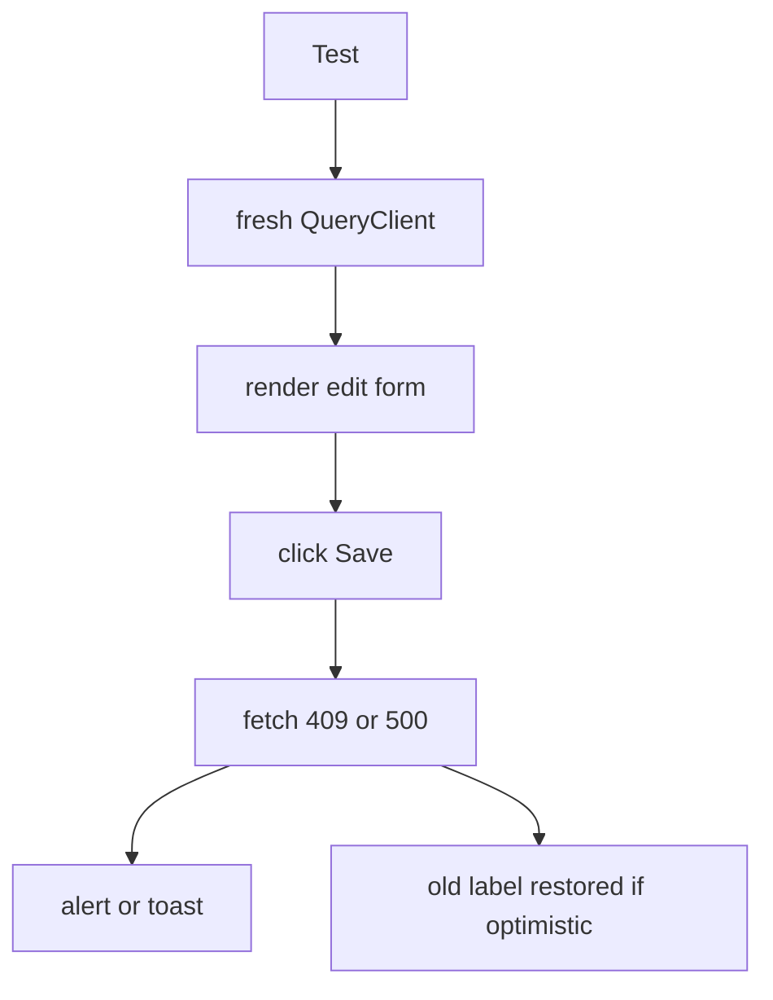
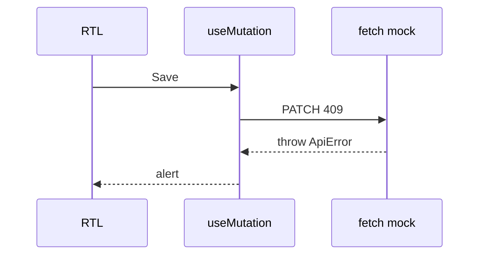
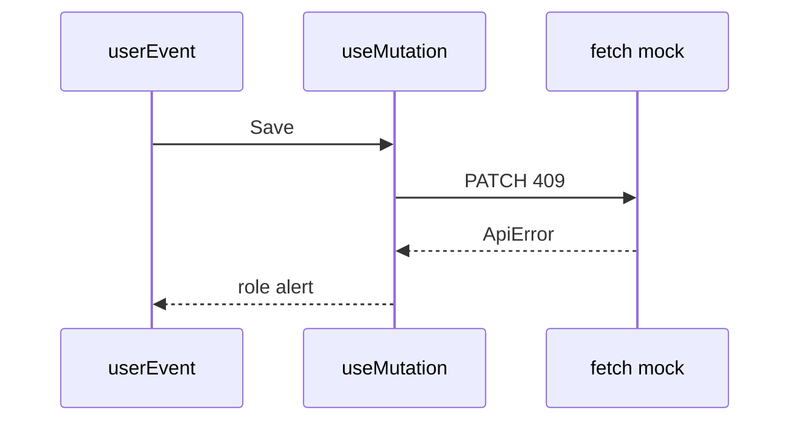

# Month 12 · Week 2 · Day 5
# Tests: Mutation Failure, Rollback, and Error Toast

**Program:** Full-Stack Mastery · 18 months  
**Phase:** 4 — Full-stack application  
**Month index:** [../../README.md](../../README.md)  
**Week 2:** [1](day-01.md) · [2](day-02.md) · [3](day-03.md) · [4](day-04.md) · Day 5 (today) · [6](day-06.md) · [7](day-07.md)  
**Week rhythm today:** Tests + documentation  
**Student state:** You can edit a detail row. Today you **prove** that failure is visible — rollback if you were optimistic, toast or alert if you were not.  
**Study time:** 3–4 focused hours

Labs: `~\fullstack-lab\month-12\week-02\day-05\`. Continue **lockers** or a smaller **nameplates** resource. Do not paste Project 7. Do not mock `useMutation` itself.

---

## How to use this textbook

1. Read a section. Close it. Say it.
2. Type a failing mutation test first if you can.
3. Break the mock; watch red; restore.
4. Optional review links are for later rechecking.

---

## How to read this chapter

A mutation test that only asserts the happy PATCH is half a test. The product question is: **when the server says no, does the user still see a lie?**



**Wrong belief:** “I’ll mock `useMutation` to `{ isError: true }`.”  
**Correct:** worthless. Mock **`fetch`** (or the client function) so `mutationFn` throws `ApiError`. Query must run `onError`.

**Wrong belief:** “Toast libraries are the lesson.”  
**Correct:** `role="alert"` or a visible error region is enough. A toast library is optional chrome.

---

## Today's contract

By the end of this day you will be able to:

1. Render with a **new** `QueryClient`, `retry: false` on **mutations** too.
2. Seed detail cache or mock GET, then mock PATCH **409/500**.
3. Assert an **error message** the user can read.
4. If optimistic: assert the **old** value returns (rollback).
5. If pessimistic: assert the **old** value never left (and error showed).
6. Keep `gcTime: 0` in tests so leftover cache does not haunt you.

**Today's gate.** Closed-book:

> Mutation retries are off in tests. I mock HTTP under the client. Failure shows UI. Optimistic rollback is asserted, or I document pessimistic and still assert the toast. I do not mock useMutation.

---

## Time box

| Block | Minutes | Work |
|---|---|---|
| A | 45 | Theory |
| B | 65 | Error toast test |
| C | 70 | Rollback test or 409 field error |
| D | 20 | Git |
| E | 15 | Recall |

---

# Block A — Theory

## 1. Wrapper (mutations)

```tsx
new QueryClient({
  defaultOptions: {
    queries: { retry: false, gcTime: 0 },
    mutations: { retry: false },
  },
});
```

Default mutation retry can **delay** your error test. Turn it off.

Wrap `MemoryRouter` with initial entry `/nameplates/1` if you use routes. Import from `"react-router"`.

---

## 2. Mock GET then PATCH

```ts
const fetchMock = vi.fn();
vi.stubGlobal("fetch", fetchMock);

fetchMock.mockImplementation((input: RequestInfo) => {
  const url = String(input);
  if (url.includes("/nameplates/1") && /* GET */) {
    return jsonResponse({ id: 1, title: "Old" });
  }
  if (/* PATCH */) {
    return jsonResponse({ detail: "Title taken" }, 409);
  }
  return jsonResponse({}, 404);
});
```

Inspect `Request` method if you pass a `Request` object from your client. If your client calls `fetch(url, { method: "PATCH" })`, branch on `init?.method`.

The client must `throw new ApiError(409, body)` so Query is in error state.

---

## 3. User-visible error

In the page, on `mutation.isError`:

```tsx
{save.isError ? (
  <p role="alert">Could not save. Try a different title.</p>
) : null}
```

Map `ApiError.status === 409` vs 500 if you want two messages. Tests can `findByRole("alert")`.

Do not only `console.error`. Tests cannot see that as a product claim.

---

## 4. Rollback assertion

If you implemented optimistic label:

1. Render with GET `title: "Old"`.  
2. Type `"New"` and Save.  
3. PATCH fails.  
4. `findByDisplayValue("Old")` or `findByText("Old")` — **not** `"New"` stuck.

If pessimistic: after failed save, input may still show `"New"` (draft). That is OK **if** the **list/detail query data** is still `"Old"` and the alert is visible. Document in `TESTS.md` which behavior you chose. Do not call a leftover draft “rollback” unless you reset the form on error on purpose.

---

## 5. Contract test on API 409

TestClient: create two nameplates, PATCH second to first’s unique title, assert **409**. This proves the server. RTL proves the toast. Both.

---

## 6. Security and tests

- Do not mock 401 with a real token dump.
- 409 `detail` should not include other rows’ private fields.

---

# Block B — Type-along

Rebuild a tiny edit screen (or copy-by-typing Day 4). Add Vitest.

Tests:

1. `test_save_error_shows_alert` (PATCH 500 or 409).  
2. `test_loading_then_detail_title` (GET success) — still required so the form exists.

`npx vitest run`. `RED.txt`: break status to 200, error test fails, restore.

---

# Block C — Independent

**Either:**

- Optimistic rollback test as specified, **or**
- Pessimistic: assert alert **and** a TestClient 409.

Write `TESTS.md`: where the mock sits; retry false; whether rollback applies.

Optional: success path invalidation — mock PATCH 200 then GET list; assert new title (heavier). Not required if time is gone.

```powershell
cd ~\fullstack-lab
git add month-12
git commit -m "Month 12 Week 2 Day 5: mutation error toast and rollback tests."
```

---

# Block E — Recall

1. Why mutation `retry: false`.  
2. Why mocking `useMutation` is worthless.  
3. Draft vs cache after pessimistic fail.  
4. 409 vs 500 message.  
5. TestClient vs RTL.

---

## Office hours — tests that lie

**`getByRole("alert")` immediately.** Mutation is async. `findByRole`.

**PATCH mock never hit.** Client URL mismatch (`VITE_API_BASE` undefined). Set env in vitest config.

**Optimistic test passes because you never setQueryData.** You tested pessimistic by accident. Assert what you implemented.

**Shared QueryClient.** Second test already has the row saved.



---

## Definition of done

- [ ] Error alert test green  
- [ ] `retry: false` on mutations  
- [ ] Rollback **or** documented pessimistic + 409 contract  
- [ ] `useMutation` not mocked  
- [ ] `RED.txt` exists  
- [ ] Commit exists  

---

## Optional review links

- [Query testing](https://tanstack.com/query/latest/docs/framework/react/guides/testing)
- [Testing Library async](https://testing-library.com/docs/dom-testing-library/api-async/)

---

## Tomorrow

**Independent:** filter + search on **your** domain list (6B / ops-web / Project 7). URL + queryKey.

---

# Worked session — fail the PATCH on purpose

Wrapper. Mock GET 200. Mock PATCH 409. `userEvent.click(Save)`. `findByRole("alert")`.

If optimistic, `findByText("Old")`. If not, `TESTS.md` says draft may stay.

pytest 409 on unique field. CORS not the focus today.

No `any` on fixtures if you have DTOs. No Project 7 dump. No mock of the hook.

---

# Closing lecture — failure is part of the contract

201/200 tests feel good. 409 is the product. The user must see a message. The cache must not keep a duplicate `code`.

`ApiError` is how Query enters `onError`. Swallowing fetch errors in the client makes tests and toasts die together.

Fresh QueryClient. `gcTime: 0`. `findBy`. Prefix invalidation is Week 2 Day 1; today you prove the unhappy path.

Named risk from Day 4 is why 409 should not have been optimistic on `code`.

---

# Failure matrix (implement at least two tests)

| Server | UI claim |
|---|---|
| PATCH 409 | `findByRole("alert")` — title/code taken |
| PATCH 500 | alert — could not save |
| PATCH 200 | title updates (optional) |
| Optimistic + 409 | old label visible again |

```ts
mutations: { retry: false }
queries: { retry: false, gcTime: 0 }
```

If retry stays at 3, the error test waits and you will call Vitest haunted.

Mock **`fetch`** (or `patchLocker`). Do not mock `useMutation`.

**Wrong belief:** “Draft text still showing New after a failed pessimistic save means rollback failed.”  
**Correct:** pessimistic never wrote the cache. The input is a draft. Document it. Assert the alert **and** that query data is still Old if you read the cache — or just the alert.

TestClient 409 on unique `code` is the API twin. Both belong in `TESTS.md`.



`findBy` not `getBy` immediately after click.
