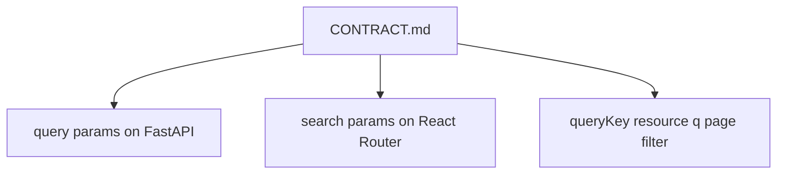
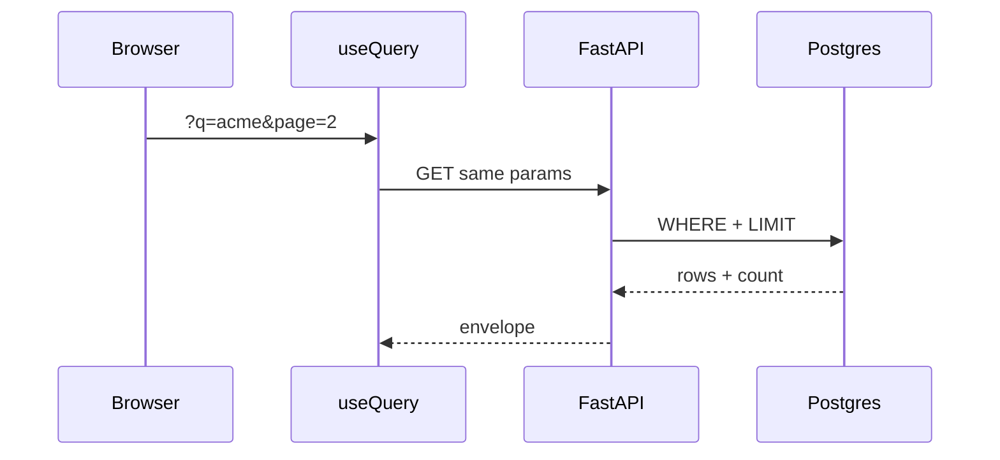

# Month 12 · Week 2 · Day 6
# Independent: Filter and Search on Your Domain

**Program:** Full-Stack Mastery · 18 months  
**Phase:** 4 — Full-stack application  
**Month index:** [../../README.md](../../README.md)  
**Week 2:** [1](day-01.md) · [2](day-02.md) · [3](day-03.md) · [4](day-04.md) · [5](day-05.md) · Day 6 (today) · [7](day-07.md)  
**Week rhythm today:** Independent implementation  
**Student state:** Labs paginate and mutate. Today **your** list gains **filter and search** with URL + queryKey.  
**Study time:** 3–4 focused hours

This textbook will **not** give you product source. Spec envelope + forbidden list only.

Notes: `~\fullstack-lab\month-12\week-02\day-06\`. Code in **your** API and web repos.

---

## How to use this textbook

1. Envelope first.  
2. Type the join.  
3. Tests part of the day.  
4. Optional links later.

---

## How to read this chapter

Week 2’s independent skill is not “I paginated ferry tickets.” It is “**my** noun slices on the server, and the address bar matches the cache key.”



**Wrong belief:** “I’ll filter in React with `.filter` on the full GET.”  
**Correct:** that is a demo. Your 6B/Project 7 list should **query Postgres** (or your store) with the same params.

**Wrong belief:** “I’ll skip the URL and only use Query keys.”  
**Correct:** refresh and shareable links fail. Both.

---

## Today's contract

By the end of this day you will be able to:

1. Document `q`, one **filter**, and **page** (or skip/limit).  
2. Implement them on **your** GET list (SQLAlchemy filters if 6B).  
3. Wire UI: committed search, filter control, pagination.  
4. `queryKey: ["noun", { q, filter, page }]`.  
5. `placeholderData: keepPreviousData`.  
6. Changing search/filter resets page.  
7. Invalidate prefix after an existing create if you have one.

**Today's gate.** Closed-book:

> My list params exist in CONTRACT, URL, queryKey, and SQL/API together. keepPreviousData is the page-change trick. I did not slice a dump in the browser as the product behavior.

---

## Time box

| Block | Minutes | Work |
|---|---|---|
| A | 25 | CONTRACT.md |
| B | 40 | Failing test (API or UI) |
| C | 90 | Implement |
| D | 30 | curl.exe + refresh URL |
| E | 15 | Recall |

---

# Block A — Envelope

`~\fullstack-lab\month-12\week-02\day-06\CONTRACT.md`:

- Repo paths  
- Param names and types  
- Envelope fields including **total** (filtered total)  
- Sort whitelist if any  
- Example URLs  
- queryKey examples  
- CORS 5173  
- What happens on empty page  

**Forbidden:** todo list; copying lab “archive cards” into ops-web. **Allowed:** lab fallback only with `BLOCKED.md`.

---

# Complete explanation (Days 1–5 closed except this recap)

**Query v5.** Object `useQuery` / `useMutation`. `invalidateQueries({ queryKey: ["noun"] })`. `isPending` first load. `placeholderData: keepPreviousData`. `gcTime` not `cacheTime`.

**URL.** `useSearchParams` from `"react-router"`. Commit `q`. Reset page.

**API.** Filter → search → sort whitelist → total → slice. Empty 200. Cap limit. Pydantic Out `model_dump()`. Never string-build SQL.

**Client.** `URLSearchParams`. No fetch in pages. `VITE_API_BASE`.

**Optimistic.** Not required today. If you edit, remember Day 4 risks.

**Windows.** `curl.exe` with quoted query URLs.



---

# Block B — Red first

TestClient: two rows, `q` matches one, `total === 1`. **Or** RTL: set URL, see one title.

Save `RED.txt`.

---

# Block C — Implement

API query params. Indexes later; correctness today. UI controls. `keepPreviousData`. Prefix invalidate if create exists.

Do not add uploads (Week 3). Do not add auth product (Week 4).

---

# Block D — Manual

```powershell
curl.exe -s "http://127.0.0.1:8000/YOUR?q=test&page=1&limit=10"
```

Refresh `http://127.0.0.1:5173/...?q=test&page=2`. Write `EVIDENCE.md`.

---

# Block E — Recall

1. Why total is filtered.  
2. Why page is in the key.  
3. Prefix invalidate.  
4. Named optimistic risk (one sentence).

## Quality bar

A classmate can implement from CONTRACT.md without Slack. Params named. 200 empty. `keepPreviousData` mentioned.

If you only added a client-side filter, the day is **not** done unless `BLOCKED.md` says the API cannot change yet — then the **lab** must still server-filter.

---

```powershell
cd ~\fullstack-lab
git add month-12\week-02\day-06
git commit -m "Month 12 Day 6: filter search envelope and evidence."
```

Product repos: separate commits.

---

## Definition of done

- [ ] CONTRACT first  
- [ ] Server-side filter/search/page  
- [ ] URL + queryKey  
- [ ] `placeholderData: keepPreviousData`  
- [ ] Evidence + one test  
- [ ] No `*` CORS  

---

## Optional review links

Week 2 Days 1–5 in this textbook.

---

## Tomorrow

**Week 2 review.** Mini-build. Debug. Retro. Then Week 3 uploads and dual validation.

---

# Server-side filter is the product

Client `.filter` on a full GET is a demo. Your 6B/Project 7 list should use SQLAlchemy (or equivalent) with the **same** `q`, filter, and page the URL shows.

```text
GET /items?q=acme&status=open&page=2&limit=10
```

Pipeline: filter → search → sort **whitelist** → count `total` → slice. Empty page **200**. Cap `limit`. Never interpolate `q` into SQL.

UI: `useSearchParams` from `"react-router"`. Committed `q` in the URL. Draft in `useState` until submit.

```ts
queryKey: ["items", { q, status, page, limit }]
placeholderData: keepPreviousData
```

Create still `invalidateQueries({ queryKey: ["items"] })` — prefix, not only page 1.

**Wrong belief:** “Independent day can skip the URL if Query keys work.”  
**Correct:** refresh must restore the slice. Keys without URL amnesia the human.

CONTRACT.md must include example URLs and example keys. `curl.exe` with quotes:

```powershell
curl.exe -s "http://127.0.0.1:8000/YOUR?q=test&page=1&limit=10"
```

`EVIDENCE.md`: filtered `total`, page 2 URL after refresh, CORS still 5173.

If you only filtered in React, the day is not done unless `BLOCKED.md` says the API cannot change — then the **lab** must still filter on the server.

Do not add uploads this day. Do not add OAuth. Depth on params.

---

# CONTRACT.md minimum tables

**Params**

| Name | Type | Default | Notes |
|---|---|---|---|
| q | string | empty | search |
| status | string | all | whitelist |
| page | int | 1 | ge=1 |
| limit | int | 10 | cap 50 |

**Keys**

`["issues", { q, status, page, limit }]`

**Statuses**

GET 200 always for a matching route, including empty `items`. 422 on `limit=nope`.

Write `EVIDENCE.md` with:

- curl URL and `total`
- browser URL after clicking Next
- whether refresh kept page
- CORS header present for 5173

SQL: parameterized. Sort whitelist. No `ORDER BY` from raw user strings.

If Project 7 list is still a dump of 5 rows, still implement the **params** so Week 4 exam is not a surprise. Empty page 2 is 200.

Do not paste ferry tickets into ops-web.

---

# Quality bar paragraph

A classmate implements from CONTRACT.md: exact path, param names, 200 empty, total meaning, queryKey shape, CORS origin, env key. Tests: at least one filtered `total`. UI: Next uses placeholder, not a blank table.

If you client-filtered, rewrite the API. That is the independent day.

`placeholderData: keepPreviousData`. `useSearchParams` from `"react-router"`. `curl.exe` quoted query URLs. Bind 127.0.0.1.

Git: envelope in fullstack-lab; product in product repos.

---

# Recite-back

- [ ] server filter not React slice
- [ ] URL + queryKey
- [ ] keepPreviousData
- [ ] prefix invalidate
- [ ] CONTRACT first
- [ ] curl evidence

---

# Closing card

Windows: `curl.exe`. Vite extra `--`. FastAPI `--host 127.0.0.1`. CORS `http://127.0.0.1:5173` not `*`. `VITE_API_BASE` public. Query v5 object API: `useQuery({ queryKey, queryFn })`, `isPending`, `gcTime` not `cacheTime`. `invalidateQueries({ queryKey })` when you write. Pydantic v2 `model_dump()`. No `fetch` in pages. No Project 7 source dump. Bind 127.0.0.1.

---

# Independent git

```powershell
cd ~\fullstack-lab
git add month-12\week-02\day-06
git commit -m "Month 12 Day 6: filter search envelope."
```

Product commits stay in the product repos.
