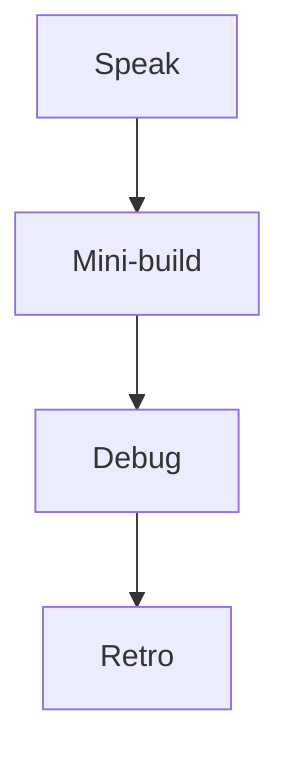

# Month 12 · Week 2 · Day 7
# Week Review — Mutations, Keys, and Honest Edits

**Program:** Full-Stack Mastery · 18 months  
**Phase:** 4 — Full-stack application  
**Month index:** [../../README.md](../../README.md)  
**Week 2:** [1](day-01.md) · [2](day-02.md) · [3](day-03.md) · [4](day-04.md) · [5](day-05.md) · [6](day-06.md) · Day 7 (today)  
**Week rhythm today:** Review, repair, plan Week 3  
**Student state:** You mutated, paginated, and named an optimistic risk. Today that must live in your head — from **this file**.  
**Study time:** 3–4 focused hours

Do not start Week 3 because the calendar moved. Uploads on a list that still slices in the browser are two problems.

Work in `~\fullstack-lab\month-12\week-02\day-07\`. Not inside ops-web / Project 7.

---

## How to read this chapter

Closed-book teaching day. The synthesis **is** the lesson.



Days 1–6 closed during mini-build.

---

## Week synthesis (the lesson, in this book)

**Writes.** `useMutation({ mutationFn })`. `mutationFn` is the **client**. On success, **`queryClient.invalidateQueries({ queryKey: ["noun"] })`**. Prefix marks filtered pages stale. Do not invalidate before the POST returns. POST **201**. PATCH **200** with **`model_dump(exclude_unset=True)`**. DELETE **204** — no `json()`.

**Reads.** `useQuery({ queryKey, queryFn })`. `isPending` first load. Keep rows on `isFetching`.

**Pagination.** `q`, filter, `page` in the **URL** (`useSearchParams` from `"react-router"`) **and** `queryKey`. FastAPI query params. Envelope `{items, total}`. Filter then total then slice. Empty 200. **`placeholderData: keepPreviousData`** (function, not boolean). Changing `q` resets page. Do not `.filter` a full dump as the product.

**Detail.** `["noun", id]`. `enabled` when id parsed. No reckless `as string`.

**Optimistic.** A bet. **Named risks:** phantom ids, 409 unique snap-back, server-normalized fields, auth 403, files, money/lost updates. Rollback restores cache, not the world. Course default: pessimistic invalidate; optional cosmetic optimistic with tests.

**Tests.** New QueryClient. `retry: false` queries **and** mutations. Mock fetch/client, not hooks. Assert `role="alert"` on failure. Rollback assert if optimistic.

**Still true from Week 1.** Client-only `fetch`. `VITE_API_BASE` public. CORS `http://127.0.0.1:5173` not `*`. `gcTime` not `cacheTime`. `curl.exe`. Vite extra `--`. `model_dump()`.

**Wrong belief:** “keepPreviousData merges pages.”  
**Correct:** it shows the previous **result** until the new key succeeds.

**Wrong belief:** “Optimistic + rollback is always safe.”  
**Correct:** users can leave before rollback; unique fields lie.

---

## Today's contract

**Today's gate.** Closed-book:

> I can teach invalidation, URL+key pagination, keepPreviousData, and one optimistic risk, and I built a mini from this spec.

---

## Time box

| Block | Minutes | Work |
|---|---|---|
| 1 | 40 | Speak synthesis |
| 2 | 55 | Mini-build `bolts` |
| 3 | 30 | Debug A–E |
| 4 | 20 | Review Day 6 CONTRACT |
| 5 | 20 | Re-run tests |
| 6 | 20 | Design: when not optimistic |
| 7 | 20 | Retro + Week 3 plan |

---

# Complete explanation — unpacking

## 1. Two isPendings

List query `isPending`: no list data. Mutation `isPending`: save in flight. Do not mix.

## 2. Keys

`["bolts"]` prefix. `["bolts", { q, page }]`. `["bolts", id]`. Invalidate prefix after create; detail + prefix after edit.

## 3. CORS / env

Unchanged. Preflight on JSON POST/PATCH.

---

# Block 1 — Speak

Cover: invalidate object form; prefix; URL+key; keepPreviousData; named risk; 204; tests retry false.

`exam-01.md` 15–25 lines.

---

# Block 2 — Mini-build

```powershell
cd ~\fullstack-lab
mkdir month-12\week-02\day-07\mini -Force
cd ~\fullstack-lab\month-12\week-02\day-07\mini
```

**Spec: hardware bolts** — not Project 7.

| Piece | Rules |
|---|---|
| API | Seed ≥ 12. GET `/bolts` envelope + `q` + `page` + `limit` + `total`. POST 201. PATCH optional. CORS 5173. Pydantic `model_dump()`. |
| Web | Router. Client. `useQuery` with key `{q,page}` + `placeholderData: keepPreviousData`. Create + `invalidateQueries({ queryKey: ["bolts"] })`. |
| Prove | curl page 2; browser Next without blank flash; create appears after invalidate |

No `*`. No ops-web. Optimistic not required; `RISK.txt` one sentence anyway.

---

# Block 3 — Debug

`exam-03-debug.md`:

**A.** Next shows empty spinner (`isPending` true) every time.  
**B.** Next shows page 1 rows forever.  
**C.** POST 201, list unchanged; Network has no GET after POST.  
**D.** Optimistic create with `id: -1`; detail route `/bolts/-1`.  
**E.** Error test hangs ~3 seconds then fails.

---

# Block 4 — Review Day 6 CONTRACT vs a real URL in your product (notes only). `MATCH.txt`.

---

# Block 5 — Break mini test or Day 5 test; restore.

---

# Block 6 — `design.md`: choose **one** named risk. Ten lines: why invalidate is the default for that field.

---

# Block 7 — `retro.md`: weakest key bug; Week 3 upload question.

## Debug keys

**A.** Missing `placeholderData: keepPreviousData`; or branching on `isFetching` like first load.

**B.** `page` not in `queryKey`.

**C.** No `invalidateQueries({ queryKey: ["bolts"] })`.

**D.** Phantom id — **do not** optimistic create ids.

**E.** Mutation/query `retry` still on. Tests need `retry: false`.

---

```powershell
cd ~\fullstack-lab
git add month-12
git commit -m "Month 12 Week 2 review: bolts mini-build and mutation debug."
```

---

# Lecture: invalidation is the join for writes

The server changed. The cache did not hear. You tell it with a **prefix**. Pagination did not invent a new rule; it invented **more keys** under that prefix.

`keepPreviousData` is courtesy during key change. It is not a substitute for putting `page` in the key.

Optimistic UI without a named risk is theater. Day 4’s table still applies.

Mini is bolts in fullstack-lab.

---

## Definition of done

- [ ] exam-01.md  
- [ ] Mini paginated + create invalidate  
- [ ] Debug A–E  
- [ ] design.md risk  
- [ ] Retro  

---

# Worked session — bolts

Seed 12. Envelope. Vite extra `--`. `react-router`. Query v5 object API. keepPreviousData. invalidateQueries object. curl.exe. Debug sentences. No cacheTime. No tuple hooks. No Project 7.

---

## Optional review links

Repair from this synthesis.

- [Query invalidation](https://tanstack.com/query/latest/docs/framework/react/guides/query-invalidation)
- [Paginated queries](https://tanstack.com/query/latest/docs/framework/react/guides/paginated-queries)

---

## Next week

[Week 3 Day 1 — File uploads](../week-03/day-01.md). Multipart is not JSON. Filenames are not trusted. Postgres stores a **path**, not bytes, if you teach files.

---

# Closing lecture — keys, then writes, then humility

URL, key, and query string are one fact. Mutations invalidate the prefix. Detail has id. Optimistic is optional and dangerous on unique fields and fake ids.

`isPending` vs `isFetching` vs mutation `isPending`. Three sentences.

Tests mock HTTP. Alerts are visible. `retry: false`.

CORS 5173. `VITE_API_BASE`. Client-only fetch. `model_dump()`. `curl.exe`.

If retro wants uploads tonight, finish bolts first.

## Recite-back checklist

Write `RECITE.txt`.

- [ ] invalidateQueries object + prefix
- [ ] page in URL and key
- [ ] keepPreviousData function
- [ ] named optimistic risk
- [ ] 201 / 204
- [ ] tests retry false
- [ ] no fetch in pages
- [ ] mini not ops-web

---

# Bolts mini — definition of enough

- Seed ≥ 12  
- GET envelope + `q` + `page` + `limit` + `total`  
- POST 201 + `invalidateQueries({ queryKey: ["bolts"] })`  
- `placeholderData: keepPreviousData`  
- URL `?q=&page=`  
- CORS 5173  
- `RISK.txt` one named optimistic risk even if you did not code optimism  

Debug keys after you write A–E:

**A** blank Next → keepPreviousData / do not spinner on isFetching  
**B** same rows → page in queryKey  
**C** no GET after POST → invalidateQueries object  
**D** `id: -1` → phantom id, do not  
**E** hanging error test → retry: false  

**Wrong belief:** “Review day is notes only.”  
**Correct:** mini + debug sentences + design.md.

Week 3: multipart, email port, Zod+Pydantic. Do not start it if bolts Next still flashes empty.

```powershell
curl.exe -s "http://127.0.0.1:8000/bolts?page=2&limit=5"
```

`npm create vite@latest bolt-web -- --template react-ts`. `npm install @tanstack/react-query react-router`. Import from `"react-router"`. `gcTime` not `cacheTime`. `isPending` first load.

---

# Speak list (Block 1)

Cover without notes: two isPendings; prefix invalidate; URL+key+query string; keepPreviousData not merge; named risk phantom id or 409; 204 no json; tests retry false; CORS 5173; VITE public; gcTime; model_dump.

exam-01.md 15 lines. Mini bolts. design.md: why unique `code` is not optimistic.

If Day 6 product URL and CONTRACT disagree, MATCH.txt. Fix after mini.

Week 3 starts only if Next does not blank the table.

---

# Recite-back

- [ ] invalidateQueries({ queryKey })
- [ ] page in URL and key
- [ ] keepPreviousData function
- [ ] named optimistic risk
- [ ] retry false in tests
- [ ] mini not ops-web

---

# Next week link

[Week 3 Day 1 — File uploads](../week-03/day-01.md). Multipart. Untrusted filename. Path not bytes. Email port Day 2. Dual validation Days 3–5.

---

# Closing card

Windows: `curl.exe`. Vite extra `--`. FastAPI `--host 127.0.0.1`. CORS `http://127.0.0.1:5173` not `*`. `VITE_API_BASE` public. Query v5 object API: `useQuery({ queryKey, queryFn })`, `isPending`, `gcTime` not `cacheTime`. `invalidateQueries({ queryKey })` when you write. Pydantic v2 `model_dump()`. No `fetch` in pages. No Project 7 source dump. Bind 127.0.0.1.
