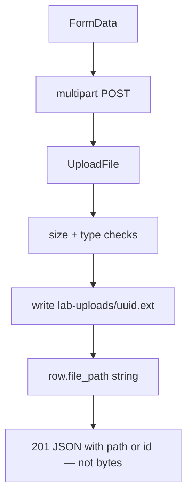
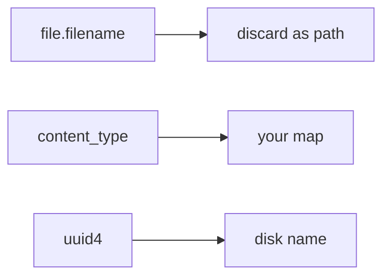
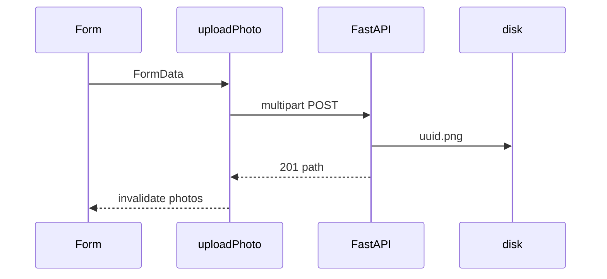

# Month 12 · Week 3 · Day 1
# File Uploads: Multipart, UploadFile, Paths Not Bytes

**Program:** Full-Stack Mastery · 18 months  
**Phase:** 4 — Full-stack application  
**Month index:** [../../README.md](../../README.md)  
**Week 3:** Day 1 (today) · [2](day-02.md) · [3](day-03.md) · [4](day-04.md) · [5](day-05.md) · [6](day-06.md) · [7](day-07.md)  
**Week rhythm today:** Learn + type-along  
**Student state:** Week 2 gate passed. JSON CRUD is familiar. Today a request can carry a **file**. Postgres, if you store anything, stores a **path** (or object key), not a bytea dump of the PDF.  
**Study time:** 3–4 focused hours

**This week covers:** uploads, email as a port, dual validation (Zod + Pydantic).

Today: **multipart vs JSON**, FastAPI **`UploadFile`**, **never trust `filename`**, size cap, content-type allowlist, disk path in the DB. No S3 required. No Project 7 dump.

Labs: `~\fullstack-lab\month-12\week-03\day-01\`. Noun: **lab photos** (metadata + file).

---

## How to use this textbook

1. Read a section. Close it. Say it.
2. Type upload. Do not paste a Dropzone empire.
3. Predict `Content-Type` **before** curl.exe.
4. Optional review links later.

---

## How to read this chapter

JSON bodies are **one** Content-Type. Files are usually **`multipart/form-data`**: a mix of fields and file parts. The browser’s `FormData` does that. `JSON.stringify` does **not**.

FastAPI gives **`UploadFile`**. You **`await file.read()`** (or stream to disk). You cap **size**. You ignore the client’s filename as a filesystem path. You save as an **id-based name**. You store that **relative path** in PostgreSQL (or in the lab dict).



**Wrong belief:** “I’ll put the file bytes in a JSON field as base64.”  
**Correct:** huge bodies, memory spikes, no streaming. Multipart (or a signed upload to object storage later) is the tool.

**Wrong belief:** “I’ll `open(file.filename)` because FastAPI already checked it.”  
**Correct:** `filename` is **attacker-controlled**. `../../etc/passwd` is a classic. You pick the name.

---

## Today's contract

By the end of this day you will be able to:

1. Explain **multipart** vs **application/json** in two sentences.
2. Declare `file: UploadFile = File(...)` on a FastAPI route.
3. Cap size (e.g. 1 MiB) and refuse with **413** or **400**.
4. Allowlist `content_type` (e.g. `image/jpeg`, `image/png`).
5. Save to a folder **you** name; persist **`file_path`**, not bytes, in the store.
6. Build `FormData` in the client; **do not** set `Content-Type` manually to JSON.
7. Keep CORS able to allow this POST (headers may include more than `Content-Type`).

**Today's gate.** Closed-book:

> Uploads are multipart. I never trust filename. I store a path. I cap size and type. The JSON API still returns metadata. Query invalidates the list after success. I still do not put secrets in Vite.

---

## Time box

| Block | Minutes | Work |
|---|---|---|
| A | 50 | Theory |
| B | 60 | Type-along: UploadFile + disk path |
| C | 70 | Independent: 413 + type refuse + client FormData |
| D | 20 | Git |
| E | 15 | Recall |

---

# Block A — Theory

## 1. Multipart vs JSON

| | JSON | Multipart |
|---|---|---|
| Content-Type | `application/json` | `multipart/form-data; boundary=...` |
| Body | One object | Parts: fields + files |
| FastAPI | Pydantic model | `File()`, `Form()`, `UploadFile` |
| Browser | `JSON.stringify` | `new FormData()` |

You can send a **title** as a form field next to the file. You can also: upload first, get an id, then PATCH JSON metadata. Both are valid. Today: **one** multipart POST that takes `title` + `file`.

**Wrong belief:** “I’ll set `Content-Type: multipart/form-data` by hand on fetch.”  
**Correct:** the **browser** must set the **boundary**. If you set the header yourself without the boundary, FastAPI cannot parse. Leave `Content-Type` **unset** on `fetch` when `body` is `FormData`.

```ts
await fetch(`${baseUrl}/photos`, {
  method: "POST",
  body: formData, // do not set Content-Type
});
```

The client helper may need a branch: JSON helpers set `application/json`; upload helpers do not.

---

## 2. UploadFile

```python
from fastapi import FastAPI, File, Form, HTTPException, UploadFile
from pathlib import Path
import uuid

UPLOAD_DIR = Path("lab-uploads")
UPLOAD_DIR.mkdir(exist_ok=True)
MAX_BYTES = 1_000_000
ALLOWED = {"image/jpeg", "image/png"}

@app.post("/photos", status_code=201)
async def create_photo(
    title: str = Form(...),
    file: UploadFile = File(...),
) -> dict:
    if file.content_type not in ALLOWED:
        raise HTTPException(status_code=400, detail="Unsupported type")
    data = await file.read()
    if len(data) > MAX_BYTES:
        raise HTTPException(status_code=413, detail="File too large")
    ext = ".jpg" if file.content_type == "image/jpeg" else ".png"
    name = f"{uuid.uuid4().hex}{ext}"
    path = UPLOAD_DIR / name
    path.write_bytes(data)
    # store str(path) or name on the row — not data
    return {"id": 1, "title": title, "file_path": str(path)}
```

Use **`model_dump()`** if you return a Pydantic Out.

For large files, streaming to disk without `await file.read()` into RAM is better. Today a 1 MiB cap makes `read()` honest.

**413** Payload Too Large is the right status for oversize. Some stacks send 400. Pick **413**, write it in CONTRACT.md.

---

## 3. Never trust filename

`file.filename` may be `None`, empty, a path, or a very long string.

Rules:

1. Do not use it as the destination path.  
2. Do not concatenate it onto `UPLOAD_DIR` without sanitizing — **prefer uuid + allowlisted extension**.  
3. You may **store** the original name as **display metadata** after stripping control characters — still not as the disk name.  
4. Extension from **your** content-type map, not from `.exe.jpg` tricks alone. Content-type can lie too; a serious product sniffs magic bytes. Lab: content-type allowlist + size is the bar. Mention magic bytes in `NOTES.md`.



---

## 4. Store path not bytes in Postgres

If you add a SQLAlchemy column this month:

- `file_path: str` (or `storage_key`)  
- maybe `content_type`, `byte_size`  
- **not** `LargeBinary` for the product lesson  

Bytes live on **disk** (lab) or object storage (later months). The database answers “which file.” Backups of Postgres should not be your photo archive by accident.

Lab dict is the same idea: `"file_path": "lab-uploads/ab12.png"`.

**Wrong belief:** “bytea is simpler because one DELETE removes everything.”  
**Correct:** until the row is 20 MB and every list query pays. Path + delete file in the same transaction story is a later reliability topic. Today: path.

---

## 5. Query and the client

After 201:

```ts
void queryClient.invalidateQueries({ queryKey: ["photos"] });
```

`useMutation({ mutationFn: uploadPhoto })`. Mutation `isPending` disables the file input submit.

List metadata with `useQuery({ queryKey: ["photos"], queryFn: () => api.listPhotos() })`. Do not put file bytes in the Query cache. Thumbnails can be a **separate** GET of static files if you mount `StaticFiles` — optional.

Serving files: `FileResponse` or StaticFiles for the lab folder. Do not `return bytes` as JSON.

---

## 6. CORS and curl.exe

Preflight may request `Content-Type` — actual multipart Content-Type includes boundary; CORS `allow_headers` often uses `*` for request headers in CORSMiddleware’s default, but **do not** use `*` for **origins**. If upload fails in the browser, inspect OPTIONS.

```powershell
curl.exe -s -D - -X POST http://127.0.0.1:8000/photos -F "title=bench" -F "file=@.\tiny.jpg" -H "Origin: http://127.0.0.1:5173"
```

Use a **tiny** jpeg you own. Do not commit huge binaries. `curl.exe -F` is multipart. Windows paths in `-F file=@...`.

---

## 7. Security start

- Size cap. Type allowlist. No trusted filename.  
- Upload dir **outside** source if you can; gitignore `lab-uploads/`.  
- Do not execute uploaded files.  
- Virus scanning is out of scope; do not pretend you did it.  
- Path traversal: uuid names avoid it.

---

# Block B — Type-along

```powershell
cd ~\fullstack-lab
mkdir month-12\week-03\day-01 -Force
cd ~\fullstack-lab\month-12\week-03\day-01
```

Stub: POST `/photos` multipart, GET list of metadata. CORS 5173. gitignore uploads.

Vite: form with `input type="file"` + title. `FormData`. Client upload function **without** JSON Content-Type. Query list + invalidate.

Write `MULTIPART.md`: JSON vs FormData; why filename discarded.

---

# Block C — Independent

1. Oversize → 413 (make a file just over the cap, or temporarily lower cap).  
2. `text/plain` → 400.  
3. GET metadata does not include bytes.  
4. `curl.exe -F` recorded in `CURL.txt`.

```powershell
cd ~\fullstack-lab
git add month-12
git commit -m "Month 12 Week 3 Day 1: multipart upload storing paths."
```

Do not `git add` large images.

---

# Block E — Recall

1. Why not set Content-Type on FormData fetch.  
2. Why uuid names.  
3. Path vs bytea.  
4. 413 vs 422.  
5. What to invalidate.

---

## Office hours — defects you will hit

**Empty file part.** `UploadFile` with zero bytes. Reject.

**`request()` always sets JSON header.** Split helpers.

**Static path `..` in GET.** Only serve from UPLOAD_DIR with resolved path check if you add a download route.

**CORS ok for JSON POST, fail for upload.** Header allowlist. Inspect preflight.

**Committed 12 MB png.** gitignore. Cap.



---

## Definition of done

- [ ] Multipart POST 201 with `file_path`  
- [ ] Filename not used as disk path  
- [ ] Size and type checks  
- [ ] Client FormData; no JSON Content-Type on that call  
- [ ] List invalidates  
- [ ] `curl.exe -F` evidence  
- [ ] Commit exists (no huge binaries)

---

## Optional review links

- [FastAPI request files](https://fastapi.tiangolo.com/tutorial/request-files/)
- [MDN FormData](https://developer.mozilla.org/en-US/docs/Web/API/FormData)
- [MDN 413](https://developer.mozilla.org/en-US/docs/Web/HTTP/Status/413)

---

## Tomorrow

**Email as a PORT:** `send_email(...)` protocol. Console backend in dev. No real SMTP.

---

# Worked session — tiny image, uuid, path column

uv FastAPI. `UploadFile`. Cap. Allow jpeg/png. uuid disk name. Dict or SQLite/Postgres **string path**. Vite FormData mutation. `invalidateQueries({ queryKey: ["photos"] })`. CORS 5173. `VITE_API_BASE`. `curl.exe -F`.

No base64 JSON. No `file.filename` as path. No secrets in Vite. No Project 7 dump. `model_dump()` on Out.

---

# Closing lecture — files are not JSON with extra steps

Multipart is a different body. UploadFile is a different parameter. The database stores a **pointer**. The pointer’s name is **yours**, not the client’s.

Query caches metadata. Bytes stay on disk. Invalidate the metadata list after create.

Browser FormData sets the boundary. Your fetch wrapper must not smash that with `application/json`.

413 is oversize. 400 is type. 422 is validation of form fields (title length) — Week 3 Day 4 will dual-validate title. Today the file is the lesson.
