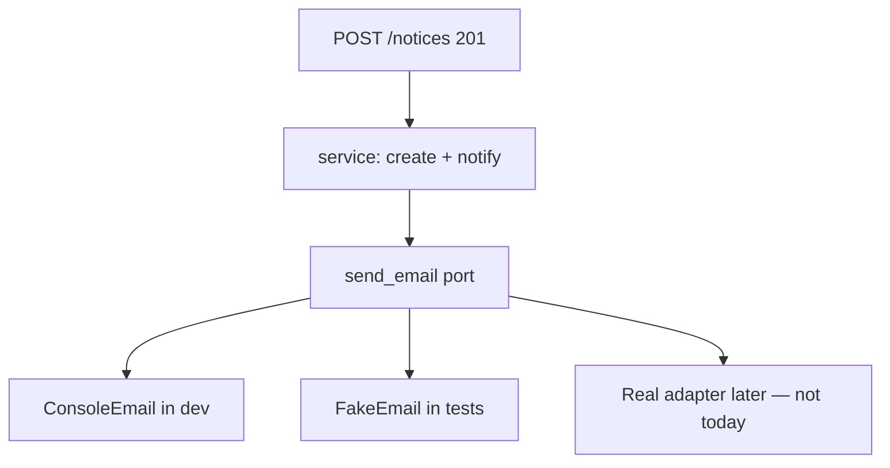
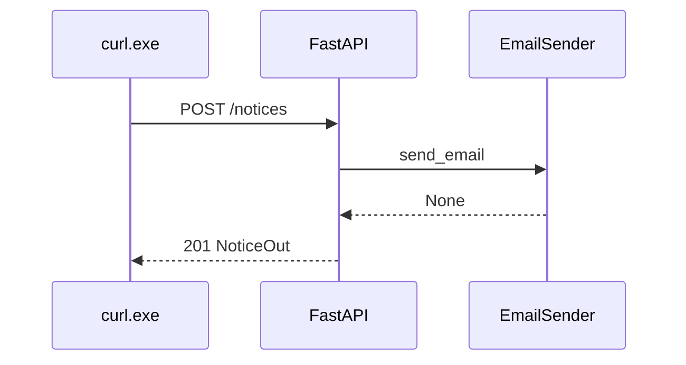
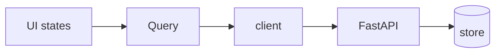

# Month 12 · Week 3 · Day 2
# Email as a Port: send_email() and a Console Backend

**Program:** Full-Stack Mastery · 18 months  
**Phase:** 4 — Full-stack application  
**Month index:** [../../README.md](../../README.md)  
**Week 3:** [1](day-01.md) · Day 2 (today) · [3](day-03.md) · [4](day-04.md) · [5](day-05.md) · [6](day-06.md) · [7](day-07.md)  
**Week rhythm today:** Learn + type-along  
**Student state:** You can upload a file. Today **notification** is a **protocol**, not a Gmail tutorial. You will not configure SMTP.  
**Study time:** 3–4 focused hours

Today: an interface **`send_email(...)`**, a **console backend** in development, injection via FastAPI `Depends`, and a test that the port was **called**. Month 9 `BackgroundTasks` was a preview. This is the **hexagonal** word **port** without a philosophy lecture.

Labs: `~\fullstack-lab\month-12\week-03\day-02\`. Noun: **hold notices**. No Project 7 dump. No real mailbox.

---

## How to use this textbook

1. Read a section. Close it. Say “port.”
2. Type an interface and two backends (console + fake list). Do not open SendGrid.
3. Optional review links later.

---

## How to read this chapter

Your API should not import `smtplib` in the path operation. The path operation should call **`send_email(to, subject, body)`**. In **dev**, that function **prints**. In **tests**, it **appends to a list**. In production (later months), a different module can speak SMTP or an HTTP vendor. The rest of the app **does not change**.

That function (and its type) is a **port**: a door in the wall of your app. The **adapter** is the console printer or the SMTP client.



**Wrong belief:** “I’ll copy a Gmail app password into `.env` so email is real.”  
**Correct:** you would put a secret in a lab, fight 2FA, and still not learn the port. Console is the backend.

**Wrong belief:** “BackgroundTasks is the port.”  
**Correct:** BackgroundTasks is **when** (after the response). The port is **what** (send). You may combine them. You may also call the port **inline** in a lab. If the process dies, in-process send dies — same Month 9 honesty. Redis/Celery is not this week.

---

## Today's contract

By the end of this day you will be able to:

1. Define a **`EmailSender`** Protocol (or ABC) with `send_email(to: str, subject: str, body: str) -> None`.
2. Implement **`ConsoleEmailSender`** that prints a clear envelope to stdout.
3. Implement **`MemoryEmailSender`** that records messages for tests.
4. `Depends(get_email_sender)` (or pass it into a service).
5. On create notice, return **201** JSON **without** waiting for SMTP (there is none).
6. Test that creating a notice **calls** the fake sender (or appends the list).
7. Keep secrets out of the frontend; the UI does not send email.

**Today's gate.** Closed-book:

> Email is a port. Dev prints. Tests fake. Path operations do not import SMTP. The UI never holds an SMTP password. VITE_ still has no secrets.

---

## Time box

| Block | Minutes | Work |
|---|---|---|
| A | 50 | Theory |
| B | 60 | Protocol + console + Depends |
| C | 70 | Memory backend + pytest |
| D | 20 | Git |
| E | 15 | Recall |

---

# Block A — Theory

## 1. Protocol in Python

```python
from typing import Protocol

class EmailSender(Protocol):
    def send_email(self, to: str, subject: str, body: str) -> None: ...
```

A class with that method **is** an EmailSender. No inheritance required (structural typing). An ABC with `@abstractmethod` is also allowed if you prefer.

```python
class ConsoleEmailSender:
    def send_email(self, to: str, subject: str, body: str) -> None:
        print("=== DEV EMAIL ===")
        print(f"To: {to}")
        print(f"Subject: {subject}")
        print(body)
        print("=== END EMAIL ===")
```

**Wrong belief:** “I’ll `print` inside the route and call that email.”  
**Correct:** then tests parse stdout and production will still print. The port lets you swap.

---

## 2. Depends

```python
from fastapi import Depends, FastAPI

app = FastAPI()

def get_email_sender() -> EmailSender:
    return ConsoleEmailSender()

@app.post("/notices", status_code=201)
def create_notice(
    payload: NoticeCreate,
    email: EmailSender = Depends(get_email_sender),
) -> NoticeOut:
    notice = save_notice(payload)
    email.send_email(
        to="dev@localhost",
        subject="Notice created",
        body=f"id={notice.id} title={notice.title}",
    )
    return NoticeOut.model_validate(notice)
```

Use **`model_dump()`** if you need a dict. Prefer `response_model`.

Tests:

```python
def test_create_sends_email() -> None:
    fake = MemoryEmailSender()
    app.dependency_overrides[get_email_sender] = lambda: fake
    client = TestClient(app)
    r = client.post("/notices", json={"title": "Door stuck"})
    assert r.status_code == 201
    assert len(fake.messages) == 1
    assert fake.messages[0]["subject"] == "Notice created"
    app.dependency_overrides.clear()
```

Always **clear** overrides. Same habit as Month 9.

---

## 3. Memory backend

```python
class MemoryEmailSender:
    def __init__(self) -> None:
        self.messages: list[dict[str, str]] = []

    def send_email(self, to: str, subject: str, body: str) -> None:
        self.messages.append({"to": to, "subject": subject, "body": body})
```

This is not a mock library. It is a **fake adapter**. Prefer it over `unittest.mock` for this port when you can.

---

## 4. When to send (HTTP vs background)

| Choice | User sees | Risk |
|---|---|---|
| Inline in the request | 201 after print | Slow later if SMTP is real |
| `BackgroundTasks.add_task` | 201 immediately | Task dies with process |
| Queue (later months) | 202 or 201 + job id | Real infrastructure |

Today: **inline console** is enough. Optional BackgroundTasks if you already like it. Do not return 200 with `"email_sent": true` as a **lie** if you only printed — saying `"notify": "console"` in a lab header is honest. The JSON Out should be the **notice**, not the SMTP transcript.

---

## 5. Frontend

The React app **creates a notice** with JSON `useMutation` + `invalidateQueries({ queryKey: ["notices"] })`. It does **not** implement email. There is no `VITE_SMTP_PASSWORD`. If you add a checkbox “send copy to me,” that is a **boolean on the API** that the **server** uses when calling the port.

**Wrong belief:** “I’ll email from the browser with a public API key.”  
**Correct:** keys in Vite are public. Email is a **server** port.

---

## 6. Security start

- Do not log full bodies if they might contain user secrets later. Lab titles are fine.  
- `to=` should not be a raw client-supplied address without validation when you wire a real adapter — today `dev@localhost` is fixed.  
- HTML email is XSS-adjacent later; **plain text** console today.

---

# Block B — Type-along

```powershell
cd ~\fullstack-lab
mkdir month-12\week-03\day-02 -Force
cd ~\fullstack-lab\month-12\week-03\day-02
```

uv FastAPI: Protocol, console, POST `/notices` 201, GET list, CORS 5173. Watch the Uvicorn terminal print the envelope when you `curl.exe` POST.

Optional tiny Vite: create form + Query list. Not required if time goes to tests — but the **API port** is required.

```powershell
curl.exe -s -X POST http://127.0.0.1:8000/notices -H "Content-Type: application/json" -d "{\"title\":\"Door stuck\"}"
```

Write `PORT.md`: three backends (console, memory, future SMTP) in one table.

---

# Block C — Independent

`MemoryEmailSender` + pytest as above. Fixture resets store **and** clears overrides.

Stretch: `get_email_sender` reads env `EMAIL_BACKEND=console|memory` — still **no** SMTP URL required. Do not add a real host.

```powershell
cd ~\fullstack-lab
git add month-12
git commit -m "Month 12 Week 3 Day 2: email port with console backend."
```

---

# Block E — Recall

1. Port vs adapter.  
2. Why the route does not import smtplib.  
3. Why Vite cannot hold SMTP passwords.  
4. Why tests use MemoryEmailSender.  
5. BackgroundTasks vs the port.

---

## Office hours — defects you will hit

**Override not cleared.** Next test still fakes — or worse, still prints. `clear()`.

**Asserted print with capsys only.** Allowed as extra; the memory backend is the cleaner claim.

**UI “Email sent!” on 201.** You printed. Say “Notice created.” Optional “Dev: console notify.”

**Protocol mismatch.** `send` vs `send_email`. Pick one name and use it everywhere.



---

## Definition of done

- [ ] `EmailSender` protocol  
- [ ] Console backend prints  
- [ ] Memory backend + pytest proves a call  
- [ ] 201 body is the notice  
- [ ] No SMTP config  
- [ ] `PORT.md` exists  
- [ ] Commit exists  

---

## Optional review links

- [FastAPI dependencies](https://fastapi.tiangolo.com/tutorial/dependencies/)
- [typing.Protocol](https://docs.python.org/3/library/typing.html#typing.Protocol)
- [FastAPI Background Tasks](https://fastapi.tiangolo.com/tutorial/background-tasks/) (optional)

---

## Tomorrow

**From memory:** dual validation story — UI **and** API refuse the same rule.

---

# Worked session — protocol, console, fake, 201

`EmailSender.send_email`. Console prints. Depends. Notice Create/Out `model_dump()`. TestClient + override. CORS 5173 if you add Vite. No Gmail. No `VITE_` mail secrets. `curl.exe` POST. Watch the terminal.

Query invalidate if you add UI. Client still JSON for this resource (not multipart).

---

# Closing lecture — you cannot test SMTP by hoping

A port is a function you own. Console is a backend you can see. Memory is a backend you can assert. SMTP is a backend you are **not** required to run in this course this month.

The UI creates resources. The server notifies. Keys stay on the server.

Month 13 will email reset links in **design**; the port you wrote today is where that adapter will plug. Do not skip the protocol because print feels toy-like. Print is the point.

---

# Why a Protocol instead of print in the route

A route that `print`s will grow an `smtplib` block next month in the same function. Tests will parse stdout. Production will still print when someone forgets env.

```python
class EmailSender(Protocol):
    def send_email(self, to: str, subject: str, body: str) -> None: ...
```

`ConsoleEmailSender` prints a visible envelope. `MemoryEmailSender` appends dicts. Tests: `app.dependency_overrides[get_email_sender] = lambda: fake` then **`clear()`**.

The JSON 201 is the **notice**, not `{ "email_sent": true }` as a lie. You printed. Be honest.

**Wrong belief:** “I’ll put SMTP host in `VITE_SMTP_HOST` so I can test from the browser.”  
**Correct:** `VITE_*` is public. Email is a **server** port. The UI POSTs a resource.

BackgroundTasks: after the response, same process. Not Redis. Optional. The **port** is still `send_email`.

```powershell
curl.exe -s -X POST http://127.0.0.1:8000/notices -H "Content-Type: application/json" --data-binary @notice.json
```

Watch the Uvicorn terminal. Write one printed envelope in `CONSOLE.txt` (no secrets).

If you add Vite: `invalidateQueries({ queryKey: ["notices"] })`. CORS 5173. No FormData today.

Month 13 reset-email **design** will plug into this port. That is why console is not a toy.

---

# Test shape (copy, rename)

```python
def test_create_records_email() -> None:
    fake = MemoryEmailSender()
    app.dependency_overrides[get_email_sender] = lambda: fake
    try:
        r = TestClient(app).post("/notices", json={"title": "Door"})
        assert r.status_code == 201
        assert len(fake.messages) == 1
        assert "Door" in fake.messages[0]["body"]
    finally:
        app.dependency_overrides.clear()
```

Isolation: also clear the notice store. Two tests, two emails, no leftovers.

PORT.md table: console / memory / future SMTP — same method name `send_email`.

No Gmail. No app passwords. No `VITE_`.

---

# Recite-back

- [ ] Protocol send_email
- [ ] Console in dev
- [ ] Memory in tests
- [ ] overrides cleared
- [ ] no VITE mail secrets
- [ ] 201 is the resource
- [ ] UI does not SMTP

Future SMTP implements the same method. Routes do not import smtplib. That sentence is the day.

---

# Office hours extra

Override leak: next test still fakes. Always `finally: clear()`.  
Asserted stdout only: allowed extra; memory backend is cleaner.  
UI toast “email sent” on console: say “notice created.”

`uv run pytest -q` must include the memory backend test. `PORT.md` three rows. No Gmail. CORS 5173 if Vite exists. Query invalidate if a list exists. `model_dump()` on NoticeOut.

---

# Closing card

Windows: `curl.exe`. Vite: `npm create vite@latest name -- --template react-ts`. Router: `npm install react-router` and import from `"react-router"`. FastAPI `--host 127.0.0.1 --port 8000`. CORS `allow_origins=["http://127.0.0.1:5173"]` not `*`. `VITE_API_BASE` in `.env` — no secrets. Query v5: `useQuery({ queryKey, queryFn })`, `useMutation({ mutationFn })`, `isPending` first load, `gcTime` not `cacheTime`, `placeholderData: keepPreviousData` when paging, `invalidateQueries({ queryKey })` after writes. Pydantic v2 `model_dump()`. JSON `unknown` then DTO. No `any`. No `fetch` in components. No Project 7 dump.


