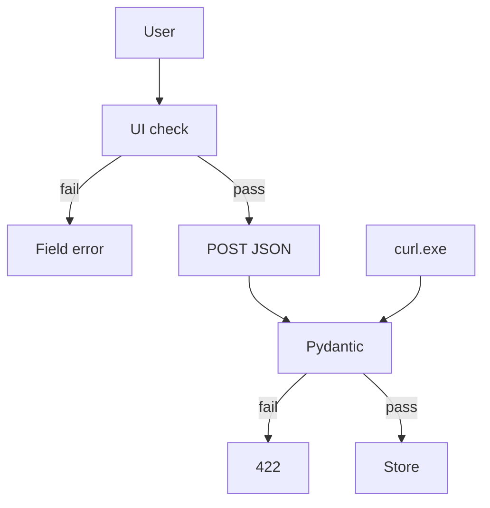

# Month 12 · Week 3 · Day 3
# Implement From Memory: Dual Validation

**Program:** Full-Stack Mastery · 18 months  
**Phase:** 4 — Full-stack application  
**Month index:** [../../README.md](../../README.md)  
**Week 3:** [1](day-01.md) · [2](day-02.md) · Day 3 (today) · [4](day-04.md) · [5](day-05.md) · [6](day-06.md) · [7](day-07.md)  
**Week rhythm today:** Implement from memory  
**Student state:** You have uploads and an email port. Today the **same rule** must live on **both** sides of HTTP — from **this file**. The typed Zod+Pydantic lab is tomorrow; today you **tell the story** and **build a small proof**.  
**Study time:** 3–4 focused hours  
**Prereq:** Day 2 gate passed.

Labs: `~\fullstack-lab\month-12\week-03\day-03\`. Noun: **sign titles** (`title` length). Do not copy Days 1–2 source. Do not paste Project 7.

---

## How Day 3 works

Days 1–2 closed during drills. This recap is the teacher. Stuck > 25 minutes: open only the matching section in this textbook. `lookups.txt`.

No complete app in this file.

---

## How to read this chapter

Browsers and React forms are **courtesy**. FastAPI + Pydantic is **the law**. If you only validate in Zod, `curl.exe` skips the UI and writes garbage. If you only validate in Pydantic, the form is a poor experience — but the data stays honest.

**Dual validation** means: the **same rule** (example: title length 3–40) in **Zod** on the client and **Pydantic** on the server. They can drift. Tomorrow you will type both. Today you must **explain** the drift risk and ship a **minimal** pair: even if Zod is a hand-written `if (title.length)` in the form, Pydantic `Field(min_length=3, max_length=40)` must still refuse.



**Wrong belief:** “Memory day is reread Day 2.”  
**Correct:** recap, then build.

**Wrong belief:** “If the button is disabled, the API is safe.”  
**Correct:** curl, TestClient, another client, a buggy deploy of the SPA — the API still runs.

---

## Complete explanation (validation you must still own)

**Client HTTP.** Typed module. `VITE_API_BASE`. `ApiError`. `unknown` parse. No fetch in pages. Query `useMutation` + `invalidateQueries({ queryKey })`. `isPending` on mutation disables submit. CORS 5173 not `*`.

**UI validation.** React Hook Form + Zod is the course default (Month 7). Today a manual length check is acceptable **if** you still have **Pydantic on the server**. Day 4 will demand Zod **and** Pydantic for the same rule.

**Server.** Pydantic v2 `Field(min_length=3, max_length=40)`. 422 `detail` is a **list** with `loc`. `HTTPException` 400 if you raise by hand. **`model_dump()`**. `response_model` Out.

**curl.exe** POST a 1-character title → **422**. The UI may never allow that click. That is the story.

**Uploads recap.** Multipart ≠ JSON. Never trust filename. Store path. Cap size.

**Email recap.** `send_email` port. Console in dev. No SMTP. No `VITE_` secrets.

**Query v5.** Object API. `gcTime`. `placeholderData: keepPreviousData` if you list with pages.

**Wrong belief:** “I’ll keep the min length only in Zod so the server stays flexible.”  
**Correct:** flexible means **unprotected**. The rule is a **product invariant**. Both sides.

---

## Today's contract

**Today's gate.** Closed-book:

> I can explain why UI validation is courtesy and API validation is law, I refused a short title with Pydantic (curl 422), and I refused it in the UI too — without copying Day 2.

---

## Time box

| Block | Minutes | Work |
|---|---|---|
| A | 20 | Oral |
| B | 40 | Paper: same rule both sides |
| C | 90 | Build spec |
| D | 35 | curl.exe vs UI |
| E | 15 | Lookups |

---

# Block A — Speak first

1. Why curl bypasses Zod.  
2. 422 vs 400 vs 413.  
3. `model_dump()`.  
4. Email port one sentence.  
5. Filename trust.  
6. What dual validation means.

---

# Block B — Paper drills

Write the **same** title rule in:

1. English  
2. A Zod-like sketch (`z.string().min(3).max(40)`)  
3. A Pydantic `Field(...)`  
4. Predict curl body `{"title":"ab"}` status  
5. Predict UI behavior for the same string  

---

# Block C — Spec

```powershell
cd ~\fullstack-lab
mkdir month-12\week-03\day-03 -Force
cd ~\fullstack-lab\month-12\week-03\day-03
```

| Piece | Rule |
|---|---|
| POST `/signs` | 201. `title` 3–40 chars (Pydantic). Out `id`, `title`. |
| GET `/signs` | Envelope or array — document it. |
| CORS | 5173 |
| UI | Cannot submit 2-char title (manual or Zod). Mutation on valid. |
| Prove | curl 422 **and** UI field error |

Email port optional today. Upload optional. **Title rule is required.**

`STORY.md`: ten lines, dual validation, in your words.

---

# Block D — Defect hunt

1. curl short title 422.  
2. UI short title: **no** network POST (or POST never needed).  
3. curl 40-char ok 201; 41-char 422.  
4. Disable UI check temporarily: POST short title still 422. **Re-enable.** That experiment is the lesson. Write `BYPASS.txt`.

---

# Block E — Lookups

```powershell
cd ~\fullstack-lab
git add month-12
git commit -m "Month 12 Day 3: dual validation story for sign titles."
```

---

# Lecture: two locks, one key size

Zod (or a hand check) saves a round trip. Pydantic saves the database. They must **agree**. If Zod says 3 and Pydantic says 1, QA will fight itself. If Zod says 3 and Pydantic says nothing, curl writes `"x"`.

Day 4 you will type both in one lab. Today `STORY.md` + `BYPASS.txt` are the exam.

Uploads still cap size even if the `<input>` has `accept="image/*"` — browsers lie. Same story, files instead of strings.

---

## Definition of done

- [ ] Spoke Block A  
- [ ] Pydantic title 3–40  
- [ ] UI refuses short title  
- [ ] curl 422 evidence  
- [ ] `BYPASS.txt`  
- [ ] Commit  

---

# Worked session — signs

uv Pydantic Field. Vite form. Client JSON. CORS 5173. curl.exe `--data-binary @short.json`. Bypass experiment. No SMTP. No Project 7. `model_dump()`. Query invalidate on 201.

---

## Optional review links

Repair from this recap.

- [Pydantic Fields](https://docs.pydantic.dev/latest/concepts/fields/)
- [Zod](https://zod.dev/)

---

## Tomorrow

**Lab:** Zod on the client **and** Pydantic on the server for the **same** rule, typed, with tests.

---

# Closing lecture — courtesy and law

The form is courtesy. The API is law. Dual validation is both, **aligned**.

curl is the honest attacker-shaped client (you may use it on **your** lab). TestClient is the same idea in pytest.

`isPending` disables double submit. It is not validation.

`VITE_API_BASE` public. No secrets. Filename still untrusted if you added files.

## Recite-back checklist

Write `RECITE.txt`.

- [ ] UI courtesy
- [ ] API law
- [ ] same length rule
- [ ] curl 422
- [ ] bypass still 422
- [ ] model_dump
- [ ] CORS 5173
- [ ] not Project 7

---

# BYPASS.txt is the exam

1. UI: type 2-character title. Submit blocked or field error. Network has **no** POST (or you document why a POST still 422).  
2. `curl.exe` POST `{"title":"ab"}` → **422**.  
3. Temporarily comment out the UI check. POST from the form. API still **422**. Restore the UI check.  

That third step is dual validation as a feeling, not a slogan.

Pydantic: `Field(min_length=3, max_length=40)` plus strip validator so `"  ab"` does not sneak through. Zod tomorrow will `.trim()` in the same order. Write the order in STORY.md today.

**Wrong belief:** “Disabled button is security.”  
**Correct:** curl, TestClient, a second client, a stale SPA. The API is the law.

Uploads: `accept="image/*"` is the same story as Zod. The API still allowlists and caps.

Email: the UI cannot be the mailer. The port is the law.

```powershell
curl.exe -s -D - -X POST http://127.0.0.1:8000/signs -H "Content-Type: application/json" --data-binary @short.json
```

CORS 5173. `model_dump()` on Out. Query invalidate on 201 if you list. No Day 2 copy. `lookups.txt`.

---

# STORY.md outline (ten lines)

1. UI check saves a round trip.  
2. API check saves the database.  
3. They must use the same numbers.  
4. curl is the bypass client for **your** lab.  
5. 422 loc names `title`.  
6. Empty list is not 422.  
7. `accept=` is not a file type law.  
8. Email is not a Vite feature.  
9. `model_dump()` Out.  
10. Query invalidates after a legal 201.

Oral Block A without Day 1–2 files. Paper drills: English, Zod sketch, Field, two predictions.

No complete app in the prompt. You write signs.

---

# Recite-back

- [ ] UI courtesy
- [ ] API law
- [ ] same length numbers
- [ ] curl 422
- [ ] bypass still 422
- [ ] strip order written
- [ ] not Project 7

Day 4 types both Zod and Pydantic. Today STORY.md + BYPASS.txt are required even if Zod is a hand `if`.

---

# Definition of done reminder

Spoke A. Pydantic 3–40. UI refuses short. curl 422. BYPASS.txt. Commit. Signs not ops-web.

---

# Closing card

Windows: `curl.exe`. Vite extra `--`. FastAPI `--host 127.0.0.1`. CORS `http://127.0.0.1:5173` not `*`. `VITE_API_BASE` public. Query v5 object API: `useQuery({ queryKey, queryFn })`, `isPending`, `gcTime` not `cacheTime`. `invalidateQueries({ queryKey })` when you write. Pydantic v2 `model_dump()`. No `fetch` in pages. No Project 7 source dump. Bind 127.0.0.1.

---

# Independent git

```powershell
cd ~\fullstack-lab
git add month-12
git commit -m "Month 12 Day 3: dual validation story."
```

Lookups.txt: none or honest. Days 1–2 closed. Recap was the teacher.
