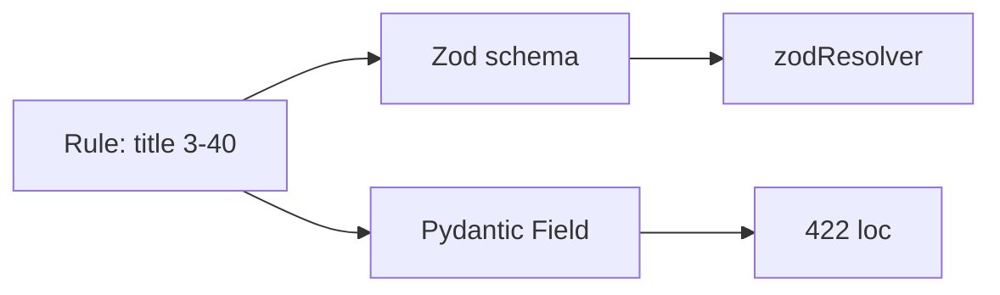
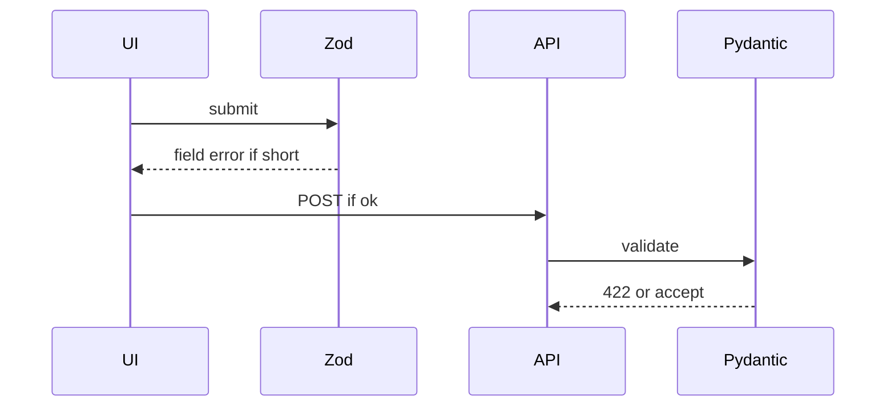
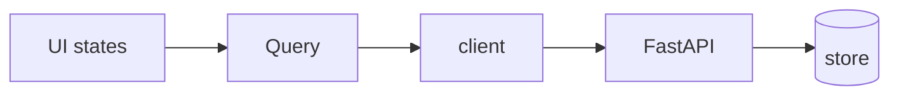

# Month 12 · Week 3 · Day 4
# Lab: Zod and Pydantic for the Same Rule

**Program:** Full-Stack Mastery · 18 months  
**Phase:** 4 — Full-stack application  
**Month index:** [../../README.md](../../README.md)  
**Week 3:** [1](day-01.md) · [2](day-02.md) · [3](day-03.md) · Day 4 (today) · [5](day-05.md) · [6](day-06.md) · [7](day-07.md)  
**Week rhythm today:** Learn + lab feature  
**Student state:** You told the dual-validation story. Today both validators are **typed** and **tested**.  
**Study time:** 3–4 focused hours

Labs: `~\fullstack-lab\month-12\week-03\day-04\`. Noun: **plaque titles**. Rule: **title length 3–40** (trim; empty after trim fails). Not Project 7.

---

## How to use this textbook

1. Read a section. Close it. Say the numbers.
2. Type Zod **and** Pydantic from the same numbers. Do not “approximate.”
3. Tests on **both** sides.
4. Optional review links later.

---

## How to read this chapter

A product invariant is a **number** (or a regex, or an enum). If Zod says `.min(3).max(40)` and Pydantic says `Field(min_length=3, max_length=40)`, curl and the form **agree**. If one is 50 and one is 40, you will ship a form that “cannot” type what the API accepts — or the reverse.



**Wrong belief:** “I’ll generate Pydantic from Zod with a blog script.”  
**Correct:** two declarations, one `RULES.md` that both were copied from. Generation is optional later; **alignment** is today’s skill.

---

## Today's contract

By the end of this day you will be able to:

1. Write **`RULES.md`** with the invariant **before** code.
2. Zod schema + `zodResolver` + RHF (or equivalent) on the form.
3. Pydantic v2 `Field(min_length=3, max_length=40)` on Create.
4. UI: associated field errors (`htmlFor`, `aria-describedby`).
5. API: 422 `detail[0].loc` includes `body` / `title` (assert loc, not a frozen `msg` string).
6. Vitest or RTL: cannot submit 2 chars (or shows error). pytest: 2 chars → 422.
7. Valid 3-char title: UI POST 201 + TestClient 201.

**Today's gate.** Closed-book:

> The same title length lives in RULES.md, Zod, and Pydantic. The UI is courtesy. curl still gets 422. I assert 422 loc. model_dump on Out. Query invalidates on success.

---

## Time box

| Block | Minutes | Work |
|---|---|---|
| A | 45 | Theory |
| B | 60 | RULES.md + both validators |
| C | 70 | Tests both sides |
| D | 20 | Git |
| E | 15 | Recall |

---

# Block A — Theory

## 1. RULES.md first

```markdown
# Plaque title
- Trim whitespace.
- Length after trim: min 3, max 40.
- Required.
```

If you change a number, you change **three** places (doc, Zod, Pydantic) or you changed the product by accident.

---

## 2. Zod

```ts
import { z } from "zod";

export const plaqueTitleSchema = z.object({
  title: z
    .string()
    .trim()
    .min(3, "Title must be at least 3 characters")
    .max(40, "Title must be at most 40 characters"),
});

export type PlaqueCreate = z.infer<typeof plaqueTitleSchema>;
```

RHF:

```ts
useForm<PlaqueCreate>({
  resolver: zodResolver(plaqueTitleSchema),
  defaultValues: { title: "" },
});
```

`noValidate` on the form so the browser does not fight you. Native `minLength` can **also** exist but Zod is the taught client law.

**Wrong belief:** “Zod replaces Pydantic if I use tRPC.”  
**Correct:** this course is REST JSON. Two runtimes, two validators.

---

## 3. Pydantic v2

```python
from pydantic import BaseModel, Field

class PlaqueCreate(BaseModel):
    title: str = Field(min_length=3, max_length=40)

class PlaqueOut(BaseModel):
    id: int
    title: str
```

Strip: `Field(..., min_length=3)` does not trim unless you add a validator. Align with Zod `.trim()`:

```python
from pydantic import field_validator

@field_validator("title")
@classmethod
def strip_title(cls, v: str) -> str:
    return v.strip()
```

Order: strip **then** length. If you length-check before strip, `"  ab"` might pass min=3 on the server and fail in Zod. **That is drift.** Fix it. Write the order in RULES.md.

`model_dump()` for serialization. `response_model=PlaqueOut`.

---

## 4. 422 loc

```python
def test_short_title_422() -> None:
    r = client.post("/plaques", json={"title": "ab"})
    assert r.status_code == 422
    loc = r.json()["detail"][0]["loc"]
    assert "title" in loc
```

Do not assert the exact English `msg` — Pydantic wording can change. **loc** is the contract.

UI: `aria-invalid` + error id. Tests `findByText(/at least 3/i)`.

---

## 5. Query

```ts
useMutation({
  mutationFn: api.createPlaque,
  onSuccess: () => queryClient.invalidateQueries({ queryKey: ["plaques"] }),
});
```

Do not `reset()` on 422. Mutation `isPending` disables submit.

---

## 6. Security start

- Server still refuses.  
- Do not trust `maxLength` in HTML alone.  
- Error messages should not include other users’ titles.

---

# Block B — Type-along

```powershell
cd ~\fullstack-lab
mkdir month-12\week-03\day-04 -Force
cd ~\fullstack-lab\month-12\week-03\day-04
```

`RULES.md` first. Then API. Then Vite form with Zod + RHF. CORS 5173. Client JSON. `VITE_API_BASE`.

Prove: UI 2 chars — no 201. curl 2 chars — 422. UI `"Hey"` — 201. curl `"Hey"` — 201.

---

# Block C — Independent

pytest 422 loc + 201. RTL or Vitest Zod parse of `"ab"` fails **without** network (unit) **and** one form test if you can.

Write `ALIGN.md`: strip order; the three places the number 40 lives.

```powershell
cd ~\fullstack-lab
git add month-12
git commit -m "Month 12 Week 3 Day 4: Zod and Pydantic title 3-40."
```

---

# Block E — Recall

1. Why loc not msg.  
2. Strip order.  
3. Why RULES.md exists.  
4. reset() on 422.  
5. Courtesy vs law.

---

## Office hours — defects you will hit

**Zod min 3, Pydantic no max.** curl 10_000 char title 201. Add max.

**HTML `maxLength={40}` only.** curl bypass. Pydantic.

**`z.string().min(3)` without trim.** Spaces count. Align strip.

**422 test asserts `msg == "ensure this value has at least 3 characters"`.** Brittle. loc.

**`any` on form values.** `z.infer`.



---

## Definition of done

- [ ] RULES.md first  
- [ ] Zod + Pydantic same 3–40 + trim  
- [ ] 422 loc test  
- [ ] UI field error  
- [ ] 201 happy path both sides  
- [ ] ALIGN.md  
- [ ] Commit exists  

---

## Optional review links

- [Zod](https://zod.dev/)
- [react-hook-form resolvers](https://github.com/react-hook-form/resolvers)
- [Pydantic validators](https://docs.pydantic.dev/latest/concepts/validators/)

---

## Tomorrow

**Docs:** what the UI validates vs what the API must **still refuse** (including uploads, ids, auth preview).

---

# Worked session — three forties

RULES.md: 3 and 40. Zod trim min max. Pydantic strip validator then Field. Tests loc. RHF zodResolver. Query invalidate. CORS 5173. curl.exe short.json.

No generation script required. No SMTP. No Project 7 dump. `gcTime` unused today. Object `useMutation`.

---

# Closing lecture — one invariant, two runtimes

JavaScript and Python will not share a class. They can share a **markdown number**. That is dual validation as engineering, not as magic.

The form is allowed to be nicer (instant errors). The API is not allowed to be weaker.

`model_dump()`. `ApiError` 422 in the client can `setError` on the field (Month 7). Optional today if RTL already sees Zod errors.

Day 5 you will write the **doc** that survives a new teammate who wants to “just disable the button.”

---

# Three places the number 40 lives

1. `RULES.md`  
2. Zod `.max(40)` after `.trim()`  
3. Pydantic `Field(max_length=40)` after strip validator  

Change one, fail the product. `ALIGN.md` lists all three.

```ts
export const plaqueTitleSchema = z.object({
  title: z.string().trim().min(3).max(40),
});
```

```python
class PlaqueCreate(BaseModel):
    title: str = Field(min_length=3, max_length=40)

    @field_validator("title")
    @classmethod
    def strip_title(cls, v: str) -> str:
        return v.strip()
```

pytest: `assert "title" in r.json()["detail"][0]["loc"]`. Do not freeze `msg`.

RHF `zodResolver`. `noValidate`. Associated errors. Mutation `isPending` disables submit. Do not `reset()` on 422. `invalidateQueries({ queryKey: ["plaques"] })` on 201.

**Wrong belief:** “HTML maxLength is dual validation.”  
**Correct:** curl ignores it. Pydantic is the twin.

curl 3-char 201. curl 41-char 422. UI `"ab"` field error.

`useMutation({ mutationFn })` object API. CORS 5173. `VITE_API_BASE`. No `any` on form values — `z.infer`.

---

# Accessible field (do not skip)

```tsx
<label htmlFor="title">Title</label>
<input id="title" aria-invalid={!!errors.title} aria-describedby="title-err" {...register("title")} />
<p id="title-err">{errors.title?.message}</p>
```

RTL can `getByLabelText(/title/i)` and `findByText(/at least 3/i)`.

`handleSubmit` → `mutate`. 201 → invalidate `["plaques"]`. 422 from server → optional `setError` if the UI check was bypassed.

RULES.md first commit if you can. Then red tests. Then green.

Strip `"  hi"` → `"hi"` length 2 → fail both sides. Write that case in ALIGN.md.

---

# Recite-back

- [ ] RULES.md first
- [ ] Zod trim min max
- [ ] Pydantic strip then Field
- [ ] 422 loc not msg
- [ ] RHF zodResolver
- [ ] invalidate on 201
- [ ] ALIGN.md three forties

`z.infer` for form types. No `any`. CORS 5173. `model_dump()` Out. Mutation object API.

---

# Tomorrow reminder

Docs: VALIDATION.md courtesy vs must-refuse. Two proofs. Drift hunt. Then independent upload XOR email-port.

`uv run pytest -q` 422 loc + 201. UI test or Zod unit for `"ab"`. RULES.md numbers match. Strip `"  ab"` fails. CORS 5173. `VITE_API_BASE`. No generation script required.

---

# Closing card

Windows: `curl.exe`. Vite: `npm create vite@latest name -- --template react-ts`. Router: `npm install react-router` and import from `"react-router"`. FastAPI `--host 127.0.0.1 --port 8000`. CORS `allow_origins=["http://127.0.0.1:5173"]` not `*`. `VITE_API_BASE` in `.env` — no secrets. Query v5: `useQuery({ queryKey, queryFn })`, `useMutation({ mutationFn })`, `isPending` first load, `gcTime` not `cacheTime`, `placeholderData: keepPreviousData` when paging, `invalidateQueries({ queryKey })` after writes. Pydantic v2 `model_dump()`. JSON `unknown` then DTO. No `any`. No `fetch` in components. No Project 7 dump.


