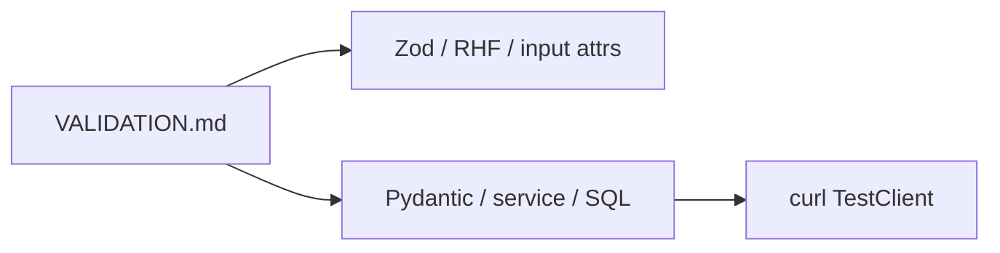
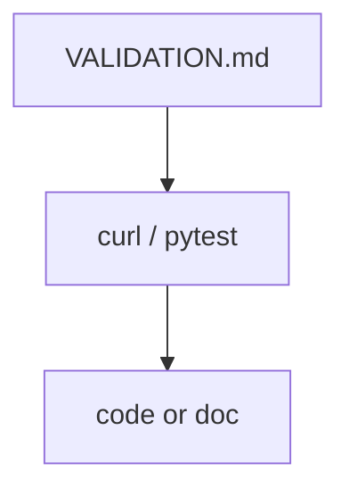

# Month 12 · Week 3 · Day 5
# Docs: What the UI Validates vs What the API Must Refuse

**Program:** Full-Stack Mastery · 18 months  
**Phase:** 4 — Full-stack application  
**Month index:** [../../README.md](../../README.md)  
**Week 3:** [1](day-01.md) · [2](day-02.md) · [3](day-03.md) · [4](day-04.md) · Day 5 (today) · [6](day-06.md) · [7](day-07.md)  
**Week rhythm today:** Tests + documentation  
**Student state:** Zod and Pydantic share a title rule. Today you write the **map** a teammate can use: UI checks vs **server must-refuse**.  
**Study time:** 3–4 focused hours

Labs: `~\fullstack-lab\month-12\week-03\day-05\`. You may document the Day 4 plaques app **or** your product. The **markdown is the deliverable**; tests prove two rows of the table. No Project 7 source dump.

---

## How to use this textbook

1. Read a section. Close it. Say it.
2. Write `VALIDATION.md` as a table, not a slogan.
3. Prove two “API still refuses” rows with curl.exe or TestClient.
4. Optional review links later.

---

## How to read this chapter

If it is not written, the next intern will delete the Pydantic `max_length` because “the form already has `maxLength`.” Your job is a **table** with columns: **Rule**, **UI**, **API**, **Bypass client**, **Status**.



**Wrong belief:** “CONTRACT.md already lists fields; we are done.”  
**Correct:** CONTRACT says shapes and statuses. This doc says **which layer is allowed to be the only check** (answer: **none** for invariants).

**Wrong belief:** “I’ll hide the delete button; that is authorization.”  
**Correct:** Month 13. Preview row today: API must 401/403 later; UI hide is courtesy. Do not implement a full auth product today.

---

## Today's contract

By the end of this day you will be able to:

1. Write **`VALIDATION.md`** covering: string length, empty list vs error, upload size/type/filename, email-not-from-browser, filter params, pagination cap, unique 409.
2. Mark each row **courtesy** vs **must-refuse**.
3. Prove **two** must-refuse rows with automated tests or `CURL.txt`.
4. Explain 422 vs 400 vs 409 vs 413 vs 404 in one table.
5. Keep dual title rule aligned (fix drift if you find it).

**Today's gate.** Closed-book:

> Invariants are enforced on the API. The UI may repeat them. I have a table and two bypass proofs. Uploads still ignore filename. Email is a server port. CORS is not one of the validators.

---

## Time box

| Block | Minutes | Work |
|---|---|---|
| A | 45 | Theory + status table |
| B | 65 | Write VALIDATION.md |
| C | 70 | Two proofs + drift hunt |
| D | 20 | Git |
| E | 15 | Recall |

---

# Block A — Theory

## 1. Courtesy vs must-refuse

| Kind | Example | If missing |
|---|---|---|
| **Courtesy** | Zod min 3; `type="email"`; disable submit while `isPending` | Extra 422s, worse UX |
| **Must-refuse** | Pydantic min 3; UploadFile size; unknown `sort=` column; missing id 404 | Bad data or crash or leak |

Courtesy **without** must-refuse is a hole. Must-refuse **without** courtesy is a grumpy but **correct** API. This course wants both for the **same** user-facing rules.

---

## 2. Status cheat sheet (keep honest)

| Status | Typical meaning this month |
|---|---|
| 200 | List/detail/patch success; **empty list is 200** |
| 201 | Created |
| 204 | Deleted, no body |
| 400 | You rejected (type not allowed) |
| 401/403 | Authz — Week 4 sketch / Month 13 |
| 404 | Missing resource (`HTTPException`) |
| 409 | Unique conflict |
| 413 | File too large |
| 422 | Schema (Pydantic `detail` list) |

Do not send 200 `{ok:false}`.

---

## 3. Rows your VALIDATION.md must include

Copy this shape; fill **your** noun:

1. **Title length 3–40** — UI Zod; API Pydantic; bypass curl; 422.  
2. **Trim** — both; bypass spaces; 422 or success after strip (say which).  
3. **Unknown JSON fields** — API ignore or forbid (Pydantic default ignore extra in v2 model config — **say yours**).  
4. **Pagination `limit` cap** — UI may offer 10/20; API clamps or 422. Bypass `limit=999999`.  
5. **Sort whitelist** — UI dropdown; API rejects `sort=password_hash`.  
6. **Upload size** — input may not know; API 413.  
7. **Upload type** — `accept=` courtesy; API 400.  
8. **Filename** — UI shows name; API **must not** use as path.  
9. **Email** — no UI SMTP; API port only. Bypass: there is no client email API.  
10. **Filter `q`** — UI search box; API parameterized query, **never** string-built SQL.  
11. **Delete** — UI confirm dialog courtesy; API still requires the id and (later) auth.  
12. **CORS** — not validation of the body. Separate. Origin 5173.

---

## 4. Tests as documentation

A sentence in markdown without curl is a wish. Pick:

- `test_limit_cap` or 422 on huge limit  
- `test_upload_rejects_extension` / content-type  
- title 422 loc from Day 4 rerun  

---

## 5. Security start

- Sort/filter whitelist is **security** (information disclosure + SQL).  
- Filename is **security**.  
- Auth rows are **preview** — do not dump a login product.

---

# Block B — Type-along

```powershell
cd ~\fullstack-lab
mkdir month-12\week-03\day-05 -Force
cd ~\fullstack-lab\month-12\week-03\day-05
```

Write `VALIDATION.md` (full table). If you reference Day 4 code, say the path. Do not paste ops-web.

Write `STATUS.md`: the cheat sheet in your words.

---

# Block C — Independent

1. Two proofs in `PROOFS.txt` (commands + statuses).  
2. Drift hunt: compare Zod and Pydantic numbers; fix or record `DRIFT.md`.  
3. Optional TestClient for `limit=999999`.

```powershell
cd ~\fullstack-lab
git add month-12
git commit -m "Month 12 Week 3 Day 5: VALIDATION.md courtesy vs must-refuse."
```

---

# Block E — Recall

1. Courtesy vs must-refuse.  
2. Why `accept=` is not enough.  
3. Why sort whitelist is API.  
4. 413 vs 422.  
5. Why CORS is not in the title-length row.

---

## Office hours — docs that lie

**Table says API refuses `limit=999999` but code does not clamp.** The doc is a bug. Fix code or doc.

**“UI validates everything.”** curl row empty. Add bypass.

**Auth claimed done.** Week 4 is concepts. Do not fake 401 on every route without a design.



---

## Definition of done

- [ ] VALIDATION.md has the required row kinds  
- [ ] Two bypass proofs  
- [ ] Status cheat sheet  
- [ ] Drift checked  
- [ ] Commit exists  

---

## Optional review links

- [OWASP Input Validation](https://cheatsheetseries.owasp.org/cheatsheets/Input_Validation_Cheat_Sheet.html) (concepts, not exploits)
- [FastAPI path operation configuration](https://fastapi.tiangolo.com/tutorial/path-operation-configuration/)

---

## Tomorrow

**Independent:** one **upload** **or** one **email port** in **your** app (not both required). Spec envelope.

---

# Worked session — table then two curls

VALIDATION.md. curl short title. curl huge limit or bad upload. Align Zod/Pydantic. STATUS.md. No Project 7 dump. No SMTP. No attack payloads — **your** lab only.

---

# Closing lecture — documentation is how dual validation survives

Zod and Pydantic drift in silence. A table with a bypass column does not.

The UI may validate more (password strength meter later). The API may refuse more (quota, virus scan). The **shared** invariants must appear twice.

Filename, sort, limit, and authz are the rows people forget because the happy path form never sends them. curl remembers.

Month 13 will add rows for CSRF and ownership. Leave a blank **Authz** row as “must-refuse, not implemented this week” if honest.
