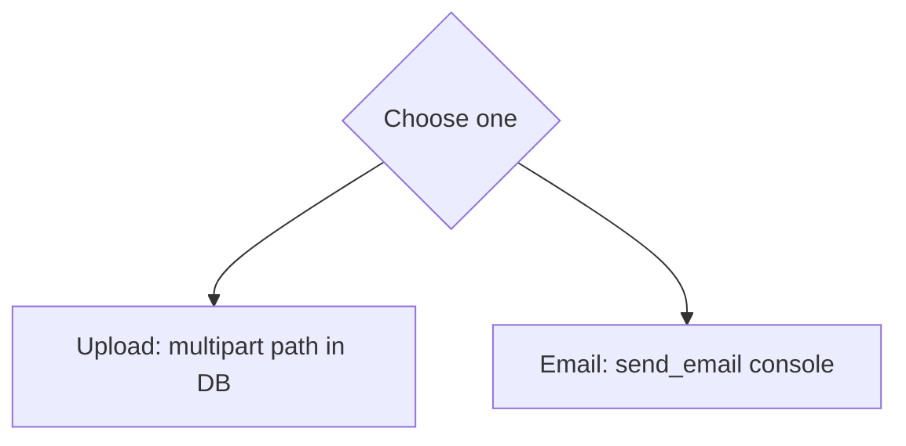
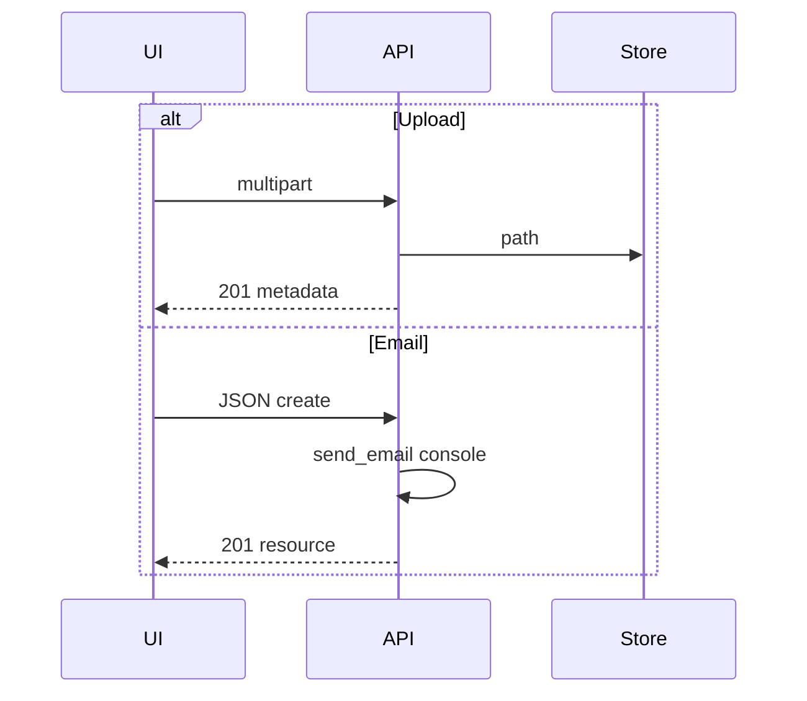

# Month 12 · Week 3 · Day 6
# Independent: One Upload or One Email Port in Your App

**Program:** Full-Stack Mastery · 18 months  
**Phase:** 4 — Full-stack application  
**Month index:** [../../README.md](../../README.md)  
**Week 3:** [1](day-01.md) · [2](day-02.md) · [3](day-03.md) · [4](day-04.md) · [5](day-05.md) · Day 6 (today) · [7](day-07.md)  
**Week rhythm today:** Independent implementation  
**Student state:** You have lab uploads, a lab email port, and dual validation docs. Today **one** of those capabilities lands in **your** product (6B / ops / Project 7 start).  
**Study time:** 3–4 focused hours

This textbook will **not** give you product source. Choose **upload XOR email-port** (one). Depth beats both half-done.

Notes: `~\fullstack-lab\month-12\week-03\day-06\`. Code in **your** repos.

---

## How to use this textbook

1. Envelope first.  
2. Type the feature.  
3. Tests part of the day.  
4. Optional links later.

---

## How to read this chapter

Week 3’s independent skill is not “I uploaded a jpeg in fullstack-lab.” It is “**my** domain has either a **safe file pointer** or a **swappable notify port**.”



**Wrong belief:** “I’ll do both so the week looks full.”  
**Correct:** one complete path with VALIDATION rows and a test.

**Wrong belief:** “I’ll store bytes in Postgres to ship faster.”  
**Correct:** store **path** (or skip files and do email).

---

## Today's contract

Pick **A or B**.

### A — Upload

1. Multipart endpoint on **your** API.  
2. Size cap + type allowlist.  
3. Disk name **you** generate.  
4. Column/field `file_path` (not bytes).  
5. Client `FormData`; no JSON Content-Type on that fetch.  
6. `invalidateQueries({ queryKey })` after 201.  
7. curl.exe `-F` evidence.

### B — Email port

1. `EmailSender` protocol in **your** API.  
2. Console backend in dev.  
3. `Depends` (or service arg).  
4. Memory backend test: create (or notify) **calls** `send_email`.  
5. No SMTP. No `VITE_` mail secrets.  
6. UI does not send mail; it creates a resource or clicks “notify” that hits **your** API.

**Today's gate.** Closed-book:

> I shipped one: safe upload paths or a console email port, with a test, in my repo. I did not paste a SaaS snippet. I did not allow CORS `*`.

---

## Time box

| Block | Minutes | Work |
|---|---|---|
| A | 25 | Choose + CONTRACT.md |
| B | 40 | Red test |
| C | 90 | Implement |
| D | 30 | Evidence |
| E | 15 | Recall |

---

# Block A — Envelope

`~\fullstack-lab\month-12\week-03\day-06\CONTRACT.md`:

- Choice A or B  
- Paths, statuses, DTO fields  
- Security: filename / no SMTP  
- queryKey if UI  
- CORS 5173  
- Dual validation note if the form has a title field  

**Forbidden:** Gmail app passwords; `allow_origins=["*"]`; `file.filename` as path; bytea as the taught store; todo uploads of random memes as the **product** domain (use **your** noun).

Lab fallback only with `BLOCKED.md`.

---

# Complete explanation (keep open; other days closed)

**Upload.** Multipart. `UploadFile`. Cap. Allowlist. uuid name. Path in DB. gitignore uploads. 413/400. FormData. Query invalidate. Never trust filename. Magic bytes optional note.

**Email.** Protocol `send_email`. Console. Memory + `dependency_overrides`. Clear overrides. 201 is the resource. BackgroundTasks optional, not a queue.

**Client.** Split JSON vs FormData helpers. `VITE_API_BASE`. `ApiError`. Object Query APIs.

**Validation.** UI courtesy. API law. Title 3–40 if present: Zod + Pydantic.

**Windows.** `curl.exe -F` for A; `curl.exe -H Content-Type application/json` for B.

**Pydantic.** `model_dump()`.



---

# Block B — Red first

A: TestClient `files=` oversize or bad type.  
B: TestClient create with memory sender empty — test expects one message (fails until wired).

`RED.txt`.

---

# Block C — Implement

Stay in **your** layout (routers, services). Do not copy lab `main.py` into ops-api as a blob. Adapt the **ideas**.

If Postgres: Alembic for `file_path` column if you choose A — that is a real vertical slice. If you cannot migrate today, `BLOCKED.md` + lab A is honest **and** you still must not claim the month gate for files.

---

# Block D — Manual

A:

```powershell
curl.exe -s -D - -X POST http://127.0.0.1:8000/YOUR -F "title=x" -F "file=@.\tiny.jpg"
```

B: POST JSON; watch Uvicorn print `=== DEV EMAIL ===`.

`EVIDENCE.md`. gitignore binaries.

---

# Block E — Recall

1. Why only one feature.  
2. Path vs bytes.  
3. Port vs SMTP.  
4. Why Vite cannot email.

## Quality bar

A classmate can hit the endpoint from CONTRACT.md. Tests green. VALIDATION-style two lines in the envelope (courtesy vs refuse).

Do not add OAuth. Do not add a toast library as the only work.

---

```powershell
cd ~\fullstack-lab
git add month-12\week-03\day-06
git commit -m "Month 12 Day 6: upload or email-port envelope and evidence."
```

Product repo: own commit.

---

## Definition of done

- [ ] CONTRACT first, A or B  
- [ ] Feature in **your** API  
- [ ] One automated test  
- [ ] Evidence curl or console  
- [ ] No SMTP secrets; no trusted filename  
- [ ] CORS 5173  

---

## Optional review links

Days 1–5 of this week.

---

## Tomorrow

**Week 3 review.** Mini-build. Debug. Then Week 4 auth concepts, tests, Project 7 start, month exam.
