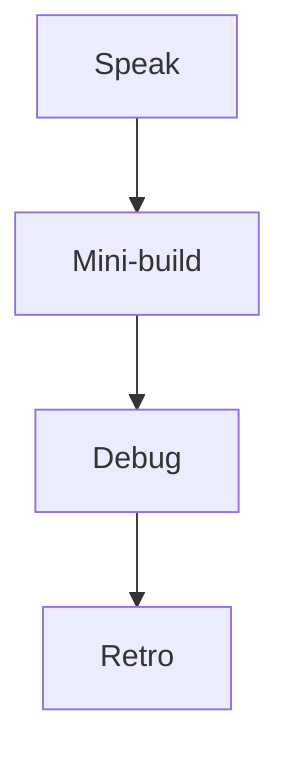

# Month 12 · Week 3 · Day 7
# Week Review — Uploads, Ports, and Dual Validation

**Program:** Full-Stack Mastery · 18 months  
**Phase:** 4 — Full-stack application  
**Month index:** [../../README.md](../../README.md)  
**Week 3:** [1](day-01.md) · [2](day-02.md) · [3](day-03.md) · [4](day-04.md) · [5](day-05.md) · [6](day-06.md) · Day 7 (today)  
**Week rhythm today:** Review, repair, plan Week 4  
**Student state:** You uploaded or notified, and you aligned Zod with Pydantic. Today that lives in your head — from **this file**.  
**Study time:** 3–4 focused hours

Do not start Week 4 because the calendar moved. Auth sketches on an API that still trusts filenames are two problems.

Work in `~\fullstack-lab\month-12\week-03\day-07\`. Not ops-web.

---

## How to read this chapter

Closed-book teaching day.



Days 1–6 closed during mini-build.

---

## Week synthesis (the lesson, in this book)

**Multipart ≠ JSON.** `FormData` in the browser. Do not set `Content-Type` by hand. FastAPI `UploadFile`. Cap size (**413**). Allowlist type (**400**). **Never trust `filename`** — uuid + your extension. Store **`file_path`**, not bytes, in Postgres/dict. Query caches **metadata**; invalidate `["photos"]` after 201. `curl.exe -F`.

**Email is a port.** `send_email(to, subject, body)`. Console in dev. Memory in tests. `Depends` + `dependency_overrides.clear()`. No SMTP required. No `VITE_` mail secrets. UI creates resources; server notifies. BackgroundTasks ≠ queue.

**Dual validation.** Same invariant in **RULES.md**, **Zod**, **Pydantic**. UI courtesy; API law. Trim order aligned. 422 **loc**, not frozen `msg`. curl bypass still 422. `VALIDATION.md` courtesy vs must-refuse: limit cap, sort whitelist, filename, sort/filter SQL binds.

**Still true.** Client-only fetch. `VITE_API_BASE` public. CORS `http://127.0.0.1:5173` not `*`. Query v5 object API: `useQuery({ queryKey, queryFn })`, `useMutation({ mutationFn })`, `invalidateQueries({ queryKey })`, `isPending`, `gcTime` not `cacheTime`, `placeholderData: keepPreviousData`. `model_dump()`. Vite extra `--`. `react-router` from `"react-router"`.

**Wrong belief:** “`accept=image/*` is enough.”  
**Correct:** API must-refuse type.

**Wrong belief:** “Console email is fake so skip the protocol.”  
**Correct:** the protocol is the production seam.

---

## Today's contract

**Today's gate.** Closed-book:

> I can teach multipart vs JSON, untrusted filenames, path-not-bytes, email port, and dual validation, and I built a mini from this spec.

---

## Time box

| Block | Minutes | Work |
|---|---|---|
| 1 | 40 | Speak |
| 2 | 55 | Mini `badges` |
| 3 | 30 | Debug A–F |
| 4 | 20 | Review Day 6 CONTRACT |
| 5 | 20 | Re-run tests |
| 6 | 20 | Design: courtesy vs law |
| 7 | 20 | Retro + Week 4 |

---

# Complete explanation — unpacking

## 1. Two body types

JSON create: `application/json`. File create: multipart. One `request()` helper that always sets JSON **breaks** uploads. Branch.

## 2. Two validators

Numbers in three places. Drift is a bug.

## 3. Two backends for mail

Console vs memory. Future SMTP implements the same method.

---

# Block 1 — Speak

Cover: FormData header trap; filename; path vs bytea; 413; port; 422 loc; VALIDATION table; Query invalidate.

`exam-01.md`.

---

# Block 2 — Mini-build

```powershell
cd ~\fullstack-lab
mkdir month-12\week-03\day-07\mini -Force
cd ~\fullstack-lab\month-12\week-03\day-07\mini
```

**Spec: conference badges** — not Project 7.

| Piece | Rules |
|---|---|
| POST `/badges` JSON | `title` 3–40 Pydantic. 201. |
| Optional | Multipart photo **or** console email on create — **one** extra, not both required |
| GET list | Envelope |
| CORS | 5173 |
| Web | Zod same 3–40. Mutation + invalidate `["badges"]`. |
| Tests | pytest 422 loc; optional MemoryEmail or upload 413 |

`RULES.md` with 3–40.

---

# Block 3 — Debug

`exam-03-debug.md`:

**A.** fetch FormData with `headers: { "Content-Type": "application/json" }`.  
**B.** `open(UPLOAD / file.filename)`.  
**C.** Zod max 40, Pydantic no max.  
**D.** SMTP password in `.env` as `VITE_SMTP_PASSWORD`.  
**E.** 422 test asserts exact `msg` string; Pydantic upgrade fails CI.  
**F.** Empty list shown as error because `!data.items.length` combined with `isError`.

---

# Block 4 — Day 6 MATCH.txt

---

# Block 5 — Break 422 test; restore.

---

# Block 6 — `design.md`: three rows courtesy vs must-refuse.

---

# Block 7 — `retro.md`. Week 4 is **auth concepts** + integration tests + Project 7 start. Not a complete IdP.

## Debug keys

**A.** Boundary missing; FastAPI cannot parse. Leave Content-Type unset.

**B.** Path traversal / overwrite. uuid names.

**C.** curl long title 201. Align Field max_length=40.

**D.** Public bundle leak. Email is server port; no VITE secrets.

**E.** Assert `loc`.

**F.** Empty is success. `isError` is throw.

---

```powershell
cd ~\fullstack-lab
git add month-12
git commit -m "Month 12 Week 3 review: badges mini and validation debug."
```

---

# Lecture: the API is the last lock

Every courtesy control has a twin that curl can walk around. Uploads, query params, and titles all work that way.

The email port keeps vendors out of route functions. Console is not embarrassment.

Mini is badges in fullstack-lab.

---

## Definition of done

- [ ] exam-01.md  
- [ ] Mini 3–40 both sides  
- [ ] Debug A–F  
- [ ] design.md  
- [ ] Retro  

---

# Worked session — badges

RULES.md. Pydantic Field + strip. Zod trim min max. CORS 5173. Client JSON. Optional one of: UploadFile or ConsoleEmail. pytest loc. Vite extra `--`. Object useMutation. invalidateQueries. curl.exe short title.

No `*`. No Gmail. No Project 7. `model_dump()`.

---

## Optional review links

Repair from this synthesis.

- [Request files](https://fastapi.tiangolo.com/tutorial/request-files/)
- [Zod](https://zod.dev/)

---

## Next week

[Week 4 Day 1 — Auth implementation concepts](../week-04/day-01.md) connecting to [Month 13](../../month-13/README.md). Session cookie **or** token — you choose and justify. Defense only. No attack payloads. No complete auth product dump.

---

# Closing lecture — files, ports, numbers

Files: multipart, untrusted names, paths. Ports: send_email, console, tests. Numbers: 3–40 in three places.

Query still schedules. CORS still 5173. Env still public-only on the client.

If retro wants JWT tonight, wait for Day 1’s **choice**, not a tutorial paste.

## Recite-back checklist

Write `RECITE.txt`.

- [ ] FormData no JSON header
- [ ] filename discarded
- [ ] path not bytes
- [ ] send_email port
- [ ] Zod + Pydantic aligned
- [ ] 422 loc
- [ ] courtesy vs law
- [ ] mini not ops-web

---

# Badges mini plus one extra

Required: JSON POST `/badges` title 3–40 both sides, GET list, CORS 5173, Query mutation + invalidate `["badges"]`, pytest 422 loc.

Optional extra (one): multipart photo **or** console email — not both required.

Debug after you write A–F:

**A** FormData + JSON Content-Type → boundary gone  
**B** `file.filename` as path → traversal/overwrite  
**C** Zod 40 Pydantic unlimited → curl long title 201  
**D** `VITE_SMTP_PASSWORD` → public secret  
**E** assert exact 422 `msg` → brittle  
**F** empty list as error → empty is success  

**Wrong belief:** “Week 4 is copy-paste JWT.”  
**Correct:** Week 4 is a **choice** (cookie vs token) and a sketch. Finish badges first.

`RULES.md` 3–40. Strip order aligned. `model_dump()`. `curl.exe` short title. Vite extra `--`. Object `useMutation`. `isPending` on the button. `gcTime` unused but named in retro.

design.md: three courtesy vs must-refuse rows (title, filename or limit, email-not-from-browser).

---

# exam-01.md must include

Multipart vs JSON; untrusted filename; path not bytes; send_email port; RULES+Zod+Pydantic; 422 loc; courtesy vs law; Query object invalidate; CORS 5173; VITE public.

Mini badges. Debug A–F written **before** you peek keys. Retro: Week 4 is a sketch not an IdP.

If Zod and Pydantic still disagree on 40, repair today. Dual validation is the week.

---

# Recite-back

- [ ] FormData no JSON header
- [ ] filename discarded
- [ ] path not bytes
- [ ] send_email port
- [ ] Zod + Pydantic aligned
- [ ] 422 loc
- [ ] mini not ops-web

Week 4 Day 1: cookie or token, justify, HttpOnly sketch, Month 13 link. No JWT paste.

---

# Next week

[Week 4 Day 1](../week-04/day-01.md) — auth concepts, cookie or token, HttpOnly sketch, [Month 13](../../month-13/README.md). Defense only.

---

# Closing card

Windows: `curl.exe`. Vite extra `--`. FastAPI `--host 127.0.0.1`. CORS `http://127.0.0.1:5173` not `*`. `VITE_API_BASE` public. Query v5 object API: `useQuery({ queryKey, queryFn })`, `isPending`, `gcTime` not `cacheTime`. `invalidateQueries({ queryKey })` when you write. Pydantic v2 `model_dump()`. No `fetch` in pages. No Project 7 source dump. Bind 127.0.0.1.

---

# Review git

```powershell
cd ~\fullstack-lab
git add month-12
git commit -m "Month 12 Week 3 review: badges mini."
```
