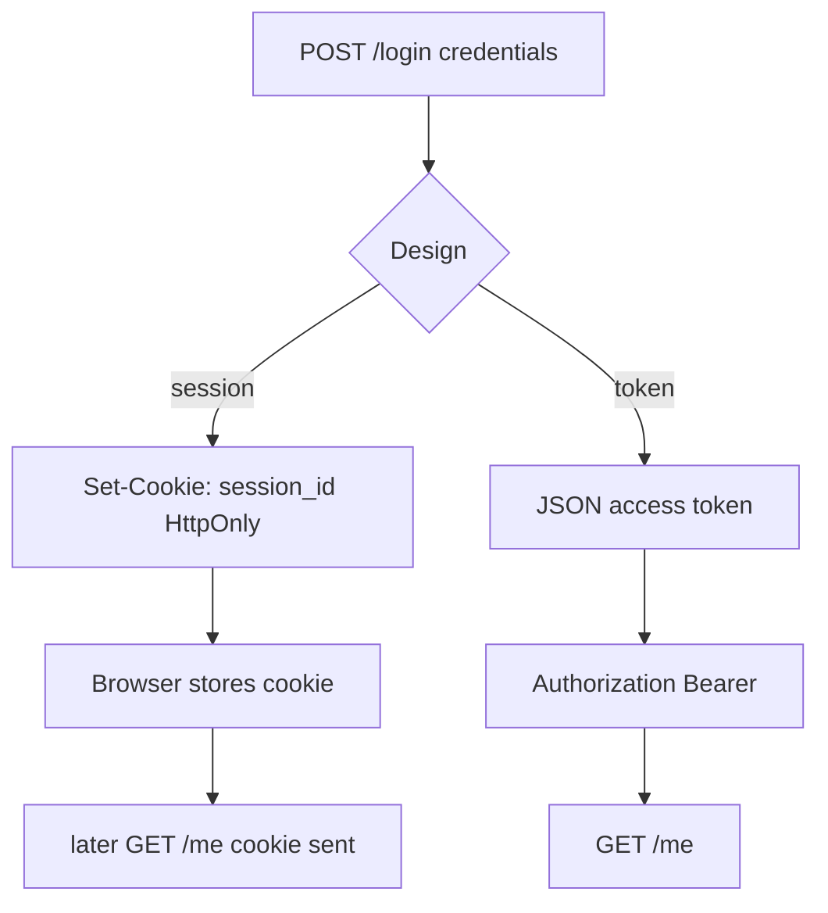
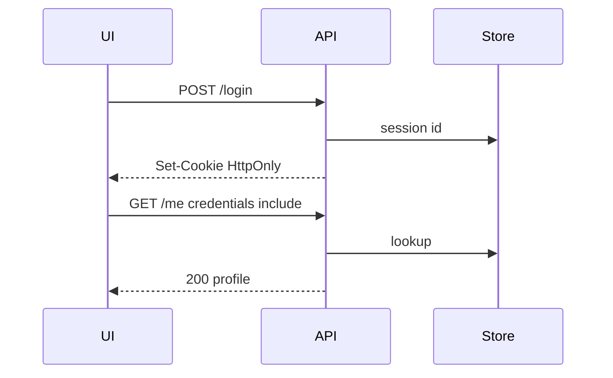

# Month 12 · Week 4 · Day 1
# Auth Concepts: Cookie or Token — Choose and Justify

**Program:** Full-Stack Mastery · 18 months  
**Phase:** 4 — Full-stack application  
**Month index:** [../../README.md](../../README.md)  
**Week 4:** Day 1 (today) · [2](day-02.md) · [3](day-03.md) · [4](day-04.md) · [5](day-05.md) · [6](day-06.md) · [7](day-07.md)  
**Week rhythm today:** Learn + type-along (sketch, not a product dump)  
**Student state:** Month 12 Weeks 1–3 join UI to API. Today you connect that join to **who someone is** — as **concepts and a thin sketch** — so [Month 13](../../../month-13/README.md) is not a surprise. You will **not** ship a complete login product from this file.  
**Study time:** 3–4 focused hours

**This week covers:** basic auth implementation concepts, integration tests, happy path, Project 7 start, month exam.

Today: **session cookie OR token** — you **choose and justify**. **HttpOnly cookie sketch**. Defense only. No attack payloads. No JWT-as-religion.

Labs: `~\fullstack-lab\month-12\week-04\day-01\`. Sketch app only. Do not paste Project 7 auth.

---

## How to use this textbook

1. Read a section. Close it. Say it.
2. Type a **minimal** sketch: login sets a cookie **or** returns a token you store **without** `localStorage` as the default sermon — you will **write why**.
3. Do not follow a “JWT full stack” tutorial. Do not copy exploit snippets from the internet.
4. Optional review links later — defensive docs.

---

## How to read this chapter

Authentication answers **who is this request?** Authorization (Month 13) answers **may they do this?** Hiding a button in React is **not** authorization. The API must refuse.

For a **first-party browser app** (Vite on 5173, FastAPI on 8000), a **server-managed session** in an **HttpOnly** cookie is often **simpler** than access/refresh JWTs. Tokens are a tool for APIs consumed by many clients, mobile apps, or third parties. You may still choose tokens. You must **write the reason**.



**Wrong belief:** “JWT is how modern apps authenticate.”  
**Correct:** JWT is **one** design. Month 13 will teach trade-offs. Today you pick a **sketch** and justify it.

**Wrong belief:** “I’ll put the access token in `localStorage` because Redux tutorials did.”  
**Correct:** JavaScript that can read the token can send it anywhere if XSS exists. **HttpOnly** cookies are **not readable** by page JS. That is the sketch’s point — not an exploit recipe.

This book describes what you **build to stop** unauthorized use. It does not provide payloads, exploit programs, or intrusion steps.

---

## Today's contract

By the end of this day you will be able to:

1. Define **authentication** vs **authorization** in one sentence each.
2. Choose **session cookie** or **token** for Project 7’s **browser** UI and write **`JUSTIFY.md`**.
3. Sketch **HttpOnly**, **Secure**, **SameSite** — what each is **for** (defense).
4. Explain why **`credentials: "include"`** and CORS **`allow_credentials=True`** require an **explicit origin**, never `*`.
5. Implement a **lab-only** login that sets a **dummy** HttpOnly cookie **or** returns a dummy token — **not** production hashing (Month 13). Plain comparison of a **lab password** is allowed in fullstack-lab only, with a comment “Month 13: argon2/bcrypt.”
6. Protect **one** `/me` or `/private` route that refuses missing credentials with **401**.
7. Keep passwords **out** of Query cache, URLs, and `VITE_*`.

**Today's gate.** Closed-book:

> I can justify cookie vs token for my first-party SPA. HttpOnly means JS cannot read the cookie. CORS plus credentials cannot use star. The API still 401s without a session. React hiding a link is not authz. Month 13 will hash passwords for real.

---

## Time box

| Block | Minutes | Work |
|---|---|---|
| A | 55 | Theory |
| B | 55 | Sketch login + /me |
| C | 70 | JUSTIFY.md + CORS credentials note |
| D | 20 | Git |
| E | 15 | Recall |

---

# Block A — Theory

## 1. Two questions

| Question | Name | UI | API |
|---|---|---|---|
| Who are you? | Authentication | Login form | Verify credentials, establish session or token |
| What may you do? | Authorization | Hide buttons (courtesy) | **Must refuse** 403 |

Month 13 deepens hashing, CSRF, XSS as **classes of bug**, RBAC, threat models. Today you only need the **join**: the client that already has `request()` will later send **cookies** or **Authorization**.

---

## 2. Session cookie (sketch)

1. User POSTs email + password (JSON).  
2. Server checks (lab: constant lab user; later: hash compare).  
3. Server creates a **random session id**, stores it **server-side** (lab dict; later Redis/DB).  
4. Response **`Set-Cookie`**:  
   - **HttpOnly** — not visible to `document.cookie`  
   - **Secure** — HTTPS only (dev HTTP on localhost may omit Secure; write that exception)  
   - **SameSite=Lax** or **Strict** — reduces cross-site cookie sending (CSRF class — Month 13)  
5. Browser **automatically** sends the cookie on later requests to that API origin **if** `fetch(..., { credentials: "include" })` for **cross-origin** 5173→8000.  
6. CORS: `allow_origins=["http://127.0.0.1:5173"]`, **`allow_credentials=True`**. **Not `*`.**

```python
from fastapi import Response

@app.post("/login")
def login(payload: LoginIn, response: Response) -> dict:
    # lab only
    if payload.password != "lab-only-not-production":
        raise HTTPException(status_code=401, detail="Invalid credentials")
    response.set_cookie(
        key="session_id",
        value="random-opaque-id",
        httponly=True,
        samesite="lax",
        secure=False,  # True in HTTPS production
        path="/",
    )
    return {"ok": True}
```

Use a **real random** value in the lab (`secrets.token_urlsafe(32)`), not the string `random-opaque-id`. Store it in a dict keyed to a user id.

**Wrong belief:** “The cookie value should be the user’s email so `/me` can decode it.”  
**Correct:** the cookie is an **opaque id**. The server looks it up. Putting email in the cookie is a token you did not mean to design.

---

## 3. Token sketch (if you choose this)

1. POST login → JSON `{ "access_token": "...", "token_type": "bearer" }`.  
2. Client `request()` sets `Authorization: Bearer ...`.  
3. **Where to store** in a SPA: memory (variable) is safest from persistence; refresh is harder. `localStorage` is easy and **XSS-readable**. If you choose localStorage, **JUSTIFY.md** must say the XSS risk in your words — not a payload.  
4. JWT optional. An **opaque** token in a server dict is enough today. Month 13: JWT trade-offs (logout, size, secret in Vite — never).

**Wrong belief:** “I’ll put `JWT_SECRET` in `VITE_JWT_SECRET`.”  
**Correct:** that signs tokens in the **browser**. Secrets stay on the **API**.

---

## 4. HttpOnly cookie flags (defense sentences)

| Flag | Defensive job (what you intend) |
|---|---|
| **HttpOnly** | Page JavaScript cannot read the cookie, so a successful XSS script cannot **exfiltrate that cookie via JS**. (XSS is still a bug; Month 13.) |
| **Secure** | Cookie only sent on HTTPS, not plain HTTP on a real network. |
| **SameSite** | Cookie is not sent on many cross-site requests, which **reduces** CSRF surface. Not a complete CSRF story. |

Do not write exploit steps. Do write: “I set HttpOnly so the session id is not `document.cookie`.”

---

## 5. Client changes (Week 1 door)

```ts
await fetch(url, {
  ...init,
  credentials: "include", // session-cookie choice, cross-origin
});
```

JSON-only Week 1 used `allow_credentials=False`. If you choose cookies, you **change both sides together**. Token choice: no credentials include required for Bearer in headers; CORS still 5173.

Query: **do not** put passwords in `queryKey` or mutation variables that Devtools will show longer than needed. Do not cache `/me` with a token in the key.

---

## 6. 401 vs 403

- **401** Unauthenticated — no valid session/token.  
- **403** Authenticated but not allowed (Month 13).  

Do not 404 to “hide” existence as your only trick without a written policy. Lab `/me` without cookie: **401**.

---

## 7. Security start (this file’s rules)

- Lab passwords only in fullstack-lab; comment Month 13 hashing.  
- Never log passwords.  
- No attack payloads in notes.  
- CORS still not auth — even with cookies.  
- Dual validation still applies to login fields (email format courtesy + API refuse).

---

# Block B — Type-along

```powershell
cd ~\fullstack-lab
mkdir month-12\week-04\day-01 -Force
cd ~\fullstack-lab\month-12\week-04\day-01
```

**Sketch:** FastAPI `/login`, `/logout`, `/me`. One in-memory user. CORS 5173 with credentials **if** cookies.

Vite: login form → client `login()`. Query `["me"]` with `queryFn: api.me`, `retry: false` on 401. `enabled` after login success if needed.

**Cookie path:** `credentials: "include"` on `request()`.  
**Token path:** store in memory module; set header in `request()`.

`curl.exe` login then `/me`:

Cookie sketch (cookie jar):

```powershell
curl.exe -s -c jar.txt -X POST http://127.0.0.1:8000/login -H "Content-Type: application/json" --data-binary @login.json
curl.exe -s -b jar.txt http://127.0.0.1:8000/me
```

Token sketch: copy token from login JSON into `-H "Authorization: Bearer ..."` — do not commit the jar or tokens.

Write `HTTP.txt`.

---

# Block C — Independent

1. `JUSTIFY.md`: cookie vs token for **your** Project 7 (first-party SPA). Ten+ lines.  
2. `COOKIES.md` or `TOKENS.md`: flags or storage choice and XSS sentence (defense).  
3. `/me` 401 without credentials — TestClient.  
4. Do **not** add OAuth, social login, or refresh-token rotation (Month 13).

```powershell
cd ~\fullstack-lab
git add month-12
git commit -m "Month 12 Week 4 Day 1: auth sketch and justification."
```

Do not commit real secrets.

---

# Block E — Recall

1. Authn vs authz.  
2. Why HttpOnly.  
3. Why `*` cannot pair with credentials.  
4. Opaque session id vs email-in-cookie.  
5. Why hashing waits for Month 13 but 401 does not.

---

## Office hours — defects you will hit

**CORS error after adding credentials.** You left `allow_origins=["*"]` or forgot `allow_credentials=True` with **explicit** 5173.

**Cookie not sent.** Missing `credentials: "include"`; or page on localhost vs 127.0.0.1.

**Secure cookie on HTTP lab.** Browser drops it. `secure=False` in lab; document production.

**Query retries 401 three times.** `retry: false` on that query or treat 401 as not retryable.



---

## Definition of done

- [ ] `/login` + `/me` sketch  
- [ ] 401 without credentials  
- [ ] JUSTIFY.md cookie or token  
- [ ] HttpOnly (cookie) or storage risk (token) written  
- [ ] CORS explicit origin if credentials  
- [ ] No complete IdP; no payloads  
- [ ] Commit exists  

---

## Optional review links (defense)

- [MDN: Set-Cookie](https://developer.mozilla.org/en-US/docs/Web/HTTP/Headers/Set-Cookie)
- [MDN: HttpOnly](https://developer.mozilla.org/en-US/docs/Web/HTTP/Cookies#security)
- [FastAPI: CORS](https://fastapi.tiangolo.com/tutorial/cors/)
- Month 13 README: [../../month-13/README.md](../../month-13/README.md)

---

## Tomorrow

**Integration tests** spanning a **UI mock** and the **API** (TestClient + RTL, or API + mocked fetch together).

---

# Worked session — pick a door, sketch one lock

JUSTIFY.md first if you can. Then either cookie jar curl.exe **or** Bearer header. `/me` 401. CORS 5173. Client `request()` updated once. Query `["me"]`. Lab password commented. `secrets.token_urlsafe`. Opaque id. `model_dump()` on Out profile. No JWT library required. No Project 7 dump. No XSS payloads.

---

# Closing lecture — Month 13 starts with a choice you can defend

A first-party SPA often wants a **session cookie** with **HttpOnly**. Tokens are valid if you have clients that cannot use cookies — then you own storage and XSS. Write the reason.

CORS + cookies is explicit origin. Star is done as a myth since Week 1.

The API 401s. The button hide is courtesy. Hashing, CSRF, RBAC: Month 13.

Your Week 1 client module is why this sketch is ten lines, not twelve copies of fetch.

---

# JUSTIFY.md prompt (write 12–20 lines)

Answer:

1. Is Project 7 a first-party browser app (Vite + FastAPI) as the main client?  
2. If yes, why a **session cookie** with **HttpOnly** is the default this course respects.  
3. If you still choose **tokens**, which clients cannot use cookies, and where the token will live (memory vs localStorage) plus the **XSS readability** sentence — no payload.  
4. How `request()` will send credentials **or** `Authorization` in **one** place.  
5. How CORS stays `http://127.0.0.1:5173` with `allow_credentials=True` only for the cookie choice — never `*`.

Lab sketch is **not** argon2. Comment `Month 13: hash passwords`. Use `secrets.token_urlsafe(32)` as an **opaque** session id. Do not put email in the cookie value.

```powershell
curl.exe -s -c jar.txt -X POST http://127.0.0.1:8000/login -H "Content-Type: application/json" --data-binary @login.json
curl.exe -s -b jar.txt http://127.0.0.1:8000/me
curl.exe -s -D - http://127.0.0.1:8000/me -o NUL
```

Expect 401 on the third call (no jar).

Query `["me"]` with `retry: false` so 401 does not retry three times. Do not put passwords in query keys.

**Wrong belief:** “Hiding `/admin` in React Router is authorization.”  
**Correct:** the API must 401/403. Month 13.

Link: [Month 13 README](../../../month-13/README.md). Defense only. No attack payloads. No complete IdP dump.

## Recite-back

- [ ] authn vs authz
- [ ] HttpOnly meaning
- [ ] star + credentials invalid
- [ ] opaque session id
- [ ] 401 on /me without cookie
- [ ] no VITE secrets

---

# Cookie flags you can recite (defense)

HttpOnly: JavaScript cannot read the cookie.  
Secure: HTTPS only in production; lab HTTP may omit.  
SameSite=Lax: fewer cross-site sends; CSRF still Month 13.

Opaque id in a server dict. `/logout` deletes cookie and server entry. `/me` 401 if missing.

Token choice: Authorization header from memory store preferred over localStorage; if localStorage, JUSTIFY.md names XSS readability. Never `VITE_JWT_SECRET`.

Client: one `request()` change. Twelve components must not each set credentials.

No attack payloads. No OAuth. No refresh rotation. Month 13.

---

# Recite-back extra

Lab password commented. `secrets.token_urlsafe`. `/logout` clears. Query `["me"]` retry false. CORS explicit if credentials. JUSTIFY.md exists. No payloads. No IdP dump.

---

# Tomorrow

Integration tests: TestClient + RTL, shared fixture, not Playwright yet.
