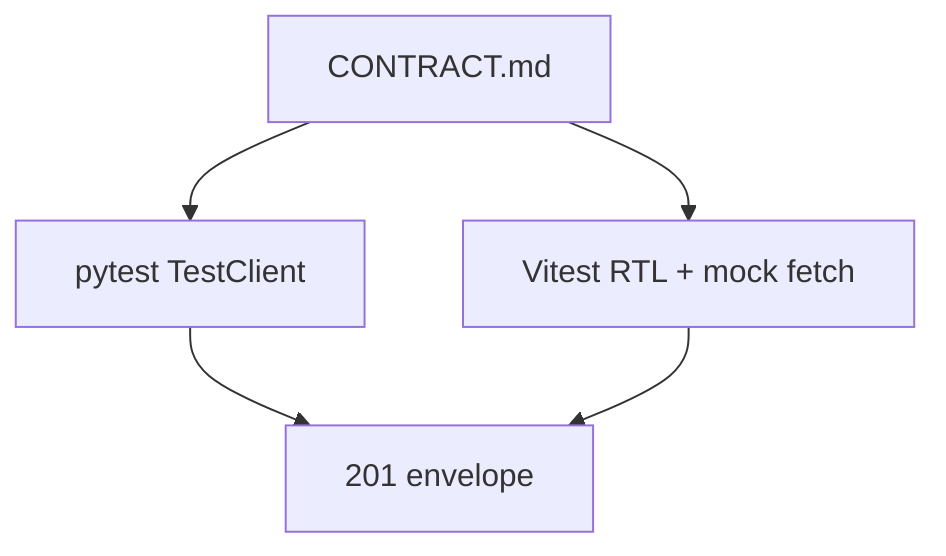
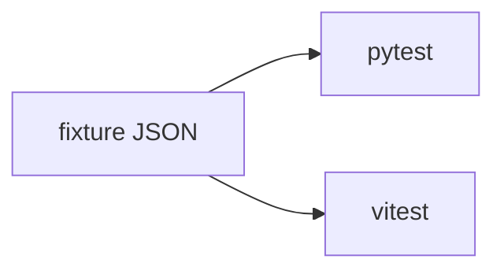

# Month 12 · Week 4 · Day 2
# Integration Tests: UI Mock Plus API Together

**Program:** Full-Stack Mastery · 18 months  
**Phase:** 4 — Full-stack application  
**Month index:** [../../README.md](../../README.md)  
**Week 4:** [1](day-01.md) · Day 2 (today) · [3](day-03.md) · [4](day-04.md) · [5](day-05.md) · [6](day-06.md) · [7](day-07.md)  
**Week rhythm today:** Learn + type-along  
**Student state:** You sketched auth. Today you prove a **slice** with tests that span **UI** and **API** — not two soliloquies.  
**Study time:** 3–4 focused hours

Labs: `~\fullstack-lab\month-12\week-04\day-02\`. Noun: **clipboards** (list + create). Playwright-deep is Month 14; today **TestClient + RTL** (mocked fetch **or** a thin in-process story). Do not paste Project 7.

---

## How to use this textbook

1. Read a section. Close it. Say “two processes, two proofs.”
2. Type an API test **and** a UI test that share the **same CONTRACT.md**.
3. Optional review links later.

---

## How to read this chapter

Unit tests of `parseClipboard` are good. They do not prove FastAPI returns 201. RTL with mocked fetch proves the **page**. TestClient proves the **route**. **Integration** this month means: the **same envelope** is asserted in both places, and at least one path uses the **real client module** with a mock at **HTTP**, not a mock of `useQuery`.

A stronger lab (optional): pytest TestClient for the API; Vitest renders the list with `fetch` stubbed to **shapes copied from** TestClient fixtures (shared `fixtures/clipboard.json`).



**Wrong belief:** “I’ll only TestClient because UI tests are slow.”  
**Correct:** then `isPending` UI can rot. Both layers this month.

**Wrong belief:** “I’ll only RTL against MSW and skip FastAPI tests.”  
**Correct:** then Pydantic 422 loc can rot. Both.

---

## Today's contract

By the end of this day you will be able to:

1. Share **one** JSON fixture (or factory) for `ClipboardOut`.  
2. pytest: POST 201, GET list `total`, 422 loc on short title if dual validation exists.  
3. RTL: loading then title; create + alert on 422 (mock 422).  
4. Document **what is not integrated** (no real Postgres required in the lab; no Playwright required).  
5. Fresh `QueryClient`, `retry: false`.  
6. CORS header test on TestClient (Origin 5173).

**Today's gate.** Closed-book:

> CONTRACT is the shared language. TestClient proves statuses. RTL proves states. I mock fetch under the client, not useQuery. Isolation fixtures reset RAM and QueryClient.

---

## Time box

| Block | Minutes | Work |
|---|---|---|
| A | 45 | Theory |
| B | 65 | Shared fixture + both suites |
| C | 70 | 422 both sides |
| D | 20 | Git |
| E | 15 | Recall |

---

# Block A — Theory

## 1. Three levels (name them)

| Level | Tool | Proves |
|---|---|---|
| Contract / HTTP | TestClient, curl.exe | Status, JSON, CORS header |
| UI + Query | RTL, mock fetch | isPending, empty, error, invalidate **behavior** |
| Browser E2E | Playwright (Day 4 thin / Month 14) | Real CORS, real Vite |

Today is the first two. Day 4 may add a **thin** happy path.

---

## 2. Shared fixture

```json
{
  "id": 1,
  "title": "Board A"
}
```

Python tests build the same dict. TS `as const` satisfies the DTO parse. If they drift, integration failed.

---

## 3. Isolation

API: clear dict, reset `_next_id`, clear `dependency_overrides`.  
UI: new QueryClient, `gcTime: 0`, `vi.unstubAllGlobals`.

---

## 4. Auth sketch in tests (optional)

If you test `/me`, TestClient can `set_cookie` or pass `Authorization`. RTL mocks 401 then 200. Do not build a full auth suite. One 401 test is enough.

---

## 5. Security

No real passwords in fixtures. Lab users only.

---

# Block B — Type-along

```powershell
cd ~\fullstack-lab
mkdir month-12\week-04\day-02 -Force
cd ~\fullstack-lab\month-12\week-04\day-02
```

Stub + Vite list/create. `CONTRACT.md`. `fixtures/clipboard.json`.

```powershell
uv run pytest -q
npx vitest run
```

Write `LAYERS.md`: what each suite owns.

---

# Block C — Independent

422 loc pytest + RTL alert. CORS Origin test. `INTEGRATION.md`: one paragraph “we are not Playwright yet.”

```powershell
cd ~\fullstack-lab
git add month-12
git commit -m "Month 12 Week 4 Day 2: TestClient and RTL share clipboard contract."
```

---

# Block E — Recall

1. Why two suites.  
2. Shared fixture.  
3. Why not mock useQuery.  
4. Isolation.  
5. What Day 4 adds.

---

## Office hours

**Different field names in TS vs Python.** Shared fixture.

**UI test hits real 8000.** Stub fetch; jsdom should not depend on Uvicorn.

**TestClient 201 but UI still `as any`.** Day 5 will hunt `any`.



---

## Definition of done

- [ ] CONTRACT + shared fixture  
- [ ] pytest green  
- [ ] vitest green (loading + one create/error)  
- [ ] CORS header asserted  
- [ ] LAYERS.md  
- [ ] Commit exists  

---

## Optional review links

- [FastAPI testing](https://fastapi.tiangolo.com/tutorial/testing/)
- [Query testing](https://tanstack.com/query/latest/docs/framework/react/guides/testing)

---

## Tomorrow

**From memory:** happy path **list → create → list**.

---

# Worked session — one envelope, two runners

CONTRACT. Fixture. TestClient POST/GET. RTL mock fetch same shape. Query wrapper. CORS 5173. `model_dump()`. No Playwright required. No Project 7. `invalidateQueries` not required in the mock if you mock GET after create — or mock POST 201 and GET list with two items.

---

# Closing lecture — integration is a shared sentence

If Python says `title` and TypeScript says `name`, the product is already split. Fixtures make the split loud.

curl.exe remains the manual sibling. Automated tests are the regression net.

Month 14 will drive a real browser. Today you still own HTTP and Query.
