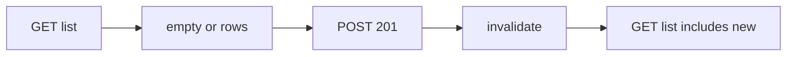

# Month 12 · Week 4 · Day 3
# Implement From Memory: List, Create, List

**Program:** Full-Stack Mastery · 18 months  
**Phase:** 4 — Full-stack application  
**Month index:** [../../README.md](../../README.md)  
**Week 4:** [1](day-01.md) · [2](day-02.md) · Day 3 (today) · [4](day-04.md) · [5](day-05.md) · [6](day-06.md) · [7](day-07.md)  
**Week rhythm today:** Implement from memory  
**Student state:** You have integration tests. Today the **happy path** — list, create, list again — must live in your head from **this file**.  
**Study time:** 3–4 focused hours  
**Prereq:** Day 2 gate passed.

Labs: `~\fullstack-lab\month-12\week-04\day-03\`. Noun: **index tabs** (`title` 3–40). Do not copy Day 2 source. Do not paste Project 7.

---

## How Day 3 works

Earlier week files stay **closed**. This recap is the teacher. Stuck > 25 minutes: matching section only. `lookups.txt`.

No complete app in this file.

---

## How to read this chapter

The month’s join in one loop: **GET list** (maybe empty) → **POST create 201** → **GET list** contains the row. Query: `useQuery` + `useMutation` + **`invalidateQueries({ queryKey: ["tabs"] })`**. Client: one module. CORS 5173. Dual validation on title.



**Wrong belief:** “I’ll setState the new row and skip invalidate.”  
**Correct:** the second GET is the proof the **server** has it.

---

## Complete explanation (happy path you must still own)

**Scaffold.** `npm create vite@latest tab-web -- --template react-ts`. `npm install @tanstack/react-query react-router`. Import router from `"react-router"`. Vite extra `--`. `VITE_API_BASE`. No secrets.

**Client.** `request()` JSON. FormData only if you add files (not required). `ApiError`. Parse `unknown`. No fetch in pages. Cookie `credentials` only if you kept Day 1 cookie sketch — **not required** for this happy path.

**Query v5.** `useQuery({ queryKey: ["tabs"], queryFn })`. `useMutation({ mutationFn })`. `invalidateQueries({ queryKey: ["tabs"] })`. `isPending` list first load. Mutation `isPending` disables submit. `gcTime` not `cacheTime`. Pagination optional; if present, URL + key + `placeholderData: keepPreviousData`.

**FastAPI.** GET envelope. POST 201. Pydantic Create/Out. **`model_dump()`**. Title `Field(min_length=3, max_length=40)` + strip. CORS `allow_origins=["http://127.0.0.1:5173"]` not `*`. `HTTPException` 404 if you add GET one.

**UI.** Four states. Zod same 3–40. `zodResolver` preferred.

**Windows.** `curl.exe` GET, POST, GET. PowerShell quoting: `--data-binary @body.json`.

**Auth.** Not required on this mini. If you add `/me`, 401 without cookie. No payloads.

**Email/upload.** Not required.

**Wrong belief:** “POST 200 is fine if the body has id.”  
**Correct:** 201 is the contract.

---

## Today's contract

**Today's gate.** Closed-book:

> From this recap I built list-create-list with typed client, Query invalidation, CORS 5173, Pydantic 201, and curl.exe proof — without copying Day 2.

---

## Time box

| Block | Minutes | Work |
|---|---|---|
| A | 20 | Oral |
| B | 40 | Paper sequence |
| C | 90 | Build |
| D | 35 | curl + Network |
| E | 15 | Lookups |

---

# Block A — Speak first

1. Why invalidate after POST.  
2. Four UI states.  
3. 201 vs 200.  
4. CORS vs curl.  
5. Dual validation one sentence.  
6. `isPending` vs mutation `isPending`.

---

# Block B — Paper drills

Sequence diagram in `DRILLS.txt`: UI, Query, client, FastAPI, store. Include invalidate.

Predict Network: GET, POST, GET.

---

# Block C — Spec

```powershell
cd ~\fullstack-lab
mkdir month-12\week-04\day-03 -Force
cd ~\fullstack-lab\month-12\week-04\day-03
```

| Step | Rule |
|---|---|
| GET `/tabs` | 200 `{items, total}` |
| POST `/tabs` | 201 `{id, title}` title 3–40 |
| UI | list, form, invalidate |
| CORS | 5173 |
| Prove | curl three calls; browser create appears |

---

# Block D — Defect hunt

1. Empty then create then one row.  
2. Short title UI + curl 422.  
3. Stop API → error state.  
4. POST then **no** invalidate → list stale; **fix**. Write `STALE.txt` if you saw it.

---

# Block E — Lookups

```powershell
cd ~\fullstack-lab
git add month-12
git commit -m "Month 12 Day 3: tabs list-create-list from memory."
```

---

# Lecture: the second GET is the point

Anyone can POST. The product is the **list agreeing**. Invalidation is how Query learns. curl.exe is how **you** learn without React.

201 is a decorator. Envelope is a contract. Zod is courtesy.

Do not paste ops-web. Index tabs only.

---

## Definition of done

- [ ] Spoke A  
- [ ] List-create-list in browser  
- [ ] curl.exe three statuses  
- [ ] invalidate present  
- [ ] No Day 2 copy  
- [ ] Commit  

---

# Worked session — tabs

uv + Vite extra `--`. Client. Provider. useQuery/useMutation object API. Pydantic Field. CORS 5173. curl.exe. Zod optional but preferred. `model_dump()`. No `cacheTime`. No `*`. No Project 7.

---

## Optional review links

Repair from this recap.

---

## Tomorrow

**Lab:** one **Playwright** happy path **or** a documented **curl.exe + UI** happy path if Playwright is deferred (Month 14 is deep Playwright — thin is enough).

---

# Closing lecture — empty, create, appear

First GET may be empty success. POST 201. Invalidate. Second GET has the title.

That loop is the month. DB (or dict) → API → UI → (tomorrow) a browser-level proof.

## Recite-back checklist

Write `RECITE.txt`.

- [ ] four states
- [ ] 201
- [ ] invalidateQueries object
- [ ] CORS 5173
- [ ] dual title rule
- [ ] curl.exe
- [ ] no fetch in pages
- [ ] not Project 7
