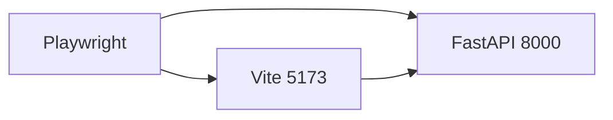
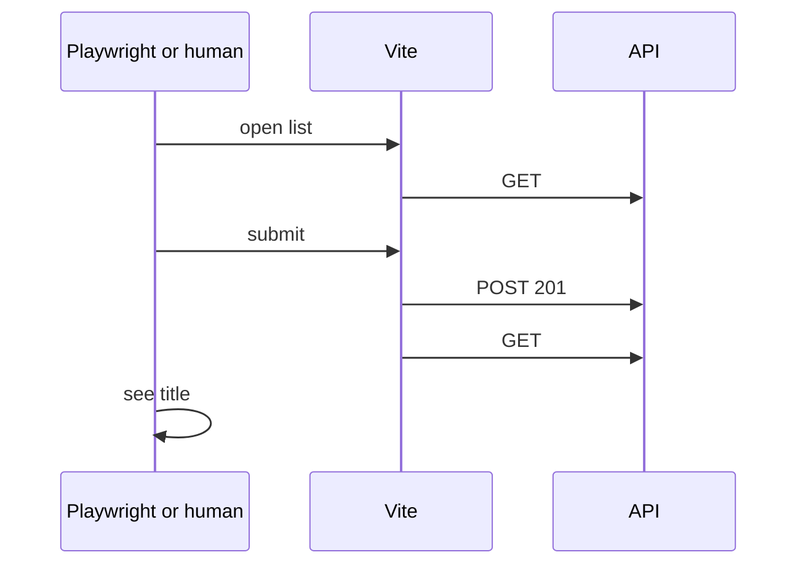
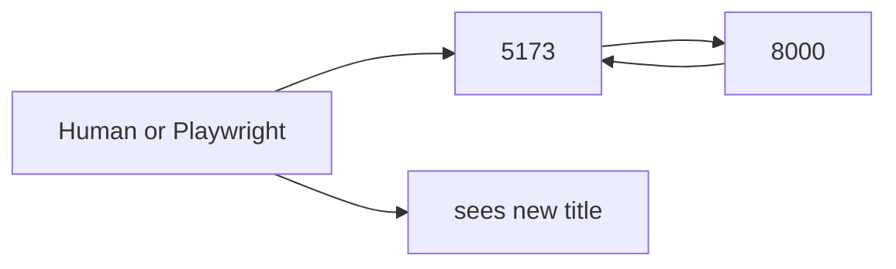
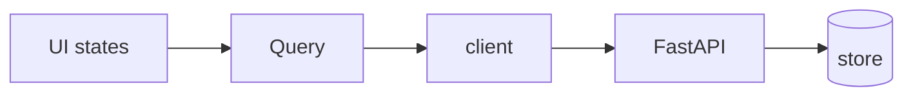

# Month 12 · Week 4 · Day 4
# Lab: Thin Happy Path — Playwright or curl.exe + UI

**Program:** Full-Stack Mastery · 18 months  
**Phase:** 4 — Full-stack application  
**Month index:** [../../README.md](../../README.md)  
**Week 4:** [1](day-01.md) · [2](day-02.md) · [3](day-03.md) · Day 4 (today) · [5](day-05.md) · [6](day-06.md) · [7](day-07.md)  
**Week rhythm today:** Learn + lab feature  
**Student state:** You can list-create-list by hand. Today you **record** that path so it can fail in CI later. **Month 14** is deep Playwright. Today a **thin** happy path is enough.  
**Study time:** 3–4 focused hours

Labs: `~\fullstack-lab\month-12\week-04\day-04\`. Continue **tabs** or **stickers**. Not Project 7 source.

**Track A:** one Playwright test: see list (or empty), create, see title.  
**Track B:** if Playwright is deferred (install pain, time), a **scripted** `curl.exe` sequence **plus** a written UI protocol you actually performed, with evidence. Track B is allowed. Do not pretend you ran Playwright.

---

## How to use this textbook

1. Read a section. Close it. Say “thin.”
2. Automate **one** happy path, not a full suite.
3. Optional review links later.

---

## How to read this chapter

RTL + TestClient do not click a **real** browser. CORS, cookies, and Vite appear when a **browser** speaks. Playwright does that. It is also slower and flakier if you over-specify.

Thin means: **one** test file, **one** flow, `getByRole`, no screenshot essay, no visual regression.



**Wrong belief:** “Month 12 requires a full Playwright POM framework.”  
**Correct:** Month 14. Today: one spec.

**Wrong belief:** “curl.exe is as good as Playwright for CORS.”  
**Correct:** curl skips CORS. Track B must include a **browser** check you wrote down (Network Allow-Origin, or create in the UI).

---

## Today's contract

By the end of this day you will be able to:

1. Choose Track A or B and write it in `TRACK.md`.  
2. **A:** Install Playwright for the lab; test `list-create-list`; start **both** servers (or Playwright `webServer` if you can).  
3. **B:** `HAPPYPATH.md` with exact `curl.exe` commands **and** UI steps you ran; screenshot optional; statuses required.  
4. Keep the flow aligned with CONTRACT (201, envelope).  
5. Not mock `useQuery` in this path (Playwright uses the real UI).

**Today's gate.** Closed-book:

> I have a repeatable happy path: Playwright one spec, or curl.exe plus a documented UI pass. I know CORS is a browser rule. Month 14 will deepen Playwright.

---

## Time box

| Block | Minutes | Work |
|---|---|---|
| A | 40 | Theory: thin E2E vs RTL |
| B | 70 | Track A or B |
| C | 60 | Evidence + one failure restore |
| D | 20 | Git |
| E | 15 | Recall |

---

# Block A — Theory

## 1. What thin covers

| Assert | Thin E2E |
|---|---|
| Empty or loading then form | yes |
| Fill title, submit | yes |
| New title visible | yes |
| 422 loc | no (pytest) |
| Every filter combo | no |

---

## 2. Playwright sketch (Track A)

```powershell
npm init playwright@latest
```

Follow the installer. Prefer Chromium only today.

```ts
import { test, expect } from "@playwright/test";

test("create sticker appears in list", async ({ page }) => {
  await page.goto("http://127.0.0.1:5173/");
  await page.getByLabel(/title/i).fill("Hello sticker");
  await page.getByRole("button", { name: /add/i }).click();
  await expect(page.getByText("Hello sticker")).toBeVisible();
});
```

**Both servers must run.** Document in `README.md`. Playwright `webServer` can start Vite; Uvicorn may be a second command. If that is too much, Track B.

Use **127.0.0.1** to match CORS.

---

## 3. Track B protocol

`HAPPYPATH.md`:

1. Start Uvicorn; `curl.exe` GET empty.  
2. Start Vite; open 127.0.0.1:5173.  
3. Note loading/empty.  
4. Create in UI.  
5. `curl.exe` GET contains title.  
6. Optional: Origin header on curl for Allow-Origin.

That is a **manual** E2E with HTTP proof. Allowed this month.

---

## 4. Auth

If login exists, thin path may skip auth **or** include lab login. Do not record real passwords. Do not write attack cases.

---

## 5. Security

- Base URL 127.0.0.1.  
- No production credentials in playwright config.

---

# Block B — Type-along

```powershell
cd ~\fullstack-lab
mkdir month-12\week-04\day-04 -Force
cd ~\fullstack-lab\month-12\week-04\day-04
```

Rebuild or type a tiny list-create app. Then Track A or B.

Write `TRACK.md`.

---

# Block C — Independent

Break the test (wrong button name) or skip a curl step; show fail; restore. `RED.txt`.

```powershell
cd ~\fullstack-lab
git add month-12
git commit -m "Month 12 Week 4 Day 4: thin happy path evidence."
```

Do not commit Playwright browsers if huge; follow Playwright’s gitignore.

---

# Block E — Recall

1. RTL vs Playwright.  
2. Why curl is not CORS.  
3. Why thin.  
4. 127.0.0.1 vs localhost.  
5. Month 14.

---

## Office hours

**Playwright times out.** Servers not up; CORS localhost mismatch; `isPending` forever (API down).

**Track B without UI.** Not done — add the browser paragraph.

**Full POM.** Delete it. One file.



---

## Definition of done

- [ ] TRACK.md A or B  
- [ ] Happy path evidence  
- [ ] RED.txt  
- [ ] README how to run servers  
- [ ] Commit exists  

---

## Optional review links

- [Playwright intro](https://playwright.dev/docs/intro)
- Month 14 will go deeper; do not binge today.

---

## Tomorrow

**Refactor client types; no `any`.** DTOs, parse functions, Query `data` typed.

---

# Worked session — one path, recorded

List-create-list. Playwright **or** curl+UI doc. 127.0.0.1. CORS 5173. 201. Invalidate. `getByRole`. No Project 7. No payload tests.

---

# Closing lecture — evidence beats folklore

“It worked in Chrome” is not a file. Playwright is a file. Track B is a file plus curl. Month 14 will make Playwright ordinary. Today you prove you **can** record the join.

Query and TestClient remain the fast net. E2E is the slow net for the path that makes money (create appears).

---

# Track A vs Track B (decide in TRACK.md)

**A Playwright** — one test, `getByRole` / `getByLabel`, `http://127.0.0.1:5173/`, both servers up. Chromium only. No POM framework. No visual diffs.

**B curl + UI protocol** — `HAPPYPATH.md` with commands **and** what you saw in the browser (empty, create, title). CORS sentence: curl is not enough alone; you opened Chrome.

Month 14 will make Playwright ordinary. Today thin is honest.

```ts
test("create sticker appears", async ({ page }) => {
  await page.goto("http://127.0.0.1:5173/");
  await page.getByLabel(/title/i).fill("Hello sticker");
  await page.getByRole("button", { name: /add/i }).click();
  await expect(page.getByText("Hello sticker")).toBeVisible();
});
```

Timeouts usually mean: Uvicorn down, Vite down, CORS localhost mismatch, or spinner forever (`queryFn` not throwing / wrong base URL).

**Wrong belief:** “I’ll test 422, 409, and XSS in Playwright today.”  
**Correct:** pytest/RTL for those. E2E is the money path: create appears.

README: how to start both servers. `RED.txt`: break the button name, show fail, restore.

Do not commit huge browser binaries if Playwright gitignores them. Do not record real passwords. Do not write attack cases.

127.0.0.1 everywhere to match `allow_origins`.



---

# Server startup notes (README)

```powershell
# terminal 1
uv run uvicorn main:app --reload --host 127.0.0.1 --port 8000
# terminal 2
npm run dev -- --host 127.0.0.1 --port 5173
```

Playwright `baseURL: "http://127.0.0.1:5173"`. Do not mix localhost.

Track B HAPPYPATH.md sections: start, curl empty, open UI, create, curl nonempty, CORS origin header optional extra.

Thin: one flow. pytest keeps 422. RTL keeps loading.

Month 14: fixtures, auth storage state, trace viewer. Not today.

If Playwright install fails on the lab machine, Track B is **not** a fail. TRACK.md says why. Still do the UI steps.

RED.txt required. Definition of done: evidence file exists.

---

# What “thin” refuses

- Page objects spanning five files  
- Screenshot comparison  
- Testing every 422 in the browser  
- Running against production  
- Recording an attack  

What thin wants: one green path, one README, one RED.txt.

Playwright config `use.baseURL`. Test uses relative `goto("/")` if set. Host 127.0.0.1.

If create is too fast to see loading, still assert the **title**. Loading is RTL’s job.

Track B: numbered steps. Each step: command or UI action, expected status or text. Sign your name and date in HAPPYPATH.md so you remember you actually ran it.

**Wrong belief:** “Track B is cheating.”  
**Correct:** Month 14 is Playwright-deep. A lying Playwright config is worse than honest curl+UI.

CORS: if the UI create works, the browser accepted Allow-Origin. Mention that in Track B. curl with Origin is extra proof of the header, not of JS.

Commit evidence. Do not commit `test-results` blobs if huge — follow Playwright gitignore.

Definition of done still: TRACK.md, evidence, RED.txt, README servers.

---

# Recite-back

- [ ] TRACK A or B
- [ ] one happy path
- [ ] 127.0.0.1
- [ ] RED.txt
- [ ] README two servers
- [ ] Month 14 is deeper
- [ ] curl is not CORS alone

Playwright install is optional. Track B is a documented UI pass plus `curl.exe` statuses. Either track must include a **browser**. Both servers on 127.0.0.1. Title 3–40 still dual-validated; E2E uses a legal title.

Tomorrow: no `any` on the client. `tsc --noEmit`. Parse `unknown`.

---

# Closing card

Windows: `curl.exe`. Vite: `npm create vite@latest name -- --template react-ts`. Router: `npm install react-router` and import from `"react-router"`. FastAPI `--host 127.0.0.1 --port 8000`. CORS `allow_origins=["http://127.0.0.1:5173"]` not `*`. `VITE_API_BASE` in `.env` — no secrets. Query v5: `useQuery({ queryKey, queryFn })`, `useMutation({ mutationFn })`, `isPending` first load, `gcTime` not `cacheTime`, `placeholderData: keepPreviousData` when paging, `invalidateQueries({ queryKey })` after writes. Pydantic v2 `model_dump()`. JSON `unknown` then DTO. No `any`. No `fetch` in components. No Project 7 dump.



---

# Git

```powershell
cd ~\fullstack-lab
git add month-12
git commit -m "Month 12 Day 4: thin happy path evidence."
```

Playwright traces stay out of git if large. TRACK.md names A or B. Month 14 deepens E2E. Today one path is enough.

Thin E2E is one path. pytest still owns 422. RTL still owns loading. Month 14 owns depth. `127.0.0.1` matches CORS. TRACK.md is required even if Playwright installed cleanly.

Start both servers before the spec. If create is instant, still assert the new title. Do not test XSS here. Do not record real passwords.

```powershell
uv run uvicorn main:app --reload --host 127.0.0.1 --port 8000
npm run dev -- --host 127.0.0.1 --port 5173
```

Then Playwright or the HAPPYPATH.md protocol. One title appearing is the claim.

Definition of done: TRACK.md, evidence, RED.txt, README.
Thin on purpose.
Month 14 is the deep Playwright month.
