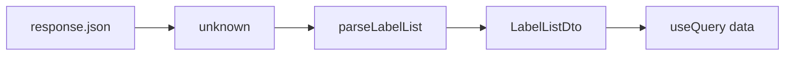
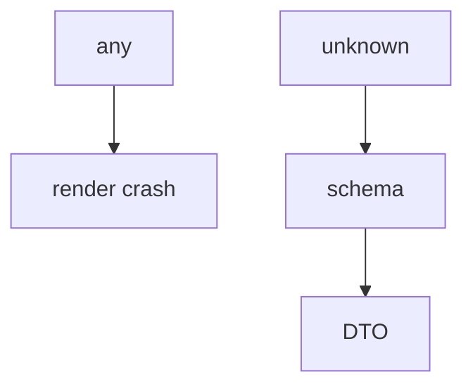

# Month 12 · Week 4 · Day 5
# Refactor Client Types: No `any`

**Program:** Full-Stack Mastery · 18 months  
**Phase:** 4 — Full-stack application  
**Month index:** [../../README.md](../../README.md)  
**Week 4:** [1](day-01.md) · [2](day-02.md) · [3](day-03.md) · [4](day-04.md) · Day 5 (today) · [6](day-06.md) · [7](day-07.md)  
**Week rhythm today:** Tests + refactor + documentation  
**Student state:** The happy path works. Today TypeScript must tell the truth: **no `any`** on the client boundary.  
**Study time:** 3–4 focused hours

Labs: `~\fullstack-lab\month-12\week-04\day-05\`. Refactor **yesterday’s** app or a small **labels** client. You may also hunt `any` in `~/ops-web/` — do not paste that app here; record paths in `HUNT.md`.

---

## How to use this textbook

1. Read a section. Close it. Say “unknown at the boundary.”
2. `grep`/`Select-String` for `any`. Delete them with types or Zod.
3. `tsc --noEmit` must be clean for the lab.
4. Optional review links later.

---

## How to read this chapter

`any` turns the DTO into a rumor. `response.json()` is **`unknown`** in honest wrappers (or you treat it as unknown). Parse, then use `LabelDto`. Query’s `data` becomes `LabelListDto | undefined` — that is **`isPending`**, not a reason to `as any`.



**Wrong belief:** “I’ll `as Label[]` because I control the API.”  
**Correct:** you control it until a deploy mismatch. Parse once in the client.

**Wrong belief:** “`eslint-disable any` in api.ts is a refactor.”  
**Correct:** that is hiding.

---

## Today's contract

By the end of this day you will be able to:

1. Find every `any` in the lab `src/` (and note product hits).  
2. Type `request<T>` with a **parse** callback, not `request<any>`.  
3. Type `ApiError.body` as `unknown`.  
4. Narrow `useParams` id without `as string`.  
5. Zod `.parse` or type guards on list/detail.  
6. `strict` true; no implicit any.  
7. Tests still green.

**Today's gate.** Closed-book:

> JSON is unknown until parsed. Query data is typed DTOs. I do not use any on the client. isPending guards undefined data. model_dump on the server still matches the DTO.

---

## Time box

| Block | Minutes | Work |
|---|---|---|
| A | 40 | Theory |
| B | 60 | Hunt and parse |
| C | 70 | Product hunt note + tests |
| D | 20 | Git |
| E | 15 | Recall |

---

# Block A — Theory

## 1. request()

```ts
async function request<T>(
  path: string,
  init: RequestInit,
  parse: (json: unknown) => T,
): Promise<T> {
  const response = await fetch(`${baseUrl}${path}`, init);
  const json: unknown = await readJson(response);
  if (!response.ok) throw new ApiError(response.status, json);
  return parse(json);
}
```

`readJson` for 204: no parse.

---

## 2. Zod at the boundary

```ts
const listSchema = z.object({
  items: z.array(labelSchema),
  total: z.number(),
});

export function listLabels() {
  return request("/labels", { method: "GET" }, (json) => listSchema.parse(json));
}
```

`parse` throws → Query `isError`. Good.

---

## 3. Query generics

Usually inferred from `queryFn`. If you write `useQuery<any>` delete it.

```ts
const q = useQuery({
  queryKey: ["labels"],
  queryFn: listLabels,
});
// q.data is LabelListDto | undefined
```

---

## 4. Event handlers

`e: React.FormEvent<HTMLFormElement>` not `any`. Files: `e.target` narrowed.

---

## 5. eslint

`@typescript-eslint/no-explicit-any` error if you have it. Enable in the lab if missing.

---

## 6. Server side

Python `Any` in FastAPI is the twin sin. Prefer Pydantic models. Not the main hunt today; mention in `HUNT.md` if you see `dict` bodies.

---

# Block B — Type-along

```powershell
cd ~\fullstack-lab
mkdir month-12\week-04\day-05 -Force
cd ~\fullstack-lab\month-12\week-04\day-05
```

Copy-by-typing a small list client. Introduce `any` on purpose, `tsc` may still pass, then remove.

```powershell
npx tsc --noEmit
Select-String -Path src\**\*.ts,src\**\*.tsx -Pattern "\bany\b"
```

Write `HUNT.md` (lab zero `any`).

---

# Block C — Independent

Hunt `~/ops-web` or Project 7 web if it exists: list file paths with `any` in `PRODUCT-HUNT.md` (paths only, **no source dump**). Fix **one** if you own it.

RTL still green. Zod parse test: bad JSON throws.

```powershell
cd ~\fullstack-lab
git add month-12
git commit -m "Month 12 Week 4 Day 5: typed client no any."
```

---

# Block E — Recall

1. Why json is unknown.  
2. parse throw → isError.  
3. useParams narrowing.  
4. 204.  
5. Why as Label[] is a lullaby.

---

## Office hours

**`zod parse` too strict on extra fields.** `.passthrough()` or strip. Document.

**`error: any` in catch.** `unknown` then `instanceof ApiError`.

**`process.env` any.** Vite `import.meta.env.VITE_API_BASE` string check.



---

## Definition of done

- [ ] Lab `src` has no `any`  
- [ ] `tsc --noEmit` clean  
- [ ] parse at boundary  
- [ ] HUNT.md  
- [ ] Tests green  
- [ ] Commit exists  

---

## Optional review links

- [TypeScript unknown](https://www.typescriptlang.org/docs/handbook/release-notes/typescript-3-0.html#new-unknown-top-type)
- [Zod](https://zod.dev/)

---

## Tomorrow

**Independent: Project 7 start** — domain chosen, repo, first vertical slice. **Spec envelope only** in this textbook.

---

# Worked session — grep then parse

Select-String `any`. Replace with DTO + Zod. Query infer. tsc. Vitest. Product hunt paths only. CORS unchanged. `model_dump` still matches fields.

No Project 7 paste. No `request<any>`.

---

# Closing lecture — types are part of the join

The month gate is DB → API → UI → test. `any` on the UI side means the test can pass while the DTO is fiction.

Unknown at `json()`, DTO after parse, Query infers. That is the client you will take into Project 7 tomorrow.
