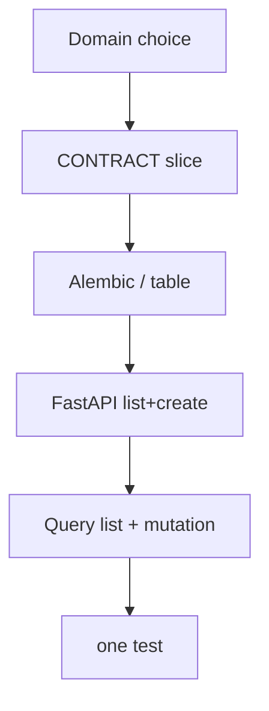
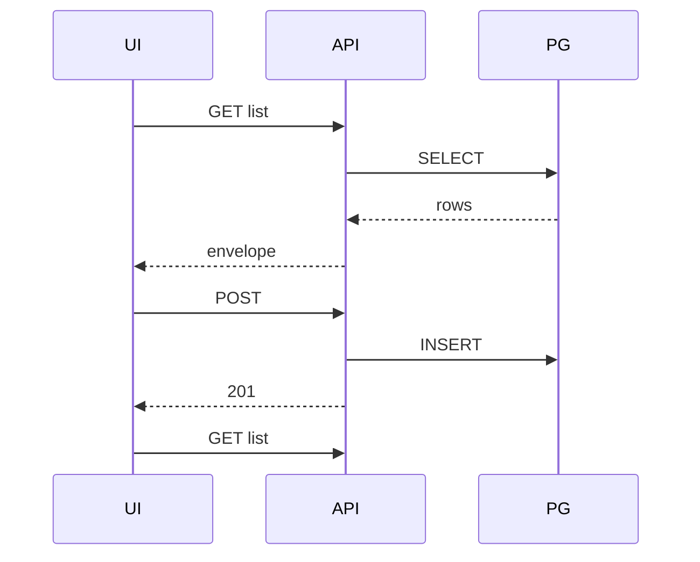

# Month 12 · Week 4 · Day 6
# Independent: Project 7 Start — Envelope, Not Source

**Program:** Full-Stack Mastery · 18 months  
**Phase:** 4 — Full-stack application  
**Month index:** [../../README.md](../../README.md)  
**Week 4:** [1](day-01.md) · [2](day-02.md) · [3](day-03.md) · [4](day-04.md) · [5](day-05.md) · Day 6 (today) · [7](day-07.md)  
**Week rhythm today:** Independent implementation  
**Student state:** You can join React Query to FastAPI with types. Today **Project 7** starts as a **serious domain**, a **repo**, and a **first vertical slice**. This textbook will **not** give you the product source.  
**Study time:** 3–4 focused hours (slice continues after the exam if needed)

**Spec:** `full_stack_project_requirements_2026/project_07_evolving_full_stack_product.md` — headings and required capabilities, **not** a template to paste.

Notes: `~\fullstack-lab\month-12\week-04\day-06\`. Code in **your** Project 7 repos (web + api), or `~/ops-web/` + `~/ops-api/` if those **are** Project 7. Do not implement inside `fullstack-lab` and call it Project 7 unless you truly have no other disk — then say so in `REPO.md`.

---

## How to use this textbook

1. Choose domain. Write envelope **before** scaffolding a junk todo.  
2. First slice: **one** list-create path through **Postgres if 6B exists**, not a new memory empire.  
3. AI may not ship the product.  
4. Optional links: the Project 7 requirements file.

---

## How to read this chapter

Project 7 is **long-lived**: auth (Month 13), testing (Month 14), Docker, CI, cloud. Today you only **start**: domain, repos, **vertical slice** (DB column → API → UI → one test).



**Wrong belief:** “I’ll start with a todo so I can copy Month 7.”  
**Correct:** requirements forbid a trivial todo. Pick inventory, scheduling, CRM, issues, learning, project management — **your** names.

**Wrong belief:** “Independent day is when the textbook pastes a starter kit.”  
**Correct:** envelope only. You already have the skills.

---

## Today's contract

By the end of this day you will be able to:

1. Write **`DOMAIN.md`**: chosen domain, why not a todo, primary + secondary entity (names only).  
2. Create or confirm **two repos** (or monorepo) with README run commands.  
3. **`SLICE.md`**: one resource, fields, GET list + POST create, envelope, queryKey, CORS 5173, `VITE_API_BASE`.  
4. Implement that slice **or** honestly `BLOCKED.md` with the missing Month 11 piece.  
5. One automated test (TestClient or RTL).  
6. No CORS `*`. No secrets in Vite. No `any` on the new client files.

**Today's gate.** Closed-book:

> Project 7 has a serious domain, a repo I can run, and a slice specified. If the slice is coded, DB→API→UI→test is visible. The textbook did not give me the app.

---

## Time box

| Block | Minutes | Work |
|---|---|---|
| A | 30 | Domain + repos |
| B | 40 | SLICE.md + failing test |
| C | 90 | Implement slice |
| D | 25 | curl.exe + UI |
| E | 15 | Recall |

---

# Block A — Domain and repos

Allowed families (pick one, specialize the names):

| Family | Primary | Secondary (later) |
|---|---|---|
| Project management | Project | Task |
| Issue tracking | Issue | Comment |
| Inventory | Location or SKU | Stock move |
| CRM | Customer | Deal |
| Scheduling | Resource or appointment | Booking |
| Learning | Course | Lesson |

Write users/orgs as **future** — Month 13. Today’s slice may be **unauthenticated lab data** **or** the Day 1 sketch; do not block the slice forever on OAuth.

`REPO.md`: clone paths, `uv run uvicorn`, `npm run dev -- --host 127.0.0.1 --port 5173`.

**Forbidden:** copying this textbook’s coats/pegs/badges nouns into Project 7 as the product.

---

# Complete explanation (skills you bring; other days closed)

**Client.** Typed `request`, DTOs, Zod parse, no `any`, no fetch in pages.

**Query.** Object API. `isPending`. `invalidateQueries({ queryKey: ["resource"] })`. Pagination: URL + key + `keepPreviousData` **if** the slice lists more than a handful — otherwise still envelope `total`.

**API.** Pydantic v2 `model_dump()`. 201. CORS 5173. Dual validation on the create field.

**DB.** SQLAlchemy + Alembic from Month 11 if 6B is the same codebase evolving — **prefer** that. New Project 7 API: still Postgres, not a dict, unless BLOCKED.

**Auth.** JUSTIFY.md from Day 1 informs Month 13; do not dump a full IdP today.

**Windows.** curl.exe. Vite extra `--`. `react-router` from `"react-router"`.



---

# Block B — Red first

TestClient: POST then GET includes title. Save `RED.txt` from **the product test folder**.

---

# Block C — Implement

Vertical slice only. No file-upload empire unless it **is** the slice. No email vendor.

README in the product: how to migrate, run API, run UI.

---

# Block D — Evidence

```powershell
curl.exe -s http://127.0.0.1:8000/YOUR_LIST
```

Browser 127.0.0.1:5173. `~\fullstack-lab\month-12\week-04\day-06\EVIDENCE.md` (commands + statuses, **not** source).

---

# Block E — Recall

1. Why not a todo.  
2. What a vertical slice is.  
3. Why envelope lives in fullstack-lab.  
4. What Month 13 will add.

## Quality bar

SLICE.md is enough for a classmate to implement without Slack. Repos run from README. One test. Domain is serious.

If you only wrote markdown, the **exam tomorrow** still asks you to change DB→API→UI→test on a **mini** — the product slice should catch up before you claim the Month 12 gate.

---

```powershell
cd ~\fullstack-lab
git add month-12\week-04\day-06
git commit -m "Month 12 Day 6: Project 7 domain and slice envelope."
```

Product repos: your commits, your messages.

---

## Definition of done

- [ ] DOMAIN.md serious  
- [ ] REPO.md  
- [ ] SLICE.md first  
- [ ] Slice coded **or** BLOCKED.md  
- [ ] One test if coded  
- [ ] EVIDENCE.md  
- [ ] No textbook product dump  

---

## Optional review links

- [Project 7 requirements](../../../../full_stack_project_requirements_2026/project_07_evolving_full_stack_product.md) — use relative path from your clone if different  
- From workspace: `full_stack_project_requirements_2026/project_07_evolving_full_stack_product.md`

---

## Tomorrow

**Month 12 exam + gate.** From a requirement, change **DB → API → UI → test**. Link [Month 13](../../../month-13/README.md) only if the gate is true.

---

# Slice that counts as a start

One resource. GET list envelope. POST 201. Postgres (prefer) or BLOCKED.md. Typed client. `useQuery` + `useMutation` + `invalidateQueries({ queryKey })`. Dual validation on one field. CORS 5173. `.env.example`. One test. `curl.exe` evidence in fullstack-lab `EVIDENCE.md` — **commands and statuses**, not product source.

DOMAIN.md: why not a todo. Primary entity name. Secondary later. Users/orgs Month 13.

REPO.md: two run commands.

SLICE.md written **before** the happy path.

**Wrong belief:** “I’ll scaffold a marketplace with 12 models today.”  
**Correct:** one vertical slice. Width is how Project 7 dies.

**Wrong belief:** “The textbook will paste a starter kit tomorrow.”  
**Correct:** the exam mini is pots, not your product. Your product stays yours.

Read Project 7 requirements headings: users later, roles later, this month’s join now.

```powershell
curl.exe -s http://127.0.0.1:8000/YOUR_LIST
```

Vite: `npm create vite@latest ... -- --template react-ts` if the web repo is new. `npm install react-router @tanstack/react-query`. Import from `"react-router"`. `isPending`. `gcTime`. `model_dump()`. No `*`. No `any` on new files.

Tomorrow the exam asks you to add a field through the stack. Practice that motion on the slice if you have time: one extra column is the whole month.

---

# DOMAIN.md questions

- What job does a real user hire this app to do?  
- What is the primary noun?  
- What is one secondary noun you will **not** build today?  
- Why is a todo list the wrong size?

SLICE.md: field table, endpoint table, queryKey, CORS, env, test name.

If 6B becomes Project 7, say that in REPO.md. Do not start a third repo by accident.

Exam tomorrow will add `material` on pots. Your slice should be ready for a similar field next week. That motion is the gate.

No textbook source for the product. Envelope only here.

---

# Recite-back

- [ ] serious domain
- [ ] REPO.md run commands
- [ ] SLICE.md before code
- [ ] one test if coded
- [ ] EVIDENCE.md no source dump
- [ ] CORS 5173
- [ ] no todo
- [ ] Month 13 not started as a substitute

Vertical slice: one noun through Postgres (prefer), FastAPI, client, Query, test.

If BLOCKED.md, the exam mini still proves the **motion**. The product gate wants the motion on **your** domain before you claim Month 12 complete.

Tomorrow: pots + `material`. Same motion. Then self-mark. Then Month 13 only if true.

---

# Definition of done reminder

DOMAIN.md serious. REPO.md. SLICE.md first. Slice or BLOCKED. One test if coded. EVIDENCE.md. No todo. No textbook dump. Gate tomorrow: material through pots, then eight claims.

```powershell
curl.exe -s http://127.0.0.1:8000/YOUR_LIST
```

Vite 127.0.0.1:5173. `isPending`. `invalidateQueries({ queryKey })`. Dual validation one field. `model_dump()`. No `any` on new client files. No `*`.

---

# Closing card

Windows: `curl.exe`. Vite extra `--`. FastAPI `--host 127.0.0.1`. CORS `http://127.0.0.1:5173` not `*`. `VITE_API_BASE` public. Query v5 object API: `useQuery({ queryKey, queryFn })`, `isPending`, `gcTime` not `cacheTime`. `invalidateQueries({ queryKey })` when you write. Pydantic v2 `model_dump()`. No `fetch` in pages. No Project 7 source dump. Bind 127.0.0.1.

---

# Git

```powershell
cd ~\fullstack-lab
git add month-12\week-04\day-06
git commit -m "Month 12 Day 6: Project 7 domain and slice envelope."
```

Product repos: your message, your history. Textbook stays envelope-only.

Serious domain. First slice. Envelope in fullstack-lab. Code in your repos. Exam tomorrow adds `material` through pots. Do not start Month 13 tonight.

Users and roles wait for Month 13. Today: domain, repo, one slice through the stack.

No todo.
No marketplace of twelve models.
One noun. One test. Envelope first.
