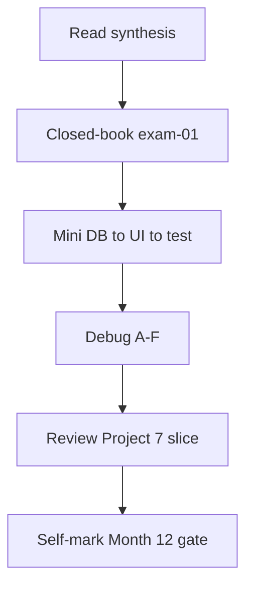

# Month 12 · Week 4 · Day 7
# Month 12 Exam + Gate

**Program:** Full-Stack Mastery · 18 months  
**Phase:** 4 — Full-stack application  
**Month index:** [../../README.md](../../README.md)  
**Week 4:** [1](day-01.md) · [2](day-02.md) · [3](day-03.md) · [4](day-04.md) · [5](day-05.md) · [6](day-06.md) · Day 7 (today)  
**Week rhythm today:** Monthly exam  
**Study time:** 3–4 focused hours (Project 7 continues **after** if the gate is still false)

Textbook files stay **closed** except:

- **this file** (synthesis + exam blocks + self-mark table),
- [Month 12 README gate](../../README.md) headings,
- Project 7 requirements **headings** if you need to remember what the product must contain — not as a source to paste,
- your **own** Project 7 CONTRACT/SLICE only in Block 4 (review), not during Blocks 1–3.

Repair forgotten facts from **this synthesis**, not from Weeks 1–4 day files and not from a full-stack tutorial.

Work in `~\fullstack-lab\month-12-exam\` for exam evidence. Do **not** implement the exam mini inside `~/ops-web/`, `~/ops-api/`, or Project 7. Do **not** start [Month 13](../../../month-13/README.md) because the calendar moved.

---

## How to read this chapter

This file is the **exam and the teacher**. The synthesis is written so a student whose Weeks 1–4 notes are foggy can still re-learn the month from **today’s pages**, then prove it with the blocks and the gate.



During Blocks 1–3, other day files stay closed. If you go blank, re-read **this synthesis**. AI may not write exam-01, the mini-app, or the debug answers.

---

## Today's contract

By the end of this day you will be able to teach Month 12 aloud from this synthesis, change a requirement through **store → API → UI → a test**, debug classic join failures, and **honestly** mark the Month 12 gate.

**Today's gate** is the Month 12 Gate table below — not “I attended four weeks.” If any required row is false, **do not start Month 13**. Continue the join and Project 7.

---

## Time box

| Block | Minutes | Work |
|---|---|---|
| 0 | 25 | Read the complete explanation; speak it |
| 1 | 35 | Closed-book `exam-01.md` |
| 2 | 55 | Mini-build: requirement change DB→API→UI→test |
| 3 | 30 | Debug A–F |
| 4 | 20 | Review Project 7 SLICE vs code |
| 5 | 15 | Break one mini test; restore |
| 6 | 15 | Design: why the client module exists |
| 7 | 20 | Retro + self-mark |

---

## Month 12 synthesis (the lesson, in this book)

**Job.** Connect **React + TypeScript + TanStack Query v5** to **FastAPI + PostgreSQL** (labs may use a stub store; the **exam mini** includes a **visible extra field** you must thread through). A requirement moves **database (or store) → API → UI → tests**.

**Client module.** Components do not call `fetch`. `request()` prefixes **`VITE_API_BASE`**. JSON as **`unknown`**, then DTO/Zod parse. **`!ok` → `ApiError`**. No **`any`**. Empty list is success. **No secrets** in `VITE_*` (they are public in the bundle).

**CORS.** Origin = scheme+host+port. `allow_origins=["http://127.0.0.1:5173"]`. **Not `*`.** `localhost` ≠ `127.0.0.1`. `curl.exe` always gets bodies; browsers need `Access-Control-Allow-Origin`. Credentials (cookies) need **explicit origin** + `allow_credentials=True` — never star. CORS is **not** authentication.

**Query v5 object API.** `useQuery({ queryKey, queryFn })`. `useMutation({ mutationFn })`. **`invalidateQueries({ queryKey: ["noun"] })`**. **`isPending`** is the main first-load flag (not v4 `isLoading` as the taught name). Do not blank on **`isFetching`**. **`gcTime`** not `cacheTime`. Pagination: **`q` / `page` in the URL and the queryKey**. **`placeholderData: keepPreviousData`** (function import, not boolean). Prefix invalidation after writes.

**CRUD.** POST **201**. PATCH `model_dump(exclude_unset=True)`. DELETE **204** no JSON. Pydantic v2 **`model_dump()`** not `.dict()`.

**Optimistic UI.** A bet. **Named risks:** phantom ids, 409 snap-back, server-normalized fields, auth 403, files, lost updates. Default: invalidate after success.

**Uploads.** Multipart ≠ JSON. Do not set Content-Type on `FormData`. **Never trust filename.** Store **path**, not bytes, in Postgres. Cap size 413. Type allowlist.

**Email.** Port `send_email()`. Console in dev. Memory in tests. No SMTP required. No Vite mail secrets.

**Dual validation.** Same rule in RULES.md, Zod, Pydantic. UI courtesy; API law. 422 **loc**. curl bypass still 422.

**Auth sketch.** Session **HttpOnly** cookie **or** token — **justify**. API **401** without credentials. Hiding a button is not authz. Hashing and CSRF: **Month 13**. Defense only; no attack payloads.

**Tests.** New `QueryClient`, `retry: false`. Mock fetch/client, not `useQuery`. TestClient for HTTP + CORS header. Thin Playwright **or** curl.exe + documented UI. Windows: **`curl.exe`**.

**Scaffold.** `npm create vite@latest name -- --template react-ts`. `npm install react-router` — import from **`"react-router"`**.

**Project 7.** Serious domain. This book never dumps the product.

**Wrong belief:** “Full-stack means a boilerplate that already wired CORS and Query.”  
**Correct:** you join pieces you already own, without lying about types or statuses.

The rest of this file unpacks those sentences so the exam is not a vocabulary quiz against a ghost month.

---

# Complete explanation — the join you must still own

## 1. Layers

| Layer | Owns |
|---|---|
| Page | Four UI states, search params |
| Query | Cache, flags, invalidation |
| Client | Base URL, ok, DTO |
| FastAPI | Statuses, Pydantic, CORS |
| Store | Postgres (product) or dict (mini) |

## 2. Requirement change (the gate skill)

Example: “Add `color` to the resource.”

1. Column / dict key / Alembic (product).  
2. Pydantic Create/Out + `model_dump()`.  
3. DTO + parse + form field + Zod.  
4. Test asserts `color` on POST GET.

If you only change the UI, the API lies. If you only change the API, the UI `any`s. The exam mini will add **one field** this way.

## 3. Flags

`isPending`: no success data. `isFetching`: in flight. Mutation `isPending`: write in flight. Empty: success length 0. Error: throw.

## 4. Keys

`["items"]` prefix. `["items", { q, page }]`. `["items", id]`. Invalidate prefix after create.

---

# Block 0 — Speak the synthesis

Out loud, no other files: client vs fetch-in-page; VITE public; CORS 5173 vs star vs curl; Query object API; isPending vs isFetching; gcTime; keepPreviousData; invalidateQueries object; dual validation; filename; email port; cookie vs token one sentence; no any.

Then start Block 1.

---

# Block 1 — Closed-book teaching (`exam-01.md`)

Create `~\fullstack-lab\month-12-exam\exam-01.md`.

15–30 lines, **your** words. Must mention: typed client, `VITE_API_BASE`, CORS 5173, `useQuery({ queryKey, queryFn })`, `isPending`, `invalidateQueries({ queryKey })`, `placeholderData: keepPreviousData` if you paginate, `model_dump()`, dual validation, path-not-bytes **or** email port. No copied textbook paragraphs.

---

# Block 2 — Mini-build: requirement through the stack (55 min)

Textbook closed except this spec.

```powershell
cd ~\fullstack-lab
mkdir month-12-exam\mini -Force
cd ~\fullstack-lab\month-12-exam\mini
```

**Domain (imposed so you cannot paste Project 7): greenhouse `pots`.**

**Starting CONTRACT (implement first if missing):**

| Method | Path | Rules |
|---|---|---|
| GET | `/pots` | 200 envelope `{items, total}`. Item: `id`, `label`. |
| POST | `/pots` | 201. `label` 3–40. CORS 5173. Pydantic Out + `model_dump()`. |

Web: Vite `npm create vite@latest pot-web -- --template react-ts`. Query list + create. Client module. `VITE_API_BASE`. Zod 3–40. `invalidateQueries({ queryKey: ["pots"] })`. Four states.

**Then the exam requirement (you must perform this change):**

> Add **`material`** (`"clay"` \| `"plastic"`) to a pot. Default `"clay"` for old rows if you need it.

Thread it:

1. Store / model / Pydantic Create+Out  
2. DTO + Zod enum or union  
3. Form control  
4. TestClient: POST includes `material`; GET echoes it  
5. UI shows material  

**Must not:** SQLAlchemy required only if you already have it handy — a **module dict** is allowed **in the exam mini**. Product gate still wants you able to do this on **Postgres** in Project 7. Write `WHERE.md`: “mini is dict; Project 7 field change would be Alembic.”

**Must not:** `allow_origins=["*"]`, `any` in `src/`, fetch in pages, Project 7 copy, SMTP, attack payloads.

```powershell
uv run uvicorn main:app --reload --host 127.0.0.1 --port 8000
npm run dev -- --host 127.0.0.1 --port 5173
uv run pytest -q
curl.exe -s http://127.0.0.1:8000/pots
```

---

# Block 3 — Debug (30 min)

Write `exam-03-debug.md`. For each: **what you see**, **cause**, **fix**. No exploit recipes.

**A.** Relative `fetch("/pots")` from Vite.  
**B.** `isFetching` blanks the table on focus refetch.  
**C.** POST 201, list unchanged; no GET after POST.  
**D.** `allow_origins=["*"]` plus planned HttpOnly cookie.  
**E.** `useQuery` mocked in tests; 500 in client never asserted.  
**F.** Added `material` in React state only; curl GET has no `material`.

---

# Block 4 — Review Project 7

Open **only** Day 6 `SLICE.md` / DOMAIN.md and (if it exists) the product CONTRACT. One mismatch: `exam-04-p7.md`. If the slice is uncoded, the month gate row for “from a requirement change the stack” is **false** until you can do it on **some** app you own — the **mini** can evidence the skill; Project 7 still needs a serious domain started.

Do not start Month 13 hashing “while you’re here.”

---

# Block 5 — Break a test

In mini: assert wrong status on POST; pytest or vitest fails; restore. `exam-05-fail.txt`.

---

# Block 6 — Design

`exam-06-design.md` (10–15 lines): why a client module is the place for `credentials` or `Authorization` later. Why Query is not that place.

---

# Block 7 — Retro + self-mark

`exam-07-retro.md`: weakest layer (client, CORS, Query, validation, types, Project 7).

---

## Month 12 Gate (self-mark)

True **without a tutorial**. Evidence paths are yours.

| # | Claim | Evidence | Pass? |
|---|---|---|---|
| 1 | Typed client (or fetch wrapper) — not raw `fetch` in every component | lab + product `src/api` | |
| 2 | `VITE_API_BASE` (or equivalent); **no secrets** in the frontend bundle | `.env.example` | |
| 3 | CORS only as wide as local Vite `http://127.0.0.1:5173`, not `*` | middleware | |
| 4 | List/detail/create/edit with loading, empty, error (detail/edit may be lab) | UI | |
| 5 | Filter/search/pagination in the **URL** and the **queryKey** (lab Week 2 or product) | keys + URL | |
| 6 | Mutations invalidate the right keys; optimistic UI only when you can name the risk | invalidate + RISK | |
| 7 | Validation on **both** sides (Zod + Pydantic) for the same rule | RULES + tests | |
| 8 | From a new requirement, change **DB/store → API → UI → a test** without a tutorial | exam mini `material` + Project 7 intent | |

If any **required** row is false, **do not start Month 13**. Keep joining. Keep Project 7.

```powershell
cd ~\fullstack-lab
git add month-12-exam
git commit -m "Complete Month 12 exam evidence."
```

---

## If you passed

Month 13 is **Authentication, Authorization, and Security**. Open [Month 13 README](../../../month-13/README.md) only when this gate is true. Bring JUSTIFY.md (cookie vs token). This book will still **not** dump Project 7 auth source. Defense only.

## If you did not pass

Stay on Month 12. This synthesis remains the teacher. Project 7 remains yours to slice.

---

If the gate table has a false row, the honest action is more join work, not JWT tutorials.

---

## Optional review links

Repair from this synthesis first.

- [TanStack Query v5](https://tanstack.com/query/latest/docs/framework/react/overview)
- [FastAPI CORS](https://fastapi.tiangolo.com/tutorial/cors/)
- [Vite env](https://vitejs.dev/guide/env-and-mode.html)
- [Pydantic serialization](https://docs.pydantic.dev/latest/concepts/serialization/)

---

## Debug keys (after you write A–F)

**A.** Hits Vite, not Uvicorn. Prefix `VITE_API_BASE` in the client.

**B.** First load is `isPending`. Keep rows on `isFetching`.

**C.** `invalidateQueries({ queryKey: ["pots"] })` on mutation success.

**D.** Browsers reject `*` with credentials. Explicit 5173.

**E.** Mock fetch or the client function. Keep Query real.

**F.** Thread the field through store, Out, DTO, UI, test — the gate skill.

If you wrote “React bug” or “Chrome bug” for CORS/Query, rewrite from the synthesis.

---

# Lecture: the exam is a field named material

The month is not “I have Vite and I have Uvicorn.” The month is **one new fact** surviving every layer. `material` is that fact today. Project 7 will be `priority` or `sku` or `starts_at`. Same motion.

Query schedules. The client speaks HTTP. FastAPI validates. The store remembers. Tests catch the layer you skipped.

`curl.exe` proves HTTP. The browser proves CORS. RTL proves states. TestClient proves 201 and 422 loc.

HttpOnly and Month 13 wait until this join is boring.

Mini is pots in `month-12-exam`. Not ops-web. Not a todo. Not a source dump from this book.

---

## Definition of done

- [ ] exam-01.md from memory  
- [ ] Mini pots + `material` through the stack  
- [ ] Debug A–F sentences  
- [ ] Gate table marked honestly  
- [ ] I will not open Month 13 if a required row is false  

---

# Worked session — pots then material

uv FastAPI envelope. CORS 5173. Vite extra `--`. Client no any. Query object API. Zod 3–40. POST 201. invalidateQueries. pytest POST/GET. Then add `material` everywhere. curl.exe. Break a test; restore.

`isPending` / `gcTime` / `keepPreviousData` named in exam-01 if you paginated; if the mini has no pages, still **name** them as Week 2 skills in exam-01.

No `cacheTime`. No tuple useQuery. No `*`. No Project 7 paste. `model_dump()`. Import from `"react-router"` if you route.

---

# Closing lecture — gate, then Month 13

The gate is eight claims. Typed client. Public env only. CORS 5173. Four UI states. URL+keys. Invalidate and named optimistic risk. Zod+Pydantic. Requirement through the stack.

Month 13 asks who you are and what you may do. It assumes this join. If `fetch` still lives in the page, repair before passwords.

JUSTIFY.md cookie vs token goes with you. Hashing is not today’s mini.

When every row is true, open [week-01/day-01 of Month 13](../../../month-13/week-01/day-01.md) if that file exists, or the [Month 13 README](../../../month-13/README.md).

---

## Recite-back checklist (close the editor, then tick)

Write `RECITE.txt` with one honest sentence per line.

- [ ] client is the only fetch
- [ ] VITE_API_BASE public
- [ ] CORS 5173 not star
- [ ] useQuery object API; isPending
- [ ] invalidateQueries object
- [ ] gcTime not cacheTime
- [ ] keepPreviousData function
- [ ] model_dump
- [ ] dual validation
- [ ] material through the stack
- [ ] mini not Project 7
- [ ] Month 13 only if gate true

If any debug answer says the framework is haunted, rewrite it from the synthesis in this file.
