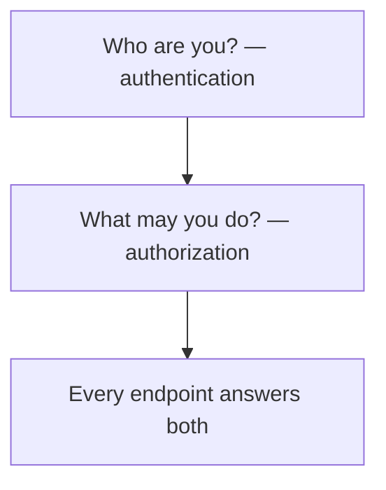

# Month 13 — Authentication, Authorization, and Security

**Program:** Full-Stack Mastery Textbook  
**Phase:** 4 — Full-stack application engineering  
**Length:** 4 weeks · 7 days each · 3–4 focused hours/day  
**Prereq:** Month 12 gate passed (you can change DB → API → UI)  
**This month’s job:** Make **who someone is** and **what they may do** real — then **threat-model** Project 7. This book teaches **defense**. It does not teach you to break systems you do not own.

**Project 7** continues. This textbook will **not** give you auth source for the product.

---

## How this textbook is organized

```
month-13/
  README.md     ← you are here
  week-01/      passwords, sessions, cookies, tokens, JWT trade-offs
  week-02/      OAuth/OIDC concepts, reset, verify, 2FA concepts
  week-03/      XSS, CSRF, injection, CORS myths, CSP, secrets
  week-04/      RBAC, ownership, least privilege, threat model, tests
```

Labs: `~\fullstack-lab\month-13\`. Work on **your** Project 7.

---

## Two questions



**Wrong belief:** “Hiding a button in React is authorization.”  
**Correct:** the API must refuse. The UI is courtesy.

**Wrong belief:** “JWT is how modern apps authenticate.”  
**Correct:** JWT is **one** design. Sessions with HttpOnly cookies are often simpler and safer for a first-party browser app. You will **choose** and **justify**.

---

## Month 13 Gate

True **without a tutorial**:

1. Store password **hashes** (argon2 or bcrypt); never log passwords or tokens.  
2. Explain session cookie vs access/refresh tokens and **JWT trade-offs**.  
3. Cookie flags: **HttpOnly**, **Secure**, **SameSite** — what each prevents.  
4. Explain XSS and CSRF as **classes of bug** and the **mitigations** you use (encoding, CSP concept, SameSite / CSRF token).  
5. Parameterized SQL / ORM binds — never string-built queries.  
6. CORS is not authentication.  
7. **Ownership or role check** on mutating endpoints; tests that **deny** the wrong user.  
8. A written threat model: assets, actors, trust boundaries, mitigations.

If any item is false, do not start Month 14.

---

## How this book talks about attacks

We describe what an unauthorized person **might try** so you can **stop it**. We do not provide exploit programs, payloads to paste into a live site, or step-by-step intrusion recipes.

---

## Start

Open [week-01/day-01.md](week-01/day-01.md).

When Month 13’s gate is true, continue with [Month 14](../month-14/README.md).
