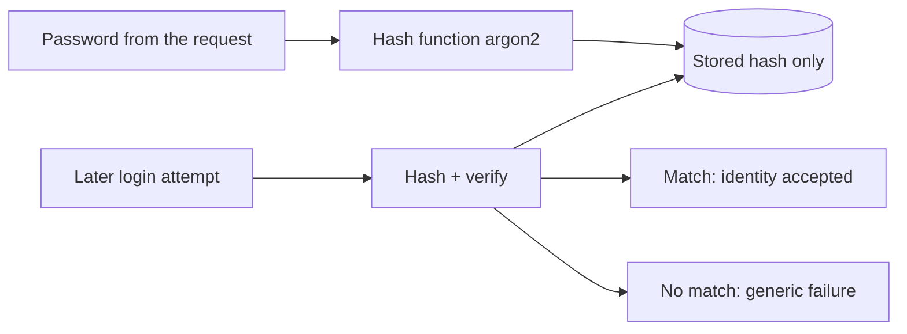

# Month 13 · Week 1 · Day 1
# Passwords: Hash, Never Store, Never Log

**Program:** Full-Stack Mastery · 18 months  
**Phase:** 4 — Full-stack application  
**Month index:** [../../README.md](../../README.md)  
**Week 1:** Day 1 (today) · [2](day-02.md) · [3](day-03.md) · [4](day-04.md) · [5](day-05.md) · [6](day-06.md) · [7](day-07.md)  
**Week rhythm today:** Learn + type-along  
**Student state:** Month 12 gate passed. You can change database → API → UI. Today **who someone is** starts with a secret you must **not** keep in a form that can leak.  
**Study time:** 3–4 focused hours

**This week covers:** password hashing, credential storage, sessions, cookies, tokens, JWT trade-offs.

Today: why plaintext passwords are a product disaster, what a **password hash** is, **argon2** (or bcrypt) as the library you call, and the rule **never log the password**. Sessions and cookies are Day 2. Do not skip them.

This book teaches **defense**. It does not teach you to break other people’s systems.

Labs: `~\fullstack-lab\month-13\week-01\day-01\`. Do not paste Project 7 auth.

---

## How to use this textbook

1. Read a section. Close it. Say it.
2. Type the hashing lab. Use a **throwaway** password you do not use anywhere else.
3. If you ever see a password in a log file, treat that as a **bug you fix today**.
4. Optional review links are for later rechecking.

---

## How to read this chapter

Authentication answers **who are you?** The usual first-party answer is: you prove you know a password. The server must **verify** that proof without **storing** the password.



**Wrong belief:** “I’ll encrypt passwords so I can decrypt them if the user forgets.”  
**Correct:** encryption is reversible with a key. A password store must be **one-way**. Forgot-password is a **reset**, not a retrieval. Week 2.

**Wrong belief:** “Base64 is hashing.”  
**Correct:** Base64 is encoding. Anyone can reverse it. It is not protection.

---

## Today's contract

By the end of this day you will be able to:

1. Explain **hash** vs **encryption** vs **encoding** in one sentence each.
2. Hash a password with **argon2** (preferred) or **bcrypt** and verify a later attempt.
3. Store only the hash in a dict or table — never the password.
4. Name **salt** as something modern password hashes **include** (you do not invent a salt scheme today).
5. Write a register/login pair of functions that return generic errors (no “email not found” vs “wrong password” split **yet** — you will discuss enumeration on Day 5).
6. Grep your lab: the password string must not appear in logs.

**Today's gate.** Closed-book:

> I store a slow password hash, not the password. Verification uses the library compare. I cannot get the password back from the hash. Logs and git never contain the password. Reset is a future token, not decryption.

---

## Time box

| Block | Minutes | Work |
|---|---|---|
| A | 50 | Theory |
| B | 65 | Type-along: hash + verify + tiny store |
| C | 50 | Independent: FastAPI register/login JSON, no JWT yet |
| D | 20 | Git + secret hygiene |
| E | 15 | Recall |

---

# Block A — Theory

## 1. Why this is Week 1 of security

If you keep passwords as text, a stolen backup is a stolen identity **and** a stolen identity on every other site where that person reused the password. You do not control reuse. You control **your** store.

A **hash** maps input to a fixed-size string that is not designed to be reversed. Password hashes are **slow** on purpose so guessing many passwords is expensive. `sha256` of a password is the wrong tool: it is fast, and people have tables of common passwords hashed that way. Use **argon2id** or **bcrypt**.

## 2. Salt, in one honest paragraph

If two users pick the same password, a naive hash would look the same in the database. That helps an attacker who stole the hash file. A **salt** is extra random data mixed in so the stored values differ. Modern password hashing APIs **generate and store the salt inside the hash string**. You call `hash()` and `verify()`. You do not concatenate salts by hand in this course.

## 3. Verify

Never write `if hash(password) == stored` with a fast hash you invented. Use the library’s `verify(password, stored_hash)`. That function knows the algorithm parameters embedded in the stored string.

## 4. What you log

Log: user id after success, “login failed” without the password, request id (Month 11).

Do not log: password, Authorization header, cookie values, reset tokens.

**Wrong belief:** “Debug mode is private on my laptop, so printing the body is fine.”  
**Correct:** debug prints get copied into tickets. Treat the lab like a habit you will keep.

## 5. What today is not

Today is **not** OAuth, not JWT, not 2FA. A dict of `{email: hash}` is enough to learn hashing. Day 2 puts a **session id** in a cookie. Month 12’s UI can wait until you have something safe to cookie.

---

# Block B — Type-along

## B1. Project

```powershell
mkdir ~\fullstack-lab\month-13\week-01\day-01 -Force
cd ~\fullstack-lab\month-13\week-01\day-01
uv init --name m13d01
uv add argon2-cffi
```

## B2. `passwords.py`

Use a password you will **never** reuse on a real site. Example below uses `lab-only-pass` — type it; do not replace it with a real password of yours.

```python
from argon2 import PasswordHasher
from argon2.exceptions import VerifyMismatchError

hasher = PasswordHasher()


def hash_password(plain: str) -> str:
    return hasher.hash(plain)


def verify_password(plain: str, stored: str) -> bool:
    try:
        return hasher.verify(stored, plain)
    except VerifyMismatchError:
        return False
```

## B3. `demo.py`

```python
from passwords import hash_password, verify_password

stored = hash_password("lab-only-pass")
print("hash starts with:", stored[:20])
print("ok password:", verify_password("lab-only-pass", stored))
print("wrong password:", verify_password("nope", stored))
```

```powershell
uv run python demo.py
```

You should see a hash that is **not** `lab-only-pass`, `True`, then `False`.

Hash the same password a second time. The strings **differ** (salt). Both still verify. Write that in `NOTES.md`.

## B4. Tiny store

`store.py`:

```python
from passwords import hash_password, verify_password

USERS: dict[str, str] = {}


def register(email: str, password: str) -> None:
    if email in USERS:
        raise ValueError("could not register")
    USERS[email] = hash_password(password)


def login(email: str, password: str) -> bool:
    stored = USERS.get(email)
    if stored is None:
        return False
    return verify_password(password, stored)
```

Register Ada. Login with the right password. Login with the wrong password. Print `USERS` and confirm it contains **hashes**, not `lab-only-pass`.

---

# Block C — Independent

Add FastAPI (`uv add fastapi uvicorn`). Two routes:

- `POST /register` body `{email, password}` → 201, body `{email}` **without** password or hash.
- `POST /login` → 200 `{ok: true}` or 401 `{detail: "invalid credentials"}` for **both** unknown email and wrong password.

Use `curl.exe` with JSON. Do not put the password on a command line you will screenshot into git. A local file `body.json` that is **gitignored** is safer than a shell history you later paste.

Write `HYGIENE.md`: how you avoided logging the password; that hashes are not returned in JSON.

Do **not** add JWT. Do **not** add cookies yet.

---

# Block D — Git

```powershell
cd ~\fullstack-lab
git add month-13/week-01/day-01
git commit -m "Month 13 Week 1 Day 1: argon2 hash and verify."
```

Search the commit diff for `lab-only-pass` inside source that will be pushed. Demo scripts that hash a **fictional** lab password are OK. Real passwords are not.

---

# Block E — Recall

1. Hash vs encryption.  
2. Why sha256(password) is the wrong store.  
3. Why two hashes of one password differ and both verify.  
4. What login JSON must never include.  
5. Why forgot-password cannot “look up” the password.

## Office hours

**`argon2` install fails on Windows.** Use the wheel from pip via `uv add argon2-cffi`. If a compiler error appears, you are missing a build path — `uv` should prefer wheels. bcrypt is the backup: `uv add bcrypt`, still a real password hash.

**Verify always false.** You swapped argument order. Argon2’s `verify(stored, plain)` — match the library. In the wrapper above, `hasher.verify(stored, plain)` follows argon2-cffi.

---

## Definition of done

- [ ] Hash and verify run locally  
- [ ] Store holds hashes only  
- [ ] Independent HTTP register/login without leaking secrets in responses  
- [ ] Commit exists  

---

## Tomorrow

Session ids and cookies: a random unguessable id, stored server-side, sent as **HttpOnly** cookie. JWT is a trade-off you will **name**, not a default.

---

## Optional review links

Password hashing is explained in this chapter. These pages are for later checking, not for first learning.

- [OWASP: Password Storage Cheat Sheet](https://cheatsheetseries.owasp.org/cheatsheets/Password_Storage_Cheat_Sheet.html)
- [argon2-cffi documentation](https://argon2-cffi.readthedocs.io/)
