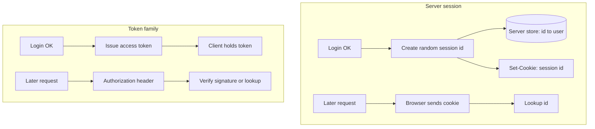
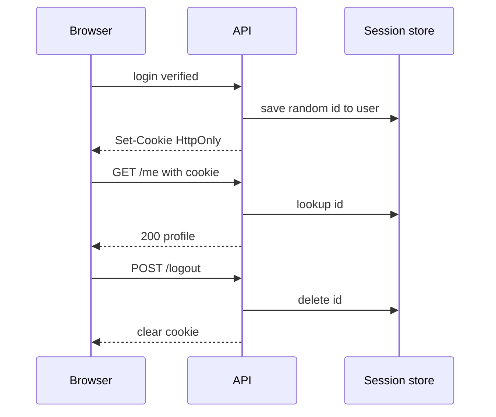

# Month 13 · Week 1 · Day 2
# Sessions vs Tokens, Cookies, and a Session Id

**Program:** Full-Stack Mastery · 18 months  
**Phase:** 4 — Full-stack application engineering  
**Month index:** [../../README.md](../../README.md)  
**Week 1:** [1](day-01.md) · Day 2 (today) · [3](day-03.md) · [4](day-04.md) · [5](day-05.md) · [6](day-06.md) · [7](day-07.md)  
**Week rhythm today:** Exercises + debugging  
**Student state:** Day 1 gate passed. You can hash with argon2/bcrypt. Today you learn **what the browser and API remember after login** — still not a paste of Project 7.  
**Study time:** 3–4 focused hours

**This week covers:** hashing (done), sessions vs tokens, cookies, JWT trade-offs, then memory-day register/login sketch.

Today: **server sessions**, **bearer tokens**, **cookies**, and the definition of a **session id**. Cookie **flags** (HttpOnly, Secure, SameSite) are named today and **labbed** on Day 4. JWT is a **trade-off**, not a default.

Labs: `~\fullstack-lab\month-13\week-01\day-02\`.

---

## How to use this textbook

1. Read a section. Close it. Say which side stores the truth.  
2. Draw the two sequences on paper before you type.  
3. Do not assume JWT. First-party browser apps often want **server sessions + HttpOnly cookies**.  
4. Optional review links are for later rechecking.

Defense only: we describe what an unauthorized person **might try** so you can **stop it**. No intrusion recipes.

---

## How to read this chapter

After verify succeeds (Day 1), the API must **remember** the user on the next request. There are two honest families:

1. **Server session:** the server stores “this random id means user 42.” The browser stores **only the id**, usually in a **cookie**.  
2. **Token:** the client stores a **string** (often in memory, sometimes in a cookie) and sends it on each request (often `Authorization: Bearer ...`). The server **verifies** the string. If the string is a **JWT**, the server may not have a row per session — that is a **feature and a bug**.



**Wrong belief:** “JWT is how modern apps authenticate.”  
**Correct:** JWT is **one** design. For a **first-party** React app talking to **your** FastAPI on a known origin, **HttpOnly session cookies** are often simpler: logout is a delete, you can revoke, the SPA does not hold a bearer in `localStorage`.

**Wrong belief:** “A session id is the user id.”  
**Correct:** a session id is a **random, unguessable** string. The **server** maps it to a user. If the id were `42`, anyone might **try** `Cookie: session=43`. **What prevents it** is cryptographic-length randomness and server-side lookup.

---

## Today's contract

By the end of this day you will be able to:

1. Define **session id**: random, unguessable, stored **server-side**, sent by the client as a cookie (typical) or header.  
2. Contrast **server session** vs **access token** vs **refresh token**.  
3. Explain what a **cookie** is (name, value, attributes) without making it a JWT lecture.  
4. List **JWT trade-offs**: no built-in revoke, size, algorithm mistakes, SPA storage mistakes.  
5. Say why **localStorage** is a poor home for a bearer if XSS ever runs.  
6. Choose nothing final yet — Day 6 is AUTH.md. Today you **understand both**.

**Today's gate.** Closed-book:

> A session id is random and mapped on the server. A cookie is how browsers attach that id. Tokens are strings the client sends. JWT is optional and has revoke and storage costs. First-party apps often should prefer sessions. I still have not pasted Project 7.

---

## Time box

| Block | Minutes | Work |
|---|---|---|
| A | 50 | Theory |
| B | 55 | Paper + tiny session-store sketch |
| C | 70 | Debug beliefs + JWT trade-off sheet |
| D | 20 | Git |
| E | 15 | Recall |

---

# Block A — Theory

## 1. The job after login

HTTP is **stateless** unless you add state. Each request is a new envelope. “Logged in” means **this request carries proof** the server accepts.

Proof families:

| Proof | Where the mapping lives | Typical transport |
|---|---|---|
| Session id | Server (memory, Redis, DB table) | Cookie |
| Opaque access token | Server table (like a session) | `Authorization` or cookie |
| JWT access token | Inside the token (signed) | `Authorization` or cookie |
| Refresh token | Server table (must be revocable) | Cookie (better) or body |

**Opaque** means the bytes are random; the server looks them up. **JWT** means the bytes are a signed document the server can parse without a row — unless you add a denylist, which is “sessions again, with extra steps.”

---

## 2. What a session id is

Requirements for this course:

- **Random** — from `secrets.token_urlsafe` (or equivalent), not `random.randint`, not `user.id`, not `hash(email)`.  
- **Unguessable** — long enough that guessing ids is not a practical way in. Do not invent “short codes” for sessions.  
- **Stored server-side** — a table or Redis key: `session_id → user_id, expires_at, maybe user_agent hash`.  
- **Rotated** on login and, later, on privilege change.  
- **Deleted** on logout. That is the gift of server sessions: logout is real.

The client stores the id **only** as the cookie value (or a header you designed). The client does **not** store `user_id` as the proof.

**Wrong belief:** “I’ll use UUID of the user as the cookie.”  
**Correct:** identifiers are **guessable or leakable**. Sessions are **handles**, not names.

What an unauthorized person might **try**: send a guessed cookie value. **What prevents it:** unguessable ids plus expiry plus (Day 4) cookie flags so other bugs cannot **read** the cookie from JavaScript.

---

## 3. Cookies, in language you already know

A **cookie** is a small name=value the **server** may send with `Set-Cookie`. The **browser** stores it and **attaches** it to later requests for that site, according to rules (domain, path, flags).

Important for auth:

- Cookies are **automatic**. The SPA does not have to remember to set a header if you use cookies. `fetch` needs `credentials: 'include'` across origins — and you should **avoid** extra origins if you can. Same-site API via Vite proxy is a gift.  
- Cookies are visible to JavaScript **unless HttpOnly**. Day 4.  
- Cookies travel on **every** matching request, including images and forms. That is why **CSRF** exists as a class of bug (Week 3) when cookies are the proof.

**Wrong belief:** “Cookies are outdated; tokens are modern.”  
**Correct:** cookies are a **transport**. Tokens are a **value**. You can put a session id in a cookie. You can put a JWT in a cookie. The arguments are about **where state lives** and **what XSS/CSRF can do**, not about fashion.

---

## 4. Access tokens and refresh tokens

If you choose tokens instead of (or besides) a session cookie:

- **Access token:** short-lived proof for APIs.  
- **Refresh token:** longer-lived, used **only** at a refresh endpoint to mint a new access token. Store refresh **server-side hashed** (like a password of a token) or as a rotating random value in a table. Logout deletes the row.

**Rotation:** when refresh is used, issue a new refresh and **invalidate** the old one. If the old one appears again, treat it as stolen and kill the family. That is a **concept** today; you will not paste a blog’s refresh machine.

**Wrong belief:** “I’ll put a 30-day JWT in localStorage and skip refresh.”  
**Correct:** then logout cannot kill it, XSS can read it, and every API request carries a long-lived key. Prefer short access + revocable refresh **or** a server session.

---

## 5. JWT trade-offs (required literacy)

A **JWT** is a signed (sometimes encrypted) blob with claims (`sub`, `exp`, …). FastAPI tutorials love it because it looks like one dependency.

**Possible upsides:**

- Stateless verify at many servers without a shared session store.  
- Claims travel with the request.

**Costs you must name before you choose it:**

| Cost | Why it hurts |
|---|---|
| **Revoke** | Until `exp`, a stolen JWT works unless you keep a **denylist** (that is a store again). Logout becomes “please wait.” |
| **Secret / key** | `algorithm=none` class of mistakes, weak secrets, keys in Git. Use a real library; never decode without verify. |
| **Size** | It is sent every request. Do not stuff a profile into it. |
| **SPA storage** | If you put it in `localStorage`, any XSS can read it. HttpOnly cookie is better transport — then you have CSRF to design (Week 3). |
| **Confusion with identity** | OIDC **ID tokens** are for **who**; access tokens are for **APIs**. Do not send an ID token as an access token because a blog did. |

**Wrong belief:** “I’ll use JWT because FastAPI’s OAuth2PasswordBearer example did.”  
**Correct:** that example is a **shape**. Day 6 you **justify** sessions or tokens for **your** first-party app. Many students should pick **server sessions**.

This course: you **may** use JWT if you can write the revoke story. You **must not** use JWT because it is popular.

---

## 6. Where the frontend keeps proof

| Place | XSS can read? | Sent automatically? | Notes |
|---|---|---|---|
| `localStorage` | Yes | No | Poor for bearers. |
| JS memory (variable) | Only while XSS runs in that page | No | Lost on refresh; you then need refresh cookie or re-login. |
| HttpOnly cookie | **No** (JS cannot `document.cookie` it) | Yes | Day 4 flags. CSRF design if cookies authenticate. |
| Non-HttpOnly cookie | Yes | Yes | Worst of both for a session. |

**Wrong belief:** “I’ll store JWT in localStorage; XSS is Week 3.”  
**Correct:** storage choice **is** an XSS mitigation. Choose now; Week 3 explains the bug class.

---

## 7. Same-origin vs cross-origin (preview)

If Vite is `:5173` and API is `:8000`, they are **different origins**. Cookies need `SameSite` and CORS **credentials** care. Month 12 already forbade `allow_origins=["*"]`. Week 3 Day 4: CORS is **not** authentication.

Simpler pattern: Vite **proxy** so the browser thinks one origin. Then session cookies are less dramatic. Record whether Project 7 uses a proxy in `NOTES.txt`.

---

## 8. What an unauthorized person might try

- **Try** to guess a session id. **Prevent:** `secrets.token_urlsafe` (32+ bytes of randomness, URL-safe string).  
- **Try** to reuse a stolen cookie. **Prevent:** HTTPS (`Secure` flag, Day 4), short expiry, logout deletes server row, later: binding extras (optional).  
- **Try** to read a token from JS. **Prevent:** HttpOnly cookie; do not use localStorage for the session.  
- **Try** to call the API with no cookie. **Prevent:** endpoints that **require** a valid session (Week 4: then **authorization**). Missing proof is **401**.

We do not practice stealing cookies. We design so theft is harder and logout works.

---

## 9. Server store options (choose later, know now)

| Store | Fits |
|---|---|
| Signed cookie with **no** server list | Looks simple; **logout and revoke are weak** unless you keep a denylist anyway. |
| PostgreSQL `sessions` table | Fine for Project 7 scale. Expiry index. |
| Redis | Fine if Month 11 Redis is already justified. Do not add Redis **only** to feel production. |
| Memory dict | Lab only. Process restart logs everyone out. |

Project 7: a **table** is an honest default.

---

## 10. 401 vs 403 (names today, depth Week 4)

- **401 Unauthorized** in HTTP language: **we do not know who you are** (missing/bad session). Odd word; think “unauthenticated.”  
- **403 Forbidden:** we know who you are; you **may not** do this (Week 4).

Do not send 200 `{error: "please login"}`.

---

# Block B — Type-along

```powershell
cd ~\fullstack-lab
mkdir month-13\week-01\day-02 -Force
cd ~\fullstack-lab\month-13\week-01\day-02
uv init --name lab-session-id
uv add --dev pytest
```

Create `session_store.py` — a **dict** lab, not Project 7:

- `create_session(user_id: int) -> str` using `secrets.token_urlsafe(32)`.  
- Store `{sid: {"user_id", "expires_at"}}` with a short expiry (e.g. 15 minutes) from `datetime.now(timezone.utc)`.  
- `get_user_id(sid: str) -> int | None` if missing or expired.  
- `revoke(sid: str) -> None`.

Tests:

- Created id is **not** equal to `str(user_id)`.  
- Two logins → two ids.  
- Wrong id → `None`.  
- After `revoke`, lookup is `None`.  
- Optional: freeze time or set `expires_at` in the past in the dict; lookup `None`.

Write `WHY-RANDOM.txt`: what an unauthorized person might try if ids were `1`, `2`, `3` — and what randomness prevents. Conceptual sentences. No attack script.

Do not add FastAPI unless extra time. If you do, **do not** paste OAuth2PasswordBearer as a default.

---

# Block C — Independent debugging of beliefs

Write `TRADEOFFS.md` (your words, 25–40 lines):

1. Server session + HttpOnly cookie — upsides, downsides (CSRF class, scaling the store).  
2. Opaque token in Authorization header — upsides, downsides (SPA must store it; XSS if localStorage).  
3. JWT access token — upsides, downsides (revoke, keys, size).  
4. Which you **lean toward** for a first-party Project 7 app, and why. **Not final** — Day 6 is final.  
5. One sentence: JWT is not required for “modern.”

Write `DEBUG-BELIEFS.md`:

**A.** A classmate stores `user_id` in a cookie named `session`. What might someone try? What do you change?  
**B.** A classmate puts a 7-day JWT in `localStorage`. Name two defenses they skipped.  
**C.** A classmate says “logout” on a stateless JWT API with no denylist. What does the server actually do?  
**D.** A classmate uses PowerShell `curl` alias to test cookies. What should they type instead?

```powershell
# When you later have a server, inspect headers with:
curl.exe -s -D - http://127.0.0.1:8000/health -o NUL
```

No live attack on anyone’s site. Lab is local.

```powershell
cd ~\fullstack-lab
git add month-13
git commit -m "Month 13 Day 2: session id store sketch and JWT trade-offs."
```

---

# Block E — Recall

1. Session id vs user id.  
2. Where the mapping lives for a server session.  
3. Why logout is easy with a server row and hard with a bare JWT.  
4. Why localStorage is a poor bearer home.  
5. 401 vs 403 in one line each.

---

## Office hours

**Used `random.random()`.** Use `secrets`.  
**Session key is email.** Emails leak in URLs and support tickets. Random id.  
**Copied a 200-line JWT gist.** Delete it. Day 6 justification first.  
**Thought cookies cannot be used with fetch.** `credentials: 'include'` and CORS — later. Same-origin proxy is easier.  
**Named the cookie `jwt` but stored a session id.** Names should tell the truth.



---

# Lecture: first-party is the usual Project 7

Project 7 is **your** React and **your** API. That is **first-party**. The hard JWT cases (many mobile clients, third-party APIs, microservices) are not your default this month.

If you still want tokens: prefer **opaque** tokens in a table — they revoke like sessions — over JWT until you can lecture revoke honestly.

**Refresh in localStorage** is still XSS-visible. If you use refresh, prefer **HttpOnly cookie** for refresh and a short access token in memory — a hybrid that you must **draw**, not copy.

**Do not** send tokens in query strings. They land in logs and Referer.

**Do not** commit signing keys. Week 3 Day 5.

---

## Definition of done

- [ ] `session_store.py` tests green  
- [ ] Ids are not user ids  
- [ ] `TRADEOFFS.md` names JWT costs  
- [ ] `DEBUG-BELIEFS.md` A–D answered  
- [ ] I can say “session id” in one breath: random, unguessable, server-side  
- [ ] Commit exists  

---

## Optional review links

- [OWASP: Session Management Cheat Sheet](https://cheatsheetseries.owasp.org/cheatsheets/Session_Management_Cheat_Sheet.html)  
- [MDN: HTTP cookies](https://developer.mozilla.org/en-US/docs/Web/HTTP/Guides/Cookies)  
- [RFC 6265: cookies](https://datatracker.ietf.org/doc/html/rfc6265)

---

## Tomorrow

**From memory:** register + login **sketch** with hashing. No complete product. Days 1–2 closed during the build.

---

# Closing lecture — the id is a handle

A session id is not the user. It is a random handle.
The server keeps the map. Logout deletes the map.
A cookie carries the handle if you choose cookies.

JWT is a signed document. It does not magically revoke.
localStorage is readable by any script the page runs.
HttpOnly exists to keep scripts off the session cookie (Day 4).

First-party Project 7: sessions are the default to beat.
Tokens are allowed with a written revoke story.
Do not paste OAuth2PasswordBearer and call it architecture.

secrets.token_urlsafe. Not user.id. Not email.
401 means we do not know you. 403 means we do, and no.

Lab path: `~\fullstack-lab\month-13\week-01\day-02\`.
curl.exe when you inspect Set-Cookie later. Not the curl alias.

---

## Recite-back checklist (close the editor, then tick)

Write `RECITE.txt` with one honest sentence per line.

- [ ] Session id is random and server-mapped  
- [ ] Cookie is transport  
- [ ] JWT trade-offs named  
- [ ] Logout needs a server-side row or denylist  
- [ ] localStorage is a poor secret drawer  
- [ ] 401 vs 403  
- [ ] First-party often wants sessions  
- [ ] No product paste  

If a line is mush, re-read this file only.
