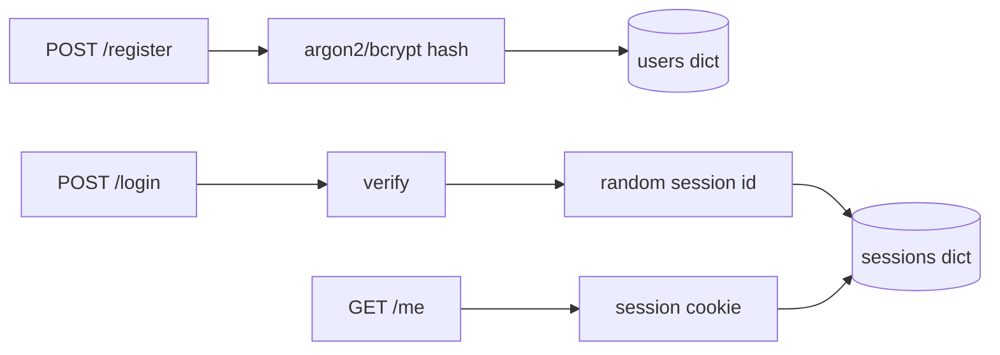

# Month 13 · Week 1 · Day 3
# From Memory: Register and Login Sketch (Hash, No Product Dump)

**Program:** Full-Stack Mastery · 18 months  
**Phase:** 4 — Full-stack application engineering  
**Month index:** [../../README.md](../../README.md)  
**Week 1:** [1](day-01.md) · [2](day-02.md) · Day 3 (today) · [4](day-04.md) · [5](day-05.md) · [6](day-06.md) · [7](day-07.md)  
**Week rhythm today:** Implement from memory  
**Student state:** Day 2 gate passed. You can hash and you can define a session id. Today those ideas must still live in your head — from **this file**.  
**Study time:** 3–4 focused hours  
**Prereq:** Day 2 gate passed.

Labs: `~\fullstack-lab\month-13\week-01\day-03\`. Do **not** copy Day 1–2 files. Do **not** paste Project 7. Do **not** paste a FastAPI users tutorial. The noun is a **lab locker** account, not your product domain.

---

## How Day 3 works

Days 1–2 had type-along code. During the drills they stay **closed**. This file contains a recap so you are not sent to another site to learn.

Allowed:

- The complete explanation in this file  
- Your own notes in `fullstack-lab`  
- The HTTP response in front of you (`curl.exe`, `/docs`)

Not allowed:

- Pasting a finished auth app from AI  
- Copying Day 1 `hash_demo.py` or Day 2 `session_store.py` as the whole answer (you may **retype** ideas)  
- Opening Project 7 as a source to copy  

If you are stuck **more than 25 minutes** on one task, open **only** the matching Day 1 or Day 2 section **in this textbook**, read it, close it, continue from memory. Record lookups in `lookups.txt`.

There is **no complete product** in this file. You write a **sketch**: register, login, logout, `/me`. In-memory is allowed. PostgreSQL is allowed only if you already have a test DB habit — not required. Do not grow into workspaces and RBAC. That is Week 4.

---

## How to read this chapter

Register **hashes**. Login **verifies** then **creates a session id**. Later requests **present** the id. Logout **revokes** it. Responses **never** include password or hash.



**Wrong belief:** “Memory day means I should clone a GitHub auth boilerplate.”  
**Correct:** the recap below is the teacher. A locker API with two dicts is the exam.

---

## Complete explanation (auth you must still own)

**Hashing:** `passlib` argon2 (or bcrypt). `hash(plain)` at register. `verify(plain, stored)` at login. Salt is **inside** the stored string. Never store plaintext. Never log the password. Never return the hash. Timing-safe compare is **the library**, not your `==`.

**Session id:** `secrets.token_urlsafe(32)`. Map `sid → user_id` plus expiry on the **server**. Not `user.id`. Not email.

**Cookie (minimal today):** `Set-Cookie` with the session id. Day 4 you will set **HttpOnly**, **Secure**, **SameSite** on purpose. Today, if you set a cookie at all, **set HttpOnly already** — it is one argument and it is the right habit. If cookie wiring steals the hour, you may pass `X-Session-Id` in a header **for the lab only** and write `TRANSPORT.txt` saying cookies are the real Project 7 plan. Do not use that header as a product standard.

**Statuses:**

| Event | Status |
|---|---|
| Register success | **201** + UserOut (id, email; no hash) |
| Register duplicate email | **409** |
| Register bad body | **422** |
| Login success | **200** + UserOut (and Set-Cookie or documented header) |
| Login failure | **401** generic message — same whether email missing or password wrong (Day 5 deepens this) |
| GET /me with valid session | **200** UserOut |
| GET /me missing/bad session | **401** |
| Logout | **204**; session gone |

**401** means we do not accept the proof. **403** is for later (we know you; you may not).

**Pydantic:** `RegisterIn` has `email`, `password`. `LoginIn` has `email`, `password`. `UserOut` has `id`, `email` only. `response_model=UserOut` on register, login, me.

**Store:** `USERS: dict[int, dict]` with `password_hash`. `SESSIONS: dict[str, dict]`. Fixture **clears both** in tests.

**Uvicorn:** `uv run uvicorn main:app --reload --host 127.0.0.1 --port 8000`. Bind **127.0.0.1**. Windows clients: **`curl.exe`**.

**JWT:** not required. If you reach for it, stop. This sketch is **sessions**.

**Wrong belief:** “I’ll return 200 with `{ok: false}` on bad login.”  
**Correct:** **401**. Same generic `detail` string.

**Wrong belief:** “Reload wiping sessions is a bug.”  
**Correct:** in-memory is the lab. Project 7 uses a table.

---

## Today's contract

**Today's gate.** Closed-book:

> Using this recap, I built register (hash), login (verify + session id), /me, logout — UserOut has no hash, login failures are generic 401, session ids are random. I did not paste Project 7.

---

## Time box

| Block | Minutes | Work |
|---|---|---|
| A | 20 | Closed-book oral review |
| B | 40 | Paper drills |
| C | 90 | Build the spec |
| D | 35 | Defect hunt with curl.exe / TestClient |
| E | 15 | Record lookups |

---

# Block A — Speak first

Out loud, no notes, no Day 1–2 files:

1. What you store instead of a password.  
2. Where salt lives in argon2/bcrypt.  
3. What a session id is.  
4. Why login must not say “email not found” vs “wrong password” as two different public messages.  
5. What UserOut omits.  
6. 401 vs 403.  
7. Why JWT is not today’s sketch.

If any answer is mush, re-read the recap. Do not open Day 1 yet.

---

# Block B — Paper drills

On paper or `DRILLS.txt`:

1. Fields of RegisterIn, LoginIn, UserOut.  
2. Decorator + status for POST `/register`.  
3. Sequence after verify returns True (create sid, store, set cookie or header).  
4. Predict status: login unknown email. Login known email, wrong password. Both should match.  
5. Predict: GET `/me` with no cookie.

---

# Block C — Spec (you implement)

```powershell
cd ~\fullstack-lab
mkdir month-13\week-01\day-03 -Force
cd ~\fullstack-lab\month-13\week-01\day-03
uv init --name lab-lockers-auth
uv add fastapi uvicorn passlib argon2-cffi
uv add --dev pytest httpx
```

If argon2 fails, bcrypt via passlib. Write `ALGO.txt`.

**Resource: locker accounts** — email + password only. Not CRM. Not inventory. Not Project 7 nouns.

| Method | Path | Rules |
|---|---|---|
| GET | `/health` | 200 `{"status":"ok"}` |
| POST | `/register` | 201 UserOut. Hash password. Duplicate email 409. |
| POST | `/login` | 200 UserOut. Verify. Session id. Generic 401 on failure. |
| GET | `/me` | 200 UserOut or 401. |
| POST | `/logout` | 204. Revoke session. Second logout 204 or 401 — **document** one. |

Tests (TestClient):

- Register + `/me` with the session.  
- UserOut JSON keys do not include `password` or `password_hash`.  
- Wrong password 401; unknown email 401; **same `detail` string**.  
- Logout then `/me` is 401.  
- Fixture clears stores.

`uv run pytest -q`.

Optional uvicorn + curl.exe:

```powershell
uv run uvicorn main:app --reload --host 127.0.0.1 --port 8000
```

```powershell
curl.exe -s -D - -X POST http://127.0.0.1:8000/register -H "Content-Type: application/json" --data-binary @register.json
```

Write JSON files for bodies so PowerShell quoting does not eat your day. `CURL.txt` records statuses.

Stretch: cookie `httponly` already. If TestClient cookie jar confuses you, read FastAPI testing cookies in docs **after** 25 minutes and record the lookup.

Do **not** add OAuth. Do **not** add refresh JWT. Do **not** add `/users` admin list.

---

# Block D — Defect hunt

On **your** app:

1. Register, then login, then GET `/me` — ids match.  
2. Login with wrong password — 401, no stack trace.  
3. Response JSON of register — no hash.  
4. Two users: session of A must not return B’s email on `/me`.  
5. Restart Uvicorn if you used memory — sessions gone. Write `RAM.txt`.

If login is 200 with `ok: false`, fix the status. If 500 on bad password, you let `verify` throw — treat as 401.

---

# Block E — Lookups

`lookups.txt`: what you opened Days 1–2 for. If empty, write `none`.

```powershell
cd ~\fullstack-lab
git add month-13
git commit -m "Month 13 Day 3: locker register/login sketch from memory."
```

---

# Lecture: generic 401 is already a security test

An unauthorized person might **try** to learn whether an email is registered by comparing error text. **What prevents it** (partially): the **same** 401 body for unknown user and bad password. Day 5 adds timing and rate-limit notes. Today: **same string**.

Do not “help” the UI with `{"reason": "no_such_user"}`. The UI can say “invalid credentials” for everything.

**Hash exceptions:** invalid stored hash should look like login failure, not 500 with a traceback.

**Session fixation (concept):** issue a **new** sid at login; do not keep an anonymous id. You have no anonymous id today — create at login only.

**Do not** put the password in query params. POST body only.

---

## Definition of done

- [ ] Spoke Block A  
- [ ] pytest: register, login, me, logout, generic 401, no hash leak  
- [ ] Session ids are random  
- [ ] No Project 7 paste  
- [ ] Commit exists  

---

# Worked session — lockers, not the product

CONTRACT table in `ROUTES.txt`. `uv init`. FastAPI + passlib. `USERS` and `SESSIONS` dicts. Register hashes. Login verifies and creates `secrets.token_urlsafe`. UserOut allowlist. TestClient with fixture clear. `curl.exe` optional with `@file` JSON.

If POST register is 200, set `status_code=201`. If `/me` is 200 with null, raise 401. If two failure messages differ, make them identical.

Bind 127.0.0.1. No JWT today.

---

## Optional review links

Repair from this recap first.

- [FastAPI: Testing](https://fastapi.tiangolo.com/tutorial/testing/)  
- [passlib](https://passlib.readthedocs.io/en/stable/)

---

## Tomorrow

**Cookie flags:** HttpOnly, Secure, SameSite — what each is **for**. Lab, not a CSRF exploit walkthrough.

---

# Closing lecture — sketch means hash plus session

Register writes a hash. Login verifies. Session id is random.
UserOut is an allowlist. 401 is generic. 204 logout revokes.

In-memory dies on reload. That is the lab. Project 7 uses a table
you will design, not paste from this file.

Do not open a JWT tutorial to “finish faster.”
Do not copy ops-web login. Lockers are the noun.

curl.exe and JSON files on Windows. TestClient is enough if cookies
fight you — then TRANSPORT.txt, and still no localStorage plan.

If verify raises, the client still sees 401.
If you logged the password, delete the log line before you commit.

---

## Recite-back checklist (close the editor, then tick)

Write `RECITE.txt` with one honest sentence per line.

- [ ] hash at register, verify at login  
- [ ] random session id server-side  
- [ ] UserOut has no hash  
- [ ] generic 401  
- [ ] logout revokes  
- [ ] not Project 7  
- [ ] not JWT required  
- [ ] lookups.txt honest  

Lockers only. Bind 127.0.0.1.
