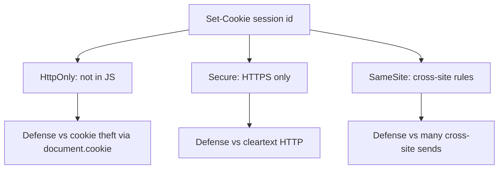
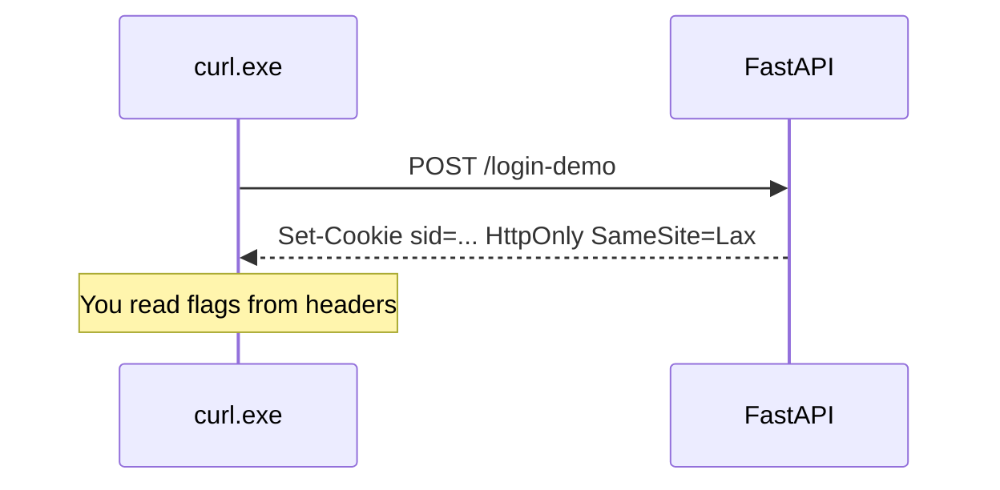

# Month 13 · Week 1 · Day 4
# Lab: Cookie Flags — HttpOnly, Secure, SameSite

**Program:** Full-Stack Mastery · 18 months  
**Phase:** 4 — Full-stack application engineering  
**Month index:** [../../README.md](../../README.md)  
**Week 1:** [1](day-01.md) · [2](day-02.md) · [3](day-03.md) · Day 4 (today) · [5](day-05.md) · [6](day-06.md) · [7](day-07.md)  
**Week rhythm today:** Learn + type-along (lab)  
**Student state:** You sketched login with a session id. Today the **cookie that carries it** gets flags with **jobs**.  
**Study time:** 3–4 focused hours

Labs: `~\fullstack-lab\month-13\week-01\day-04\`. Still not a paste of Project 7. You may **apply** flags to Project 7 **after** the lab proves you can read `Set-Cookie`.

---

## How to use this textbook

1. Read what each flag is **for**. Close it. Say it.  
2. Type a tiny FastAPI app that sets a cookie. Read the header with **`curl.exe -D -`**.  
3. Do not walk through stealing cookies. Defense is the job.  
4. Optional review links are for later rechecking.

---

## How to read this chapter

A session cookie without flags is a value the browser will **hand out** more freely than you meant. Flags are **instructions to the browser**:

| Flag | Job |
|---|---|
| **HttpOnly** | JavaScript **cannot** read the cookie via `document.cookie`. An unauthorized script that might **try** to copy the session out of JS **cannot** use that API. |
| **Secure** | Cookie is only sent on **HTTPS** (and localhost exceptions in some browsers). An unauthorized observer on the network path might **try** to read HTTP cookies. **HTTPS + Secure** is what prevents that class of leak. |
| **SameSite** | Controls **cross-site** sending. `Lax` or `Strict` reduce a class of **CSRF** (Week 3) where another site might **try** to make the browser attach your cookie to a request it did not intend. |



**Wrong belief:** “HttpOnly means the cookie is unforgeable.”  
**Correct:** HttpOnly hides it from **page JavaScript**. The browser still **sends** it. CSRF is a different class (Week 3). You still need unguessable ids (Day 2).

**Wrong belief:** “SameSite=Lax means I can skip CSRF tokens forever.”  
**Correct:** Lax is a **strong default** for many first-party cookie apps. Week 3 still teaches CSRF **tokens** for unsafe methods when cookies authenticate, especially if you have older browsers or `None`+credentials patterns. Do not claim Lax is a magic shield without naming remaining cases.

---

## Today's contract

By the end of this day you will be able to:

1. Explain **HttpOnly**, **Secure**, and **SameSite** (`Strict` / `Lax` / `None`) in one sentence each.  
2. Set them on a FastAPI `Response` / `set_cookie`.  
3. Read them from `curl.exe -D -` (curl prints headers; it is not a browser).  
4. Name **Path** and **Max-Age** / **Expires** as related knobs.  
5. State that **localhost HTTP** may still set cookies in dev while **Secure** waits for HTTPS in production.  
6. Write how Project 7 will set these — notes, not a dump.

**Today's gate.** Closed-book:

> HttpOnly keeps the cookie out of JavaScript. Secure keeps it off HTTP. SameSite limits cross-site sends. I can read Set-Cookie. I still know CORS is not auth (Week 3). I do not have an exploit lab.

---

## Time box

| Block | Minutes | Work |
|---|---|---|
| A | 50 | Theory |
| B | 60 | Type-along: set_cookie + curl.exe |
| C | 70 | Independent: matrix of flags + Project 7 notes |
| D | 20 | Git |
| E | 15 | Recall |

---

# Block A — Theory

## 1. Set-Cookie is a header

The server says: store this name/value with these attributes. The **browser** enforces flags. `curl.exe` **shows** the header; it does not behave like Chrome.

Example shape (values are **illustrative names**, not an attack):

```
Set-Cookie: sid=...; HttpOnly; Path=/; SameSite=Lax
```

In production you also want `Secure` and a real expiry.

FastAPI:

```python
from fastapi import FastAPI, Response

app = FastAPI()

@app.post("/login-demo")
def login_demo(response: Response) -> dict[str, str]:
    response.set_cookie(
        key="sid",
        value="lab-not-a-real-session",
        httponly=True,
        secure=False,  # True in HTTPS production
        samesite="lax",
        max_age=3600,
        path="/",
    )
    return {"ok": "cookie set"}
```

The `value` in the lab may be a placeholder. In a real login it is `secrets.token_urlsafe` from Day 2.

---

## 2. HttpOnly — what it is for

**For:** stopping **JavaScript** from reading the cookie.

If an XSS bug ever runs (Week 3), an unauthorized script might **try** to read `document.cookie` and send it elsewhere. **HttpOnly** means that API **does not include** this cookie. XSS can still **do other harm** (act as the user **inside** the page). HttpOnly is **necessary, not sufficient**. Output encoding still matters.

**Wrong belief:** “HttpOnly fixes XSS.”  
**Correct:** it reduces **cookie theft via `document.cookie`**. XSS remains a bug class to prevent.

---

## 3. Secure — what it is for

**For:** sending the cookie only on **encrypted** connections.

On public Wi-Fi, an unauthorized observer might **try** to read HTTP traffic. **What prevents that** for the cookie is **TLS (HTTPS)** plus the **Secure** flag so the browser will not attach the cookie to `http://` requests.

**Local development:** `http://127.0.0.1` is a special case. Browsers are looser on localhost. You may set `secure=False` in **dev settings** and `True` when `ENV=production`. Never leave `secure=False` as the only code path.

**Wrong belief:** “HttpOnly already encrypts the cookie.”  
**Correct:** HttpOnly is not encryption. **TLS** encrypts the bytes on the wire.

---

## 4. SameSite — what it is for

**For:** controlling whether the cookie rides along on **cross-site** requests.

| Value | Typical behavior (browser-honest, not a law textbook) |
|---|---|
| **Strict** | Cookie not sent on cross-site requests, including many inbound clicks. Safest, sometimes annoying for links into the app. |
| **Lax** | Cookie sent on top-level GET navigations; **not** on most cross-site POST fetches. A good **default** for session cookies. |
| **None** | Cross-site allowed; **requires Secure**. Used for true cross-site needs. Easy to get wrong. Avoid for Project 7 unless you can lecture why. |

Week 3: **CSRF** is the class of bug where another origin might **try** to trigger a **state-changing** request in the user’s browser. SameSite **Lax/Strict** prevent a large slice of that for cookie-authenticated apps. Remaining cases and **CSRF tokens** are Week 3 — **concepts**, not an exploit demo.

**Wrong belief:** “SameSite=None; Secure is what all SPAs need.”  
**Correct:** that is for **cross-site** cookie use. First-party + proxy often wants **Lax**.

---

## 5. Path, Domain, Max-Age, Expires

- **Path=/ ** — cookie sent to all paths on the site. A narrower path is rare for session cookies; do not get clever.  
- **Domain** — leave default (current host) unless you have a real subdomain design. Over-wide domain shares cookies too far.  
- **Max-Age** / **Expires** — when the browser forgets. Server **must still expire** the session row. Browser expiry is not the only clock.  
- **Clearing:** `set_cookie` with empty value and `max_age=0` on logout, **and** delete the server row.

**Wrong belief:** “If Max-Age passed, the server still accepts the id.”  
**Correct:** if the row still exists, a stolen cookie might still work until **server** expiry/revoke. Always expire server-side.

---

## 6. What curl.exe can and cannot prove

```powershell
curl.exe -s -D - -X POST http://127.0.0.1:8000/login-demo -o NUL
```

You should **see** `Set-Cookie` and the flag words. curl will **store** cookies only if you use `-c` / `-b` cookie jars. Browsers enforce SameSite; curl does **not** simulate a foreign website. Do **not** spend the day building a cross-site attack page. Write the **meaning** of flags instead.

**Wrong belief:** “If curl sent the cookie, SameSite works.”  
**Correct:** SameSite is a **browser** policy. curl is a header inspector today.

---

## 7. fetch and credentials (preview)

Same-origin: cookies send by default. Cross-origin: `fetch(url, { credentials: 'include' })` **and** CORS `allow_credentials` **and** an explicit origin — not `*`. Week 3 Day 4. Today: prefer **one origin** via Vite proxy so the session cookie is first-party.

---

## 8. Production vs lab matrix

| Setting | Lab `127.0.0.1` HTTP | Production HTTPS |
|---|---|---|
| HttpOnly | **True** | **True** |
| Secure | False often required | **True** |
| SameSite | Lax | Lax (or Strict if you accept UX) |
| Max-Age | short | session policy you document |

Read flags from **config**, not scattered literals.

---

## 9. Prefixes (awareness)

Some browsers treat cookie names with prefixes `__Host-` / `__Secure-` as extra constraints (path, secure, no domain). Optional literacy. Do not require them in the lab. Mention in `NOTES.txt` if you want extra credit.

---

# Block B — Type-along

```powershell
cd ~\fullstack-lab
mkdir month-13\week-01\day-04 -Force
cd ~\fullstack-lab\month-13\week-01\day-04
uv init --name lab-cookie-flags
uv add fastapi uvicorn
uv add --dev pytest httpx
```

Type `main.py` with:

- `POST /login-demo` — `set_cookie` as in Block A (`httponly=True`, `samesite="lax"`, `secure=False` for local HTTP).  
- `POST /logout-demo` — delete cookie (`max_age=0`).  
- `GET /health`

Run:

```powershell
uv run uvicorn main:app --reload --host 127.0.0.1 --port 8000
```

```powershell
curl.exe -s -D headers-login.txt -X POST http://127.0.0.1:8000/login-demo -o NUL
```

Open `headers-login.txt`. Tick:

- [ ] `Set-Cookie` present  
- [ ] `HttpOnly` present  
- [ ] `SameSite=Lax` (spelling may vary in case)  
- [ ] `Secure` **absent** in this HTTP lab (expected)  

Write `FLAGS.txt`: one paragraph per flag — **what it is for**, not a copy of MDN.

TestClient test: after `client.post("/login-demo")`, inspect `response.headers` / cookies for httponly if the test client exposes it. If the client is blurry about flags, **header string** assertions on `set-cookie` are enough.

Do not implement password hashing today unless leftover from Day 3 — this lab is **flags**.

---

# Block C — Independent

1. Add `GET /who` that returns `{"has_sid": true/false}` based on whether the cookie arrived — **not** a user profile dump. Prove TestClient cookie jar round-trip.  
2. `PROJECT7-COOKIES.md`: for **your** app, HttpOnly yes/no, Secure how toggled, SameSite value, cookie name, session store (table vs Redis). No source dump.  
3. `BROWSER-VS-CURL.md`: three sentences — curl reads headers; Chrome enforces SameSite; you will not “test CSRF” by building a foreign form today.  
4. Stretch: read FastAPI `set_cookie` signature; list parameters in `API.txt`.

```powershell
cd ~\fullstack-lab
git add month-13
git commit -m "Month 13 Day 4: cookie flags lab HttpOnly Secure SameSite."
```

---

# Block E — Recall

1. HttpOnly is for …  
2. Secure is for …  
3. SameSite=Lax is for …  
4. Why server expiry still matters.  
5. Why curl is not a SameSite proof.

---

## Office hours

**Set-Cookie missing.** You returned a dict without using `Response`. Inject `Response` or return `JSONResponse`.  
**PowerShell `curl`.** Use `curl.exe`.  
**`secure=True` on HTTP localhost and the browser ignores the cookie.** Dev config: secure false only locally.  
**Cookie name `session` on a shared parent domain.** Default host only.  
**Put JWT in a non-HttpOnly cookie “so JS can read claims.”** Then XSS can read it. Put claims in `/me` JSON instead.



---

# Lecture: flags are browser promises, not API authorization

Setting HttpOnly does **not** check `owner_id`. Week 4 still exists. Flags reduce **how** a cookie leaks or rides along. **Authorization** is a server `if`.

**Session cookie name:** boring (`sid`, `session`). Do not put user ids in the name or value.

**Multiple cookies:** CSRF token cookie (Week 3) if you need the double-submit pattern — **concept later**. Today one session cookie.

**Never log `Set-Cookie` values** in application logs.

---

## Definition of done

- [ ] `headers-login.txt` shows HttpOnly and SameSite  
- [ ] `FLAGS.txt` explains all three jobs  
- [ ] `PROJECT7-COOKIES.md` written  
- [ ] I can teach why Secure is production-true  
- [ ] Commit exists  

---

## Optional review links

- [MDN: Set-Cookie](https://developer.mozilla.org/en-US/docs/Web/HTTP/Headers/Set-Cookie)  
- [MDN: SameSite](https://developer.mozilla.org/en-US/docs/Web/HTTP/Reference/Headers/Set-Cookie#samesitesamesite-value)  
- [OWASP: Session Management](https://cheatsheetseries.owasp.org/cheatsheets/Session_Management_Cheat_Sheet.html)

---

## Tomorrow

**Tests:** login failure **must not leak** whether the email exists. Enumeration as a **risk**; generic errors as **mitigation**. No attack script.

---

# Closing lecture — three flags, three jobs

HttpOnly: JavaScript does not read the session cookie.
Secure: the cookie does not ride on clear HTTP.
SameSite: the cookie does not freely join foreign posts.

curl.exe shows Set-Cookie. Browsers enforce policy.
Server-side expiry still deletes the map.
Logout clears the cookie and the row.

Lax is the default to beat for first-party Project 7.
None is a cross-site tool, not a fashion.

Lab: `~\fullstack-lab\month-13\week-01\day-04\`.
Do not build a CSRF demo site. Write FLAGS.txt instead.

Vite proxy keeps the cookie first-party if you already have it.
Week 3 will name CSRF tokens without a walkthrough.

If you set Secure on HTTP and the cookie vanished, that is
the flag doing its job. Split dev and production settings.

---

## Recite-back checklist (close the editor, then tick)

Write `RECITE.txt` with one honest sentence per line.

- [ ] HttpOnly vs document.cookie  
- [ ] Secure vs HTTP  
- [ ] SameSite Lax vs None  
- [ ] Server expiry still required  
- [ ] curl is not Chrome  
- [ ] flags are not AuthZ  
- [ ] PROJECT7-COOKIES.md exists  
- [ ] no exploit page  

If a line is mush, re-read this file only.

---

# Extra lecture — flags in production vs the lab

**HttpOnly** stays **True** in lab and production. There is no “we’ll add it after launch.”

**Secure** is often **False** on `http://127.0.0.1` because browsers will not store a Secure cookie on clear HTTP (localhost exceptions exist; do not depend on folklore). Production HTTPS: **True**, driven by `ENV` / settings, not a comment you forget.

**SameSite=Lax** is the default to beat for first-party Project 7. **None** requires **Secure** and is a **cross-site** tool. **Strict** is safer and sometimes annoying for inbound links.

**Path=/** is normal for a session cookie. Do not invent a clever path that “hides” the cookie from `/docs` — `/docs` is not the threat model.

**Max-Age** is the **browser** clock. The **server** row must still expire. Logout deletes the row **and** clears the cookie (`max_age=0`).

**Logging:** never print `Set-Cookie` values. `curl.exe -D headers-login.txt` is a **file you keep local**; do not commit real session ids.

**fetch:** same-origin cookies send by default. Cross-origin needs `credentials: 'include'` **and** CORS credentials **and** an explicit origin — Week 3. Vite **proxy** keeps the cookie first-party if you already use one. Record that in `PROJECT7-COOKIES.md`.

**Wrong belief:** “If curl sent the cookie, SameSite works.”  
**Correct:** SameSite is a **browser** policy. Today curl is a **header inspector**.

Prefixes `__Host-` / `__Secure-` are optional literacy. Not required in the lab.

If you set `secure=True` on HTTP and the browser ignores the cookie, the flag did its job. Split dev and production settings.

Lab path remains `~\fullstack-lab\month-13\week-01\day-04\`. Bind `127.0.0.1`. `uv run uvicorn main:app --reload --host 127.0.0.1 --port 8000`.

