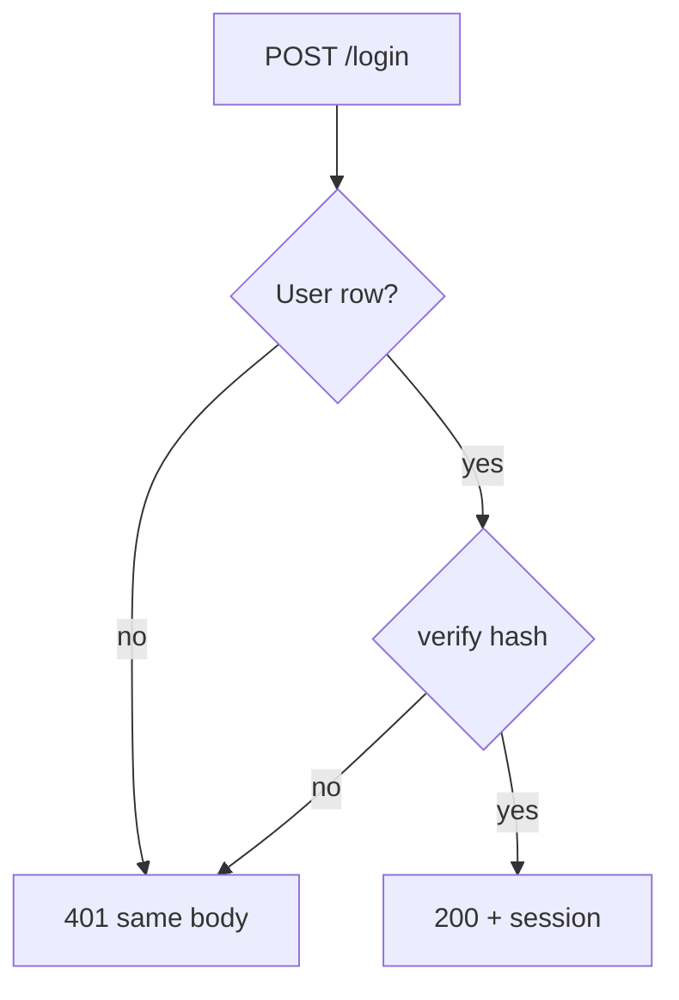
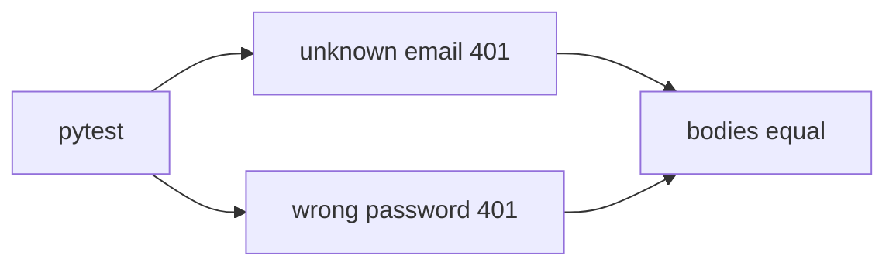

# Month 13 · Week 1 · Day 5
# Tests: Login Failures Must Not Leak Whether an Email Exists

**Program:** Full-Stack Mastery · 18 months  
**Phase:** 4 — Full-stack application engineering  
**Month index:** [../../README.md](../../README.md)  
**Week 1:** [1](day-01.md) · [2](day-02.md) · [3](day-03.md) · [4](day-04.md) · Day 5 (today) · [6](day-06.md) · [7](day-07.md)  
**Week rhythm today:** Tests + refactor + documentation  
**Student state:** You can set cookie flags and sketch login. Today you **prove** login errors are **generic**.  
**Study time:** 3–4 focused hours

Labs: `~\fullstack-lab\month-13\week-01\day-05\`. You may reuse **ideas** from Day 3 but type a **fresh** mini (or copy **your** Day 3 into this folder and add tests — do not open a tutorial). Still **not** Project 7 source as the textbook answer.

---

## How to use this textbook

1. Read why **account enumeration** is a risk.  
2. Write tests that **fail** if messages differ.  
3. Do **not** write a script that guesses emails against a live site. Defense tests run on **your** lab.  
4. Optional review links are for later rechecking.

---

## How to read this chapter

**Account enumeration** means an unauthorized person might **try** to learn **which identifiers are registered** by comparing responses: different JSON, different status, different timing. **What prevents it** (in part):

- The **same HTTP status** (401)  
- The **same `detail` string** (and same JSON shape)  
- Avoiding “helpful” extras (`hint`, `reason_code`, `user_id`)  
- Later: **rate limiting** (Week 3) so guessing is expensive  
- Timing is **hard**; you still must not `sleep` only on the “user exists” path as a naive fix you copy from a meme — prefer **always hashing** a dummy when the user is missing so work is similar (concept below)



**Wrong belief:** “Telling them ‘no such email’ is better UX.”  
**Correct:** the **login** form can say “invalid credentials” for every failure. **Registration** “email taken” is a different trade-off (often unavoidable). Do not make **login** as leaky as register.

**Wrong belief:** “I’ll write a tool to try emails on production to prove it.”  
**Correct:** you write **pytest** on **your** app. You do not probe systems you do not own.

---

## Today's contract

By the end of this day you will be able to:

1. Define **enumeration** in one sentence as a **risk**.  
2. Return **identical** 401 bodies for unknown identifier vs bad password.  
3. Test that identity with TestClient.  
4. Omit leak fields (`exists`, `reason`, `next_hint`).  
5. Explain **dummy verify** as a timing-mitigation **concept**.  
6. Name **rate limiting** as a later defense (do not build Redis today unless you already have it).

**Today's gate.** Closed-book:

> Login failures are generic 401. Tests compare unknown-user and wrong-password bodies for equality. I will not ship `reason: no_such_user`. I did not write an attack script.

---

## Time box

| Block | Minutes | Work |
|---|---|---|
| A | 40 | Theory |
| B | 65 | Tests first, then code |
| C | 70 | Dummy hash path + docs |
| D | 20 | Git |
| E | 15 | Recall |

---

# Block A — Theory

## 1. What might someone try — and what you prevent

They might **try** to submit many login requests, changing only the email, and **watch** whether the error text changes. **What prevents it:** one message, one status, one shape.

They might **try** the same on a **password reset** form (“if we emailed you” vs “unknown”). Week 2: reset responses should also be **generic** (“if the account exists, we sent mail”).

They might **try** to read **timing**. If unknown users return immediately and known users run argon2, the clock leaks. **Mitigation concept:** when the user is missing, still run `verify` against a **precomputed dummy hash** (constant, from startup) so both paths do password-hash work. Then return the same 401. You still will not make a perfect constant-time API; you **remove the obvious branch**.

They might **try** many guesses quickly. **Mitigation:** rate limit by IP and by identifier (Week 3). Today: mention in `RATE.txt`, do not build a scanner.

This book will **not** give you a list of emails to try or a loop to paste against a URL.

---

## 2. Register vs login (honest UX)

| Endpoint | Enumeration | Typical course policy |
|---|---|---|
| **Login** | Harmful | Generic 401 |
| **Reset request** | Harmful | Generic 200 “if it exists, emailed” |
| **Register** | Often leaks “taken” | 409 on duplicate; consider **rate limit**; some apps use “we sent a mail if new” — optional later |
| **GET /users/{email}** | Direct leak | **Do not expose** this |

**Wrong belief:** “I’ll hide register 409 so nobody knows.”  
**Correct:** you can try; many products still 409. **Login** is the one you **must** keep generic this week.

---

## 3. Dummy hash (concept + small code)

At process start (or module load in the lab):

```python
DUMMY_HASH = argon2.hash("not-a-real-user-password-lab-only")
```

On login, if user is `None`, call `argon2.verify(plain, DUMMY_HASH)` and **ignore** the boolean. Then 401. If user exists, `verify(plain, user.hash)` as usual.

Do not use a dummy that equals a real user’s hash. One constant dummy is fine.

**Wrong belief:** “I’ll `time.sleep(0.3)` on 401 instead.”  
**Correct:** sleeps make every failure slow and still leak if you sleep only in one branch. Dummy verify is the grown-up version of “do the work anyway.”

---

## 4. Tests as defense

```python
def test_login_unknown_and_wrong_password_match(client: TestClient) -> None:
    client.post("/register", json={"email": "a@example.com", "password": "correcthorse"})
    unknown = client.post("/login", json={"email": "nobody@example.com", "password": "correcthorse"})
    wrong = client.post("/login", json={"email": "a@example.com", "password": "wrong-horse-1"})
    assert unknown.status_code == 401
    assert wrong.status_code == 401
    assert unknown.json() == wrong.json()
```

Use **your** min lengths. Do not log those passwords. `example.com` is a reserved name — good for tests.

Also assert:

- Success login still 200.  
- JSON has no `password`.  
- `detail` is a **string** (HTTPException), not a dict with `exists: false`.

**Wrong belief:** “I’ll assert the exact English once and never compare two failures.”  
**Correct:** the **equality of two failures** is the security claim.

---

## 5. Headers and extra leaks

Watch for:

- Different `X-Debug` headers  
- `WWW-Authenticate` only on one path  
- 404 for unknown vs 401 for known  
- Validation 422 that names “email not in DB” (do not)

422 is for **malformed** email types, not “missing user.”

---

## 6. What you do not implement today

- No email sending.  
- No OAuth.  
- No scanning tool.  
- No Project 7 dump.  
- Rate limiter: optional stub comment, not a Redis novel.

---

# Block B — Type-along

```powershell
cd ~\fullstack-lab
mkdir month-13\week-01\day-05 -Force
cd ~\fullstack-lab\month-13\week-01\day-05
uv init --name lab-login-enum
uv add fastapi uvicorn passlib argon2-cffi
uv add --dev pytest httpx
```

If you already have Day 3, you may copy **your** files into this folder, then **add** the equality test and dummy hash. Still type the test yourself.

Minimum routes: `/register`, `/login` (session optional if you only test 401 bodies — prefer full sketch).

Write tests **first** if you can. `RED.txt` if they fail first.

```powershell
uv run pytest -q
```

---

# Block C — Independent

1. Dummy hash path implemented; comment in code **why**.  
2. `ENUM.md`: what an unauthorized person might try (conceptual) and what your tests prevent.  
3. `RATE.txt`: two sentences on rate limiting as a **future** defense.  
4. Optional: Project 7 — add the **same test** in **their** repo if login exists. If login does not exist yet, write the test as `TODO` in lab `PROJECT7-TEST.md` with the assertion shape. Do not paste their app.

```powershell
cd ~\fullstack-lab
git add month-13
git commit -m "Month 13 Day 5: generic login 401 tests against enumeration."
```

---

# Block E — Recall

1. What enumeration means.  
2. Why two 401 bodies must be equal.  
3. Dummy hash purpose.  
4. Register 409 vs login 401.  
5. Why you do not write a guessing script.

---

## Office hours

**Unknown user 404.** Wrong status. Use 401 for login proof failure.  
**`detail` dict with `code: USER_NOT_FOUND`.** A leak. String only.  
**Dummy hash on the success path too.** No — success must verify the **real** hash. Dummy only when missing user (and you still return 401).  
**Tests used different password lengths** so 422 vs 401. Use valid-shaped passwords on both failures.



---

# Lecture: tests are how this week becomes real

A lecture about generic errors does nothing if the SPA developer later asks for `reason`. The **test** is the contract. If a teammate “improves UX” with two messages, CI should go red.

**Do not** print full JSON with emails in CI logs if you can assert keys only — emails in tests are fake anyway.

**Lockout:** some apps lock after N failures. That can **increase** enumeration if lockout messages differ (“account locked” vs “invalid”). If you lock, keep messages generic and rate-limit instead of user-visible lock when you can. Optional note in `ENUM.md`.

---

## Definition of done

- [ ] Test asserts two 401 JSON bodies are equal  
- [ ] Dummy hash path exists or is written as a justified skip in `SKIP.txt` with a date to add it  
- [ ] `ENUM.md` written  
- [ ] No guessing script  
- [ ] Commit exists  

---

## Optional review links

- [OWASP: Authentication Cheat Sheet](https://cheatsheetseries.owasp.org/cheatsheets/Authentication_Cheat_Sheet.html) (enumeration / generic errors)  
- [FastAPI: Testing](https://fastapi.tiangolo.com/tutorial/testing/)

---

## Tomorrow

**Independent:** choose **session or token** for Project 7 and write **AUTH.md** justification. JWT only if you can name revoke.

---

# Closing lecture — one string for two failures

Unknown email and wrong password look the same on the wire.
That is a test, not a slogan. Dummy verify reduces a timing tell.
Rate limiting is next week’s family of defenses.

Do not probe other people’s login forms.
Do not add reason codes to help the React toast.

Register may still 409. Login must not.
Reset (Week 2) is generic too.

Lab: `~\fullstack-lab\month-13\week-01\day-05\`.
Project 7 gets the same assertion when login exists.

If the bodies differ by a single space, they differ.
Compare json() equality, not “both are 401.”

---

## Recite-back checklist (close the editor, then tick)

Write `RECITE.txt` with one honest sentence per line.

- [ ] enumeration is a risk  
- [ ] generic 401  
- [ ] equal bodies test  
- [ ] dummy hash concept  
- [ ] no attack script  
- [ ] register 409 is a different trade  
- [ ] rate limit later  
- [ ] not a product dump  

If a line is mush, re-read this file only.
