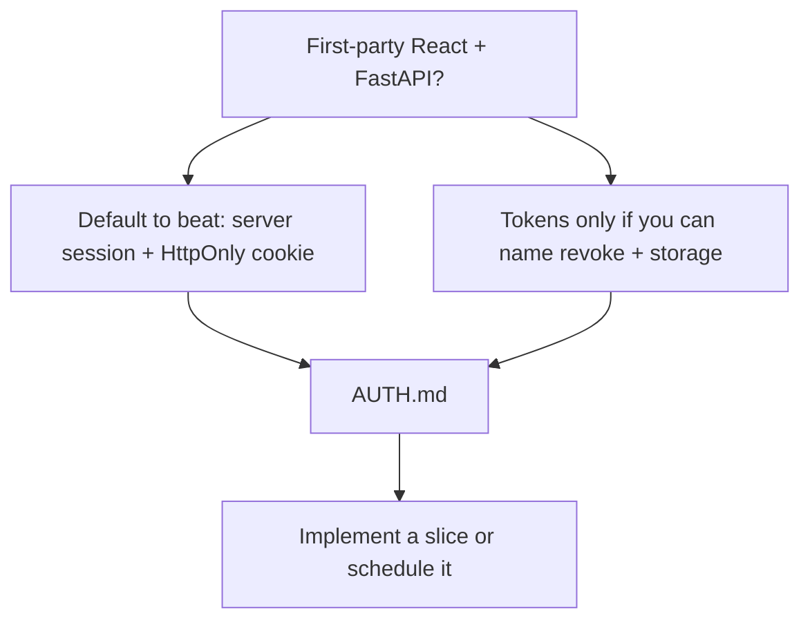
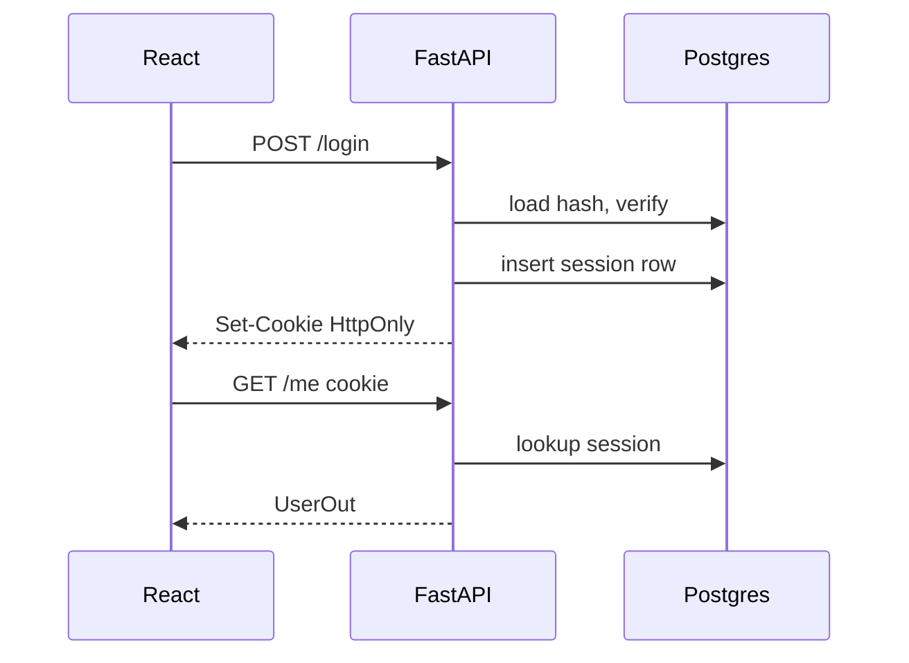

# Month 13 · Week 1 · Day 6
# Independent: Choose Session or Token for Project 7 (AUTH.md)

**Program:** Full-Stack Mastery · 18 months  
**Phase:** 4 — Full-stack application engineering  
**Month index:** [../../README.md](../../README.md)  
**Week 1:** [1](day-01.md) · [2](day-02.md) · [3](day-03.md) · [4](day-04.md) · [5](day-05.md) · Day 6 (today) · [7](day-07.md)  
**Week rhythm today:** Independent implementation  
**Student state:** You can hash, define sessions, set cookie flags, and test generic 401. Today you **choose** an architecture for **your** product and write it down.  
**Study time:** 3–4 focused hours

Labs: `~\fullstack-lab\month-13\week-01\day-06\` for the write-up if you want a copy. The **canonical** AUTH.md lives in **your Project 7 repo** (backend root or `docs/AUTH.md`). This textbook will **not** give you the product source.

---

## How to use this textbook

1. Write AUTH.md **before** you paste a JWT tutorial into the API.  
2. Implement **only** what the doc promises, or implement a **slice** and mark the rest as Week 2+.  
3. AI may review AUTH.md; it may not ship your auth for you.  
4. Optional review links are for later rechecking.

---

## How to read this chapter

Week 1’s skill is not “I hashed in a lab.” It is “I can **justify** how Project 7 proves who someone is.”



**Wrong belief:** “I’ll use JWT because every FastAPI blog does.”  
**Correct:** first-party browser apps often want **server-managed sessions** and **HttpOnly cookies**. JWT is allowed when **you** can teach trade-offs and revoke.

**Wrong belief:** “AUTH.md can wait until the UI looks logged in.”  
**Correct:** a UI that stores a token in localStorage is already a decision — usually a bad one. Write the doc **today**.

---

## Today's contract

By the end of this day you will be able to:

1. Choose **server session** **or** **token architecture** (opaque or JWT) for Project 7.  
2. Write **AUTH.md** that a classmate could implement without Slack.  
3. Include cookie flags **or** token storage rules.  
4. Include password hashing library name.  
5. Include logout/revoke.  
6. Optionally wire a **thin** slice in the product **or** keep the lab as the only code — but the **doc is required**.

**Today's gate.** Closed-book:

> I chose session or token on purpose. AUTH.md states hashing, transport, flags, revoke, and what the SPA must never store. I did not copy a random OAuth gist as the architecture.

---

## Time box

| Block | Minutes | Work |
|---|---|---|
| A | 25 | Decision + outline |
| B | 40 | Write AUTH.md (complete) |
| C | 90 | Implement a slice **or** a lab that matches the doc |
| D | 30 | Review against the checklist |
| E | 15 | Recall |

---

# Block A — Choose

## Default this course wants you to beat

**Server session** in PostgreSQL (or Redis if already justified) + cookie:

- `HttpOnly`  
- `Secure` in production  
- `SameSite=Lax`  
- Random `secrets.token_urlsafe`  
- Server expiry + logout delete  

This fits Project 7: one SPA, one API, you control both.

## When tokens are honest

- You have a native mobile client that cannot use first-party cookies well.  
- You have third-party API clients.  
- You can store **refresh** as HttpOnly cookie or a server table, and **access** is short-lived.  
- If JWT: you wrote how logout works (denylist or accept delay until `exp` **and** said so in AUTH.md).

**Opaque tokens** in a table are “sessions with an Authorization header.” That is coherent. JWT is the one that needs extra sentences.

## Forbidden “choices”

- Password in localStorage  
- Hash in a cookie  
- JWT in localStorage as the only plan with 30-day `exp`  
- “We’ll add flags later”  
- Copy-paste Google OAuth as login #1 this week (Week 2 is concepts, not a blog clone)

---

# Complete explanation (keep this open; Days 1–5 closed except this recap)

**Hash:** argon2 or bcrypt via passlib / argon2-cffi. Never plaintext. Salt inside the string. Library verify.

**Session id:** random, unguessable, server map.

**Cookie flags:** HttpOnly, Secure, SameSite — Day 4 jobs.

**JWT trade-offs:** revoke, key management, size, SPA storage, not a default.

**Generic 401:** unknown vs wrong password look the same.

**401 vs 403:** identity vs permission.

**Never log** passwords or tokens.

**Windows:** `curl.exe` to read `Set-Cookie`.



If you chose Bearer tokens, redraw this in AUTH.md with `Authorization` and where the SPA holds the string (**not** localStorage unless you write an XSS essay and still should not).

---

# Block B — AUTH.md required sections

Create `docs/AUTH.md` in Project 7 **or** `~\fullstack-lab\month-13\week-01\day-06\AUTH.md` **and** copy to the product repo the same day.

Must include:

1. **Title** and date.  
2. **Choice:** `server session cookie` | `opaque token` | `JWT` | hybrid — one label.  
3. **Why** (10–20 lines). Name the JWT costs even if you did **not** pick JWT.  
4. **Password hashing:** library, algorithm, min/max length.  
5. **Register / login / logout / me** statuses (table).  
6. **Transport:** cookie name + flags **or** header name + storage.  
7. **Server store:** table columns sketch (`id`, `user_id`, `expires_at`, `revoked`…).  
8. **Revoke:** what logout deletes.  
9. **SPA rules:** no password in Query; no token in localStorage (or a justified exception that this course will **mark down** unless extraordinary).  
10. **Enumeration:** generic login errors.  
11. **Out of scope this week:** OAuth, 2FA — listed as Week 2+.  
12. **Threat one-liners:** what someone might try (guess cookie, XSS read storage, call `/me` without cookie) and **what prevents it**.

If you cannot fill the table, stay in Block B. Empty code is allowed. Empty AUTH.md is not.

---

# Block C — Implement a slice

Pick **one**:

**Option 1 — Product slice.** In Project 7, add hashed register/login/logout/me **matching AUTH.md**, with tests for generic 401. Do not add social login. Do not paste a cookiecutter.

**Option 2 — Lab only.** Mini API in `day-06/mini` that **implements AUTH.md** as if it were the product (different noun: **greenhouse users**). Tests green. Then AUTH.md still goes to the product repo as the plan.

Either option: `uv run pytest -q` on what you built.

```powershell
cd ~\fullstack-lab
mkdir month-13\week-01\day-06\mini -Force
```

Uvicorn if you want headers:

```powershell
uv run uvicorn main:app --reload --host 127.0.0.1 --port 8000
curl.exe -s -D - -X POST http://127.0.0.1:8000/login -H "Content-Type: application/json" --data-binary @login.json
```

---

# Block D — Checklist review

Print AUTH.md. Tick:

- [ ] Choice is one phrase  
- [ ] JWT trade-offs named  
- [ ] Hashing named  
- [ ] Cookie flags or storage named  
- [ ] Logout is real  
- [ ] Generic 401  
- [ ] No secrets in the markdown (no real keys)  
- [ ] Project 7 domain nouns only as **yours**, not a textbook dump of features  

Write `MATCH.txt`: one mismatch between AUTH.md and code, or `match`.

---

# Block E — Recall

1. Why first-party leans session.  
2. What AUTH.md must say about revoke.  
3. Where the canonical file lives.  
4. What you refused to put in localStorage.

---

## A day-6 quality bar

AUTH.md is too thin if it says “use JWT + cookies.” It is enough if a classmate knows:

- exact cookie name and flags  
- table vs Redis  
- 401 shapes  
- hashing library  
- logout behavior  

Code is too thin if login returns the hash. Tests must include enumeration equality if login exists.

**Forbidden rescue:** do not copy a full FastAPI Users library as “the independent day.” Libraries are Week 2+ if ever; this month you must **explain** the design.

---

```powershell
cd ~\fullstack-lab
git add month-13
git commit -m "Month 13 Day 6: AUTH.md session-or-token choice."
```

Also commit AUTH.md in the **Project 7** repo if that is a separate git.

---

## Definition of done

- [ ] AUTH.md complete in the product repo  
- [ ] Choice justified  
- [ ] Slice or mini matches the doc or `MATCH.txt` lists gaps  
- [ ] No localStorage session plan without a failing grade from yourself  
- [ ] Commit exists  

---

## Optional review links

- [OWASP: Authentication Cheat Sheet](https://cheatsheetseries.owasp.org/cheatsheets/Authentication_Cheat_Sheet.html)  
- [OWASP: Session Management Cheat Sheet](https://cheatsheetseries.owasp.org/cheatsheets/Session_Management_Cheat_Sheet.html)

---

## Tomorrow

**Week 1 review** — synthesis in the Day 7 file, mini-build, debug, retro. Days 1–6 closed during the mini-build.

---

# Closing lecture — choose in writing

The architecture is the AUTH.md file, not a vibe.
Sessions plus HttpOnly is the default to beat.
JWT is a trade-off sheet, not a personality.

Hash, random sid, generic 401, cookie flags.
Logout deletes a row. Logs never see secrets.

Implement a slice or a greenhouse mini.
Do not paste the product into the textbook lab
as a substitute for AUTH.md.

If you chose JWT, your revoke paragraph must be
a paragraph, not the word “stateless.”

curl.exe reads Set-Cookie. PowerShell curl is a trap.
Bind 127.0.0.1. pytest on generic 401.

---

## Recite-back checklist (close the editor, then tick)

Write `RECITE.txt` with one honest sentence per line.

- [ ] one architecture label  
- [ ] hashing named  
- [ ] transport named  
- [ ] revoke named  
- [ ] JWT costs named anyway  
- [ ] generic 401  
- [ ] AUTH.md in Project 7  
- [ ] no tutorial paste as the design  

If a line is mush, re-read this file only.
