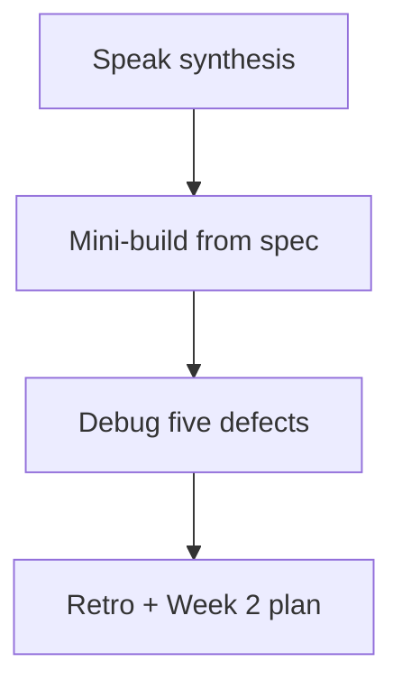

# Month 13 · Week 1 · Day 7
# Week Review — Passwords, Sessions, Cookies, Tokens

**Program:** Full-Stack Mastery · 18 months  
**Phase:** 4 — Full-stack application engineering  
**Month index:** [../../README.md](../../README.md)  
**Week 1:** [1](day-01.md) · [2](day-02.md) · [3](day-03.md) · [4](day-04.md) · [5](day-05.md) · [6](day-06.md) · Day 7 (today)  
**Week rhythm today:** Review, repair, plan Week 2  
**Student state:** You hashed, chose sessions or tokens on paper, set cookie flags, tested generic 401. Today those ideas must still live in your head — from **this file**.  
**Study time:** 3–4 focused hours

Do not start Week 2 because the calendar moved. OAuth on a plaintext password column is two disasters.

Work in `~\fullstack-lab\month-13\week-01\day-07\`. Do not implement the mini-build inside Project 7’s domain as a copy of the product. Do not paste Project 7.

---

## How to read this chapter

This is a **closed-book teaching day**. The synthesis **is** the Week 1 lesson.



Days 1–6 closed during mini-build. Repair from **this** recap.

---

## Week synthesis (the lesson, in this book)

**Passwords:** store **argon2 or bcrypt** hashes via **passlib** / **argon2-cffi**. Never plaintext. **Salt is included** in the modern hash string. **Verify** is the library call. Timing-safe compare is a **library property**, not a loop you write. Never log passwords. Never put hashes on `UserOut`. Hash ≠ encryption. SHA-256 is the wrong password tool.

**After login:** HTTP is stateless unless you add proof. A **session id** is **random** (`secrets.token_urlsafe`), **unguessable**, mapped **server-side** to a user, expired and **deleted on logout**. It is not `user.id`.

**Cookies** transport the id for browser apps. **HttpOnly:** JS cannot read it via `document.cookie`. **Secure:** HTTPS only (true in production). **SameSite=Lax** (typical): limits cross-site sending (CSRF class is Week 3). Server expiry still required. `curl.exe -D -` **shows** `Set-Cookie`; browsers **enforce** SameSite.

**Tokens:** access + refresh is another family. **JWT** is optional. Trade-offs: **revoke**, key management, size, SPA storage. First-party React + FastAPI often wants **server sessions + HttpOnly cookies**. Do not assume JWT. Do not put bearers in `localStorage`.

**Enumeration:** an unauthorized person might **try** to learn which emails exist from login errors. **Prevent:** same **401** and same body for unknown user vs bad password. Tests assert **equality**. Dummy hash verify when the user is missing reduces a timing tell. Rate limiting is a later defense. No guessing scripts against other sites.

**401** = we do not accept who you are. **403** = we do, and you may not (Week 4).

**AUTH.md** in Project 7 records the choice. This week’s labs used **lockers / greenhouse**, not the product dump.

**Wrong belief:** “JWT is required to be modern.”  
**Correct:** sessions are modern. JWT is a trade-off.

**Wrong belief:** “HttpOnly means CSRF is impossible.”  
**Correct:** HttpOnly is not CSRF. SameSite and Week 3 tokens are the CSRF family.

**Wrong belief:** “I’ll encrypt passwords so I can email them back.”  
**Correct:** reset is Week 2. Hashes do not reverse.

The sections below unpack that so you can mini-build without Days 1–6.

---

## Today's contract

**Today's gate.** Closed-book:

> I can teach hashing, session ids, cookie flags, JWT trade-offs, and generic 401 tests. I built a tiny auth sketch from this file’s spec. AUTH.md still exists in Project 7.

---

## Time box

| Block | Minutes | Work |
|---|---|---|
| 1 | 40 | Speak the synthesis |
| 2 | 55 | Mini-build `heralds` accounts |
| 3 | 30 | Debug five defects |
| 4 | 20 | Review AUTH.md vs reality |
| 5 | 20 | Re-run pytest; break one test; restore |
| 6 | 20 | Design: why not localStorage |
| 7 | 20 | Retro + Week 2 plan |

---

# Complete explanation — authentication you must still own

## 1. Hashing

`argon2.hash` / `argon2.verify` (or bcrypt). Two hashes of one password differ. Verify both. Cap length. Min length. No SHA-256-as-password. No Base64. No reversible “recovery encryption.”

## 2. Session

`create`: random sid, store `{user_id, expires_at}`. `get`: None if missing/expired. `revoke`: delete. Cookie or lab header — AUTH.md says cookies for the product.

## 3. Flags

HttpOnly / Secure / SameSite jobs. Production Secure true. Dev HTTP may false. Lax default.

## 4. Failures

Login 401 generic. Register duplicate 409. `/me` 401 without session. Logout 204.

## 5. Tests

TestClient. Fixture clears users **and** sessions. Assert two 401 bodies equal. Assert Out has no `password_hash`. Do not `.json()` on 204.

## 6. Windows

`curl.exe`. JSON via `--data-binary @file`. Bind `127.0.0.1`.

```powershell
uv run uvicorn main:app --reload --host 127.0.0.1 --port 8000
```

---

# Block 1 — Speak

No notes. Cover: hash vs encryption; salt location; session id; three flags; JWT costs; enumeration test; AUTH.md choice.

Write `exam-01.md` after speaking — 15–25 lines, your words.

---

# Block 2 — Mini-build (Days 1–6 closed)

```powershell
cd ~\fullstack-lab
mkdir month-13\week-01\day-07\mini -Force
cd ~\fullstack-lab\month-13\week-01\day-07\mini
uv init --name lab-heralds
uv add fastapi uvicorn passlib argon2-cffi
uv add --dev pytest httpx
```

**Spec: town heralds** — not Project 7, not lockers.

| Method | Path | Rules |
|---|---|---|
| GET | `/health` | 200 |
| POST | `/register` | 201 `{id, email}` only. Hash. Duplicate email 409. |
| POST | `/login` | 200 same Out. Session cookie **HttpOnly** + **SameSite=lax**. Generic 401. |
| GET | `/me` | 200 or 401 |
| POST | `/logout` | 204; revoke |

Tests: register+me; no hash leak; unknown vs wrong password **JSON equal**; logout then 401; fixture clears.

No JWT. No OAuth. In-memory dicts OK. `secure=False` for HTTP lab.

`uv run pytest -q`.

---

# Block 3 — Debug

Write `exam-03-debug.md`. For each: **what the client sees**, **root cause**, **fix**. No exploit steps.

**A.** Login unknown email returns 404 `"not found"`; wrong password returns 401 `"bad password"`.  
**B.** Register JSON includes `password_hash`.  
**C.** Session cookie value is `"42"` for user id 42.  
**D.** Classmate stores JWT in `localStorage` and calls it HttpOnly.  
**E.** After logout, `/me` still 200 because only the client cleared memory, not the server row.

---

# Block 4 — Review AUTH.md

Open **only** Project 7 `AUTH.md` (or Day 6 copy). One gap vs this week: write `GAP.txt`. If missing, AUTH.md is **false** for the week gate — write it now from this synthesis, still not a product dump.

---

# Block 5 — Tests

`uv run pytest -q`. Change the equality test to allow different details; show fail **or** if you already would pass wrongly, fix the test to be strict; restore.

Paste fail snippet into `exam-05-fail.txt`.

---

# Block 6 — Design

`design.md` (10–15 lines): why **HttpOnly cookie session** beats **localStorage JWT** for first-party Project 7. Name XSS reading storage **as a class**, not a payload. Name logout.

---

# Block 7 — Retro

`retro.md`: weakest idea (hash, flags, JWT, enumeration). Week 2 question about reset or OAuth. Do not start Week 2 if mini pytest is red.

## Debug keys (after you write A–E)

**A.** Enumeration leak + wrong status. Same 401 string.  
**B.** Missing `response_model` / UserOut allowlist.  
**C.** Session id must be random, not user id.  
**D.** HttpOnly is a **cookie flag**. localStorage is always JS-visible.  
**E.** Logout must revoke **server-side**.

If you wrote “just use JWT” for any fix, rewrite from the synthesis.

---

```powershell
cd ~\fullstack-lab
git add month-13
git commit -m "Month 13 Week 1 review: heralds auth mini-build."
```

---

# Lecture: the week is a chain

Hash without a session is a stored secret that never logs anyone in.
A session without flags is a handle the page script can read.
Flags without generic 401 still leak who exists.
AUTH.md without code is a plan; code without AUTH.md is a tutorial leftover.

Mini-build is heralds. Not the product. `~\fullstack-lab\month-13\week-01\day-07\mini`.

TestClient plus a cookie jar: if cookies fail, read FastAPI testing docs **after** you try. Record lookup.

**Dummy hash:** if you have time, add it. If not, mention in retro as Week 1 debt.

---

## Definition of done

- [ ] `exam-01.md` from memory  
- [ ] Mini pytest green  
- [ ] Debug A–E answered  
- [ ] AUTH.md exists  
- [ ] Retro exists  
- [ ] I will not start OAuth copy-paste tonight  

---

## Optional review links

Repair from this synthesis first.

- [OWASP Password Storage](https://cheatsheetseries.owasp.org/cheatsheets/Password_Storage_Cheat_Sheet.html)  
- [OWASP Session Management](https://cheatsheetseries.owasp.org/cheatsheets/Session_Management_Cheat_Sheet.html)

---

## Next week

[Week 2 Day 1 — OAuth 2 / OIDC concepts](../week-02/day-01.md). Roles, not a Google blog clone.

---

# Closing lecture — prove who you are, slowly

argon2/bcrypt. Salt in the string. Library verify.
Random session id. Server map. Logout deletes.
HttpOnly, Secure, SameSite — three jobs.
JWT is optional and expensive to revoke.
Generic 401. Equal bodies. No guessing scripts.

First-party: sessions to beat. AUTH.md is the choice.
Heralds mini. curl.exe. Bind 127.0.0.1.

If debug A still wants two messages for UX, rewrite A.
If debug C still likes user id cookies, rewrite C.

Week 2 is reset tokens and OAuth **words**.
Not a reason to skip hashing.

---

## Recite-back checklist (close the editor, then tick)

Write `RECITE.txt` with one honest sentence per line.

- [ ] hash not encrypt  
- [ ] salt included  
- [ ] random sid  
- [ ] three cookie flags  
- [ ] JWT trade-offs  
- [ ] generic 401  
- [ ] AUTH.md choice  
- [ ] mini not the product  

`uv run pytest -q`. Debug A–E in sentences.
If any answer is an exploit recipe, delete it and write a defense.

---

# Extra lecture — the week is one chain

Hash without a session is a stored secret that never logs anyone in.
A session without flags is a handle page script can read.
Flags without generic 401 still leak who exists.
AUTH.md without code is a plan; code without AUTH.md is a tutorial leftover.

**Dummy hash:** if the mini skipped it, name it in retro as Week 1 debt.
**JWT:** if exam-01 still says “JWT because FastAPI,” rewrite from this synthesis.
**localStorage:** if design.md still likes it for a 30-day token, rewrite.

Heralds (or your Day 7 noun) live in `~\fullstack-lab\month-13\week-01\day-07\mini`. Not Project 7. `uv run pytest -q`. Bind `127.0.0.1` if you run Uvicorn. `curl.exe` for Set-Cookie.

Week 2 is OAuth **words**, reset **tokens**, verify **inbox proof**. Not a reason to skip hashing.
Do not start Week 2 if the mini is red.

If two 401 bodies differ by a space, they differ. Compare `json()` equality.
If session value is `"1"`, randomness failed. `secrets.token_urlsafe`.

