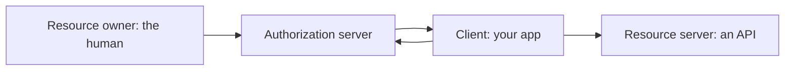
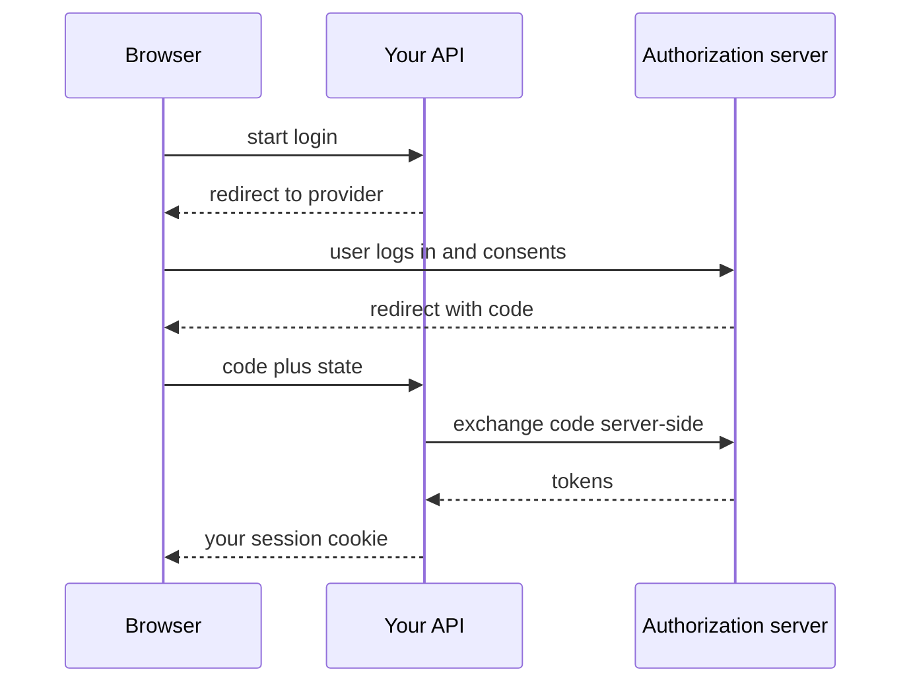

# Month 13 · Week 2 · Day 1
# OAuth 2 and OIDC Concepts — Roles, Not a Blog Clone

**Program:** Full-Stack Mastery · 18 months  
**Phase:** 4 — Full-stack application engineering  
**Month index:** [../../README.md](../../README.md)  
**Week 2:** Day 1 (today) · [2](day-02.md) · [3](day-03.md) · [4](day-04.md) · [5](day-05.md) · [6](day-06.md) · [7](day-07.md)  
**Week 1 review:** [../week-01/day-07.md](../week-01/day-07.md)  
**Week rhythm today:** Learn + type-along  
**Student state:** Week 1 gate passed. AUTH.md exists. Today you learn **what OAuth 2 and OpenID Connect are for** — you are **not** implementing “Login with Google” from a copy-paste.  
**Study time:** 3–4 focused hours

**This week covers:** OAuth/OIDC roles, social login and linking risks, password reset, email verification, 2FA as a concept.

Labs: `~\fullstack-lab\month-13\week-02\day-01\`. Project 7 may keep **password login** as the only implemented path this week. That is allowed.

---

## How to use this textbook

1. Read roles until you can assign them on a whiteboard.  
2. Draw **one** authorization-code flow in mermaid/on paper. Do not paste a Google quickstart.  
3. Optional review links are for later rechecking.

This book teaches **defense**. We describe what an unauthorized person **might try** so you can **stop it**. No phishing kits. No token-theft recipes.

---

## How to read this chapter

**OAuth 2** is a framework for **delegated authorization**: an app (the **client**) obtains **limited access** to an API (the **resource server**) with permission of the **resource owner**, via an **authorization server**.

**OpenID Connect (OIDC)** is a thin identity layer **on top of OAuth 2**. It adds an **ID token** (and UserInfo) so the client can know **who** logged in — **authentication**.



**Wrong belief:** “OAuth is how I hash passwords.”  
**Correct:** OAuth is **delegation**. Your password hash is still Week 1. You can have accounts **without** OAuth.

**Wrong belief:** “I’ll implement Google login today by cloning a gist.”  
**Correct:** today is **vocabulary and threat names**. Wiring a provider is a later, slow, documented task — not a Day 1 paste.

---

## Today's contract

By the end of this day you will be able to:

1. Name the four OAuth roles: **resource owner**, **client**, **authorization server**, **resource server**.  
2. Explain **authorization code** as the browser-app pattern at a high level (redirect, code, token **at the server**).  
3. Distinguish **access token** vs **refresh token** vs **ID token**.  
4. Explain **scopes** as strings that **limit** what the token is for.  
5. Name **PKCE** as a defense for public clients (concept).  
6. State why the **client secret** is not a `VITE_` variable.

**Today's gate.** Closed-book:

> OAuth 2 delegates access. OIDC adds identity. My SPA is often a public client. Secrets stay on the server. I will not paste a Google OAuth tutorial as today’s work.

---

## Time box

| Block | Minutes | Work |
|---|---|---|
| A | 55 | Theory |
| B | 50 | Paper roles + a fake CONTRACT for a provider |
| C | 70 | Independent: map Project 7; no live Google app required |
| D | 20 | Git |
| E | 15 | Recall |

---

# Block A — Theory

## 1. The four roles (learn these cold)

| Role | Who in a “login with a big provider” story |
|---|---|
| **Resource owner** | The human who has an account at the provider |
| **Client** | **Your** application (Project 7), asking for permission |
| **Authorization server** | The provider’s login + consent (issues codes/tokens) |
| **Resource server** | The provider’s API (or yours, if you are the API) |

When **your** FastAPI is the only API and you only use the provider to **sign in**, OIDC is the usual name: you want **who they are**, not Gmail scopes.

When **your** app will call the provider’s API (calendar, drive), that is **authorization** to that API — extra scopes, extra responsibility. Project 7 does **not** need that this month.

**Wrong belief:** “The React app is the authorization server.”  
**Correct:** the authorization server is the **provider** (or a dedicated IdP you run later). React is part of the **client**.

---

## 2. Why the password does not go to every app

Without OAuth, every site would ask for the user’s provider password. An unauthorized site might **try** to **phish** that password. **What prevents that pattern** is: the user types the password **only at the authorization server**, then **consents** to scopes, then your app receives **tokens or a code** — not the user’s provider password.

Your app still has **its own** passwords for users who register locally (Week 1).

---

## 3. Authorization code flow — the picture, not a recipe to abuse

High level, **confidential** or **public** client with PKCE:

1. Browser visits **your** “start login” endpoint (better: **server** starts the flow).  
2. Browser **redirects** to the authorization server with a **client id**, **redirect URI**, **state** (random CSRF-ish value for the **flow**), **scope**, and (public clients) **PKCE challenge**.  
3. User authenticates **at the provider** and consents.  
4. Provider **redirects back** to your **registered** redirect URI with a **code** and the **state**.  
5. **Your backend** (not the browser, if you can help it) **exchanges** the code for tokens at the token endpoint, checking **state** and **PKCE verifier**.  
6. Your backend **starts your session** (Week 1). You do **not** need to store the provider access token unless you will call their API.



**Wrong belief:** “The SPA should take the code and call the token endpoint with a secret in JavaScript.”  
**Correct:** **client secrets belong on the server**. Public SPAs use **PKCE** and still prefer a **backend** exchange (BFF pattern) so tokens are not sitting in JS.

You will **not** implement this flow today against a real Google project unless you already have one and it does not steal the day. The **diagram** is the deliverable.

---

## 4. Tokens, three names

| Token | Job |
|---|---|
| **Access token** | Call an API. Short-lived. Opaque or JWT. |
| **Refresh token** | Get new access tokens. Treat like a password: store hashed or in a table; restrict use to the token endpoint. |
| **ID token** (OIDC) | Tells the **client** who authenticated. **Not** automatically the thing your resource server should take as an API key unless you designed that (usually you should not). |

**Wrong belief:** “I’ll pass the ID token as `Authorization` to my FastAPI because it has an email in it.”  
**Correct:** your API should trust **your** session or **your** access tokens. Validate OIDC **on login**, then issue **your** session (AUTH.md).

---

## 5. Scopes and consent

A **scope** is a string such as “read email” (actual strings are provider-specific). The resource owner **consents**. Your client must **only request** what it needs (**least privilege** — Week 4 echo).

An unauthorized app might **try** to request extra scopes. **What prevents harm:** the user sees consent (when the provider shows it), and **you** do not ask for scopes you will not use. Do not copy a tutorial’s `scope=everything`.

---

## 6. Public vs confidential clients

- **Confidential:** can keep a **client secret** (your FastAPI).  
- **Public:** cannot (a SPA, a native app). Must not put secrets in Vite.

**PKCE:** the public client proves that the app that started the flow is the one finishing it. **Concept:** a random verifier, a challenge sent up front, verifier at token exchange. You do not need to implement PKCE by hand if a maintained library does it **later**. You **must** know why it exists: an unauthorized person who **intercepts a code** should not be able to spend it easily.

**state** parameter: a random value you store server-side (or signed) and check on return, so an unauthorized page cannot **try** to complete a login into the victim’s browser session as easily. Related to CSRF **of the OAuth flow**, not a payload lab.

---

## 7. Redirect URI allowlist

The provider **only** redirects to URIs you registered. An unauthorized person might **try** to steal codes by pointing redirects at their site. **What prevents it:** **exact** redirect URI registration, `https` in production, no wildcards you do not understand.

**Wrong belief:** “I’ll register `http://localhost` and `*` to make demos easy.”  
**Correct:** tight list. Dev: `http://127.0.0.1:8000/auth/callback` (your real path). Not a stranger’s domain.

---

## 8. What this month will not do

- You are **not** required to ship social login in Week 2.  
- You **are** required to **explain** roles and why a gist is dangerous (secrets in frontend, wrong token type, skipping `state`).  
- Password **reset** and **verify email** (Days 3–6) are **your** tokens, not Google’s.

---

## 9. Defense language for the gate

Month 13 gate: explain how an unauthorized user might **try** an endpoint and **what prevents it**.

For an OAuth callback:

- They might **try** to send a forged `code`. **Prevent:** exchange only at the real token endpoint; codes are one-time; PKCE; `state` check.  
- They might **try** to skip your login and call `/me`. **Prevent:** your session still required; OAuth is **how you create** that session, not a replacement for `/me` auth.

---

# Block B — Type-along (no Google project required)

```powershell
cd ~\fullstack-lab
mkdir month-13\week-02\day-01 -Force
cd ~\fullstack-lab\month-13\week-02\day-01
```

Write `ROLES.md`: four roles, each with a Project 7 sentence (“If we added a provider, the human is …, FastAPI is …”).

Write `FLOW.md`: the sequence in **your** words (15–25 lines). No client secret in the file.

Write `TOKENS.md`: access vs refresh vs ID — three bullets each.

Write `MISTAKES.md`: five tutorial mistakes (secret in `VITE_`, ID token as API key, skip `state`, huge scopes, paste-and-pray).

No `uv` app required. If you want a **quiz script**, a pytest file that asserts a dict of roles has four keys is optional theater.

---

# Block C — Independent

1. `PROJECT7-OAUTH.md`: **Will Project 7 use a provider this month?** Yes/no. If no: what you still needed to learn (this day). If yes: which provider, **backend** exchange, session after login — still **no** copy-paste of their dashboard secrets into git.  
2. Draw the mermaid from this chapter on paper; photo optional.  
3. List **scopes you would refuse** even if a tutorial included them (your words).

```powershell
cd ~\fullstack-lab
git add month-13
git commit -m "Month 13 Day 8: OAuth OIDC roles and flow notes."
```

Use a message you like; Day 8 in the month is fine or “Week 2 Day 1.”

---

# Block E — Recall

1. Four roles.  
2. OAuth vs OIDC in one line.  
3. Where the client secret lives.  
4. Why `state` exists.  
5. ID token vs your session.

---

## Office hours

**“OAuth and JWT are the same.”** JWT is a **token format**. OAuth is a **protocol**. OIDC can use JWT for ID tokens. Your session cookie is none of those.  
**Implemented a frontend-only implicit flow because a 2018 blog said so.** Implicit is **legacy**. Authorization code + PKCE (and a backend) is the current picture.  
**Put Google client secret in `.env` and also in the React repo.** Frontend repo should not have it.  
**Used the provider access token as your only auth forever.** Then their revoke and your `/me` diverge. Issue **your** session.

---

# Lecture: you can ship Project 7 without a provider

Password accounts are enough for the Month 13 gate. OAuth literacy is so you **do not** bolt on a broken button under deadline.

When you do add a provider, you will read **that provider’s** docs, register redirect URIs, keep secrets on the server, and still hash **local** passwords for users who never use the button.

**Never** log the authorization code or tokens.

---

## Definition of done

- [ ] Four roles in `ROLES.md`  
- [ ] Flow in `FLOW.md`  
- [ ] Token types in `TOKENS.md`  
- [ ] No Google gist as `main.py`  
- [ ] Commit exists  

---

## Optional review links

- [OAuth 2.1 draft / OAuth 2.0 RFCs — start at oauth.net](https://oauth.net/2/)  
- [OpenID Connect Core](https://openid.net/specs/openid-connect-core-1_0.html)  
- [OWASP: OAuth](https://cheatsheetseries.owasp.org/cheatsheets/OAuth2_Cheat_Sheet.html)

Read after you can teach roles without the page.

---

## Tomorrow

**Social login and account linking risks** (conceptual) and **why email verification exists**.

---

# Closing lecture — roles before buttons

Resource owner, client, authorization server, resource server.
OAuth delegates. OIDC identifies. Secrets stay off Vite.
Authorization code is exchanged on the server.
state and PKCE exist because codes get stolen in theory.
Your session is still your session.

Do not paste Login with Google today.
Do not put client secrets in VITE_.
Do not send ID tokens to every endpoint because they look official.

Project 7 may wait on providers.
Literacy does not wait.

Lab: `~\fullstack-lab\month-13\week-02\day-01\`.
Notes, not a clone of a dashboard tutorial.

If FLOW.md is a URL list, rewrite it as a story
with the four roles named.

---

## Recite-back checklist (close the editor, then tick)

Write `RECITE.txt` with one honest sentence per line.

- [ ] four roles  
- [ ] OAuth vs OIDC  
- [ ] code exchange on server  
- [ ] access / refresh / ID  
- [ ] scopes least privilege  
- [ ] no secret in frontend  
- [ ] state + PKCE concepts  
- [ ] no gist clone  

If a line is mush, re-read this file only.

---

# Extra lecture — you can ship Project 7 without a provider

Password accounts are enough for the Month 13 gate. OAuth literacy is so you **do not** bolt on a broken button under deadline.

When you later add a provider, you will read **that provider’s** docs, register **exact** redirect URIs, keep secrets on the server, check `state`, prefer PKCE for public clients, and still issue **your** session after the code exchange. You still hash **local** passwords for users who never use the button.

**Never** log the authorization code or tokens.

**ID token** tells the client who authenticated. It is **not** automatically your FastAPI `Authorization` for every route. Validate OIDC **on login**, then mint **your** session (AUTH.md).

**Scopes:** request the minimum. Do not copy a tutorial’s “everything.”

**Implicit flow** from a 2018 blog is **legacy**. Authorization code + PKCE (and a backend) is the picture.

If FLOW.md is a URL list, rewrite it as a story with the four roles named.

Lab: `~\fullstack-lab\month-13\week-02\day-01\`. Notes, not a clone of a dashboard tutorial. No `uv` app required unless you want a quiz dict.

Redirect URI allowlist: `http://127.0.0.1:8000/...` in dev, `https` in production. No wildcard you do not understand.

**Wrong belief:** “OAuth and JWT are the same.”  
**Correct:** JWT is a **token format**. OAuth is a **protocol**. OIDC can use JWT for ID tokens. Your session cookie is none of those.

---

# Office hours — OAuth vocabulary bugs

**“The React app is the authorization server.”** The authorization server is the **provider** (or a dedicated IdP). React is part of the **client**.

**“I’ll put the client secret in Vite so the SPA can finish the flow.”** Public clients cannot keep secrets. Backend exchange (BFF) or PKCE without shipping a secret.

**“I’ll send the ID token as Bearer to every FastAPI route.”** Your API trusts **your** session. OIDC is how you **create** that session.

**“I’ll register redirect `*` to make demos easy.”** Tight list. Exact URIs.

Write `MISTAKES.md` if you have not: five tutorial mistakes. Write `ROLES.md` if you have not: four roles with a Project 7 sentence each.

`state` is a random value you check on return so an unauthorized page cannot **try** to complete a login into the victim’s browser as easily. Related to CSRF **of the OAuth flow**, not a payload lab.

PKCE: the client that started the flow is the one finishing it. An unauthorized person who **intercepts a code** should not spend it easily. You do not implement PKCE by hand today.

Project 7 may wait on providers. Literacy does not wait.

If you already have a Google cloud project, **do not** spend this day wiring it unless leftover time. The diagram is the deliverable.

Access token: call an API, short-lived. Refresh: mint new access; store hashed or in a table. ID token: who authenticated, for the client.

After OIDC, issue **your** Week 1 session. That is the sentence AUTH.md needs if you add a provider later.


