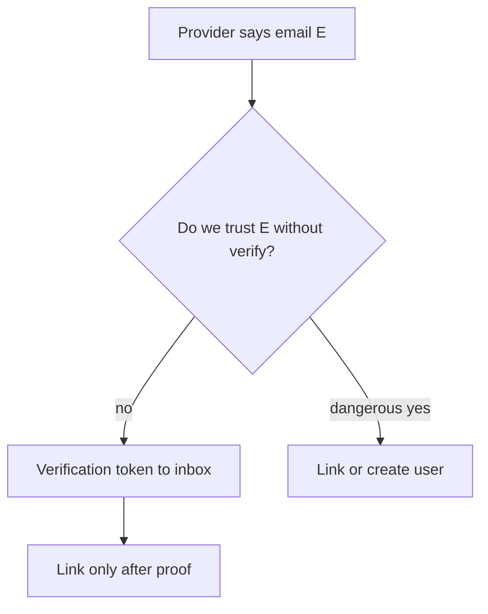
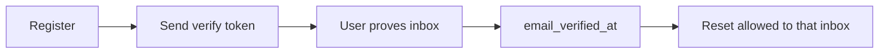

# Month 13 · Week 2 · Day 2
# Social Login and Account Linking Risks; Email Verification Purpose

**Program:** Full-Stack Mastery · 18 months  
**Phase:** 4 — Full-stack application engineering  
**Month index:** [../../README.md](../../README.md)  
**Week 2:** [1](day-01.md) · Day 2 (today) · [3](day-03.md) · [4](day-04.md) · [5](day-05.md) · [6](day-06.md) · [7](day-07.md)  
**Week rhythm today:** Exercises + debugging  
**Student state:** You can name OAuth roles. Today: **what goes wrong** when emails and provider accounts meet, and **why verification exists**.  
**Study time:** 3–4 focused hours

Labs: `~\fullstack-lab\month-13\week-02\day-02\`. Still **no** requirement to ship Google login. Defense concepts only — no takeover recipes.

---

## How to use this textbook

1. Read each risk. Close it. Say the **mitigation**.  
2. Write scenarios in your words. Do not write a how-to for taking over accounts.  
3. Optional review links are for later rechecking.

---

## How to read this chapter

**Social login** means “sign in with a provider” (OIDC). **Account linking** means attaching that provider identity to a **local** user row (the same person who might also have a password).

**Email verification** means: prove **control of the inbox** before you treat the address as a login key or a recovery key.



**Wrong belief:** “The provider already verified the email, so I can attach it to any local user with that email.”  
**Correct:** **automatic linking by email alone** is a classic **account takeover** class of bug. An unauthorized person might **try** to use a provider account whose email **matches** a victim’s local account. **What prevents it:** do **not** auto-link on email match; require the user to **be logged in** and confirm, or require **verified** emails on **both** sides with a clear policy you can lecture.

**Wrong belief:** “Verification is just a marketing opt-in.”  
**Correct:** it is **proof of control** of the address you will send **reset tokens** to (Day 3).

---

## Today's contract

By the end of this day you will be able to:

1. List **three linking risks** in conceptual sentences.  
2. State a **safe linking rule** for Project 7 (even if you never ship social).  
3. Explain **email verification’s purpose** (control of inbox; not “the user is a good person”).  
4. Separate **verified email** from **authenticated session**.  
5. Write generic messages for “we sent a mail if we should.”

**Today's gate.** Closed-book:

> I will not auto-link accounts just because emails match. Verification proves inbox control for recovery. I did not write an account-takeover script.

---

## Time box

| Block | Minutes | Work |
|---|---|---|
| A | 50 | Theory |
| B | 55 | Scenario write-ups |
| C | 70 | Project 7 policy page |
| D | 20 | Git |
| E | 15 | Recall |

---

# Block A — Theory

## 1. Identifiers are not all equal

| Identifier | Trust |
|---|---|
| Provider `sub` (stable subject) | The **stable** id at that provider. Store **this**, not only email. |
| Email from ID token | May change; may be unverified at some providers; check the **verified** claim if present. |
| Local `user.id` | Yours. |
| Local email | Yours only after **you** verified, or you accept the risk in writing. |

**Wrong belief:** “Email is the primary key across the internet.”  
**Correct:** email is a **routing address**. Provider `sub` is the **account**. People change emails. People share typos.

---

## 2. Linking risks (conceptual — so you can stop them)

**Risk A — Auto-link on email match.**  
A local user registered `sam@example.com` with a password. Later, a provider asserts that same email. If you **merge** automatically, whoever can authenticate **at the provider** as that email might **try** to open the local account. **Prevent:** never link solely because strings match. Link only when a logged-in user **explicitly** connects, or when both emails are verified **and** you still use an extra confirmation step.

**Risk B — Unverified provider email.**  
Some providers can assert an email the human does not control (provider-dependent). **Prevent:** check `email_verified` (OIDC claim) when you rely on email; still prefer `sub` as the link key.

**Risk C — One provider, many local users, or the reverse.**  
Messy data: two local users, one `sub`. **Prevent:** unique constraint on `(provider, sub)`. Unique email if you claim unique emails.

**Risk D — Account enumeration via “this email is already linked.”**  
Messages that differ teach which emails exist. **Prevent:** generic errors where you can; linking UI only when **logged in**.

**Risk E — Dropping the password at link time without consent.**  
If linking **disables** password login silently, recovery stories change. **Prevent:** explicit user choice; keep a password or a second factor story.

This chapter does **not** walk through performing a takeover. You write **policies** that refuse the unsafe merge.

---

## 3. Purpose of email verification

When a user **registers** with `sam@example.com`, you do not yet know they can **read** that inbox. An unauthorized person might **try** to register someone else’s address to flood it, or to set up **reset** later. **What verification does:**

1. You send a **time-limited random token** (Day 3–4) to that address.  
2. The human who can **open the mail** completes a link or enters the token.  
3. You set `email_verified_at` (or boolean + timestamp).  
4. You **refuse** sensitive actions (password reset completion is already gated by the token; you may also refuse posting as a “known email” until verified — product choice).

Verification is **not**:

- Proof they are who they claim in the physical world  
- Proof the password is strong  
- A substitute for hashing  

**Wrong belief:** “I’ll skip verify in production because it slows growth.”  
**Correct:** then **reset mail** goes to an inbox you never proved. Write the risk in AUTH.md if you delay verify in **dev only**.

---

## 4. Session vs verified

A user can be **logged in** with `email_verified=false` (you chose to allow it). Then `/me` works and **reset** might still be dangerous. Typical policy:

- Unverified: can log in, cannot change email, maybe cannot invite others.  
- Or: cannot log in until verified (stricter).

Pick one in Project 7 notes. Either is defensible. **Silent full access** without verify is the weak default.

---

## 5. What an unauthorized person might try with mail

- **Try** to register many addresses to annoy people. **Prevent:** rate limit; CAPTCHA later; require verify before posting.  
- **Try** to use your server to send spam (open relay). **Prevent:** you send **only** to the address in the register/reset form, through a **mail port** (Month 12 email port), never arbitrary SMTP to a user-supplied **server**.  
- **Try** to guess verify tokens. **Prevent:** long random tokens, hashed at rest, expiry (Days 3–4).

No payload for forging mail. Defense is token design + rate limits.

---

## 6. Social login without linking (simpler)

You can treat “Google user sub=abc” as **its own** user row with `provider=google`, no password. No merge with password users. **Simplest** if you add social at all. Linking is **optional complexity**. Project 7 can ship **password only** this month.

---

# Block B — Scenarios (writing, not exploiting)

```powershell
cd ~\fullstack-lab
mkdir month-13\week-02\day-02 -Force
cd ~\fullstack-lab\month-13\week-02\day-02
```

Write `SCENARIOS.md` with **four** short stories. Each story has: **what someone might try** (one sentence) and **what your rule prevents**. No step-by-step.

Suggested titles:

1. Auto-link by email  
2. Unverified claim  
3. Duplicate `sub`  
4. Reset to an unverified address  

Write `VERIFY-PURPOSE.md`: ten lines, your words.

---

# Block C — Independent

`PROJECT7-IDENTITY.md` in the lab (copy policy into AUTH.md or a sibling doc in the product):

- Social this month: yes/no  
- If yes: link policy (default: **no auto-link**)  
- Store `provider` + `sub` unique  
- Email verification required before reset? (this course: **yes**, or reset token still proves inbox **this once**)  
- Unverified users: what they can do  

If you have a users table, add **columns on paper**: `email_verified_at`, `provider`, `provider_sub` nullable. Do not dump the product schema from a generator.

```powershell
cd ~\fullstack-lab
git add month-13
git commit -m "Month 13 Week 2 Day 2: linking risks and verification purpose."
```

---

# Block E — Recall

1. Why email match is not a link proof.  
2. What `sub` is for.  
3. What verification proves.  
4. Session vs verified.  
5. Simplest social design (no merge).

---

## Office hours

**“I’ll trust Google because they are big.”** You still store `sub`. You still decide linking.  
**Verification email logged in plaintext in INFO.** Tokens are secrets. Week 1 logging rules.  
**Same message for verify-already-done vs invalid token.** Good — reduces enumeration of tokens. Day 5 tests expired vs invalid carefully without leaking extra.



---

# Lecture: linking is a feature you can refuse

Students add “Login with …” because demos look friendly. Then they merge rows on email and call it UX. The **safe** product is either **no merge** or **logged-in explicit connect**.

Email verification is the bridge to **reset** (tomorrow). If you skip verify, you are sending secrets to a guessed address.

---

## Definition of done

- [ ] `SCENARIOS.md` has mitigations, not recipes  
- [ ] `VERIFY-PURPOSE.md` written  
- [ ] Project 7 policy written  
- [ ] No auto-link as the default  
- [ ] Commit exists  

---

## Optional review links

- [OWASP: Authentication Cheat Sheet](https://cheatsheetseries.owasp.org/cheatsheets/Authentication_Cheat_Sheet.html)  
- [OIDC Core — ID token](https://openid.net/specs/openid-connect-core-1_0.html)

---

## Tomorrow

**From memory:** password reset as a **time-limited random token stored hashed**, sent via the **email port**.

---

# Closing lecture — match is not merge

Email string match is not identity.
Provider sub is the provider’s account key.
Auto-link is how takeovers happen as a class of bug.
Verification proves inbox control.
Reset uses that proof.

Social login is optional this month.
Password accounts already authenticate.
Do not paste a linking snippet from a blog.

Write policies. Do not write takeover steps.
Generic messages. Rate limits later.

Lab: `~\fullstack-lab\month-13\week-02\day-02\`.

If SCENARIOS.md reads like a crime novel with
step numbers, delete the steps and keep the rule.

---

## Recite-back checklist (close the editor, then tick)

Write `RECITE.txt` with one honest sentence per line.

- [ ] no auto-link on email  
- [ ] store provider sub  
- [ ] verification = inbox control  
- [ ] session ≠ verified  
- [ ] unique (provider, sub)  
- [ ] social optional  
- [ ] no takeover recipe  
- [ ] policy in Project 7 notes  

If a line is mush, re-read this file only.

---

# Extra lecture — match is not merge

Email string match is not identity. Provider `sub` is the provider’s account key. Auto-link is how takeovers happen as a **class of bug**. Verification proves inbox control. Reset uses that proof.

Social login is optional this month. Password accounts already authenticate. Do not paste a linking snippet from a blog.

Write policies. Do not write takeover steps. Generic messages. Rate limits later.

Lab: `~\fullstack-lab\month-13\week-02\day-02\`.

If SCENARIOS.md reads like a crime novel with step numbers, delete the steps and keep the rule.

Unverified users: pick a policy (login allowed but no invite, or cannot login until verified). Silent full access without verify is the weak default.

Store `provider` + `sub` unique. Emails change. `sub` is the stable handle.

`email_verified` claim from a provider is useful and **still** not a reason to auto-merge with a local password user.

