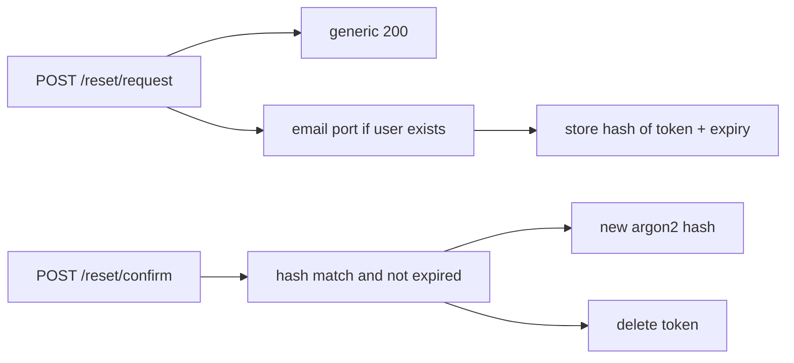

# Month 13 · Week 2 · Day 3
# From Memory: Password Reset as a Hashed, Expiring Token

**Program:** Full-Stack Mastery · 18 months  
**Phase:** 4 — Full-stack application engineering  
**Month index:** [../../README.md](../../README.md)  
**Week 2:** [1](day-01.md) · [2](day-02.md) · Day 3 (today) · [4](day-04.md) · [5](day-05.md) · [6](day-06.md) · [7](day-07.md)  
**Week rhythm today:** Implement from memory  
**Student state:** You know why verification exists. Today you sketch **reset** the way this course allows: a **random token**, **hashed at rest**, **time-limited**, delivered through an **email port** — not a real exploit against anyone’s inbox.  
**Study time:** 3–4 focused hours  
**Prereq:** Day 2 gate passed.

Labs: `~\fullstack-lab\month-13\week-02\day-03\`. Noun: **library cards**, not Project 7. Days 1–2 closed during the build except this recap.

---

## How Day 3 works

Allowed: this recap, your notes, pytest, `curl.exe`.  
Not allowed: pasting a reset tutorial, copying Project 7, sending real mail to strangers, writing a token-guessing script.

Stuck 25 minutes: open **only** Week 1 Day 1 (hashing) or this file’s spec. Record `lookups.txt`.

---

## How to read this chapter

Forgot-password is **not** “email them their old password.” There is no old password. It is:

1. User asks for reset (identifier).  
2. If the user exists, you create a **random token**, store **only a hash** of it, set **expires_at**, send the **raw token once** via the **email port** (a function you can fake in tests).  
3. User submits token + new password.  
4. You hash-compare the token (library / compare digest on the **hash** you stored), check expiry, set a **new password hash**, **invalidate** the token (and other open reset tokens).  
5. Whether the email existed or not, the **request** endpoint returns the **same generic success**.



**Wrong belief:** “I’ll store the token in plaintext in the database so support can read it.”  
**Correct:** the table is as sensitive as a password file. **Hash** the token. Support does not need it.

**Wrong belief:** “I’ll put the user id in the token as `42-reset`.”  
**Correct:** random, long, unguessable — like a session id. `secrets.token_urlsafe(32)` or better.

---

## Complete explanation (reset you must still own)

**Email port:** Month 12 taught a **port** — a function `send_email(to, subject, body)` that in tests is a **list append**. Do not call a live SMTP vendor from the lab unless you already have a mail trap **you own**. Never log the token.

**Generic request:** `{"detail": "If an account exists, we sent instructions."}` always 200 (or always 202). An unauthorized person might **try** to learn who has accounts. **Prevent:** same body.

**Token storage:** `token_hash`, `user_id`, `expires_at`, `used_at` null. Hash with SHA-256 of the raw token is **acceptable for high-entropy random tokens** (they are not user-chosen passwords). Do **not** use fast hashes for **passwords**. Optional: HMAC with a server secret. Document the choice. **Compare** hashes with `hmac.compare_digest` on the **hex/bytes**, not a password `==`.

**Expiry:** 15–60 minutes typical. Day 4–5 tests **expired refused**.

**One-time:** after success, mark used. Reuse → 400/401 generic.

**New password:** argon2/bcrypt as Week 1. Optionally revoke **all sessions** on reset (good). Document it.

**Statuses:** request 200 generic. Confirm success 204 or 200. Confirm fail (bad/expired) 400 or 401 **generic** — same shape. Do not say “expired” vs “unknown token” if you can avoid it; Day 5 may test expiry **in the lab** with a dedicated path that still does not leak **which emails** exist.

**Windows:** `curl.exe`. Bind `127.0.0.1`.

**OAuth:** not in this sketch.

---

## Today's contract

**Today's gate.** Closed-book:

> Reset stores a hashed random token with expiry, sends via a fake email port, generic request response, new password hashed, token one-time. I did not paste the product.

---

## Time box

| Block | Minutes | Work |
|---|---|---|
| A | 20 | Speak |
| B | 35 | Paper drills |
| C | 95 | Build |
| D | 30 | Defect hunt |
| E | 15 | Lookups |

---

# Block A — Speak

1. Why you cannot email the old password.  
2. What is stored vs what is emailed.  
3. Why request is generic.  
4. How expiry is enforced (server clock, not the email text).  
5. What happens to sessions after reset (your choice, named).

---

# Block B — Paper

1. Columns of `reset_tokens`.  
2. `send_email` signature.  
3. Confirm sequence.  
4. Predict: request for unknown email — status and body.  
5. Predict: confirm with random garbage token.

---

# Block C — Spec

```powershell
cd ~\fullstack-lab
mkdir month-13\week-02\day-03 -Force
cd ~\fullstack-lab\month-13\week-02\day-03
uv init --name lab-library-reset
uv add fastapi uvicorn passlib argon2-cffi
uv add --dev pytest httpx
```

**Library card holders** — `email`, `password_hash`.

| Method | Path | Rules |
|---|---|---|
| POST | `/register` | 201, hash password (minimal, to seed) |
| POST | `/reset/request` | body `{email}`. Always 200 generic. If user exists, create token, append to `MAILBOX` list: `{to, token}` **in tests only** — production would not keep tokens in a list on the server process for attackers to read; this is a **test double**. |
| POST | `/reset/confirm` | `{token, new_password}`. Success sets hash, consumes token. Fail generic. |

`MAILBOX: list` is the email port. Tests read the last token **from MAILBOX**, not from the DB plaintext (DB has hash).

Tests:

- Unknown email: 200, same JSON, mailbox unchanged.  
- Known email: 200, mailbox has one item, DB token column ≠ raw token.  
- Confirm with that token: login with new password works.  
- Confirm again: fail.  
- Fixture clears users, tokens, mailbox.

Do not print tokens in pytest names. Do not use real addresses that are not `@example.com`.

```powershell
uv run pytest -q
```

---

# Block D — Defect hunt

1. Request twice: old token invalid **or** both valid — **document**. Course preference: **only latest** valid, or all unused until expiry — pick one.  
2. Confirm with expired: set `expires_at` in the past in the store; expect fail. (If clock code is hard, a function `is_expired` you can call with a frozen datetime.)  
3. New password too short: 422, token **not** consumed (or consumed — document; prefer **not** consumed so the user can retry).

---

# Block E

`lookups.txt`. Commit:

```powershell
cd ~\fullstack-lab
git add month-13
git commit -m "Month 13 Day 3: hashed expiring reset token sketch."
```

---

# Lecture: the mailbox list is a test spy

Never ship `MAILBOX` in production. The port becomes SMTP or a vendor. Tests inject a fake.

**Do not** put the raw token in query logs. If the confirm link is `https://app/reset?token=...`, the token still must be hashed at rest and short-lived. GET-with-token in URLs lands in browser history — prefer POST body for confirm in APIs; if you use a link, accept the history risk and keep expiry short.

No guessing scripts. Entropy of `token_urlsafe(32)` is the defense against guessing.

---

## Definition of done

- [ ] Generic request 200  
- [ ] Token hashed in store  
- [ ] Email port fake  
- [ ] Confirm sets new hash  
- [ ] Token one-time  
- [ ] Commit exists  

---

## Optional review links

- [OWASP: Forgot Password](https://cheatsheetseries.owasp.org/cheatsheets/Forgot_Password_Cheat_Sheet.html)

---

## Tomorrow

**Lab:** verification token **table design** + expiry. No email exploit.

---

# Closing lecture — reset is a new secret

You never retrieve a password. You issue a new secret,
hash it at rest, expire it, use it once, then hash a new
password with argon2. The request endpoint does not leak
whether the email exists.

MAILBOX is a test double. Production uses the email port.
Do not log tokens. Do not store tokens plaintext.

Library cards, not the product. Bind 127.0.0.1.
curl.exe if you inspect HTTP. pytest is the proof.

If confirm tells the client "expired" vs "unknown"
and you care about token enumeration, make them identical.
Day 5 will still prove expiry in tests by arranging the clock.

---

## Recite-back checklist (close the editor, then tick)

Write `RECITE.txt` with one honest sentence per line.

- [ ] no password retrieval  
- [ ] random token  
- [ ] hashed at rest  
- [ ] expiry server-side  
- [ ] generic request  
- [ ] email port fake  
- [ ] one-time  
- [ ] new password hashed  

If a line is mush, re-read this file only.

---

# Extra lecture — the mailbox list is a test spy

Never ship `MAILBOX` in production. The port becomes SMTP or a vendor. Tests inject a fake.

**Do not** put the raw token in query logs. If the confirm link is a URL with a query token, it still must be hashed at rest and short-lived. Prefer POST body for confirm in APIs; if you use a link, keep expiry short and accept history risk.

No guessing scripts. Entropy of `token_urlsafe(32)` is the defense against guessing.

**Two requests:** document whether only the **latest** token is valid. Course preference: invalidate previous unused tokens of the same purpose.

**New password too short:** 422, prefer **not** consuming the token so they can retry.

**Sessions after reset:** optionally revoke all sessions. Write the choice.

Library cards, not the product. Bind `127.0.0.1`. `curl.exe` if you inspect HTTP. pytest is the proof.

If confirm tells the client "expired" vs "unknown" and you care about token enumeration, make public bodies identical. Day 5 still proves expiry by arranging the clock.

`uv run uvicorn main:app --reload --host 127.0.0.1 --port 8000` is optional. Tests do not need port 8000.

Windows: JSON files + `--data-binary @file` so PowerShell quoting does not eat the day.

---

# Status table you must still own

| Event | Status |
|---|---|
| Reset request (email exists or not) | **200** same generic body |
| Confirm success | **204** or **200** |
| Confirm fail (bad or expired) | **400** or **401** generic |
| New password too short | **422**; prefer token **not** consumed |
| Register seed user | **201** |

**Token hash:** SHA-256 of a high-entropy random token is acceptable. **Passwords** still argon2/bcrypt. Compare token hashes with `hmac.compare_digest`.

**One-time:** reuse fails. **Clock:** UTC on the server, not the email text.

Unknown email: mailbox **unchanged**. Known email: mailbox has one item; DB value ≠ raw token.

Login with the **new** password after confirm. Login with the **old** must fail.

Lab noun: library cards. `~\fullstack-lab\month-13\week-02\day-03\`. `uv add fastapi uvicorn passlib argon2-cffi`. `uv add --dev pytest httpx`.

Do not send real mail to strangers. Do not paste Project 7. Do not put the user id in the token as `42-reset`.

`lookups.txt` if you opened Week 1 hashing after 25 minutes. `RAM.txt` if in-memory tokens die on reload — that is the lab, not a reason to skip hashing the token.

`uv run pytest -q` is the proof. Generic request 200. Token hashed. Confirm one-time. New password argon2.

Do not print tokens in pytest names. `@example.com` only. MAILBOX is a test spy, not production.

Forgot-password is not retrieval. There is no old password. Hash, expire, one-time, new argon2 hash.


