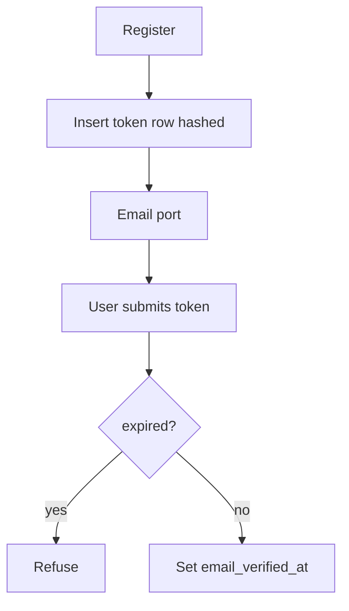
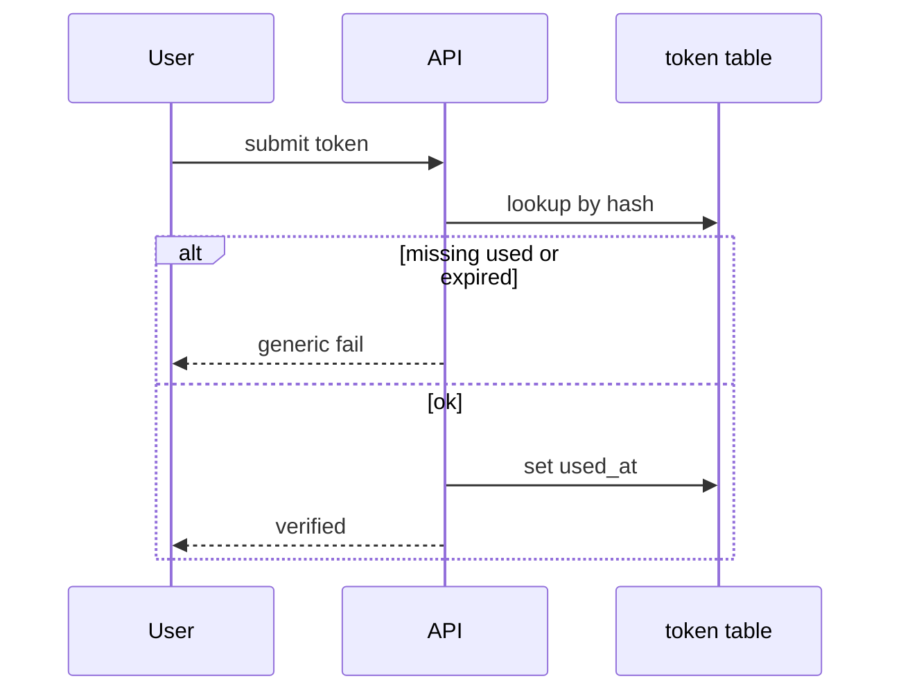

# Month 13 · Week 2 · Day 4
# Lab: Verification Token Table Design and Expiry

**Program:** Full-Stack Mastery · 18 months  
**Phase:** 4 — Full-stack application engineering  
**Month index:** [../../README.md](../../README.md)  
**Week 2:** [1](day-01.md) · [2](day-02.md) · [3](day-03.md) · Day 4 (today) · [5](day-05.md) · [6](day-06.md) · [7](day-07.md)  
**Week rhythm today:** Learn + type-along (lab)  
**Student state:** You sketched reset. Today you **design** (and implement a mini of) **email verification tokens** with **expiry**. You will **not** phish, forge SMTP, or exploit a mail vendor.  
**Study time:** 3–4 focused hours

Labs: `~\fullstack-lab\month-13\week-02\day-04\`. Noun: **studio passes**. Project 7 gets a **schema note**, not a dumped product.

---

## How to use this textbook

1. Design columns **before** routes.  
2. Type a lab table (SQLAlchemy model **or** a typed dict — both OK).  
3. No live email exploit. Fake port only.

---

## How to read this chapter

Verification tokens and reset tokens are **the same family**: random secret, **hash stored**, **expires_at**, **used_at**, **purpose** (`verify_email` vs `reset_password`).



**Wrong belief:** “I’ll store the token in the user row as plaintext until they click.”  
**Correct:** a leaked users table would include **live** verify links. Hash it. Separate table lets you have **many** tokens and audit expiry.

**Wrong belief:** “Expiry can be only in the email text (‘valid 24h’).”  
**Correct:** the **database clock** (you compare `datetime.now(timezone.utc)` to `expires_at`) is the law. Email text is courtesy.

---

## Today's contract

By the end of this day you will be able to:

1. Draw a `email_tokens` (or `verification_tokens`) table.  
2. Name columns: `id`, `user_id`, `purpose`, `token_hash`, `expires_at`, `used_at`, `created_at`.  
3. Implement **create** + **consume** with expiry in a lab.  
4. Refuse expired tokens.  
5. Keep request/verify messages generic where they would leak.

**Today's gate.** Closed-book:

> Tokens are hashed, expired on the server, one-purpose, one-time. Email is a port. I did not write an email exploit.

---

## Time box

| Block | Minutes | Work |
|---|---|---|
| A | 45 | Theory / schema |
| B | 65 | Type-along consume/expiry |
| C | 70 | Independent schema for Project 7 |
| D | 20 | Git |
| E | 15 | Recall |

---

# Block A — Theory

## 1. Table design (SQL-flavored, honest)

| Column | Type idea | Why |
|---|---|---|
| `id` | UUID or int | PK |
| `user_id` | FK users | Who |
| `purpose` | string/enum | `verify_email` / `reset_password` — **do not** mix consumers |
| `token_hash` | unique bytes/hex | Lookup: hash the submitted token, find row |
| `expires_at` | timestamptz | Required |
| `used_at` | timestamptz null | One-time |
| `created_at` | timestamptz | Audit |

Index: `token_hash` unique. Index: `user_id` + `purpose` for invalidate-all.

**Do not** store `raw_token`.  
**Do not** store the new password here.

**Lookup method:** hash incoming token with the **same** algorithm, look up by hash. If you HMAC with a server secret, the secret is in `.env`, not in the table.

---

## 2. Expiry rules

- Create: `expires_at = now + timedelta(hours=24)` for verify (reset shorter, e.g. 30 min).  
- Consume: if `now >= expires_at`: refuse.  
- Consume: if `used_at` is set: refuse.  
- Clock: **UTC**. Naive datetimes will bite you.

**Wrong belief:** “I’ll delete expired rows in the consume path only.”  
**Correct:** also a **periodic cleanup** later (cron/job). Consume still checks expiry even if cleanup is late.

---

## 3. What someone might try

- **Try** to reuse a token from an old email. **Prevent:** `used_at` or delete.  
- **Try** a token after a week. **Prevent:** `expires_at`.  
- **Try** to use a **reset** token on the **verify** endpoint. **Prevent:** `purpose` check.  
- **Try** to flood inboxes. **Prevent:** rate limit (Week 3); invalidate previous unused tokens of the same purpose.

No script to brute-force tokens. Length of `token_urlsafe(32)` is the guess defense.

---

## 4. SQLAlchemy sketch (defense shape, not the product)

```python
# sketch — your names; not Project 7
class EmailToken(Base):
    __tablename__ = "email_tokens"
    id: Mapped[int] = mapped_column(primary_key=True)
    user_id: Mapped[int] = mapped_column(ForeignKey("users.id"))
    purpose: Mapped[str] = mapped_column(String(32))
    token_hash: Mapped[str] = mapped_column(String(64), unique=True)
    expires_at: Mapped[datetime] = mapped_column(DateTime(timezone=True))
    used_at: Mapped[datetime | None] = mapped_column(DateTime(timezone=True), nullable=True)
```

Lab may use a **dict** keyed by hash if you do not want Alembic today. The **columns** must still appear in `SCHEMA.md`.

---

## 5. Alembic (if Project 7 already has it)

Day 6 may migrate. Today: `SCHEMA.md` is enough. Do not invent seven tables.

---

# Block B — Type-along

```powershell
cd ~\fullstack-lab
mkdir month-13\week-02\day-04 -Force
cd ~\fullstack-lab\month-13\week-02\day-04
uv init --name lab-studio-verify
uv add fastapi uvicorn
uv add --dev pytest httpx
```

Implement in-memory:

- `create_verify_token(user_id) -> raw_token` (returns raw **once**, stores hash, expiry 1 hour).  
- `consume_verify_token(raw) -> user_id | None` (None if missing, used, expired, wrong purpose).  
- Tests: happy consume; second consume None; expiry by inserting past `expires_at`.

Optional FastAPI `POST /verify` wrapping consume. Generic fail message.

```powershell
uv run pytest -q
```

Write `SCHEMA.md` matching the dict keys.

---

# Block C — Independent

1. `PROJECT7-TOKENS.md`: table name, columns, verify TTL, reset TTL, purpose enum.  
2. Decide: one table vs two. (One table + purpose is enough.)  
3. `CLEANUP.md`: one paragraph — expired rows do not stay forever.  
4. Stretch: unique constraint words for Alembic later.

```powershell
cd ~\fullstack-lab
git add month-13
git commit -m "Month 13 Day 4: verification token schema and expiry lab."
```

---

# Block E — Recall

1. Why hash the token.  
2. Which clock expires it.  
3. Why `purpose` exists.  
4. What `used_at` prevents.  
5. Why this is not an email exploit lab.

---

## Office hours

**Looked up by user_id and compared raw in Python.** Then the table still has raw. Hash lookup.  
**Used password argon2 for the token.** Allowed but slow; SHA-256 of high-entropy token + `compare_digest` is the usual split: **argon2 for passwords**, **fast hash for random tokens**. Write the split in SCHEMA.md so you do not “optimize” passwords next.  
**Expired but 200 anyway.** You compared strings of dates wrong. Use timezone-aware UTC.



---

# Lecture: design is a table, not a vendor

SendGrid does not expire tokens for you. Your row does.

Do not put tokens in Redis **only** “because they expire” unless you already operate Redis — Postgres `expires_at` is honest. Redis is fine if Month 11 already justified it.

Never commit a real SMTP password. `.env.example` has empty keys (Day 5 Week 3).

---

## Definition of done

- [ ] SCHEMA.md complete  
- [ ] Tests: consume, reuse fail, expiry fail  
- [ ] Project 7 token notes  
- [ ] No email exploit  
- [ ] Commit exists  

---

## Optional review links

- [OWASP Forgot Password](https://cheatsheetseries.owasp.org/cheatsheets/Forgot_Password_Cheat_Sheet.html)  
- [SQLAlchemy 2.0 mapped columns](https://docs.sqlalchemy.org/en/20/orm/quickstart.html)

---

## Tomorrow

**Tests** that an **expired** token is refused.

---

# Closing lecture — expiry lives in the row

A token is random, hashed, timed, purposeful, one-shot.
The email port delivers the raw value once.
The table never stores that raw value.

Studio passes, not the product.
UTC timestamps. used_at. purpose.

If you can consume yesterday’s token, expiry is a comment
not a check. Write the check. Test it tomorrow harder.

No phishing. No SMTP tricks. Defense only.

Lab: `~\fullstack-lab\month-13\week-02\day-04\`.

---

## Recite-back checklist (close the editor, then tick)

Write `RECITE.txt` with one honest sentence per line.

- [ ] columns named  
- [ ] hash not raw  
- [ ] expires_at law  
- [ ] purpose split  
- [ ] used_at  
- [ ] fake email port  
- [ ] Project 7 notes  
- [ ] no exploit  

If a line is mush, re-read this file only.
