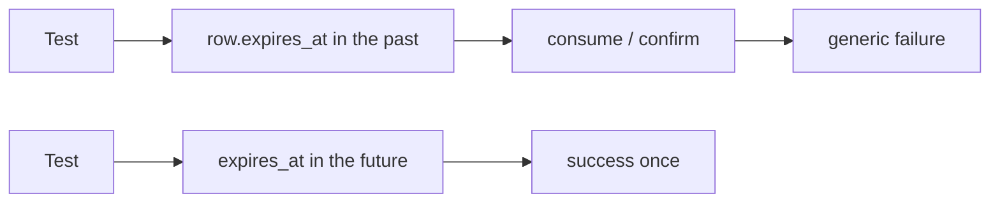
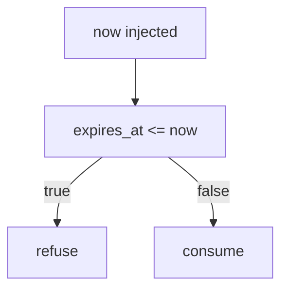

# Month 13 · Week 2 · Day 5
# Tests: Expired Tokens Are Refused

**Program:** Full-Stack Mastery · 18 months  
**Phase:** 4 — Full-stack application engineering  
**Month index:** [../../README.md](../../README.md)  
**Week 2:** [1](day-01.md) · [2](day-02.md) · [3](day-03.md) · [4](day-04.md) · Day 5 (today) · [6](day-06.md) · [7](day-07.md)  
**Week rhythm today:** Tests + refactor + documentation  
**Student state:** You designed token rows. Today you **prove** expiry with tests — not with a guessing script.  
**Study time:** 3–4 focused hours

Labs: `~\fullstack-lab\month-13\week-02\day-05\`. You may copy **your** Day 3/4 code into this folder and add tests. Still not Project 7 as the textbook answer.

---

## How to use this textbook

1. Arrange **time** in the test; do not wait 24 hours.  
2. Assert expired consume fails.  
3. Do not probe anyone else’s reset form.

---

## How to read this chapter

Expiry that is not tested is a comment. Tests must **force** `expires_at` into the past (or inject a clock).



**Wrong belief:** “I’ll sleep in pytest until it expires.”  
**Correct:** set the timestamp. Or pass `now=` into `consume`. Sleeps make CI slow and flaky.

**Wrong belief:** “Expired and invalid should return different codes so the UI can help.”  
**Correct:** a dedicated **UI** can say “request a new link” for all failures. Different **API** bodies help an unauthorized person **try** to learn whether a token **was** real. Prefer **one** fail shape. Your **test** can still set a known expired row and assert **refuse**.

---

## Today's contract

By the end of this day you will be able to:

1. Inject time or mutate `expires_at` in tests.  
2. Prove expired verify **and** expired reset (if you have both) refuse.  
3. Prove a fresh token still works.  
4. Keep fail JSON generic.  
5. Document the clock helper.

**Today's gate.** Closed-book:

> Expired tokens fail in pytest without sleeping. I did not write a brute-force client.

---

## Time box

| Block | Minutes | Work |
|---|---|---|
| A | 35 | Theory |
| B | 70 | Tests + clock |
| C | 70 | Both purposes + Project 7 test plan |
| D | 20 | Git |
| E | 15 | Recall |

---

# Block A — Theory

## 1. Clock seams

```python
from datetime import datetime, timezone

def consume(token: str, *, now: datetime | None = None) -> int | None:
    now = now or datetime.now(timezone.utc)
    ...
    if row.expires_at <= now:
        return None
```

Tests pass `now=` far in the future, **or** create the row with `expires_at` already past.

**Freezegun** is allowed if you want; a `now` parameter is fewer dependencies.

## 2. What to assert

- Status 400 or 401 (your contract).  
- Body equals the generic fail for a random token (optional equality test).  
- `used_at` still null on expiry fail (do not mark used if they never succeeded — so a clock fix could retry **only if** you re-issue; usually they need a **new** token anyway). Document.  
- Password **unchanged** on expired reset confirm.  
- `email_verified_at` **unchanged** on expired verify.

## 3. Used vs expired

Two fail reasons, one public shape. Internally your tests can create:

- Row used  
- Row expired  
- Row missing  

All public responses match.

## 4. What someone might try

They might **try** an old link from email search. **Prevent:** expiry + used. Tests encode that.

They might **try** many random tokens. **Prevent:** entropy + rate limit (Week 3). Tests do **not** loop 10 million guesses.

---

# Block B — Type-along

```powershell
cd ~\fullstack-lab
mkdir month-13\week-02\day-05 -Force
cd ~\fullstack-lab\month-13\week-02\day-05
uv init --name lab-token-expiry
uv add fastapi uvicorn passlib argon2-cffi
uv add --dev pytest httpx
```

Port your consume function. Tests in `test_expiry.py`:

1. `test_fresh_token_ok`  
2. `test_expired_token_refused`  
3. `test_used_token_refused`  
4. `test_expired_reset_does_not_change_password` if reset exists  

```powershell
uv run pytest -q
```

Write `CLOCK.md`: how tests control time.

---

# Block C — Independent

1. Add equality: expired fail JSON == random-token fail JSON.  
2. `PROJECT7-TESTPLAN.md`: names of tests you will add in the product.  
3. If product already has reset, add the expired test **there**. If not, the lab is enough plus the plan.

```powershell
cd ~\fullstack-lab
git add month-13
git commit -m "Month 13 Day 5: expired token tests."
```

---

# Block E — Recall

1. Why not `sleep`.  
2. What must stay unchanged on expired reset.  
3. Why public fail shapes match.  
4. UTC.

---

## Office hours

**Compared naive and aware datetimes.** Crash or wrong. UTC everywhere.  
**Expiry test used a token string from logs.** Stop logging tokens.  
**Marked used on failed expiry.** Then metrics lie; keep used for **success** only unless you have a reason.



---

# Lecture: time is part of the contract

`expires_at` without a test is how “24 hours” becomes forever because of a timezone bug.

Do not use `datetime.now()` without timezone in new code.

Rate-limit notes in `RATE.txt` one sentence — Week 3.

---

## Definition of done

- [ ] Expired refused in pytest  
- [ ] Fresh still works  
- [ ] CLOCK.md written  
- [ ] No brute-force script  
- [ ] Commit exists  

---

## Optional review links

- [pytest time / freezegun](https://github.com/spulec/freezegun) (optional)  
- [Python datetime aware vs naive](https://docs.python.org/3/library/datetime.html)

---

## Tomorrow

**Independent:** reset + verify in **your** app **or** a lab mini that is complete.

---

# Closing lecture — refuse the old link

Expiry is a comparison, not a hope.
Tests move the clock or the column.
Password and verified flags stay put on failure.
Public JSON stays generic.

No guessing loops. Entropy plus expiry plus used_at.
Lab: `~\fullstack-lab\month-13\week-02\day-05\`.

If the only expiry test sleeps, rewrite it before you commit.

---

## Recite-back checklist (close the editor, then tick)

Write `RECITE.txt` with one honest sentence per line.

- [ ] no sleep  
- [ ] expired refused  
- [ ] password unchanged  
- [ ] generic fail  
- [ ] clock seam  
- [ ] UTC  
- [ ] product test plan  
- [ ] not an attack script  

If a line is mush, re-read this file only.
